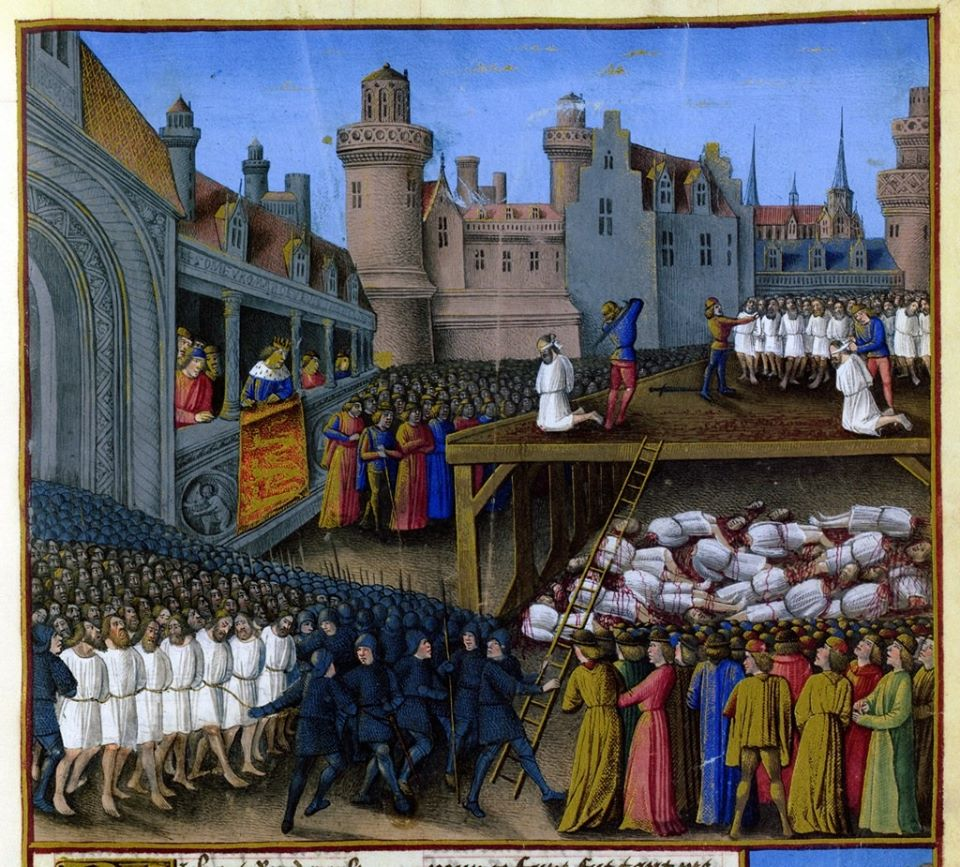

### 2020

Byki wchodzą mozolnie po schodach, a niedźwiedzie skaczą z okien?

### 1968

Wojska Układu Warszawskiego rozpoczęły w Czechosłowacji zbrojną interwencję pod kryptonimem "Dunaj". Celem tej operacji było powstrzymanie reform politycznych i gospodarczych oraz liberalizacji praw.
Według szaunków w interwencji uczestniczyło blisko pół miliona żołnierzy w tym druga,co do liczebnej wielkości II Armia Wojska Polskiego.
Jedynym krajem UW, który nie zdecydował się wziąć w tym udziału była Rumunia.

  

### 1191

III wyprawa krzyżowa: 2700 wziętych do niewoli muzułmańskich obrońców Akki zostało zabitych z rozkazu króla Anglii Ryszarda I Lwie Serce.

Podczas trzeciej wyprawy krzyżowej (1189-92) król Anglii Ryszard Lwie Serce kazał wyrżnąć 2,7 tys. muzułmańskich jeńców wziętych do niewoli po zdobyciu Akki. Miasto skapitulowało 12 lipca, muzułmanie w zamian za życie zobowiązali się m.in. zapłacić 600 tys. sztuk złota i uwolnić 1,5 tys. jeńców znajdujących się w rękach sułtana Saladyna. Król przystał na te warunki, ale gdy stwierdził, że wśród uwolnionych jeńców nie ma dobrze urodzonych, na których mu najbardziej zależało, nakazał rzeź. Ryszard z niecierpliwością czekał na chwilę, gdy będzie mógł pomaszerować na Jerozolimę. Jeńcy sprawiali mu kłopot, rad był więc z pretekstu do pozbycia się tak wielkiej rzeszy muzułmanów - pisał wybitny znawca wypraw krzyżowych, brytyjski historyk Steven Runciman.

  

---

<a href="https://github.com/TomaszWaszczyk/historia.waszczyk.com/edit/master/src/content/august-20.md" target="_blank">Edytuj tę stronę dzieląc się własnymi notatkami!</a>
