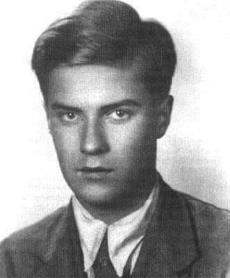

### 2022

"Niespłacone zobowiązania państwa składające się na nasz dług publiczny rosną i nie ma sił politycznych, które chciałyby lub mogłyby ten wzrost poskromić. Gorzej, że nie znamy prawdziwych rozmiarów zadłużenia, ponieważ rząd pożycza pieniądze także za pośrednictwem instytucji państwowych, np. Banku Gospodarstwa Krajowego, czy Polskiego Funduszu Rozwoju, które są wyłączone spod bezpośredniej kontroli Sejmu."

### 2020

Byki wchodzą mozolnie po schodach, a niedźwiedzie skaczą z okien?

### 1968

Wojska Układu Warszawskiego rozpoczęły w Czechosłowacji zbrojną interwencję pod kryptonimem "Dunaj". Celem tej operacji było powstrzymanie reform politycznych i gospodarczych oraz liberalizacji praw.
Według szaunków w interwencji uczestniczyło blisko pół miliona żołnierzy w tym druga,co do liczebnej wielkości II Armia Wojska Polskiego.
Jedynym krajem UW, który nie zdecydował się wziąć w tym udziału była Rumunia.

  

### 1943

"Naprzód! - wrzeszczy Zośka nienaturalnym głosem i oderwany od ziemi pędzi ku furtce. Odrętwienie znikło. Zerwał się Maciek, pędzą inni. Furtka! Zośka kopie nogą drzwi, skacze na próg, czując za sobą tupot dziesiątka stóp towarzyszy broni. Strzał w okna! Wali coś w pierś! Zapiera oddech... 
Jak cuglami szarpnięty koń, wspiera się Zośka stopami w deski werandy i powoli skręca półobrotem. Słania się ku ścianie. A obok, w czującym zwycięstwo pędzie przebiegają jego ludzie, wpadając do izb. Strzał 
po strzale...Gęsto... Wrzaski strachu i wybuchowe krzyki bitewnego upojenia... 
Głosy stają się coraz dalsze, coraz cichsze... W głowie wzmaga się szum, przed oczyma blaski i cienie. Czy to się zbliża postać zwycięskiego Maćka, czy też idzie szaleniec Alek? Nie ... to Długi szybko nadchodzi od pola, Alek, czy Długi? Rudy! Rudy! To na pewno on... Złocista , rozwichrzona czupryna - to on! Nareszcie znów razem, w walce. Kochany... Teraz... ja ... ranny... Bezsilne, omdlałe ciało osuwa się spod ściany ku ziemi... Zdobycie posterunku żandarmerii w Sieczychach było jednym z najpiękniejszych zwycięstw Zośki.  Całkowicie udana akcja. Tylko jeden człowiek z całego polskiego oddziału przelał w tej bitwie krew: Zośka." 
---cyt. za: Aleksander Kamiński "Kamienie na szaniec"
20 sierpnia 1943 roku w akcji pod Sieczychami poległ Tadeusz Zawadzki pseudonimy ,,Zośka'', ,,Kajman'', Kotwicki'', ,,Lech Pomarańczowy'' - urodzony 24 I 1921 roku, student Politechniki, w konspiracji Komendant Warszawskich Grup Szturmowych, w słynnej Akcji pod Arsenałem dowódca grupy ,,atak'', podporucznik AK, kawaler Orderu Virtuti Militari V-ej klasy i dwukrotnie Krzyża Walecznych, harcmistrz, żołnierz Szarych Szeregów, jeden z głównych bohaterów książki Aleksandra Kamińskiego pt. ,,Kamienie na Szaniec''. Kilka dni po jego śmierci, oddział Szarych Szeregów , wydzielony z warszawskich Grup Szturmowych, przyjął nazwę Baon Szarych Szeregów „Zośka”. 
Celem Akcji pod Sieczychami było zlikwidowanie w ciągu jednej nocy ponad dziesięciu posterunków niemieckiej straży granicznej na północno-wschodniej granicy GG. Oddział Komendanta ,,Zośki'' otrzymał zadanie rozbrojenia posterunku ulokowanego we wsi Sieczychy pod Wyszkowem, w którym zakwaterowanych było około dwunastu żandarmów. Posterunek został rozbrojony. Większość żandarmów zginęła lub ratowała się ucieczką. Po stronie polskiej poległ komendant, trzej żołnierze zostali ranni. W Sieczychach o śmierci komendanta przypomina tablica, którą w hołdzie poległemu złożyła 26. Warszawska Drużyna Harcerzy wraz z Kołem Przyjaciół Harcerstwa. Miejsce pochówku ,,Zośki'' znajduje się w kwaterze Batalionu Zośka (A-20) na warszawskim Cmentarzu Wojskowym na Powązkach.

  

### 1191

III wyprawa krzyżowa: 2700 wziętych do niewoli muzułmańskich obrońców Akki zostało zabitych z rozkazu króla Anglii Ryszarda I Lwie Serce.

Podczas trzeciej wyprawy krzyżowej (1189-92) król Anglii Ryszard Lwie Serce kazał wyrżnąć 2,7 tys. muzułmańskich jeńców wziętych do niewoli po zdobyciu Akki. Miasto skapitulowało 12 lipca, muzułmanie w zamian za życie zobowiązali się m.in. zapłacić 600 tys. sztuk złota i uwolnić 1,5 tys. jeńców znajdujących się w rękach sułtana Saladyna. Król przystał na te warunki, ale gdy stwierdził, że wśród uwolnionych jeńców nie ma dobrze urodzonych, na których mu najbardziej zależało, nakazał rzeź. Ryszard z niecierpliwością czekał na chwilę, gdy będzie mógł pomaszerować na Jerozolimę. Jeńcy sprawiali mu kłopot, rad był więc z pretekstu do pozbycia się tak wielkiej rzeszy muzułmanów - pisał wybitny znawca wypraw krzyżowych, brytyjski historyk Steven Runciman.

  

---

<a href="https://github.com/TomaszWaszczyk/historia.waszczyk.com/edit/master/src/content/august-20.md" target="_blank">Edytuj tę stronę dzieląc się własnymi notatkami!</a>
