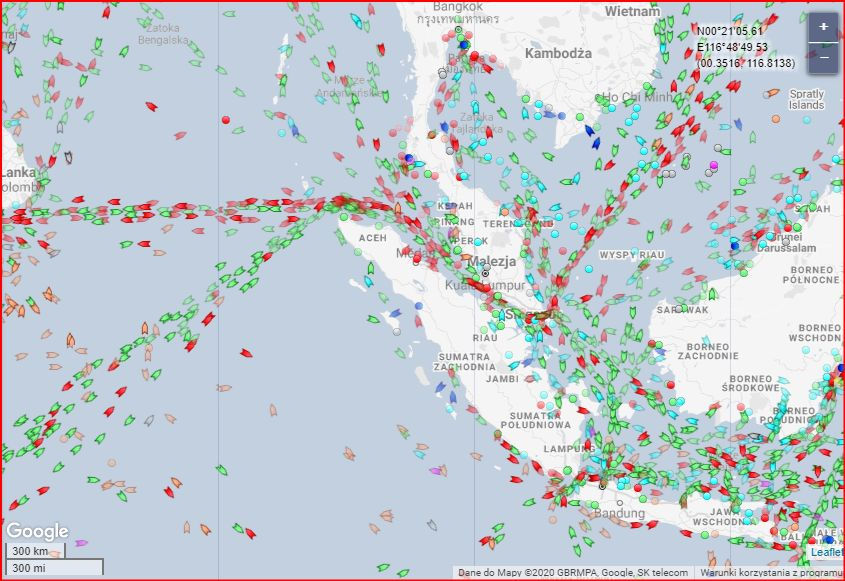
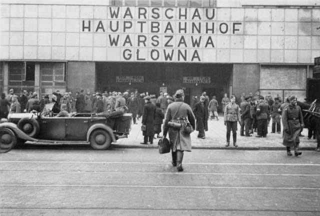

### 2020

Jeżeli chcemy wiedzieć dlaczego Chiny tworzą lądowy Jedwabny Szlak to warto rzucić okiem na skan ruchu statków w cieśninie Malakka. I teraz dodać do tego że ich główny rywal (USA) w pełni panuje na morzu, to już wiemy dlaczego budują szlak w środku lądu.

  

---

Czy uważacie, że półroczna strata w wysokości 21 miliardów dolarów (USD) w pierwszym półroczu tego roku to dużo? Z perspektywy polskiego rynku kapitałowego to tak jakby wszystkie aktywa funduszy inwestycyjnych stopniały o blisko jedną trzecią (na koniec lipca wartość aktywów zgromadzonych w polskich funduszach inwestycyjnych wynosiła 257,7 mld złotych, co daje około 69,6 mld (USD)), czyli całkiem sporo. Z perspektywy największego na Świecie funduszu emerytalnego jakim jest Norweski Państwowy Fundusz Emerytalny (z ang. Government Pension Fund of Norway - GPFN) z aktywami na poziomie 1,2 biliona USD jest to jednak nieco mniej (niespełna 2% wartości aktywów). A taką stratę ów fundusz zanotował w pierwszych sześciu miesiącach tego roku. Zważywszy na okoliczności i porównując do stopy zwrotu z polskiego rynku akcji w analogicznym okresie (indeks WIG -14,3%), taki wynik wydaje się całkiem przyzwoity. GPFN inwestuje jednak globalnie i w różne klasy aktywów.

### 1942

Lotnictwo radzieckie zbombardowało okolice warszawskiego Dworca Głównego przy Alejach Jerozolimskich 38/46.
Przypomnijmy, że obiekt ten istniał w latach 1933-1944, kiedy to został zburzony po upadku Powstania Warszawskiego.

  

### 1794

Podczas insurekcji kościuszkowskiej wybuchło pierwsze z powstań wielkopolskich. Do największych wystąpień przeciwko zaborcy pruskiemu doszło w Brześciu Kujawskim. Oddział dowodzony przez ksztelana brzesko-kujawskiego Dionizego Mniewskiego przypuścił atak na stacjonujący tam garnizon pruski, który po krótkiej walce został rozbrojony. Następnego dnia sukesem zakończyły się walki powstańcze o Włocławek, gdzie udało się przechwycić jadący z Warszawy transport broni dla wojsk pruskich. W ciągu kilku dni powstanie ogarnęło większość Wielkopolski: dawne województwa brzesko-kujawskie, część inowrocławskiego, kaliskiego, sieradzkiego, gnieźnieńskiego i poznańskiego. Zaskoczone zrywem siły pruskie nie były w stanie go stłumić. Utrzymały się jedynie większe garnizony pruskie między innymi w Poznaniu.

---

<a href="https://github.com/TomaszWaszczyk/historia.waszczyk.com/edit/master/src/content/august-2.md" target="_blank">Edytuj tę stronę dzieląc się własnymi notatkami!</a>
