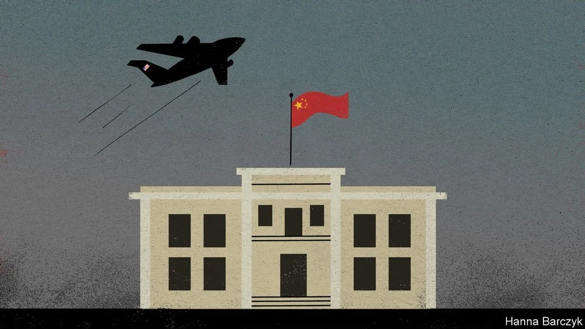

### 2023

  

Claude Elwood Shannon ( 1916 - 2001 ) was an American mathematician, electrical engineer, computer scientist, and cryptographer known as the "father of information theory." Here's a brief overview of some of his major contributions:

1 - Information Theory:

- Mathematical Theory of Communication (1948): Shannon published a groundbreaking paper titled "A Mathematical Theory of Communication" in the Bell System Technical Journal. This work introduced the foundational concepts of information theory, such as entropy, information rate, and redundancy.
- Entropy: Shannon introduced the concept of entropy as a measure of the uncertainty or randomness of information. This allowed for a quantifiable measure of the information content of a source.
- Channel Capacity: He established the limits on how much information can be reliably transmitted over a given communication channel, considering the presence of noise.

2 - Digital Circuit Design Theory:

- Masters Thesis (1937): At 21, Shannon's master's thesis demonstrated that electrical circuits could perform logical operations. This work laid the groundwork for digital circuit design, bridging the gap between electrical engineering and Boolean algebra.
- Relay Circuits and Cryptography: During World War II, Shannon worked on improving the reliability of relay circuits, which was foundational for early computer design. He also worked on cryptography, developing a theoretical basis for ensuring communications security.

3 - Cryptanalysis: Shannon collaborated with British mathematician Alan Turing during WWII. They both were working on cryptography, and Shannon's work laid the groundwork for modern cryptographic theory.

4 - Sampling Theory: Along with Harry Nyquist, Shannon formulated the Nyquist–Shannon sampling theorem, which defines the conditions necessary for a signal to be sampled and reconstructed without error.

5- Data Compression: Shannon's entropy concept paved the way for the development of modern data compression techniques. Concepts like Huffman coding can be traced back to Shannon's early work.

6 - Noisy-channel Coding Theorem: This theorem establishes the maximum rate at which information can be transmitted over a noisy channel with an arbitrarily low error probability.

7 - Shannon-Hartley Theorem: In collaboration with R.V.L. Hartley, this theorem relates the maximum data rate of a communication channel to its bandwidth and signal-to-noise ratio.

8 - Work on Artificial Intelligence: Shannon was among the early pioneers thinking about machine learning and artificial intelligence. He devised a mechanical mouse that could "learn" to navigate a maze, which was an early demonstration of machine learning principles.

These are just the highlights. Shannon's work touched various fields, and his ideas provided the theoretical foundation for much of modern digital communications and computing.

### 2022

I am old enough to remember so called expert opinions related to the future price of bitcoin by the end of 2021 or mid-2022.

- Mashinsky (yes, the guy from Celsius): USD 140 – 160k (mid-’22)
- Plan B: USD 100k (end ‘21) / USD 280k (mid-’22)
- Raoul Pal: USD 200k (end ’21) / USD 400k (end cycle)
- Tim Draper: USD 250k (mid ’22)

Just to mention a few.

My advice: Don’t buy the noise & do your own research.

A model that I appreciate and (yet) not that much noticed is shown below. It is called: the bitcoin power-law corridor of growth

  

### 2021

> China is happy to see America humbled in Afghanistan. It does not love the Taliban, but is ready to do business with them

On the afternoon of August 17th, as scenes of horror unfolded around Kabul, China’s envoy to Afghanistan recorded the tranquil mood at his own embassy. The ambassador’s smartphone images, proudly shared on social media by Hu Xijin, the editor of a Communist Party tabloid, show the Chinese flag snapping crisply against a summer sky, and front doors guarded by nothing more menacing than a tall porcelain vase.
China’s propaganda machine is enjoying the fall of Afghanistan, at least for now. Chinese diplomats and state media have missed no chance to contrast the chaotic retreat of America and its allies with their own country’s continued welcome. For China, this is a chance to advance a model of foreign relations based on coldly weighed security and economic interests, rather than on lofty talk of building a better Afghanistan where girls may go to school. No bonds of affection or trust bind China and the Taliban. Instead, China has pursued a few narrowly defined goals during years of intensifying contacts with Taliban delegations. China’s list is headed by its desire for a stable Afghanistan, especially near that country’s short, mountainous border with China. Above all, China has made clear that in return for the international recognition that the Taliban crave, and (probably rather limited) investments in roads, mines and other infrastructure, they must deny any haven to exiles from China’s north-western region of Xinjiang, especially Uyghurs. China’s fear is that Uyghur militants, including some with combat experience in Syria or training in Iran, may hope to enter Xinjiang through Afghanistan. Though China’s iron-fisted rule in Xinjiang—featuring the demolition of mosques and the detention of Muslims to “cure” them of excessive piety—offends all that the Taliban purport to believe, the group needs China’s backing. Its political leader, Mullah Abdul Ghani Baradar, duly told China’s foreign minister on July 28th that the Taliban will never allow any force to use Afghan territory “to engage in acts detrimental to China”.

  

### 2020

Jeżeli chcemy wiedzieć dlaczego Chiny tworzą lądowy Jedwabny Szlak to warto rzucić okiem na skan ruchu statków w cieśninie Malakka. I teraz dodać do tego że ich główny rywal (USA) w pełni panuje na morzu, to już wiemy dlaczego budują szlak w środku lądu.

  

---

Czy uważacie, że półroczna strata w wysokości 21 miliardów dolarów (USD) w pierwszym półroczu tego roku to dużo? Z perspektywy polskiego rynku kapitałowego to tak jakby wszystkie aktywa funduszy inwestycyjnych stopniały o blisko jedną trzecią (na koniec lipca wartość aktywów zgromadzonych w polskich funduszach inwestycyjnych wynosiła 257,7 mld złotych, co daje około 69,6 mld (USD)), czyli całkiem sporo. Z perspektywy największego na Świecie funduszu emerytalnego jakim jest Norweski Państwowy Fundusz Emerytalny (z ang. Government Pension Fund of Norway - GPFN) z aktywami na poziomie 1,2 biliona USD jest to jednak nieco mniej (niespełna 2% wartości aktywów). A taką stratę ów fundusz zanotował w pierwszych sześciu miesiącach tego roku. Zważywszy na okoliczności i porównując do stopy zwrotu z polskiego rynku akcji w analogicznym okresie (indeks WIG -14,3%), taki wynik wydaje się całkiem przyzwoity. GPFN inwestuje jednak globalnie i w różne klasy aktywów.

### 1944

https://pl.wikipedia.org/wiki/Bitwa_pod_Falaise

### 1942

Lotnictwo radzieckie zbombardowało okolice warszawskiego Dworca Głównego przy Alejach Jerozolimskich 38/46.
Przypomnijmy, że obiekt ten istniał w latach 1933-1944, kiedy to został zburzony po upadku Powstania Warszawskiego.

  

### 1794

Podczas insurekcji kościuszkowskiej wybuchło pierwsze z powstań wielkopolskich. Do największych wystąpień przeciwko zaborcy pruskiemu doszło w Brześciu Kujawskim. Oddział dowodzony przez ksztelana brzesko-kujawskiego Dionizego Mniewskiego przypuścił atak na stacjonujący tam garnizon pruski, który po krótkiej walce został rozbrojony. Następnego dnia sukesem zakończyły się walki powstańcze o Włocławek, gdzie udało się przechwycić jadący z Warszawy transport broni dla wojsk pruskich. W ciągu kilku dni powstanie ogarnęło większość Wielkopolski: dawne województwa brzesko-kujawskie, część inowrocławskiego, kaliskiego, sieradzkiego, gnieźnieńskiego i poznańskiego. Zaskoczone zrywem siły pruskie nie były w stanie go stłumić. Utrzymały się jedynie większe garnizony pruskie między innymi w Poznaniu.

---

<a href="https://github.com/TomaszWaszczyk/historia.waszczyk.com/edit/master/src/content/august-2.md" target="_blank">Edytuj tę stronę dzieląc się własnymi notatkami!</a>
