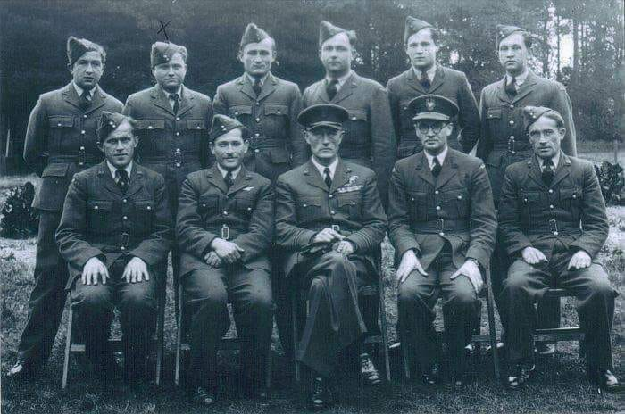

### 1940

W Wielkiej Brytanii weszła w życie tzw ustawa "Allied Forces Act", na mocy której został zalegalizowany pobyt polskich lotników na terytorium tego kraju.
Do tego czasu wszystkie polskie dywizjony lotnicze traktowane były jak nielegalni emigranci. Nawet wyładunek Polskich Sił Zbrojnych był naruszeniem prawa konstytucyjnego Wielkiej Brytanii.

  

---

<a href="https://github.com/TomaszWaszczyk/historia.waszczyk.com/edit/master/src/content/august-22.md" target="_blank">Edytuj tę stronę dzieląc się własnymi notatkami!</a>
