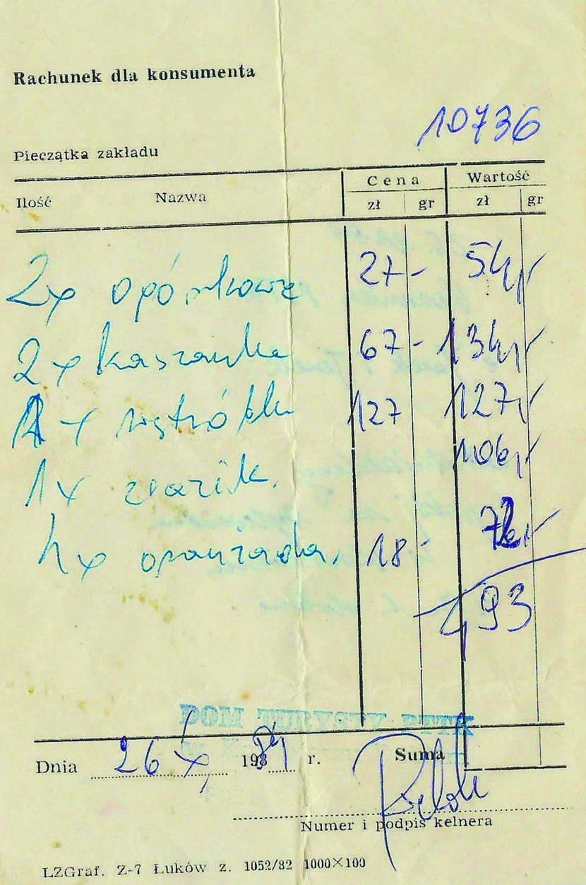
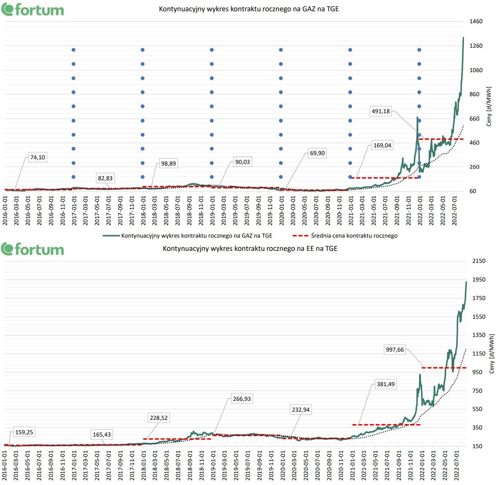
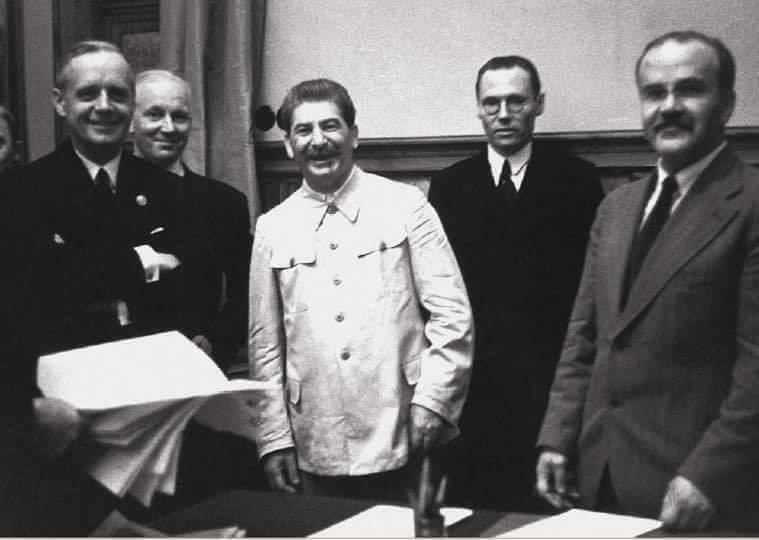
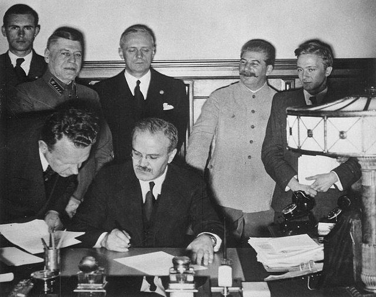

### 2023

<a href="./documents/august/origins-of-the-federal-reserve-system.pdf" target="_blank">Origins of Federal Reserve</a>

<a href="./documents/august/r191126d.pdf" target="_blank">The yield curve in Eurozone</a>

---

> W 2013 roku Bank Japonii podjął decyzję o wdrożeniu programu “nowej ramy polityki pieniężnej”, który zakładał agresywne luzowanie monetarne. Bank rozpoczął masowe skupowanie obligacji rządowych, dążąc do zwiększenia podaży pieniądza i obniżenia kosztu kredytu. W ramach programu zobowiązał się do podwojenia podaży pieniądza w ciągu dwóch lat. Cel został osiągnięty, jednak inflacja wciąż utrzymywała się na niskim poziomie.

---

Dom Turysty PTTK w Kazimierzu Dolnym. Przeciętne miesięczne wynagrodzenie w 1984r: 16838zł

  

---

  

---

### 2022

  

### 2021

Frasyniuk o Wojsku Polskim na granicy z Białorusią

<video width="640" height="480" controls>
<source src="./movies/august/frasyniuk.mp4" type="video/mp4">
Your browser does not support the video tag.
</video>

### 1943

https://pl.wikipedia.org/wiki/Bitwa_na_%C5%82uku_kurskim

### 1939

W nocy z 23/24 sierpnia 1939 roku w Moskwie, po krótkich negocjacjach podpisany został pakt o nieagresji między III Rzeszą i ZSRR tzw. Pakt Ribbentrop-Mołotow.
Nazwa paktu pochodziła od nazwisk, które nosili ministrowie spraw zagranicznych III Rzeszy (Joachim von Ribbentrop) i ZSRR (Wiaczesław Mołotow). Pakt zawierał tajny protokół dodatkowy dotyczący podziału ziem i stref wpływów w Europie Środkowo-Wschodniej. W jednym z punktów czytamy: „W razie terytorialnych i politycznych zmian na obszarach należących do państwa polskiego strefy interesów Niemiec i ZSRR będą rozgraniczone wzdłuż linii rzek Narwi, Wisły i Sanu.” Oprócz tego III Rzesza dała Kremlowi wolną rękę w odniesieniu do Finlandii, Łotwy, Estonii, rumuńskiej Besarabii.
Traktat umocnił pozycję III Rzeszy i ułatwił jej zaatakowanie Polski.  Po agresji III Rzeszy na Polskę 1 września 1939 r., Armia Czerwona 17 września 1939 r. zaatakowała od wschodu i zajęła ziemie polskie. Ostatecznego porozumienia co do podziału terytorium II Rzeczpospolitej obaj agresorzy dokonali na mocy Traktatu o granicach i przyjaźni z 28 września 1939 r.

  

  

### 1905

https://pl.wikipedia.org/wiki/Czes%C5%82aw_Klimuszko - człowiek którzy przewidział, że w Polsce będą winnice.

### 1901

https://pl.wikipedia.org/wiki/Ozjasz_Szechter

### 1754

https://pl.wikipedia.org/wiki/Ludwik_XVI porównany to Tezosa (XTZ)

---

<a href="https://pl.wikipedia.org/wiki/Pakt_Ribbentrop-Mo%C5%82otow" target="_blank">Pakt Ribbentrop-Mołotow</a>

---

<a href="https://github.com/TomaszWaszczyk/historia.waszczyk.com/edit/master/src/content/august-23.md" target="_blank">Edytuj tę stronę dzieląc się własnymi notatkami!</a>
