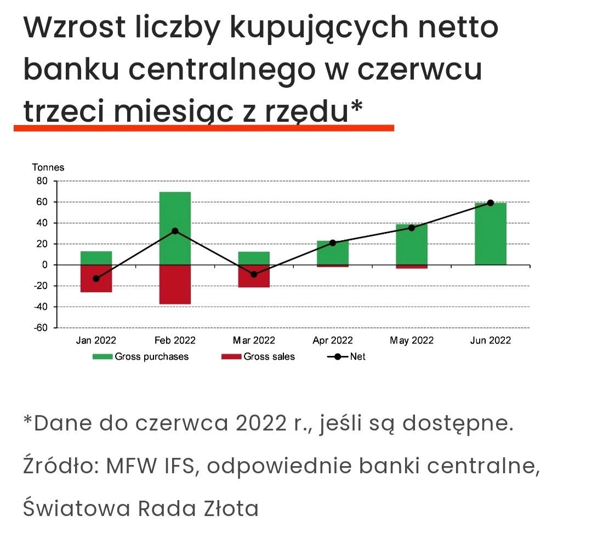
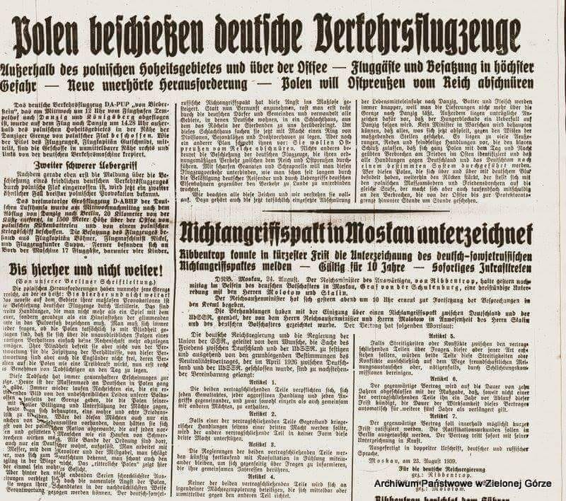
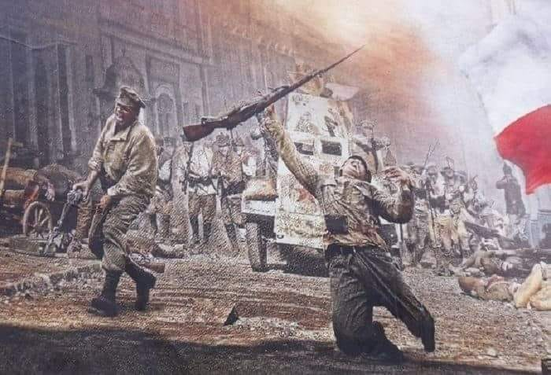

### 2023

> Życie 😊

  
<!--    -->
---

Dywersja psychologiczna, a rosyjskie służby specjalne
Dzisiejszy tekst chcę poświęcić dywersji psychologicznej – jednej z bardziej niebezpiecznych broni stosowanej przez rosyjskie służby specjalne. Dywersja psychologiczna wykorzystywana jest przez Rosjan w działaniach asymetrycznych i nastawiona na długofalowe działanie. Jej skutki potrafią być niszczycielskie dla całych społeczeństw.

Na samym początku zdefiniujmy, czym w ogóle jest dywersja psychologiczna. Oddajmy w tym miejscu głos specjaliście OSINT Mirosławowi Szczerbie, który stwierdził, że dywersja psychologiczna to: „zespół wypracowanych metod w przestrzeni oddziaływania poprzez media społecznościowe, operacji psychologicznych dla spowodowania gwałtownej atmosfery i reakcji społeczeństwa w celu podważenia porządku prawnego i historycznej pozycji państwa”.
Nadrzędnymi celami takich działań jest jak największa polaryzacja społeczeństwa, podkopanie zaufania do instytucji państwa, rozbicie jedności narodowej, sprzyjanie i podsycanie radykalizacji oraz ośmieszenie wszelkich autorytetów ważnych dla danej społeczności. Aby przeprowadzić skuteczne działania psychologiczne, należy bardzo dobrze znać kod kulturowy i DNA danego społeczeństwa. Rosjanie są w tym mistrzami już od czasów ZSRR. Dywersja psychologiczna od klasycznej dywersji różni się tym, że zamiast niszczenia obiektów infrastruktury krytycznej czy wojskowej niszczy się całe społeczeństwa. Operacje w ramach dywersji psychologicznej obliczone są często na całe dekady do przodu. Udział w nich bierze główne agentura wpływu i system agentów zwanych w slangu służb „śpiochami”.
Modus operandi rosyjskich służb wygląda następująco: bardzo często nie są one nawet inspiratorem pewnych wydarzeń, a bacznie obserwują sytuację w danym kraju. Kiedy dochodzi do sytuacji kryzysowych, Rosjanie wchodzą wówczas do gry i wykorzystują turbulencje oraz podsycają negatywne zdarzenia zachodzące w państwie, w którym działają.
Jurij Bezmienow, jeden ze współpracowników KGB, który w latach 70. uciekł do USA, twierdzi, że Rosjanie, prowadząc działania noszące znamiona operacji psychologicznych, powodują w atakowanych przez siebie krajach następujące etapy korzystne dla Kremla:

- demoralizację – społeczeństwo dochodzi do momentu, w którym nie wie już, co jest dobre, a co złe, zostają zatarte wszelkie wartości, a polaryzacja dochodzi do punktu krytycznego;
- destabilizację – na tym etapie wspierane są grupy oraz osoby, które przyczyniają się do dalszego rozkładu instytucji państwowych i pogorszenia sytuacji wewnętrznej;
- kryzys – w tym momencie prowadzone są działania prowadzące do przewrotu i zmiany władzy, którą to jednak ma uznać samo społeczeństwo oczekujące silnego przywódcy, kryzys może prowadzić do wojny domowej lub inwazji z zewnątrz
- normalizację – nowe władze wprowadzają porządek i „normalizują” sytuację zgodnie z linią Kremla.
Całe clue właściwie przeprowadzonej dywersji psychologicznej polega zatem na tym, aby doprowadzić atakowane społeczeństwo do takiego momentu, aby nie było ono w stanie skutecznie się bronić. Ludzie powinni być wówczas maksymalnie zantagonizowani, a z drugiej strony zmęczeni ciągłą niestabilną sytuacją wewnętrzną. Wówczas na scenę może wyjść nowy i silny przywódca bądź ugrupowanie, które będzie remedium na wszystkie problemy.
Z dywersją psychologiczną ściśle powiązany jest tzw. werbunek mentalny. Od klasycznego werbunku różni się on tym, że werbowana jest nie pojedyncza osoba, a całe społeczeństwo. Jest to niezauważalne wpływanie na zbiorową  świadomość mas, które ostatecznie mają doprowadzić do korzystnych dla Rosji zmian politycznych. Werbunek mentalny jest ściśle związany z sytuacjami kryzysogennymi podsycanymi przez rosyjskie służby.
Polska na działania psychologiczne ze strony Rosji narażona jest w zasadzie od lat 90. Przez całe lata rosyjskie służby umiejętnie budowały w naszym kraju sieci agentury wpływu. Obok działań stricte siłowych Kreml prowadził u nas misternie utkane działania psychologiczne połączone z dezinformacją. Zarówno w Polsce, jak i w całej Europie Kreml do swych operacji wykorzystuje skrajne ugrupowania z prawej i lewej strony politycznej. Rosyjska agentura wpływu napuszcza na siebie jednych i drugich, tworząc przy tym atmosferę strachu, ale i nadziei. Dane ugrupowania uważa, że to właśnie ONO jest tym, które uratuje Polskę z matni, w jakiej się znalazła. Przy umiejętnie przeprowadzonej dezinformacji społeczeństwo polskie dostaje wówczas niemal gotową receptę na rozwiązanie swoich problemów. Kreml stara się przy tym zwalczać wszystko, co bliskie danym grupom społecznym. Z jednej strony Rosjanie próbują ośmieszyć i skompromitować bliski Polakom katolicyzm (bardzo często wykorzystując słabości polskiego Kościoła Katolickiego), z drugiej zaś strony Kreml obrzydza demokratyczne wartości, liberalny światopogląd, eksponując przy tym misyjną i zbawienną rolę ruchów konserwatywnych.

Niestety Polska jest bardzo łatwym celem dla Kremla. Nasz kraj nie ma praktycznie żadnej odporności na działania psychologiczne prowadzone przez Rosję. Dużą rolę odgrywają tutaj media, które bardzo często są wykorzystywane przez rosyjskie służby jako jeden z punktów dezinformacji ułatwiającej dywersję psychologiczną. Dziennikarze w Polsce nie muszą jawnie współpracować z Rosjanami. Rodzime media są niemal całkowicie powiązane ze stronami sporu politycznego. Dlatego też dziennikarze często nie mają żadnych hamulców przed hejtem czy wręcz oszczerstwami rzucanymi wobec oponentów ich politycznych protektorów. Polskie media z jednej strony są pod kontrolą polityczną, a z drugiej strony brak, aby ktoś kontrolował ich rzetelność. Takie zachowania w mig podłapują rosyjskie służby, które jeszcze bardziej nakręcają spiralę nienawiści. Jest to klasyczny przykład wykorzystywania, a nie kreowania sytuacji kryzysogennych.

Kolejnym ważnym celem operacji psychologicznych w Polsce jest całkowite odwrócenie uwagi naszego społeczeństwa od realnych zagrożeń, jakie stwarza Kreml. Rosyjskim służbom mocno zależy na tym, aby wzbudzić w Polakach swoisty rodzaj znieczulicy. Ludzie piszący o zagrożeniu płynącym ze strony Rosji mają być kreowani na szurów, siewców teorii spiskowych i niewiarygodnych fantastów. O to chodzi Kremlowi. Dywersja psychologiczna jest niewidzialna, atakuje jak wirus i infekuje kolejne zdrowe tkanki społeczeństwa. Skoro nie widzimy wybuchających mostów czy składów broni, to przecież jesteśmy bezpieczni i nikt nie próbuje nami sterować ani manipulować. W takich warunkach Rosjanie mogą się czuć wręcz bezkarni.

Przed dywersją psychologiczną można się jednak bronić. Polskie służby kontrwywiadowcze i wywiadowcze (bez podziału na cywilne i wojskowe) powinny połączyć siły. Rodzime służby specjalne MUSZĄ prowadzić działania bardziej ofensywne, walcząc z Rosjanami… dokładnie tą samą bronią. Nasz wywiad powinien zacząć prowadzić operacje psychologiczne na terenie Rosji, próbując rozbijać i antagonizować tamtejsze społeczeństwo. Jest to bardzo trudne, ale wykonalne. Armia dobrze wyszkolonych analityków i spójna polityka dezinformacyjna oraz szeroko zakrojona dywersja psychologiczna wobec wrogiego państwa potrafi przynieść lepsze skutki niż działania siłowe. Nasze służby muszą jednak zdać sobie sprawę, że takie operacje planuje się z wyprzedzeniem i pierwsze plony, które Państwo Polskie może z tego tytułu zebrać, pojawią się dopiero za 10-15 lat.

Problem dywersji psychologicznej prowadzonej przez Kreml jest bardzo ważnym wyzwaniem, z jakim muszą zmierzyć się nasze elity polityczne. Zniszczenie tkanki narodu i rozbicie jego jedności w fundamentalnych sprawach przyniesie katastrofalne skutki w przyszłości.

### 2022

Bank Centralny Iraku był największym nabywcą w czerwcu, dodając 34 tony do swoich rezerw złota. Jest to pierwszy dodatek Iraku od września 2018 r. (7 ton) i podnosi całkowite rezerwy złota do 130 ton, czyli 11% całkowitych rezerw. Uzbekistan (9t), Turcja (8t), Kazachstan (4t) i Indie (4t), wszyscy stali kupcy.

  

---

  

### 2021

W szpitalu w Ostrowcu Świętokrzyskim pracuje pierwszy lekarz z zagranicy zatrudniony w tej placówce w oparciu o przepisy trybu szczegółowego. Będą następni.
- To nie jest działanie przeciwko kolegom lekarzom, ale dla poprawy ich warunków pracy. W szpitalu wielu lekarzy pracuje ponad 400 godzin miesięcznie, czyli prawie na trzech etatach, ponad siły - mówi dr Adam Karolik, dyrektor szpitala.

---

  

---

Pierwsze miejsca na listach rekrutacyjnych dostały osoby z Ukrainy/Białorusi, gdzie jak wiadomo szerzy się korupcja i za paczkę Malborasków można kupić sobie świadectwo/maturę. Przez to wielu Polaków nie dostało się na studia mimo całkiem dobrych wyników. Na informatyce 70% przyjętych to osoby zza wschodniej granicy, poniżej skrin z psychologii. Podobnie wygląda to na dziennikarstwie, politologii i jeszcze na kilku kierunkach. Ja jestem jak najbardziej za wspieraniem Ukraińców i Białorusinów, ale na Boga, niech oni zdają jakieś miarodajne egzaminy, a nie dostają full punktów za nic. Współczuję tym, którzy harowali 3 lata w liceum, napisali całkiem dobrze rozszerzenia a i tak się nie dostali, bo jakiś Sasza czy Valeria dostali się na listy z maxem punktów. Jak widać polskie uczelnie wolą przyjąć masę osób zza granicy o wątpliwych umiejętnościach, niż Polaków, bo dostają z tego większe pieniądze. Po wybuchu afery, na profilu na fb UAM zaczęto usuwać nieprzychylne komentarze.

  

---

### 2020

Ciekawą rozmowę uciął sobie w TOK FM Maciek Głogowski z wiceministrem finansów Piotrem Patkowskim. Młody wiceminister w pewnym momencie zdradził, dlaczego rząd aż tak bardzo się nie przejmuje rosnącym zadłużeniem. Otóż wiceminister powiedział, że po pierwsze PKB będzie nominalnie rósł, więc ten sam dług z czasem „rozpuści się” w większym bogactwie Narodu, a po drugie, że…

> „Oprocentowanie pieniędzy, które pożyczamy na rynku często jest niższe od poziomu inflacji. W związku z tym te pieniądze realnie i nominalnie tracą na wartości”

### 2011

  

### 1995

Oficjalna premiera systemu operacyjnego Windows 95.

  

### 1979

https://pl.wikipedia.org/wiki/Hanna_Reitsch

### 1939

Fragment artykułu z niemieckiej gazety regionalnej "Zullichau Schwiebuser Kreiszeitund"z dnia 24 sierpnia 1939 roku.
"Polska ostrzelała niemieckie samoloty rejsowe"
"Polskie prowokacje sięgneły granic. Polska przekroczyła już granice swojego zaślepienia i powinna w końcu ponieść odpowiedzialność.Nie można dalej tolerować polskich prowokacji i napadów szału,należy wprowadzić prawdziwą politykę pokoju. Zorganizowane bandy w Polsce pracują nożami, rewolwerami i widłami zabijając każdego kto należy do narodowości niemieckiej. Rycerscy Polacy pokazują swoją prawdziwą twarz." W dalszej części tego arykułu autor przekonywał czytelników, że właśnie po zawarciu Paktu o nieagresji z Rosją, wsie i gminy, w których zamieszkuhą Niemcy zostały zamienione w "rzeźnie", "otoczone dywizjami, umocnieniami i zasiekami", z których "nie mogą się wydobyć jęki mordowanych". Ponadto Polacy chcą - jak pisze autor - "zasznurować" Prusy Wschodnie, głównie po to, aby oddzielić je od Rzeszy. O tym ma świadczyć przywołane na występie ostrzelanie samolotów rejsowych.
Opisane zestrzelenie samolotów nigdy nie zostało potwierdzone.

  

### 1920

Podczas dobiegającej już końca bitwy warszawskiej resztki oddziałów bolszewickich w postaci 3 korpusu kawalerii oraz 4. i 15. Armii nie mogąc przebić się na wschód przekroczyły granicę niemiecką i zostały internowane na terytorium Prus Wschodnich.
Bilans kończącej się bitwy to po stronie polskiej 4500 zabitych, 22 tysiące rannych i około 10 000 zagonionych. Armia Czerwona straciła 25 000 żłonierzy, 60 000 trafiło do polskiej niewoli, a kolejne 45 000 zostało internowanych w Niemczech.

  

---

<a href="https://github.com/TomaszWaszczyk/historia.waszczyk.com/edit/master/src/content/august-24.md" target="_blank">Edytuj tę stronę dzieląc się własnymi notatkami!</a>
