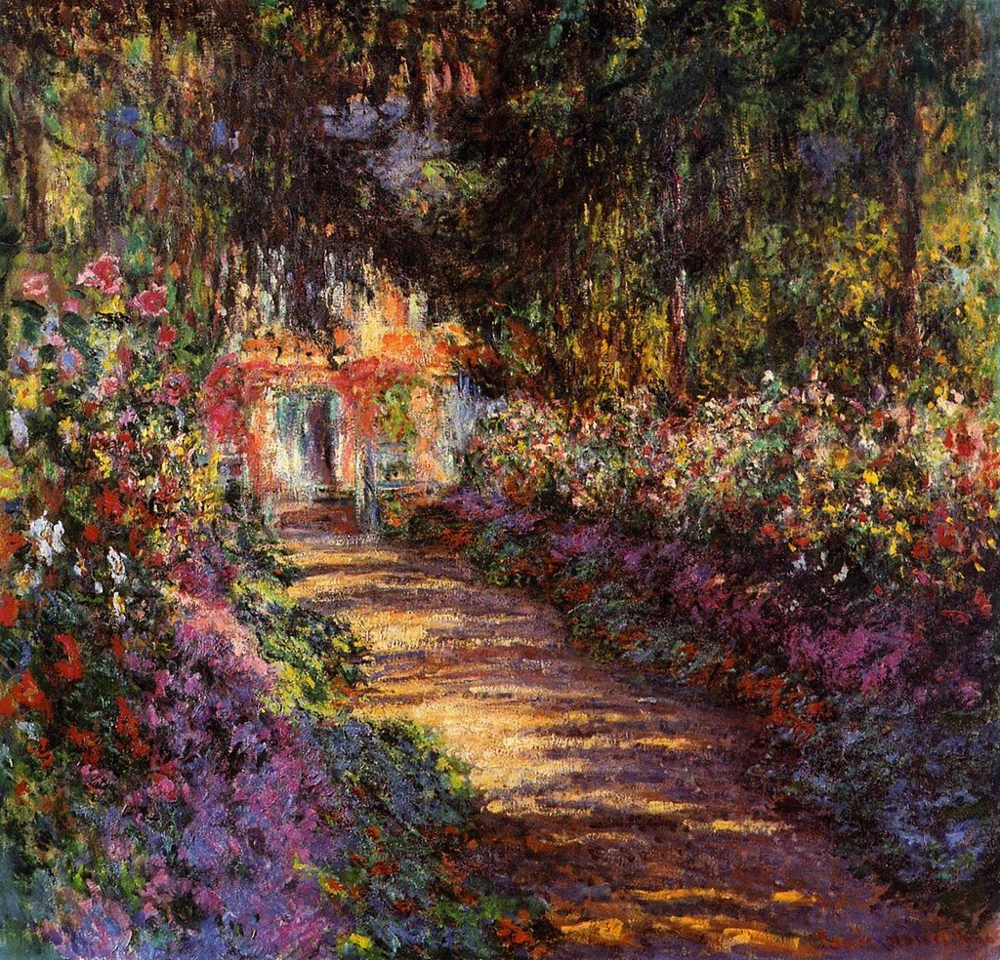
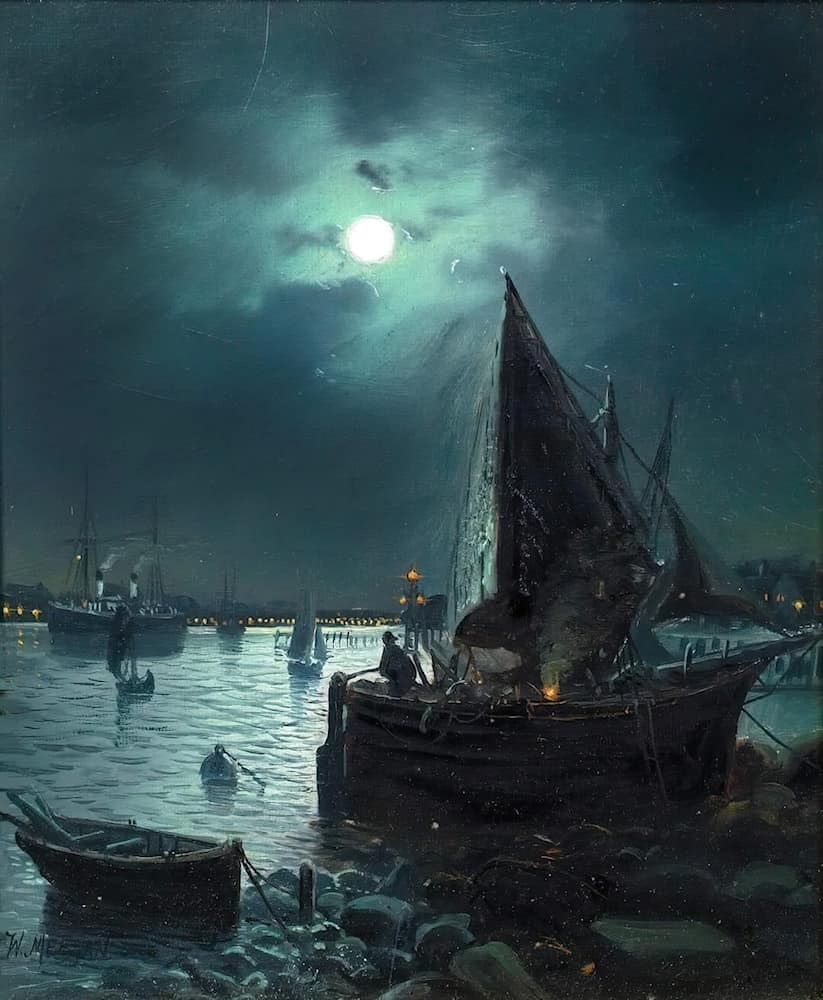
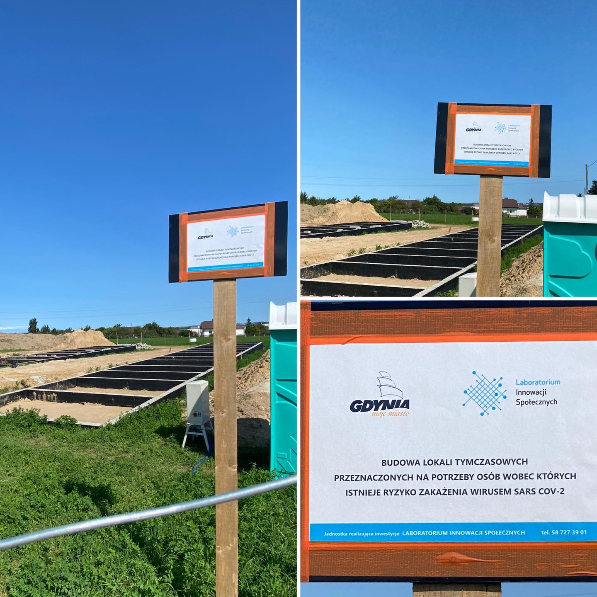
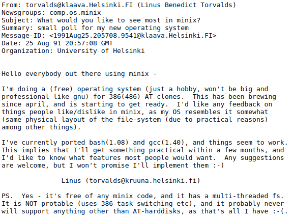
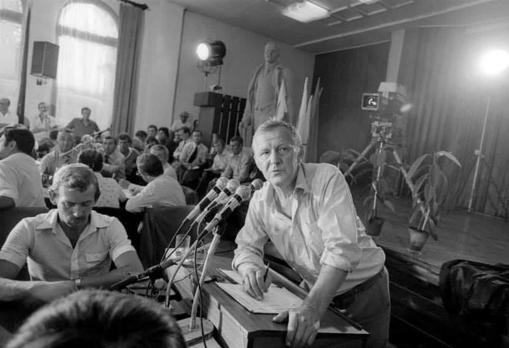
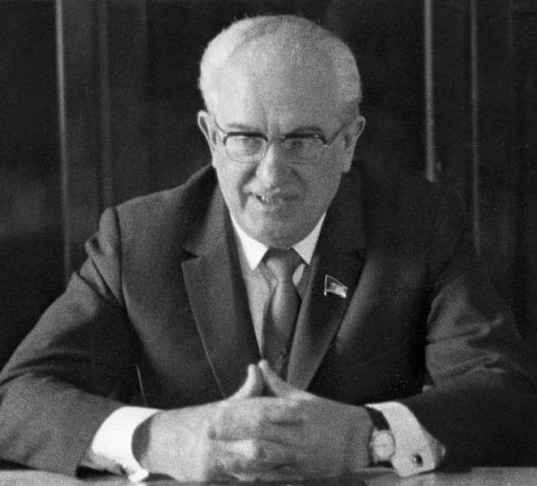
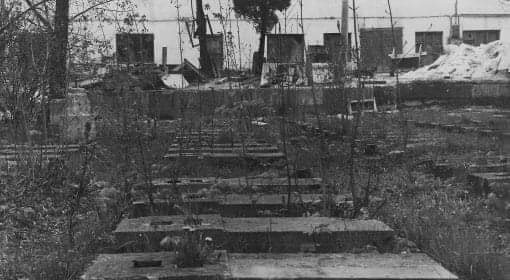
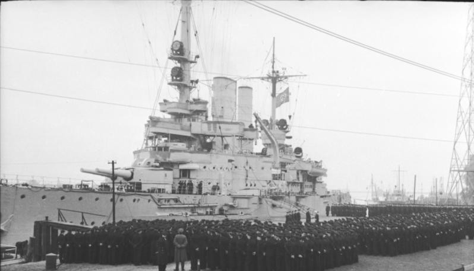
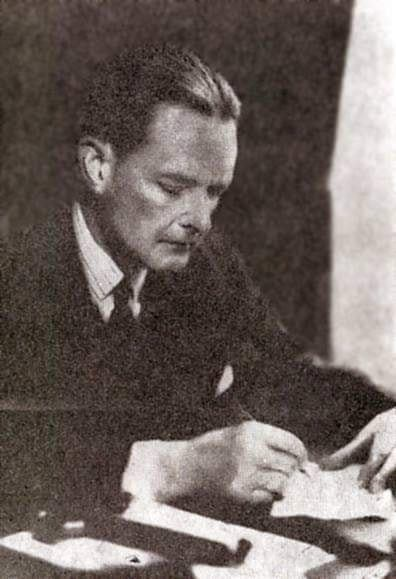

### 2023

"The Garden in Flower", 1900 By Claude Monet (French, 1840-1926), Place of creation: Giverny, France

"Claude Monet lived for forty-three years, from 1883 to 1926, in his house in Giverny. With a passion for gardening as well as for colours, he conceived both his flower garden and water garden as true works of art.

Walking through his house and gardens, visitors can still feel the atmosphere which reigned at the home of the Master of Impressionnism and marvel at the floral compositions and nymphéas, his greatest sources of inspiration.

Mpnet. He untiringly transformed an abandoned domaine into a floral masterpiece, to be the inspiration for many of his greatest works of art. Monet was not only a painter of his own garden but also an artist whose painting trips took him away for lengthy periods of time. However, he was never really far from his garden .

Through constant correspondence, he kept a close eye on his family and his flowers . Frequent visits from his friends and admirers made Giverny the centre of his existence . Until his death in 1926, the painter, the father , the gardener and the man would never really leave Giverny."

  

---

  

---

### 2021

> No więc Gdynia buduje miejsca odosobnienia dla podejrzanych o styczność z Covid-19. Klatek będzie aż 18. Budowa ma się zakończyć w marcu 2022 🤷🏻‍♂️ Zdjęcia zrobiłem przed chwilą. Klatki duże nie będą, będzie łatwo zwariować. W tym tygodniu złożę interpelację z prośbą o szczegóły. - Artur Dziambor

  

---

> "People who received two vaccine shots walk around feeling like they are protected... they don't understand that the second vaccine has faded against the "Delta" - they must quickly get vaccinated with the 3rd dose!". - Israel's Prime Minister

---

### 2020

Poprzedni kryzys finansowy był znacznie łagodniejszy od obecnie trwającego. Polsce udało się wtedy nawet uniknąć recesji. Mimo to, nasze zadłużenie wzrosło na tyle, że rząd Donalda Tuska musiał ukraść pieniądze z OFE, żeby oddalić się od konstytucyjnego limitu zadłużenia w wysokości 60% PKB. W reszcie Europy było znacznie gorzej. W wyniku kryzysu w ciągu kilku lat średni poziom zadłużenia państw z UE wzrósł o prawie 30 pp. Dla porównania, po drugim kwartale 2020 roku, nasze PKB spadło o ponad 8%, inflacja dobija do 5%, a nowelizowany budżet zakłada ponad 100 mld zł deficytu, nie licząc drugiego tyle ukrytego w BGK i PFR. Oznacza to, że czekają nas znacznie większe problemy niż poprzednio i nasz dług będzie szybko rósł.
Już teraz widać, że nasza gospodarka bardzo ucierpi, a my możemy niedługo znaleźć się w sytuacji, gdy przekroczymy konstytucyjny poziom długu, przez co kolejny budżet trzeba będzie uchwalić bez deficytu. Jest to bardzo poważna sytuacja. Już teraz powinniśmy się zastanawiać, jak z niej wybrnąć. Tymczasem odpowiedzialne za te zagadnienia Ministerstwo Finansów wydaje się być nieświadome problemu. Co więcej, wiceminister finansów Piotr Patkowski powiedział, że nie wyklucza kolejnego lockdownu tej jesieni. Te słowa potwierdził rzecznik PiS Radosław Fogiel.
Lockdown jest metodą średniowieczną, niezwykle dewastującą życie gospodarcze i społeczne. Tak zresztą mówił były już, niestety, wiceminister finansów rządu PiS Konrad Raczkowski. To jest skandal, że ktokolwiek jeszcze to rozważa, w szczególności ktokolwiek z MF. Czy myśli ktoś tam, co stanie się z budżetem, z przedsiębiorcami, z miejscami pracy i z naszym długiem? Co z konstytucyjnym progiem zadłużenia? Ostatnią rzeczą, którą chciałby usłyszeć teraz przedsiębiorca jest drugi lockdown. Same zapowiedzi ponownego niszczenia firm działają druzgocąco na inwestycje i plany rozwoju przedsiębiorstw.
Rozumiałbym, gdyby zamknięcia firm chciało Ministerstwo Zdrowia, sprzedawcy masek, czy instruktorzy narciarscy. Ale Ministerstwo Finansów? To tak jakby karp czekał na Wigilię, albo Jacek Sasin domagał się rozliczenia 70 mln zł, które wydał na wybory, które się nie odbyły.
MF w pierwszej kolejności powinno zadeklarować, że drugiego lockdownu już nie będzie. Nie można pozwolić wejść sobie na głowę ludziom z Ministerstwa Zdrowia i instruktorom narciarskim. Jest to niezbędne dla pobudzenia inwestycji, przywrócenia przedsiębiorcom nadziei i ustabilizowania naszej gospodarki. To fatalna wiadomość, że nawet Ministerstwo Finansów tego nie rozumie. To ministerstwo powinno stać w pierwszym rzędzie walki z kolejnymi pomysłami niszczenia gospodarki. Jeżeli nawet tam nie ma krzty zrozumienia dla sytuacji polskiej gospodarki, to ratuj się kto może, rządzą nami szaleńcy.

### 1991

21 years old Finnish computer science student Linus Torvalds sent a mail announcing that he was working on a new operating system which was ‘just a hobby, won’t be big and professional’.

  

### 1983

W Stoczni Gdańskiej odbyło się spotkanie wicepremiera Mieczysława Rakowskiego z załogą Stoczni. W spotkaniu wziął też udział Lech Wałęsa. W jego trakcie Wałęsa przedstawił propozycję przeprowadzenia wspólnych rozmów, co jego zdaniem miało przyczynić się do wyjścia z impasu na linii rząd- Solidarność. Rakowski propozycję odrzucił, obarczając winą za powstałą w kraju trudną sytuację gospodarczą Solidarność. Jednocześnie zaznaczył, że rząd bez przeszkadzających mu "krzykaczy" zbuduje prawdziwy socjalizm.

  

### 1980

W Moskwie władze sowieckie powołały do życia Komisję do Spraw Polski. Głównymi zadaniami tego organu było monitorowanie wydarzeń w Polsce oraz proponowanie polskim działaczom komunistycznym konkretnych działań mających na celu opanowanie trudnej sytuacji społecznej w Polsce. W ramach działań komisji planowano między innymi wprowadzenie na terytorium Polski 7 lub 8 dywizji państw Układu Warszawskiego.
Na czele komsji stał główny ideolog Komunistycznej Partii Związku Radzieckiego Michaił Susłow. Członkami byli f KGB Jurij Andropow (zdjęcie) , minister obrony marsz. Dmitrij Ustinow i minister spraw zagranicznych Andriej Gromyko.

  

### 1971

Władze sowieckie wydały decyzję w sprawie likwidacji Cmentarza Orląt Lwowskich. 
Do realizacji tego zadania przystąpiono w bardzo bezpardonowy i brutalny sposób. Do zniszczenia Łuku Chwały sprowadzono żołnierzy oraz czołgi, do których podczepione zostały liny umożliwiające przewrócenie wspierających go filarów. Strzelano również do umieszczonych na nim polskich napisów. Przesunięto również mur cmentarny, co sprawiło, że część grobów znalazła się na terenie przeznaczonym pod budowę drogi. Zniszczeniu oparły się jedynie solidne fundamenty Łuku. Gruz z polskich grobów, wywieziony z cmentarza użyty został do budowy pomnika Lenina we Lwowie. 

  

### 1939

Do Gdańska z kurtuazyjną wizytą przypłynął niemiecki szkolny okręt liniowy Schleswig-Holstein. Okręt zacumował przy nabrzeży w Nowym Porcie, naprzeciw Westerplatte.  Kurtuazyjna wizyta była w rzeczywistości tylko pretekstem, na okręcie przez cały czas panowała dyskretna wachta bojowa artylerii.  Maszyny były w ciągłym pogotowiu tak by w niedługim czasie mogły uzyskać potrzebną moc do opuszczenia nabrzeża.  O godzinie 15:02 załoga okrętu otrzymała rozkaz o rozpoczęciu działań wojennych, który w nocy 26 sierpnia o godzinie 04:30 odwołano.

  

---

W Londynie został podpisany sojusz polsko-brytyjski o wzajemnej pomoc między Polską a Wielką Brytanią. Ze strony polskiej podpis pod dokumentem złożył ambasador Edward Raczyński [foto]; w imieniu Wielkiej Brytanii dokument podpisał minister spraw zagranicznych lord Edward Halifax. Układ miał rozwinąć wcześniej złożone gwarancje Brytyjczyków z 31 marca 1939 r. Traktat zobowiązywał obie strony do udzielenia sobie wzajemnej pomocy wojskowej w przypadku agresji na jednego z sygnatariuszy lub agresji pośredniej na Wolne Miasto Gdańsk, Litwę, Belgię i Holandię. W tajnym załączniku widniał zapis iż sojusz został skierowany jedynie przeciw Rzeszy hitlerowskiej. Ważność sojuszu miała obowiązywać pięć lat.
Tego samego dnia o godzinie 15:02 Hitler wydaje rozkaz ,,Weiss''. Na wieść o podpisaniu przez Polskę sojuszu z Wielką Brytanią Hitler cofa wydany przez siebie rozkaz. Szturm na Polskę został przełożony z 26 sierpnia 1939 roku na 1 września 1939 r.

  

### 1530

https://pl.wikipedia.org/wiki/Iwan_IV_Gro%C5%BAny

---

<a href="https://github.com/TomaszWaszczyk/historia.waszczyk.com/edit/master/src/content/august-25.md" target="_blank">Edytuj tę stronę dzieląc się własnymi notatkami!</a>
