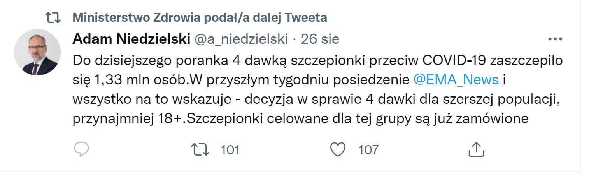

### 2022

  

### 2021

Businessinsider.pl:

> Nadchodzi budżetowe zaciskanie pasa. Minister finansów potwierdza

W 2023 r. będziemy wracać do unijnych i krajowych reguł fiskalnych - zapowiada minister finansów Tadeusz Kościński. Ekonomiści od dawna ostrzegają, że Unia może przestać tolerować wysoki deficyt w Polsce.

### 2020

Chinese are doing a runner, taking their wealth out of China using the Bitcoin Express

The government (like all governments) is powerless to stop it

The era of the nation-state is finished

  

---

  

---

### 2002

The full implementation of Agenda 21, the Programme for Further Implementation of Agenda 21 and the Commitments to the Rio principles, were strongly reaffirmed at the World Summit on Sustainable Development (WSSD) held in Johannesburg, South Africa from 26 August to 4 September 2002.

### 1943

W okolicach Ożarowa w województwie świętokrzyskim żołnierze Narodowych Sił Zbrojnych pod  wodzą plutonowego Tomasza  Wójcika zorganizowali zasadzkę, w którą wpadł dowódca 174 Dywizji Rezerwowej Wojsk Lądowych Wehrmachtu generalleutenant Kurt Renner (zdjęcie). Celem akcji było nie tylko schwytanie niemieckiego oficera, ale również uwolnienie 14 Polaków aresztownych przez ożarowskie Gestapo.  
Razem z Rennerem, który był najwyższym rangą niemieckim oficerem zabitym przez żołnierzy polskiego podziemia niepodległościowego zginęło dwóch oficerów sztabowych i pięciu ochraniających go żołnierzy Waffen-SS.

  

---

<a href="https://github.com/TomaszWaszczyk/historia.waszczyk.com/edit/master/src/content/august-26.md" target="_blank">Edytuj tę stronę dzieląc się własnymi notatkami!</a>
