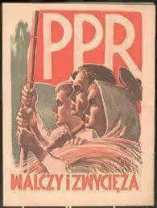
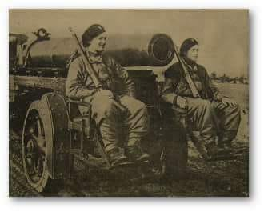
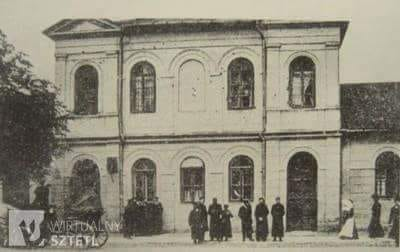
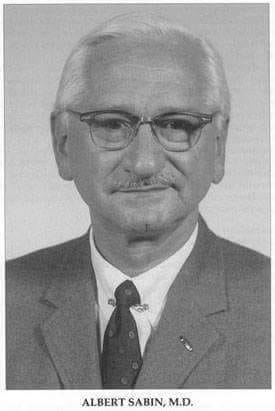

### 1941

Józef Stalin wydał decyzję o utworzeniu w Polsce partii komunistycznej pod nazwą Polska Partia Robotnicza. Pełnomocnictwo w tej sprawie przekazał stojącemu na czele Kominternu Georgijowi Dymitrowowi. Polecenia utworzenia struktur tej organizacji otrzymali również członkowie grup dywersyjnych wyszkolonych przez radzieckie służby specjalne.Członkowie tych grup mieli być zrzuceni na spadochronach na tereny polskie.
Dowódcą przygotowanej do
wysłania do Warszawy specjalnej grupy
dywersyjnej mianowano Marcelego Nowotkę, ps. „Stary” – działacza Wszechzwiązkowej
Komunistycznej Partii (bolszewików), urzędnika
administracji sowieckiej na ziemiach polskich
okupowanych po 17 września 1939 roku,
wytypowanego wcześniej do udziału w
specjalnych szkoleniach polityczno-dywersyjnych pod Moskwą.
Pozostałe wytyczne dotarły już 2 dni pózniej. Były to wskazówki na temat zatajenia bezpośredniej ingerencji radzieckiej w powstanie tej partii,a także dotyczące propagowania polskich haseł patriotycznych. Strukturę, skład kierownictwa, cele i zadania oraz pierwsze dokumenty „programowe” opracowywano pod bezpośrednim nadzorem Stalina i Dymitrowa.
Szczegółowe dyrektywy dotyczące form i
charakteru działalności oraz łączności radiowej
zapewnić miały pełne podporządkowanie
rozkazom sowieckim.
5 stycznia 1942 roku w Warszawie odbyło się zebranie założycielskie PPR. Zgodnie z
wcześniejszymi decyzjami Stalina na czele
nowej struktury stał Marceli Nowotko. Oprócz
niego w skład kierowniczej trójki nowej partii i
zarazem jej tzw. Komitetu Centralnego weszli:
Pinkus Finder ps. „Paweł” i Bolesław Mołojec
ps. „Długi”. Członkowie grupy Nowotki oraz
kolejne osoby przerzucone z obszarów ZSRR
otrzymywały zadania formalnego
podporządkowania nowemu kierownictwu
poszczególnych rozproszonych grup
komunistycznych na terenie Generalnego
Gubernatorstwa. Rozpoczęto formowanie
zbrojnych grup Gwardii Ludowej, w 1944 roku
przekształconych w Armię Ludową.

  

### 1939

Fragment odezwy prezydenta RP opublikowanej w Ilustrowanym Kurierze Codziennym w dniu 27 sierpnia 1939 roku:
" Obywatele Rzeczypospolitej!
Nocy dzisiejszej odwieczny wróg nasz rozpoczął działania zaczepne wobec Państwa Polskiego, co stwierdzam wobec Boga i historii.
W tej chwili dziejowej zwracam się do wszystkich obywateli państwa z głębokim przeświadczeniu, że cały naród w obronie swojej wolności, niepodległości i honoru skupi się dokoła Wodza Naczelnego i sił zbrojnych oraz da godną odpowiedź napastnikowi, jak się to już nieraz działo w historii stosunków polsko-niemieckich..."

  

### 1906

W Siedlcach władze carskie dokonały pogromu ludności żydowskiej tego miasta.
Początkowo planowano dokonanie tego pogromu podburzając do niego Polaków,ale nie udało się to, ponieważ na jaw wyszły tajne plany władzy rosyjskiej, która nie chcąc odpuścić zdecydowała się na samodzielne działania.
Tak wspominał ten dzień jeden z uczestniczących w nim rosyjskich podoficerów:
" „Rankiem 27 sierpnia 1906 r. nasz rotmistrz Zatczew, wróciwszy z zarządu policji, rozkazał mi podpalić jakikolwiek budynek, wyjaśniając na moje zapytanie, że jest to rozkaz dowódcy Ochrany ppłk Tichonowskiego, wobec czego nie należy rozumować, budynek trzeba
podpalić ukradkiem, aby usunąć od siebie
podejrzenia i stworzyć pozór, że podpalaczami
byli rewolucjoniści”.
Podczas „pogromu” zginęło od 26 (źródła
policyjne), do 100 (źródła nieoficjalne) Żydów,
kilkudziesięciu odniosło rany, kilkaset osób
aresztowano. Wiele rodzin pozostało bez dachu
nad głową. Splądrowano ok. 40 sklepów i wiele
mieszkań. Najmłodszą ofiarą był trzyletni
Jehoszua Rozen.

  

---

"Naukowiec, który jest również istotą ludzką, nie może spocząć, dopóki wiedza, która mogłaby zmniejszyć cierpienie, zalega na półkach." - Albert B. Sabin

26 sierpnia 1906 w Białymstoku w ubogiej rodzinie polskich Żydów przyszedł na świat Albert Sabin - wynalazca szczepionki przeciwko wirusowi polio. W 1921 wraz z rodziną wyemigrował do Stanów Zjednoczonych. Kształcił się jako stomatolog, Wkrótce przeniósł się do uniwersyteckiej szkoły medycznej. Poświęcił swoje życie zgłębianiom tajników mikrobiologii, wirusologii i immunologii. W czasie II wojny światowej służył w United States Army Medical Corps, gdzie był zaangażowany w rozwój szczepionki ochronnej przeciw tropikalnej gorączce denga i przeciwko japońskiemu zapaleniu mózgu. W 1956 roku wynalazł szczepionkę doustną przeciwko chorobie Heinego-Medina. W latach 60-tych podjął badania nad chorobami nowotworowymi na Uniwersytecie w Chincinnati, które kontynuował jako kierownik Instytutu Weismanna w Tel Awiwe -Jaffie i National Institute of Health w Bethesda. Sabinowi przyznano 40 doktoratów honoris causa przez uczelnie na całym świecie, a także wiele innych wyróżnień i nagród. W 1965 przyznano mu amerykańską nagrodę im. Alberta Laskera za wybitne osiągnięcia w klinicznych badaniach w medycynie. Uczony zmarł 3 marca 1993 roku w Waszyngtonie.

  

---

### 1856

https://pl.wikipedia.org/wiki/Iwan_Franko

### 1770

https://pl.wikipedia.org/wiki/Georg_Wilhelm_Friedrich_Hegel

---

<a href="https://github.com/TomaszWaszczyk/historia.waszczyk.com/edit/master/src/content/august-27.md" target="_blank">Edytuj tę stronę dzieląc się własnymi notatkami!</a>
