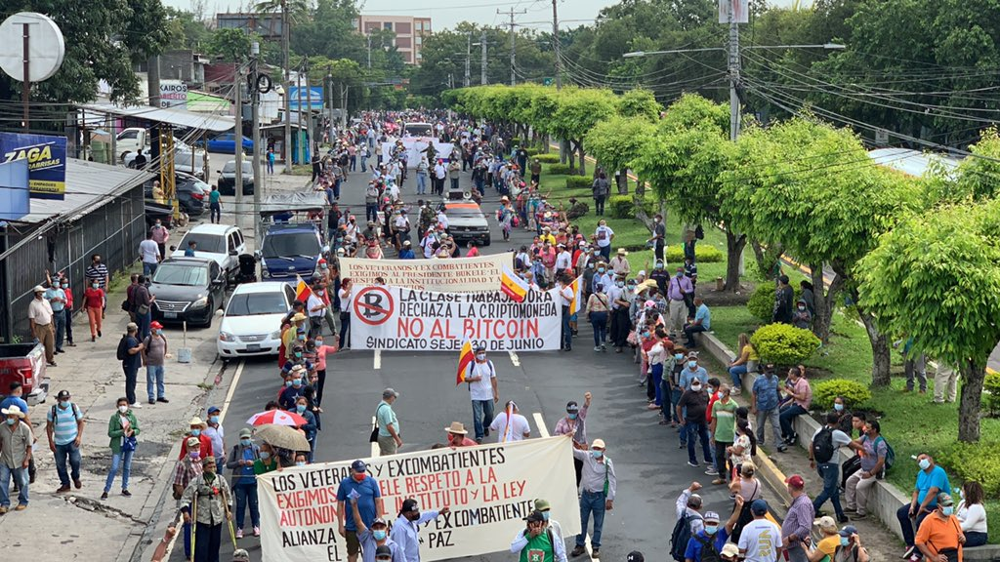
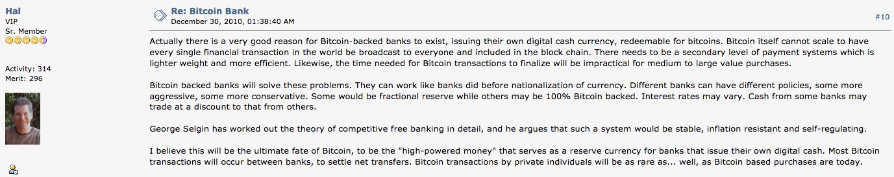
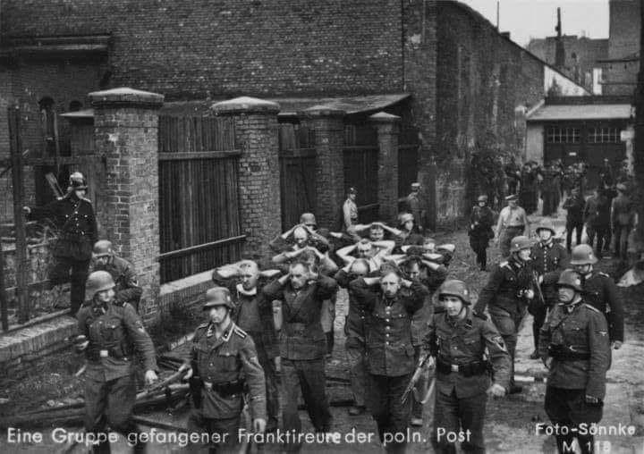
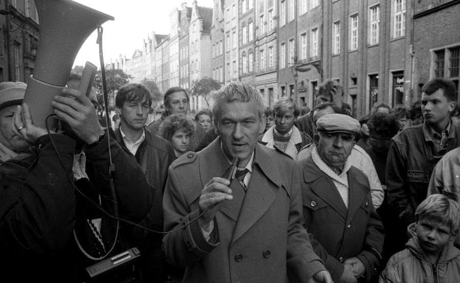
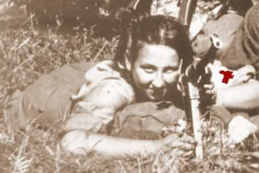
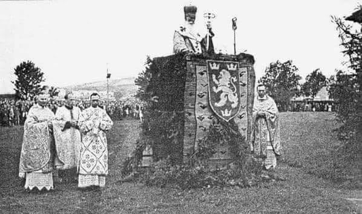
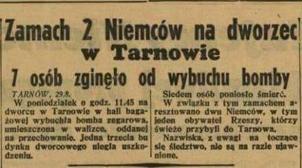
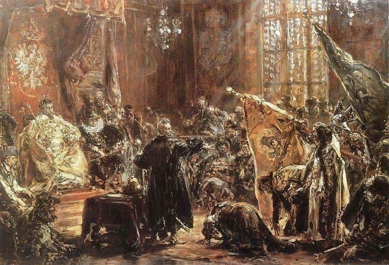

### 2021

Protest przeciwko wprowadzeniu standardu Bitcoin w Salwador, jednym z argumentów to brak możliwości udzielania kredytów przez IMF.

  

---

Kuba: rząd przepchnął ustawę cenzurującą Internet w kraju. Od teraz krytyka reżimu to „cyberterroryzm”.

---

Today's Thought?

Dear Charlatans, peddling the fraud known as stable coins..
The fact that no concept of a stable coin can exist, is well known by every economist on the planet..
Hence it is beyond comprehension the level of ignorance of these charlatans peddling stable coins upon the worlds sheeple.

"In a scientific sense, there is no such thing as a perfectly stable value of money-or of anything else. Value is a relationship, a rate of equivalence, or, as W. S. Jevons said, 'an indirect mode of expressing a ratio’ which can be stated only by naming the quantity of one object that is valued equally with the 'equivalent' quantity of another object. Two objects may keep a constant relative value in terms of each other, but unless we specify the other, the statement that the value of something is unchanged has no definite or practical meaning. Equally market prices always change on a free market, and have no known correlation to monetary value. The chief disturbances which changes in the value of money will cause operate through the effects on contracts for deferred payments and on the use of money units as the basis of calculation and accounting, as such the unalterable truth that for the individual the future movement of most prices is unpredictable (because market prices serve as signals of events of most of which the individual cannot know)."
This chapter analyses the economic impossibility known as "stable coins" or “currency basket”...

Extracted from the chapter "Stable Coin or Currency Basket"..

It's Money

  

---

### 2020

a) Ciężkie czasy tworzą twardych ludzi

b) Twardzi ludzie tworzą dobre czasy

c) Dobre czasy tworzą słabych ludzi

d) Słabi ludzie tworzą ciężkie czasy

---

Niemiecki portal promuje osobę Arndta Freytaga von Loringhoven, syna adiutanta Hitlera jako nowego ambasadora w Polsce. Bez czekania na agrément państwa przyjmującego. W tekście ani słowa, że to syn adiutanta Hitlera. Niemiecka finezja, trochę nie wyobrażam sobie, żeby ten kandydat mógł być ambasadorem w Izraelu, zgodnie z unijnymi zasadami praworządności i czegoś tam jeszcze, nie można nikogo dyskryminować.

### 2014

https://en.wikipedia.org/wiki/Hal_Finney_(computer_scientist)

  

### 1991

Podczas prac budowlanych na terenach dawnej strzelnicy na Zaspie odkryto 38 szczątków ludzkich. Badania potwierdziły, że są to Obrońcy Poczty Polskiej , których niemiecki pluton egzekucyjny rozstrzelał 5 października 1939 roku. Obrońcy Poczty Polskiej w Gdańsku dowodzeni przez inżyniera podporucznika Konrada Guderskiego i podreferendarza kaprala Alfonsa Flisykowskiego zostali  wzięci do niewoli 1 września 1939 roku przez żołnierzy SS Heimwehr Danzig. Wcześniej dzielnie odpierali ataki nieprzyjaciół, broniąc budynku poczty przez 14 godzin. Skazano ich na karę śmierci na podstawie bezprawnego wyroku wydanego przez niemiecki sąd, któremu przewodniczyli prokurator generalny dr Kurt Bode i sędzia sądów polowych dr Hans Werner Giesecke. Wyrok łamał postanowienia konwencji haskiej, gdyż 30 sierpnia pocztowcy zostali objęci mobilizacją, a więc w świetle prawa byli żołnierzami. Uroczystości pogrzebowe, którym patronował prezydent RP odbyły się 4 kwietnia 1992 roku. Bohaterska załoga Poczty Polskiej została pośmiertnie uhonorowana Krzyżami Virtuti Militari. W 1999 roku niemiecki wymiar sprawiedliwości przyznał rodzinom ofiar odszkodowania finansowe.

  

### 1989

Lider Solidarnosci Walczącej Kornel Morawiecki (zdjęcie) wystosował list otwarty do premiera Tadeusza Mazowieckiego, w którym apelował o podjęcie zdecydowanych kroków w celu przejęcia państwa i obalenia komunizmu. List kończył się życzeniami, aby za kadencji nowego szefa rządu „rozkład komunizmu następował szybciej niż jego dopasowanie się do nowej sytuacji".

  

### 1969

https://en.wikipedia.org/wiki/Sheryl_Sandberg

### 1946

W Gdańsku została zamordowana przez komunistyczną bezpiekę Danuta Siedzikówna "Inka", osiemnastoletnia łączniczka i sanitariuszka Brygady Wileńskiej AK. Przywrócenie pamięci o jej walce i okolicznościach śmierci sprawiło, że "Inka" stała się jednym z symboli walki podziemia antykomunistycznego.

  

Oskarżycielem w procesie sanitariuszki był prokurator Wacław Krzyżanowski, który dla 17-letniej wówczas dziewczyny zażądał kary śmierci. Zbrodniarz sądowy był oskarżany przez Instytut Pamięci Narodowej o udział w przestępstwach komunistycznych, jednak dwukrotnie został uniewinniony przez sąd. Zmarł w 2014 r. Został pochowany z wojskowymi honorami na cmentarzu w Koszalinie. Skandal wywołany tym wydarzeniem doprowadził do dymisji dowódcy i komendanta miejscowego garnizonu.

### 1943

UPA rozpoczęła trwającą cztery dni serię morderczych ataków na około 85 miejscowości zamieszkałych przez Polaków. Celami ataków stały się wioski w powiatach: kowelskim, włodzimierskim i lubomelskim ( Ostrówki i Wola Ostrowiecka, o czym napiszemy jutro). 
Makabrycznym kuriozum jest fakt, że tego samego dnia we wsi Sztuń w gminie Bereżce w powiecie lubomelskim odbyła się msza, w czasie której ukraiński prawosławny duchowny o nazwisku Pokrowskyj poświęcił, a następnie rozdał swoim parafianom noże, kosy i siekiery przeznaczone do mordowania "Lachów".
Na zdjęciu: Biskup grekokatolicki Jozafat Kocyłowski wygłasza kazanie do ochotników do dywizji SS Galizien podczas uroczystego nabożeństwa polowego na stadionie sportowym w Przemyślu – 4 lipca 1943 roku.

  

### 1939

W Tarnowie dwaj niemieccy zamachowcy Anton Guzy i Jakub Hessler dokonali wysadzenia części tarnowskiego dworca kolejowego.
Zamach miał być szokiem dla Polaków. Sam Guzy, którego ojciec był Polakiem po aresztowaniu wyznał "Czynu przestępczego jakiego się dopuściłem dokonałem dlatego, że czuję się Niemcem".
W wyniku wybuchu bomb zniszczeniu uległa 1/3 budynku dworca od strony zachodniej. Eksplozja zdewastowała m.in. posterunek policji i restaurację oraz doprowadziła do zawalenia się stropu i części ścian nośnych. Trudno ustalić liczbę ofiar ataku. Meldunek policyjny z 29 sierpnia mówił o 14 zabitych i 38 rannych (w tym 15 ciężko), w aktach sądowych pojawiła się liczba 22 zabitych, zaś ówczesna prasa wspominała o 35 ofiarach śmiertelnych. Ilość poszkodowanych byłaby prawdopodobnie większa, gdyby pociąg do Krakowa nie spóźnił się, bądź też na dworcu stałby któryś z transportów wojskowych.

  

### 1610

W Moskwie hetman Stanisław Żółkiewski zawarł porozumienie z bojarami moskiewskimi, na mocy którego carem Rosji został królewicz Władysław Waza.
Fakt ten był wynikiem prowadzonych od stycznia 1610 roku rozmów ze stroną rosyjską oraz zwycięstwa Polaków w bitwie pod Kłuszynem.
Jednak z obawy o los Władysława, król Polski Zygmunt III Waza nigdy nie zgodził się na koronację syna. W państwie moskiewskim panowała wówczas nadal wojna domowa.

  

---

<a href="https://github.com/TomaszWaszczyk/historia.waszczyk.com/edit/master/src/content/august-28.md" target="_blank">Edytuj tę stronę dzieląc się własnymi notatkami!</a>
