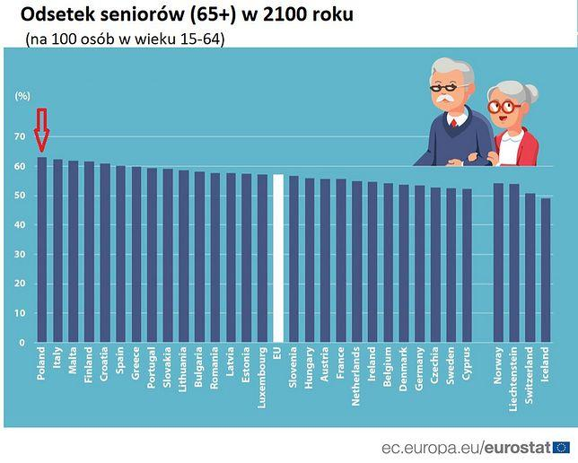
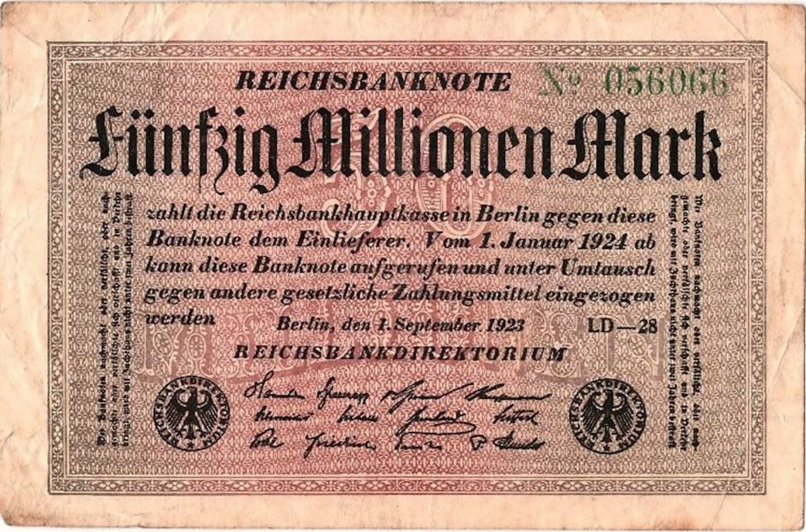
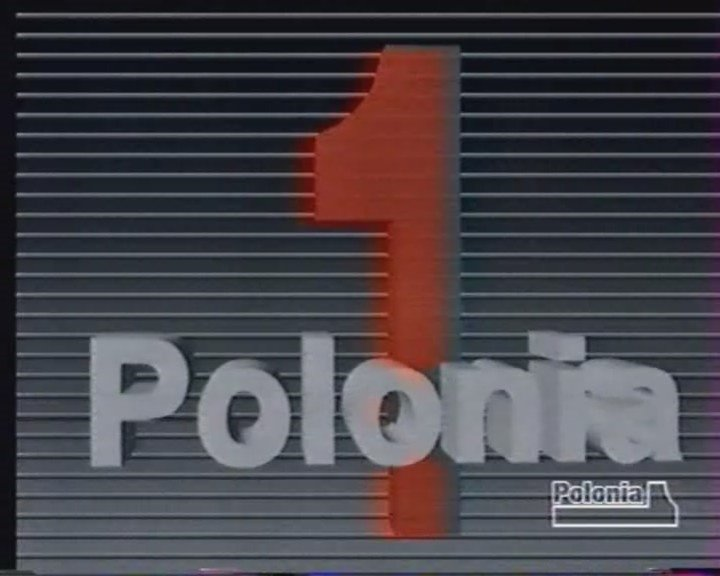
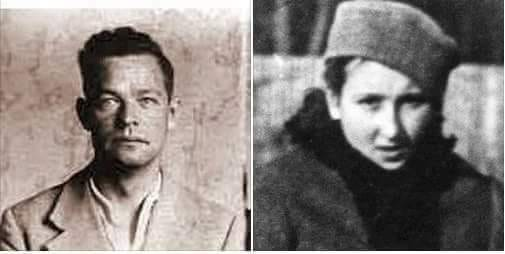
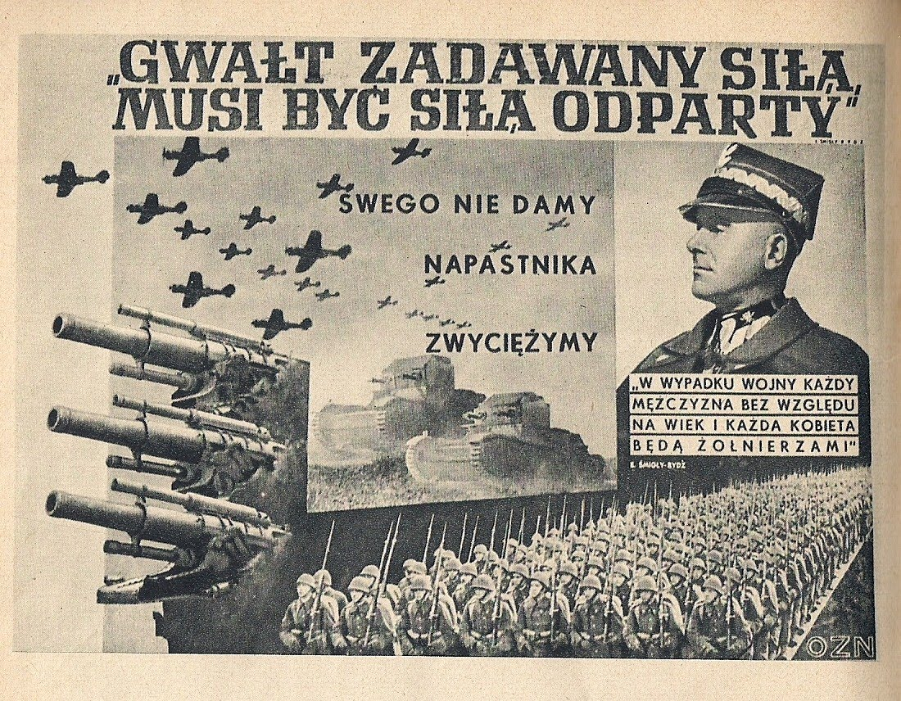

### 2021

To, co obecnie obserwujemy, to nie tyle przyspieszony upadek cywilizacji, co przyspieszone obnażanie jej już od dawna podupadłego charakteru. Jest to zasadniczo korzystne zjawisko, pozwalające ostatecznie zerwać z fasadowymi iluzjami i zająć się obroną osobistych "wysp cywilizacji".
Innymi słowy, to, co dzieje się od półtora roku, doskonale obnażyło fakt, że żyjemy w cywilizacji kadłubkowej, posiadającej mnóstwo technicznych gadżetów, ale za grosz siły charakteru. W związku z tym zamiast zachwycać się tymi pierwszymi, należy zacząć wreszcie likwidować deficyt tej drugiej: konserwować lub odbudowywać w skali lokalnej - a przede wszystkim indywidualnej - to, co od dawna było konsekwentnie podkopywane lub burzone w skali kolektywnej i globalnej. Narzędzi ku temu mamy aż nadto - grunt jednak w tym, żeby nie stały się one w naszych rękach jałowymi zabawkami.

### 2020

CBDCs is a huge advancement and a huge threat. Even if used with blockchain, it centralizes the sovereign currency even more and stamps even more power to the issuer. The good part of the story is that blockchain technologies are really getting wide adoptions in it's different forms.

The U.S. Federal Reserve is actively investigating distributed ledger technologies for use in digitizing the dollar, CoinDesk regulatory reporter Nikhilesh De said. “To enhance the Federal Reserve’s understanding of digital currencies, the Federal Reserve Bank of Boston is collaborating with researchers at the Massachusetts Institute of Technology in a multiyear effort to build and test a hypothetical digital currency oriented to central bank uses,” Federal Reserve Board Governor Lael Brainard said Thursday. While the monetary authority was long looking into a digital dollar, the coronavirus crisis and China’s ongoing experiments with a CBDC have provided impetus to “remain on the frontier of research and policy development.”

---

  

---

𝚆𝚑𝚎𝚗 𝚙𝚎𝚘𝚙𝚕𝚎 𝚒𝚗 𝚅𝚎𝚗𝚎𝚣𝚞𝚎𝚕𝚊 𝚊𝚗 𝚃𝚞𝚛𝚔𝚎𝚢 𝚑𝚎𝚊𝚛 𝚝𝚑𝚎𝚒𝚛 𝚎𝚗𝚝𝚛𝚊𝚕 𝚋𝚊𝚗𝚔 𝚜𝚊𝚢 𝚝𝚑𝚎 𝚠𝚘𝚛𝚍𝚜 "𝚖𝚘𝚍𝚎𝚛𝚊𝚝𝚎𝚕𝚢" 𝚊𝚗𝚍 "𝚏𝚘𝚛 𝚜𝚘𝚖𝚎 𝚝𝚒𝚖𝚎", 𝚝𝚑𝚎𝚢 𝚍𝚘𝚗'𝚝 𝚔𝚗𝚘𝚠 𝚠𝚑𝚎𝚝𝚑𝚎𝚛 𝚝𝚘 𝚜𝚝𝚊𝚛𝚝 𝚕𝚊𝚞𝚐𝚑𝚒𝚗𝚐 𝚘𝚛 𝚌𝚛𝚢𝚒𝚗𝚐. 🇹🇷🇻🇪

"...following periods when inflation has been running persistently below 2%, appropriate monetary policy will likely aim to achieve inflation moderately above 2% for some time." FED Chairman Jerome Powell 27 Aug 2020

Putting complete trust in your central bank is not a one-way street. If you'd rather protect your savings from fancy acronyms like MMT and QE, which mean nothing more than currency manipulation, then take a look at this "Hard Money" documentary 🎥

And remember that in a free market economy you should always have options as to where you can put your money!

  

---

### 1994

Prokuratorzy, w asyście brygad antyterrorystycznych policji, zamknęli w Warszawie, Krakowie, Opolu, Lublinie, Poznaniu i Szczecinie 6 stacji telewizyjnych należących do sieci Polonia 1.

  

Stacja nie dostała koncesji na nadawanie.

### 1949

Zmarł Adam Władysław Doboszyński, prekursor i jeden z czołowych przedstawicieli polskiego dystrybucjonizmu. Jego proces polityczny i śmierć była jednym z symboli rozpoczęcia w Polsce terroru stalinowskiego

### 1946

„W ubeckich piwnicach przestrzelone czaszki, To śpiący rycerze majora Łupaszki Wieczna chwała zmarłym, hańba ich mordercom Tętno Polski bije w przestrzelonych sercach”.
-- cyt. za: autor wiersza nieznany

We wnęce gdańskiego więzienia przy ulicy Kurkowej padła komenda: „Po zdrajcach narodu polskiego, ognia!”

,,Kiedy po mnie przyjechali, była noc – pierwsza, może druga (...). Uczestnictwo w egzekucji przyjąłem z niechęcią, choć to przecież obowiązek. (...) Oddziałowy zaprowadził mnie najpierw do tego pana [Feliksa Selmanowicza „Zagończyka”]. Kiedy wszedłem do celi, widziałem przeraźliwy smutek w jego twarzy. Pierwsze słowa, z którymi zwrócił się do mnie, brzmiały: „No tak, jednak nie skorzystano z prawa łaski...” (...). Potem przeprowadzono mnie do celi, w której na śmierć czekała młoda, szczupła dziewczyna w letniej sukience. Przyjęła mnie nadzwyczaj spokojnie, wyspowiadała się, a potem wyraziła życzenie, żeby o wyroku i o śmierci powiadomić jej siostrę. Mówiła to ciągle tak, jakby się nadal spowiadała. Czuliśmy, że możemy być obserwowani. Podała mi adres (...). W końcu poprowadzono mnie schodami, jakby do piwnicy. Oni już tam byli. Zdaje się w kajdankach albo z zawiązanymi rękami. Sala była niewielka, jak dwa pokoje. Miałem krzyż, dałem go do pocałowania. Chciano im zawiązać oczy, nie pozwolili. Obok czekała zgraja ludzi, tak że było dosyć ciasno. Był wojskowy prokurator i pełno jakichś młodych ubowców. Ustawiono nieszczęśników pod słupkami. W rogu był stolik, skąd prokurator odczytywał wyrok i skąd dał rozkaz wykonania egzekucji. Była taka jakby wnęka, chyba czerwona nieotynkowana cegła, były słupki do połowy wysokości człowieka. Postawiono ich przy nich, nie pamiętam, czy ich przywiązano. Ci, którzy tam stali, nie uszanowali powagi śmierci. Obrzucili skazańców obelżywymi słowami, a prokurator odczytał uzasadnienie wyroku i poinformował, że nie było ułaskawienia. Jego ostatnie słowa brzmiały: „Po zdrajcach narodu polskiego, ognia!”. W tym momencie skazani krzyknęli, jakby się wcześniej umówili: „Niech żyje Polska!”. Potem salwa i osunęli się na ziemię (...). Nie mogłem na to patrzeć, ale pamiętam, że obydwoje po tej salwie żyli. Wtedy podszedł oficer i dobił ich strzałami w głowę. Nie wiem, kto to był ( skazańcy zostali dobici przez dowódcę plutonu egzekucyjnego ppor. Franciszka Sawickiego przyp. M.S.).To było dla mnie nie do zniesienia (...). Nie pamiętam, jak znalazłem się w samochodzie (...). Mało z kim dzieliłem się tymi wspomnieniami. Nawet rodzinie nic nie powiedziałem. Zachowałem to w sobie. Śmierć „Inki” i „Zagończyka” przeżyłem jak śmierć kogoś bliskiego..''

--- cyt. za: ks. Marian Prusak. Ksiądz Prusak był wikarym w gdańskim kościele garnizonowym. Był ostatnim spowiednikiem „Inki” i ,,Zagończyka'' oraz przymusowym świadkiem ich egzekucji.

Foto: Wachmistrz Feliks Selmanowisz ,,Zagończyk'', żołnierz zgrupowania ,,Łupaszki'', walczący w obronie niezawisłości. Niewinnie skazany na śmierć przez polskich komunistów.
Danuta Siedzikówna „Inka”, sanitariuszka i łączniczka zgrupowania ,,Łupaszki'', walcząca w obronie niezawisłości. Niewinnie skazana na śmierć przez polskich komunistów.

  

### 1939

W całej Polsce zostały powieszone takie plakaty, autorstwa Henryka Tomaszewskiego.

  

### 1931

https://en.wikipedia.org/wiki/Evelyn_de_Rothschild

### 1918

W czasie kończącej się pierwszej wojny światowej Rada Komisarzy Ludowych (rząd radziecki) anulowała wszystkie obowiązujące do tej pory traktaty rozbiorowe zawarte z Prusami i Austrią.

### 1837

W 1839 roku francuski fizyk Alexandre Edmond Becquerel eksperymentując z elektrodami metalowymi i elektrolitem odkrył, że przewodnictwo elektryczne rośnie wraz z podświetleniem, a co za tym idzie, że niektóre materiały wytwarzają niewielkie ilości prądu elektrycznego po wystawieniu na działanie światła. Odkrycie to stało się bodźcem do dalszych badań nad tą tematyką.

W 1904 roku znany wszystkim Albert Einstein opublikował swoją pracę opisującą naturę światła i efekt fotowoltaiczny. Wykazał w niej, że światło to strumień cząstek – fotonów, z których każdy niesie ściśle określoną porcję energii – kwant energii. Foton oddziałując na elektron znajdujący się na powierzchni płytki metalowej, przekazuje mu całą swą energię. Gdy energia fotonu jest większa od energii wiązania elektronu, elektron zostaje wyrwany z powierzchni płytki i zachodzi zjawisko fotowoltaiczne. Za to odkrycie Einstein otrzymał w 1921 roku nagrodę Nobla.

W historii rozwoju fotowoltaiki zapisał się również nasz rodak Jan Czochralski, który w 1918 roku odkrył metodę produkcji krzemu monokrystalicznego. Osiągnięcie Polaka umożliwiło wytwarzanie monokrystalicznych ogniw słonecznych. Pierwsze takie ogniwo krzemowe zostało zbudowane w 1941 roku.

---

<a href="https://github.com/TomaszWaszczyk/historia.waszczyk.com/edit/master/src/content/august-29.md" target="_blank">Edytuj tę stronę dzieląc się własnymi notatkami!</a>
