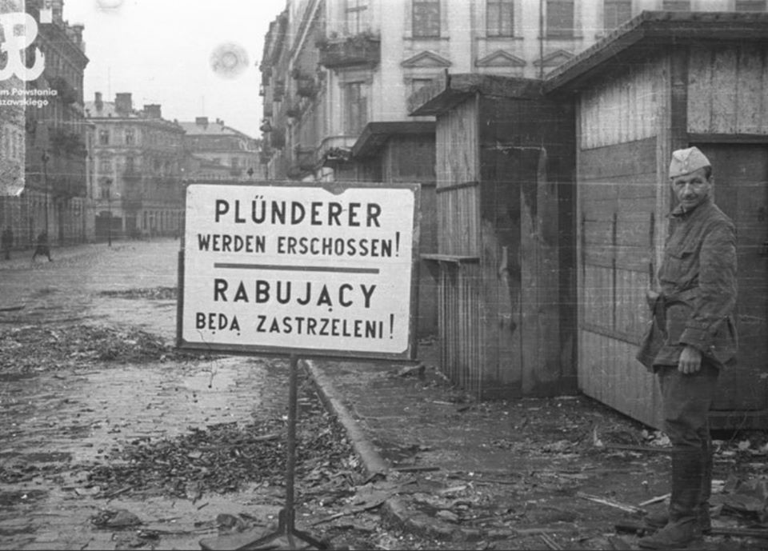
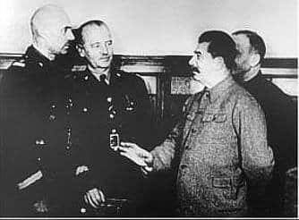

### 1946

Wojskowy Sąd Rejonowy w Gdańsku skazał na karę śmierci Danutę Siedzikównę ps. ,,Inka'', sanitariuszkę 5 Wileńskiej Brygady AK.
Wyrok na dziewczynce wykonano 28 sierpnia w gdańskim więzieniu przy ul. Kurkowej 12. Dziesięciu żołnierzy KBW oddało strzały do ,,Inki'' i Feliksa Selmanowicza ps. „Zagończyk”, żołnierza mjr. „Łupaszki”. „Inka” i „Zagończyk” upadli na ziemię, ale wciąż dawali oznaki życia. Skazańcy zostali dobici o godz. 6.15 strzałem w głowę przez dowódcę plutonu egzekucyjnego ppor. Franciszka Sawickiego.

  

### 1944

"Plunderers will be shot!"

Lt. Stanisław "Agaton" Jankowski at a city market on Kazimierza Wielkiego Square poses with the sign in German and Polish.

Warsaw Uprising, August 3, 1944. Photo credit: Stefan "Kubuś" Bałuk

  

### 1941

W Moskwie podczas spotkania z delegacją polską zapytany o los zaginionych polskich oficerów Józef Stalin oświadczył, że w obozach na terenie ZSRR nie ma już żadnych polskich jeńców i że zbiegli oni prawdopodobnie do Mandżurii, co było oczywistym kłamstwem, ponieważ ludzie ci zostali zamordowani już wcześniej w Katyniu.

  

### 1929

https://en.wikipedia.org/wiki/Thorstein_Veblen

### 1863

W czasie powstania styczniowego pod Lipnem w województwie kujawsko-pomorskim oddział powstańczy powiatu płockiego pod dowództwem Tadeusza Kopytki został zaskoczony przez kozaków podczas transportu broni z terenu Prus.Mimo znacznej liczebnej przewagi wroga powstańcy zdobyli się na atak, który poskutkował całkowitym rozbiciem oddziału kozackiego.
Na zdjęciu kościół pod wezwaniem Najświętszej Maryi Panny w Lipnie.

---

<a href="https://github.com/TomaszWaszczyk/historia.waszczyk.com/edit/master/src/content/august-2.md" target="_blank">Edytuj tę stronę dzieląc się własnymi notatkami!</a>
