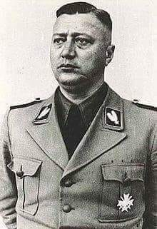

### 1958

https://en.wikipedia.org/wiki/Anna_Politkovskaya

### 1941

Dowódca Sipo i SD w Generalnym Gubernatorstwie Eberhard Schöngarth (zdjęcie) wydał rozporzadzenie, nakazujące wszystkim przedwojennym funkcjonariuszom polskiej policji kryminalnej zgłoszenie się do 10 września pod groźbą surowej kary. Zgłoszenia przyjmowane były w siedzibie Sipo we Lwowie przy pl. Smolki 3, lub w Biurze Dowódcy Sipo i SD w Krakowie.

  

### 1877

Urodził się Feliks Dzierżyński: <https://pl.wikipedia.org/wiki/Feliks_Dzierżyński>

---

<a href="https://github.com/TomaszWaszczyk/historia.waszczyk.com/edit/master/src/content/august-30.md" target="_blank">Edytuj tę stronę dzieląc się własnymi notatkami!</a>
