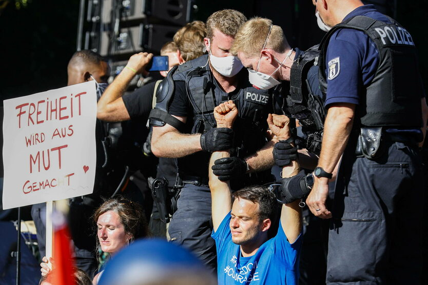

### 2022

> Europa Vom Atlantik bis zum Ural! Deutscher Traum seit 1936!

  

---

Do wszystkich "gold buggersów", którzy ekscytują się, że YTD zarobili na złocie w PLN. Nie zarobiliście na złocie, tylko na słabym złotym. W sumie więcej byście zarobili, gdybyście po prostu kupili dolce.

---

  

<a href="./documents/august/wig20.pdf" target="_blank">WIG20</a>

  

  

---

### 2021

W  trakcie  wakacji  rząd  przygotował  radykalne zmiany  przepisów  dot.  funkcjonowania  szkoły, które już we wrześniu mogą zostać uchwalone przez Sejm.

<a href="./documents/august/ulotka-a6_wolna_szkola.pdf" target="_blank">Propozycje funkcjonowania szkoły</a>

---

„Warto rozmawiać” zdjęte z anteny TVP. Pospieszalski: Kurski mówi, że nasza postawa jest błędna.

---

Prezydent RP Andrzej Duda powiedział w poniedziałek 30 sierpnia 2021 roku podczas Rady Gabinetowej:

> Jestem absolutnie przeciwnikiem obowiązkowego szczepienia; uważam, że spowoduje to niepokoje społeczne, to kwestia odpowiedzialności ludzi i każdy tę odpowiedzialność powinien ponosić sam. (...) Obowiązkowe szczepienia to przekroczenie granicy, na które nie możemy sobie pozwolić.

---

### 2020

Niemcy: Policja rozwiązała wielką demonstrację przeciwników restrykcji

Policja w Berlinie przerwała w sobotę demonstrację przeciwników restrykcji, wprowadzonych w związku w pandemią koronawirusa. 18-tysięczny tłum musiał zrezygnować z manifestacji z powodu nieprzestrzegania tzw. (moje) rygorów sanitarnych.
Według zapowiedzi organizatorów w demonstracji miało wziąć udział 22 tys. osób. Władze miasta zmobilizowały na to wydarzenie 3 tys. policjantów, z czego 1000 w ramach wsparcia dla policji berlińskiej przyjechało z różnych krajów związkowych.
Pojawiły się też transparenty nawołujące kanclerz Angelę Merkel do dymisji i przeprowadzenia przedterminowych wyborów. Jak relacjonowała Deutsche Welle niektórzy demonstranci nieśli zdjęcia Merkel, wicekanclerza Olafa Scholza i ministra gospodarki Petera Altmaiera i premiera Bawarii Markusa Soedera, ubranych w więzienne stroje z napisem „Winny”.
Sobotnia demonstracja miała się odbyć pod hasłem "Święto wolności i pokoju".
Na plakatach widniały hasła: "Zatrzymać szaleństwo pandemii", "Skończyć z dyktaturą koronawirusa". Raz za razem tłum skandował: "Opór" i "My jesteśmy narodem".

  

### 1958

https://en.wikipedia.org/wiki/Anna_Politkovskaya

### 1942

  

### 1941

Dowódca Sipo i SD w Generalnym Gubernatorstwie Eberhard Schöngarth (zdjęcie) wydał rozporzadzenie, nakazujące wszystkim przedwojennym funkcjonariuszom polskiej policji kryminalnej zgłoszenie się do 10 września pod groźbą surowej kary. Zgłoszenia przyjmowane były w siedzibie Sipo we Lwowie przy pl. Smolki 3, lub w Biurze Dowódcy Sipo i SD w Krakowie.

  

### 1939

Prezydent Rzeczypospolitej zarządził mobilizację powszechną w wykonaniu powyższego w porozumieniu z właściwymi ministrami zarządzam co następuje :
I. Dnie mobilizacji
1-szym dniem mobilizacji jest: czwartek 31 sierpień 1939 r. Następne dni liczą się kolejno jako 2-gi, 3-ci, 4-ty i t. d. dzień mobilizacji.
II. Powołanie do czynnej służby wojskowej.
A. Powołuję do czynnej służby wojskowej wszystkich tych:
oficerów rezerwy, pospolitego ruszenia i stanu spoczynku
podchorążych rezerwy i pospolitego ruszenia
podoficerów, starszych szeregowców i szeregowców rezerwy oraz pospolitego ruszenia
podoficerów stanu spoczynku
zaliczonych do pomocniczej służby wojskowej
Bez względu na wiek, kategorię zdrowia i rodzaj broni (służby), którzy utrzymali białe karty mobilizacyjne bez czerwonego pasa.
B. Powołani wykonują rozkaz podróży podany na stronie 2-giej białej karty mobilizacyjnej, który wskazuje KIEDY, GDZIE i W JAKIEJ FORMACJI WOJSKOWEJ LUB NIEWOJSKOWEJ powołany ma się zameldować, w jaki sposób - pieszo lub koleją - odbyć podróż i co ma zabrać ze sobą. Powołani, którzy są kierowcami lub właścicielami i kierowcami pojazdów mechanicznych, a w myśl otrzymanych imiennych kart powołania lub ogłoszonego planu poboru mają dostarczyć te pojazdy do komisyj poborowych, winni zastosować się do wskazówek podanych w punkcie 3-cim na stronie 3-ciej karty mobilizacyjnej.
C. Powołani, którzy przed rozplakatowaniem niniejszego obwieszczenia lub równocześnie z rozplakatowaniem otrzymali kolorowe karty powołania, winni wykonać rozkaz podróży podany w tych kolorowych kartach powołania.
D. 1) Oficerowie, podchorążowie, podoficerowie, starsi szeregowcy i szeregowcy rezerwy do 40 roku życia włącznie, którzy nie otrzymali kart mobilizacyjnych ani niebieskich zaświadczeń mobilizacyjnych, winni BEZZWŁOCZNIE zgłosić się w tych komendach rejonów uzupełnień, na terenie których w chwili obwieszczenia mobilizacji się znajdują.
2) Oficerowie, podchorążowie, podoficerowie, starsi szeregowcy i szeregowcy rezerwy, pospolitego ruszenia, stanu spoczynku oraz zaliczeni do pomocniczej służby wojskowej, którzy otrzymali karty mobilizacyjne, a w chwili obwieszczenia mobilizacji z jakichkolwiek powodów ich nie posiadają, winni udać się BEZZWŁOCZNIE: -ci, którzy pamiętają do jakiej jednostki otrzymali przydział mobilizacyjny - do tych jednostek, -ci, którzy nie pamiętają, do jakiej jednostki otrzymali przydział mobilizacyjny - do tych komend rejonów uzupełnień, na terenie których w chwili obwieszczenia mobilizacji się znajdują. Udający się w myśl niniejszego punktu D, do jednostek lub komend rejonów uzupełnień wini zabrać ze sobą wszystkie posiadane przez nich dokumenty wojskowe (książeczki stanu służby, książeczki wojskowe), a w razie posiadania - również legitymacje osobiste. Ponadto ci z pośród nich, którzy w chwili obwieszczenia mobilizacji znajdują się w miejscowościach położonych ponad 20 kilometrów od miejsca stawiennictwa, winni przed wyruszeniem zgłosić się do najbliższego zarządu gminy lub posterunku policji państwowej, gdzie otrzymają zaświadczenie uprawniające do przejazdu koleją.
III. Cofnięcie urlopów.
A. Przebywający na urlopach czasowych:
oficerowie służby stałej
podoficerowie służby stałej i nadterminowi
podoficerowie i szeregowcy odbywający zasadniczą służbę wojskową mają BEZZWŁOCZNIE powrócić do swych oddziałów.
B. Podoficerowie i szeregowcy STALE URLOPOWANI z powodu skrócenia czasokresu zasadniczej służby wojskowej, którzy posiadają dokumenty urlopowe, a nie otrzymali kart mobilizacyjnych, mają BEZZWŁOCZNIE udać się do oddziałów podanych w punkcie II pouczenia dla urlopowanego na dokumencie urlopowym.
C. Podoficerowie i szeregowcy STALE URLOPOWANI z powodu czasowej niezdolności do służby wojskowej pozostają w swych miejscach zamieszkania do terminu wyznaczonego w dokumencie urlopowym, a następnie zgłaszają się w terminie i miejscu podanym w punkcie II pouczenia dla urlopowanego na dokumencie urlopowym.
IV. Nie podlegają powołaniu do czynnej służby wojskowej w myśl niniejszego obwieszczenia:
wszyscy ci oficerowie, podchorążowie, podoficerowie, starsi szeregowcy i szeregowcy, którzy posiadają:
białe karty mobilizacyjne z czerwonym pasem,
niebieskie zaświadczenia mobilizacyjne
wszyscy ci oficerowie rezerwy ponad 40 lat życia, pospolitego ruszenia i stanu spoczynku, podchorążowie, podoficerowie, starsi szeregowcy i szeregowcy pospolitego ruszenia, podoficerowie stanu spoczynku, oraz zaliczeni do pomocniczej służby wojskowej, którzy nie otrzymali w ogóle kart mobilizacyjnych
osoby korzystające z odroczenia odbycia zasadniczej służby wojskowej
Odroczeni pozostają - aż do dalszych zarządzeń - w swych miejscach zamieszkania.
V. Odpowiedzialność za niezgłoszenie się do czynnej służby wojskowej:
Winny niezgłoszenia się do czynnej służby wojskowej w myśl niniejszego obwieszczenia BĘDZIE UKARANY według przepisów kodeksu karnego wojskowego, przewidującego - zależnie od kwalifikacji czynu - KARĘ POZBAWIENIA WOLNOŚCI DO WIĘZIENIA BEZTERMINOWEGO WŁĄCZNIE LUB KARĘ ŚMIERCI.
Minister Spraw Wojskowych''

### 1877

Urodził się Feliks Dzierżyński: <https://pl.wikipedia.org/wiki/Feliks_Dzierżyński>

---

<a href="https://github.com/TomaszWaszczyk/historia.waszczyk.com/edit/master/src/content/august-30.md" target="_blank">Edytuj tę stronę dzieląc się własnymi notatkami!</a>
