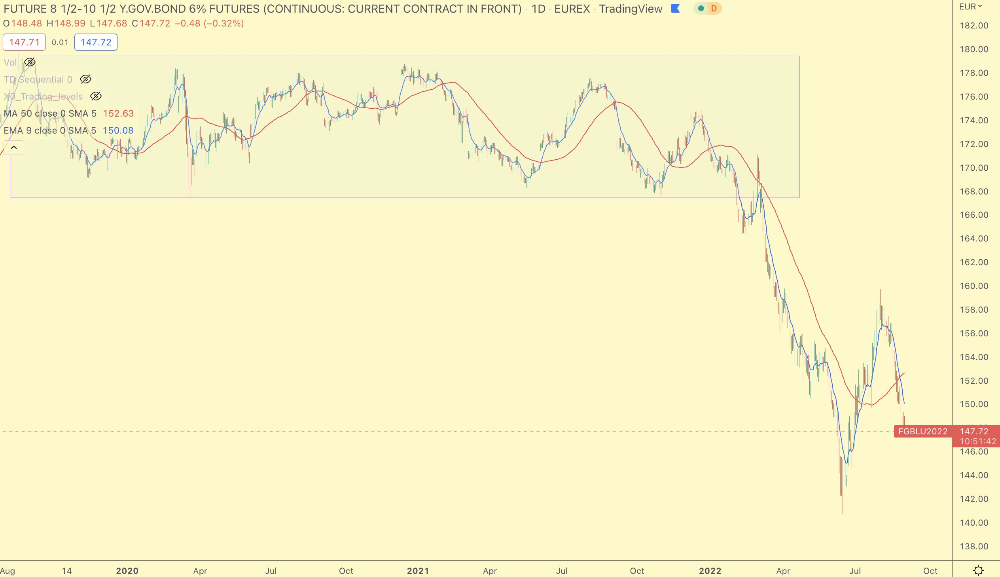
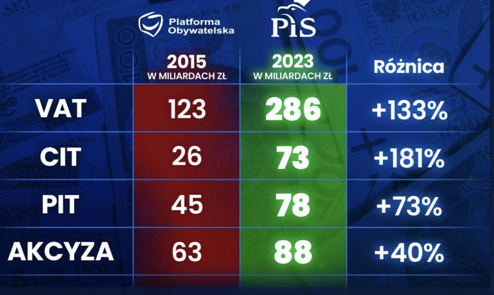
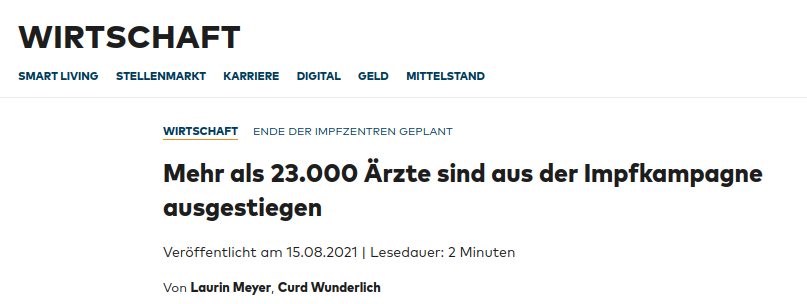
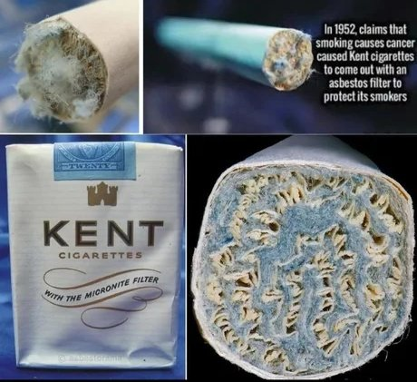
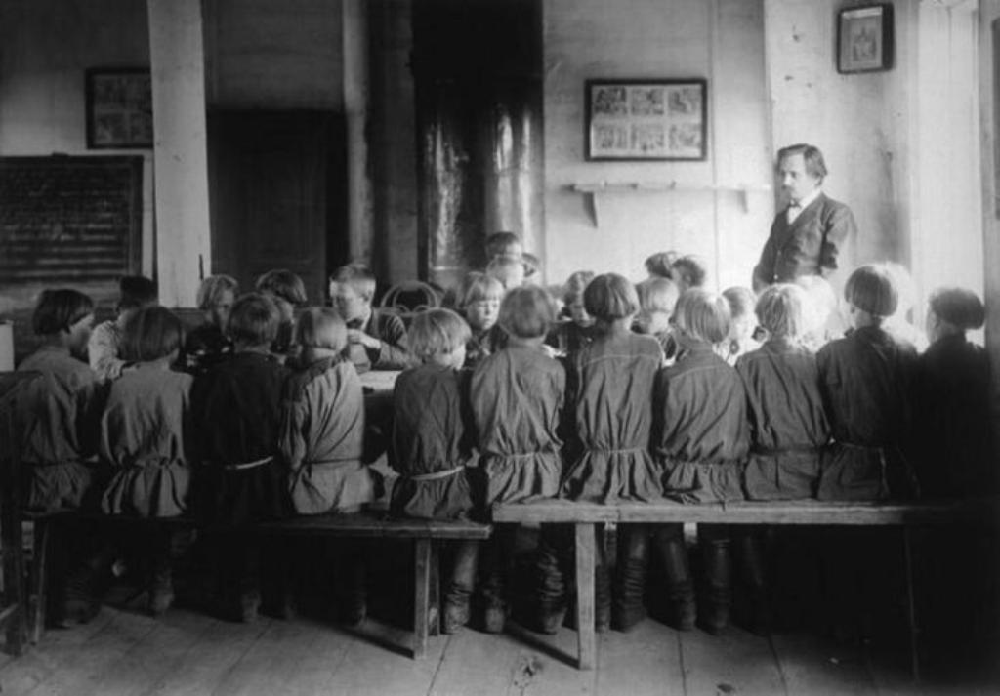

### 2022

🇪🇺 The EURO and bond markets in EU are getting smashed as US 10 year yield keeps trending up.

Pure debt madness in EU for 10 years. Europeans ignoring the problem.

The EU deception is really big, ask Lagarde and also Draghi indeed.

Years saying the same: EXIT THE EURO

  

---

  

---

  

---

### 2021

Wiceminister finansów Piotr Patkowski:

> Zawsze podwyższona inflacja pojawia się tam, gdzie jest dość dynamiczny wzrost gospodarczy.

  

---

The Bank of Japan has today released the English version of its Annual Review 2021, which includes — not surprisingly — quite a few mentions of Central Bank Digital Currencies CBDC, firmly reiterating the messaging that the BOJ has applied to date, including the statement that "the Bank currently has no plan to issue a CBDC".

---

More than 23,000 German doctors have quit the genocide campaign

The German vaccination machine is beginning to falter. In quite a few general practitioners’ offices, vaccinations are no longer being administered. More and more doctors are withdrawing from the corona “vaccination” campaign

according to figures from the Robert Koch Institut, accessed by the newspaper Welt am Sonntag.

In the week from August 2 to 8, only 29,300 practices still “vaccinated people against the coronavirus”, meaning many dropped out. At the time the vaccines were rolled out in Germany, a total of 52,600 practices were participating in the genocide campaign. This means that 23,300 (44%) practices have stopped giving the shot.

  

---

  

---

### 2020

Robert F. Kennedy Jr. spoke to an enormous crowd in Berlin on Saturday, as tens of thousands of Germans joined forces to protest what Kennedy Jr. referred to as Bill Gates’ “bio-security agenda, the rise of the authoritarian surveillance state and the Big Pharma sponsored coup d’etat against liberal democracy.”
“Fifty years ago, my uncle John F. Kennedy came to this city. He came to this land, because Berlin was the frontline against global totalitarianism. And today again, Berlin is frontline against global totalitarianism,” said Kennedy Jr. to a roar of approval from the crowd.

  

<!-- ### 2017

W RAMACH ODKŁAMYWANIA HISTORII, ale i odświeżania pamięci :)

"31 sierpnia 2017 pan Tadeusz Zając z Katowic napisał w swoim poście.

Tadeusz Zając:
A kto – z młodych wykształconych, z dużych miast – wie, że kiedyś w Polsce produkowano generatory elektryczne dla największych elektrowni?
Że produkowano turbiny o mocy 500 MW, — a przymierzano się do turbin 1500 MW?
Że połowa chińskich, indyjskich, indonezyjskich, greckich i tureckich, libijskich i irackich elektrowni — wyposażona była / jest nie w amerykańskie, czy niemieckie — a w polskie turbiny?
Że produkowano u nas śmigłowce, samoloty tłokowe i odrzutowe, że produkowano 40.000 ciężarówek, że wytapiano 20 mln ton stali, że byliśmy na 2 miejscu – za Japonią – w produkcji statków rybackich, a te zdobywały Błękitną Wstęgę Atlantyku w tej kategorii?
Że nasze zestawy audio – radio, wzmacniacz, głośniki, gramofon, magnetofon Radmoru — biły amerykańskie i japońskie?
Że nasze sprężarki chłodnicze kupowało wiele krajów świata? Że już w latach 50-tych nasz Star był napędzany gazem LPG — i miał nim chłodzone nadwozie?
Kto pamięta, że pierwszy PC komputer powstał w Erze – przed ZX Spectrum?
Że wybudowano:
• Trasę Warszawa-Katowice (Gierkówka, niecałe 300 km – jedna z nielicznych dziś dróg dwujezdniowych o tej długości w Polsce);
• Trasę Łazienkowską wraz z drogami dojazdowymi w Warszawie;
• Dwujezdniową drogę Tuszyn-Łódź;
• Szpital „Centrum Zdrowia Dziecka”;
• Szpital „Centrum Zdrowia Matki Polki”;
• Rafinerię ropy naftowej w Gdańsku;
• Odlewnię żeliwa w Koluszkach;
• Zakłady Dziewiarskie „Kalina” w Lodzi;
• Zakłady produkcji dywanów „Dywilan” w Lodzi;
• Zakłady odzieżowe „Cotex”;
• Zakład produkcji profili giętch w Bochni;
• Zakłady przetwórstwa owocowo-warzywnego w Leżajsku i Lipsku;
• Hutę miedzi w Głogowie;
• Produkcja blach walcowanych na zimno w Hucie im. Lenina ( obecnie ArcelorMittal Poland S.A. Oddział w Krakowie);
• Płocką Fabrykę Maszyn Żniwnych (wyd. 2,5 tys. sztuk kombajnów zbożowych BIZON);
• Zakłady mleczarskie w Węgrowie, Ciechanowie, Chodzieży, Zabrzu;
• Produkcja autobusu Jelcz w Kowarach;
• Zakłady mięsne w Ostródzie, Sokołowie Podlaskim, Zielonej Górze;
• Port Północny i nafto-port (mieliśmy wtedy własne tankowce);
• Zakład kineskopów kolorowych na licencji amerykańskiej w Piasecznie (wtedy jedyny zakład w Europie produkujący tej klasy sprzęt);
• Produkcja układów scalonych i półprzewodników w Naukowo-Produkcyjnym
• Centrum Półprzewodników CEMI w Warszawie,
• 11 elektrowni (w tym największa, Kozienice I – o mocy 1200 MW; po 1989 r. – zero elektrowni) – i wiele, wiele innych.
• W latach 70′ oddawano do użytku ok. 300 tys. mieszkań rocznie, a obecnie ok. 1/3 tej liczby, w latach 90-tcyh jeszcze mniej;
• W latach 1970-75 płace wzrosły o 40%;
• W dekadzie 1970-80 – wzrost PKB o ok. 80% (po 1989 r. potrzeba było na taki sam wyczyn 20 lat);
• Spożycie mięsa na głowę było wyższe niż dziś, mięsa nie myto i nie nasączano (Constar);
• 1982 (rok kryzysu wywołanego przez „Solidarność” finansowaną przez CIA);
• Od tego roku mierzy się w Polsce liczbę osób żyjących poniżej minimum socjalnego na 24 %, obecnie – powyżej 60%!
• We wrześniu 1980 r. (kiedy Gierek odchodził) zadłużenie Polski w Klubach Paryskim i Londyńskim wynosiło ok. 17,6 miliardów dolarów. Na osobę (615 USD) było ono mniejsze niż na Węgrzech (836 USD) lub Jugosławii (856 USD).
Pod względem zadłużenia byliśmy na 12-13 miejscu w świecie — co odpowiadało naszej ówczesnej produkcji.
Przypominam, że Polska posiadała wówczas rezerwy walutowe w wysokości ok. 1,3 mld USD — 4 mld USD w surowcach i półfabrykatach, jak również blisko miliardową nadwyżkę eksportu nad importem (wartość eksportu w 1980 to ok 10 mld USD; bilans handlowy pogorszył się po strajkach „S”).
Dług Gierka został prawie całkowicie spłacony w roku 2009.
Gierek, kiedy rządził, mieszkał w rządowych willach (które przy niektórych dzisiejszych chałupach wyglądały jak psia buda). Po internowaniu mieszkał w domku typu klocek w Ustroniu. Jeździł maluchem 126p kupionym na talon. Żył tylko z emerytury belgijskiej za okres przepracowany w tamtejszych kopalniach.
Proste pytania dla tych, którzy dostają piany na ustach, kiedy pada słowo ROSJA.
Które przedsiębiorstwa kupiła Rosja lub Rosjanie w Polsce za bezcen, a następnie zlikwidowała przez tzw. wrogie przejęcia? Może w Łodzi? Na Śląsku, w Starachowicach?
Kto doprowadził armię Polską do ruiny, tak że w tej chwili mamy zaledwie parę tysięcy żołnierzy zdolnych do walki?
Czy to w Moskwie powstają prawa zakazujące w Polsce wędzenia mięsa?
Kto limituje nam połowy ryb, produkcję mleka, cukru, etc.?
Czy to Rosja kontroluje handel w Polsce przez 12 największych sieci handlowych?
Ktoś może dać przykład — kiedy Rosjanie przez podstawione osoby wykupują ziemie na zachodzie Polski?
A może ktoś zna jakieś rosyjskie, lichwiarskie banki w kraju nad Wisłą?
Kto zlikwidował całe nasze gałęzie przemysłu takie jak stocznie, elektronika, hutnictwo, zbrojeniówkę?
A może Putin nałożył na nas haracz za emisję dwutlenku węgla, przez co prąd kosztuje Polaka dwa razy więcej tyle, co wcześniej?
Czy Rosja w Polsce propaguje demoralizację, niszczy rodzinę, patriotyzm młodzieży, gryzie katolików?
Rosja nie pozwala budować dróg tak, jak chcemy, ze względu na dwa żółwie przechadzające się od sadzawki do sadzawki?
Czy Rosjanie planują masowe osadnictwo na ziemiach polskich?
Czy Rosjanie roszczą pretensje do 1/3 polskiego terytorium?
Czy Rosja wspiera naszych wrogów takich jak banderowcy?
Czy żąda od nas wysyłania kontyngentów wojskowych do Afganistanu, na Bliski Wschód czy ostatnio Afryki przy okazji niszcząc nasze interesy i powiązania handlowe?
Czy Rosja narzuca nam swojego rubla, czy ktoś inny – euro?
Czy Rosja zmusiła do emigracji około 4 milionów, głównie młodych ludzi po 1989 roku?
Czy to Rosja kazała nam podpisach w 2006 roku traktat lizboński, który de facto zlikwidował suwerenność Polski?
Pytania można mnożyć – bagaż historyczny stosunków polsko-rosyjskich jest ciężki jak cholera – ale każdy powinien zrozumieć proporcje.
Los Ukrainy jest ważny — ale jeszcze ważniejsze jest to, co LEŻY w INTERESIE POLSKI a CO NIE – czasem się o tym zapomina…
Co do zakładów, to można wymienić jeszcze setki innych, w zależności z jakiego fragmentu Polski się pochodzi, bo po prostu było tego całkiem sporo.
Jeśli wszystko to było nieopłacalne – to niech mi ktoś wyjaśni, z czego dokładano do interesu — skoro do czasów Gierka nikt nie brał ani grosza pożyczek? I podobno sponsorowaliśmy ZSRR i KDLe… normalnie perpetuum mobile.
A Potem Wałęsa przeskoczył przez płot i się skończyło..."

Edward Gierek mąż stanu, ur. 6.01.1913, zmarł 29.07.2001 -->

### 2016

Koniec prezydentury https://pl.wikipedia.org/wiki/Dilma_Rousseff

### 2015

Angela Merkel powiedziała „Wir schaffen das”, co znaczy „Damy radę“, „Zrobimy to“. Zdanie wypowiedziane na konferencji prasowej w Berlinie, powtórzone później przez niemiecką kanclerz wielokrotnie, stało się symbolem. „Niemcy raczej nie dały rady” komentuje prof. Andrzej Sakson

### 1980

https://en.wikipedia.org/wiki/Solidarity_(Polish_trade_union)

### 1988

W willi Ministerstwa Spraw Wewnętrznych przy ulicy Zawrat w Warszawie odbyło się spotkanie Lecha Wałęsy z Czesławem Kiszczakiem. Towarzyszyli im również biskup Jerzy Dąbrowski oraz sekretarz Komitetu Centralnego Stanisław Ciosek.
W trakcie spotkania ustalono, że przewodniczący NSZZ Solidarność nakłoni strajkujących do powrotu do pracy i zaprzestania protestów, co miało być warunkiem rozpoczęcia przygotowań do rozmów przy Okrągłym Stole.
Tak o tym fakcie w książce "Droga do wolności pisał Wałęsa:
"Oczywiście, nie byłem zadowolony, ale też nie mogłem zbytnio podskakiwać. Kilkanaście strajkujących zakładów to nie kilkaset, jak w sierpniu 1980, a generał powiedział bez ogródek, że i tak „beton" partyjny próbuje torpedować każdą ofertę ugody z opozycją. Czułem, że mówi szczerze, lecz zastanawiałem się, jak spojrzę w oczy zarośniętym, czekającym z nadzieją stoczniowcom czy górnikom. Cóż z tego – myślałem – że racja moralna jest po ich stronie?"

  

### 1952

Firma Kent z powodu pojawiających się opinii, że papierosy powodują raka wypuściła papierosy z azbestem żeby chronić palaczy.

  

### 1945

Stefan Banach to jeden z najważniejszych matematyków w historii. Za jego czasów nie było uczonych, którzy nie słyszeliby o Banachu. Prace jego były tłumaczone na najważniejsze języki świata, a on sam w ogromnym stopniu przyczynił się do rozwoju matematyki, jak i jej popularyzacji.

Banach po ukończeniu szkoły, nie studiował matemtyki, lecz uczył się jej sam. Nie dostał się do wojska w czasie I wojny światowej ze względu na wadę wzroku i...leworęczność (a więc lista genialnych leworęcznych się powiększa!). Po spotkaniu na krakowskich Plantach z Hugo Steinhausem, kariera Banacha zaczęła nabierać rozpędu. Banach jest znany z takich pojęć jak: przestrzeń Banacha, algebra Banacha, całka Banacha czy różnych twierdzeń z jego nazwiskiem w nazwie.

Nie możemy zapominać o tym, że Banach prócz tego, że był genialnym matematykiem, to był też spoko człowiekiem. Potrafił tłumaczyć studentom matemtykę w sposób prosty i zrozumiały. W wolnych chwilach kibicował lokalnej Pogoni Lwów i bawił się na imprezach. Te najlepsze nazywano banachaliami!

Banach był tak cennym kąskiem dla wszystkich państw, że propozycje pracy u nich składały chociażby ZSRR i USA. Nawet jeden z delegatów ze Stanów przwiózł czek dla Banacha, na którym widniała "goła jedynka". Banach mógł dopisać tyle "zer", ile chciał w zamian za wyjazd i pracę dla USA. Stefan tylko powiedział, że nie ma takiej ilości zer, dla których mógłby opuścić Lwów!

Gdyby istniał Nobel z matemtyki, to na pewno by go dostał. Mówi się o tym, że przed śmiercią rozmawiał z synem, że chce się zająć fizyką, i że ma pomysły, które przyniosą mu Nagrodę Nobla. Niestety nie doczekał realizacji tych planów. Zmarł 31 sierpnia 1945 roku w swoim ukochanym Lwowie, który w wyniku konferencji jałtańskiej, znajdował się już po radzieckiej stronie.

  

### 1944

Polski Komitet Wyzwolenia Narodowego wydał tak zwaną "Sierpniówkę" czyli Dekret o wymiarze kary dla faszystowsko-hitlerowskich zbrodniarzy winnych zabójstw i znęcania się nad ludnością cywilną i jeńcami oraz dla zdrajców Narodu Polskiego.
Dokument ten przewidywał  karę śmierci za zabójstwa, znęcanie się i innego typu prześladowanie ludności cywilnej i jeńców wojennych. Zgodnie z ustaleniami Międzynarodowego Trybunału Wojskowego w Norymberdze odpowiedzialność karna groziła również za sam udział w niemieckiej lub sprzymierzonej z Niemcami organizacji przestępczej (np. NSDAP, gestapo itd.). Przewidziano również karę więzienia za szantaż z żądaniem okupu za zaniechanie donosu do władz niemieckich.
Postanowienia dekretu odnosiły się do czynów popełnionych w okresie od 1 września 1939 roku do 9 maja 1945 roku.
Władze komunistyczne podeszły do jego realizacji bardzo restrykcyjnie, obejmując jego przepisami działaczy podziemia antykomunistycznego, a także byłych żołnierzy Armii Krajowej.

  

### 1939

18:45 kapitan niemieckiego pancernika ,,Schleswig -Holstein'' Gustav Kleinkamp ponownie otrzymał rozkaz rozpoczęcia ataku na Westerplatte. Datę ataku wyznaczono na dzień 1 września o 4:45 rano.
O godzinie 23:30 niemiecka kompania szturmowa opuszcza pokład pancernika i przygotowuje na lądzie swe pozycje do szturmu na Westerplatte.

  

Foto: Wymarsz kompanii szturmowej ze ,,Schleswig-Holsteina''

---

ULTIMATUM NIEMIECKIE WOBEC POLSKI Z 31 SIERPNIA 1939 ROKU.
Sytuacja między Rzeszą Niemiecką a Polską
jest obecnie tego rodzaju, że każdy dalszy
incydent może doprowadzić do wybuchu w
szeregach wojsk zajmujących pozycje po obu
stronach. Jakiekolwiek rozwiązanie pokojowe
musi być tak ułożone, by przy następnej
sposobnej okoliczności powodujące ten stan
rzeczy nie mogły się powtórzyć i by przez to
nie tylko Europa Wschodnia, lecz także inne
obszary nie znalazły się w stanie takiego
samego naprężenia. Przyczyny tego rozwoju
leżą:
1. W niemożliwym przeprowadzeniu granic,
wytyczonych przez dyktat wersalski.
2. W niemożliwym traktowaniu mniejszości na
odstąpionych obszarach.
Rząd Rzeszy Niemieckiej wychodzi zatem przy
niniejszych propozycjach z założenia, że
trzeba znaleźć ostateczne rozwiązanie, które
usunie niemożliwą sytuację związaną z
wytyczeniem granic, obu stronom zapewni
życiowo ważne dla nich linie komunikacyjne
oraz problem mniejszościowy - o ile to jest w
ogóle możliwe - zlikwiduje, a o ile to nie jest
możliwe, znośnie ułoży los mniejszości przez
całkowite zagwarantowanie ich praw.
Rząd niemiecki jest przekonany, że przy tym
jest niezbędne, by szkody gospodarcze i
fizyczne, spowodowane od roku 1918, wykryć i
w calej pełni zrekompensować. Oczywiście,
uważa to zobowiązanie za wiążące dla obu
stron.
Z tych rozważań wynikają następujące
praktyczne propozycje:
1. Wolne Miasto Gdańsk wraca na podstawie
swego czysto niemieckiego charakteru oraz
jednomyślnej woli swej ludności niezwłocznie
do Rzeszy Niemieckiej.
2. Obszar tzw. Korytarza, od Bałtyku do linii
Kwidzyn - Grudziądz - Chełmno - Bydgoszcz
(włączając tu te miasta), a potem na zachód
mniej więcej od Trzcianki, sam rozstrzygnie o
swojej przynależności do Niemiec lub do
Polski.
3. W tym celu przeprowadzi się na tym
obszarze głosowanie. Do głosowania będą
uprawnieni wszyscy Niemcy, którzy mieszkali
na tym obszarze w dniu 1 stycznia 1918, albo
urodzili się tam do tej daty, jak również
wszyscy w danym dniu na tym obszarze
zamieszkali lub do tej daty tam urodzeni
Polacy, Kaszubi itd. Niemcy wygnani z tego
obszaru wracają dla spełnienia swego
obowiązku głosowania. Dla zagwarantowania
bezstronnego głosowania oraz zapewnienia
rozległych do tego potrzebnych prac
przygotowawczych określony wyżej obszar,
podobnie jak Zagłębie Saary, zostanie
poddany władzy natychmiast utworzonej
Komisji powołanej przez cztery mocarstwa:
Włochy, Związek Radziecki, Francję i Anglię.
Komisja ta posiadać będzie wszelkie prawa
suwerenne na tym obszarze. W tym celu
należy obszar ten w jak najkrótszym do
ustalenia czasie opróżnić z polskich sił
zbrojnych, polskiej policji i polskich
urzędników.
4. Z powyższego obszaru wyjęty zostaje polski
port Gdynia, który w zasadzie pozostaje
terytorium polskim, w ramach polskiego
zasiedlenia. Bliższe granice tego polskiego
miasta portowego winny być ustalone między
Niemcami a Polską, a w razie potrzeby
rozstrzygnięte przez międzynarodowe
rozjemstwo.
5. Dla zapewnienia niezbędnego czasu do
koniecznych rozległych prac
przygotowawczych w celu zapewnienia
sprawiedliwego głosowania - głosowanie to nie
odbędzie się wcześniej jak po upływie 12
miesięcy.
6. Aby w tym okresie zagwarantować bez
ograniczeń Niemcom połączenie do Prus
Wschodnich, a Polsce do morza, zostaną
wyznaczone szosy i koleje, które umożliwią
wolny tranzyt. Przy tym będzie dozwolone
pobieranie tylko tych opłat, które są niezbędne
do utrzymania połączeń komunikacyjnych lub
przeprowadzenia transportów.
7. O przynależności obszaru rozstrzygnie
zwykła większość oddanych głosów.
8. Aby po przeprowadzeniu głosowania - bez
względu na to, jak ono wypadnie - zapewnić
swobodną komunikację z Niemiec z ich
prowincją Gdańsk-Prusy Wschodnie, a Polsce
połączenie z morzem, zostanie w razie gdyby
obszar plebiscytowy przypadł Polsce
wydzielona dla Niemiec eksterytorialna strefa
komunikacyjna, mniej więcej w kierunku Bytów
- Gdańsk lub Tczew, nadająca się do budowy
autostrady oraz czterotorowej linii kolejowej.
Budowa autostrady i kolei zostanie
przeprowadzona w ten sposób, że polskie linie
komunikacyjne nie zostaną przez to dotknięte,
tzn. budowa przejdzie albo nad, albo pod nimi.
Szerokość tej strefy określa się na 1 km, a
sama strefa należeć będzie terytorialnie do
Rzeszy. W razie gdyby głosowanie wypadło na
korzyść Niemiec, Polska dla swobodnego i
nieograniczonego połączenia do swojego
portu Gdynia otrzyma identyczne prawo takiej
samej eksterytorialnej trasy drogowej lub
kolejowej, jakie posiadałyby Niemcy.
9. W razie gdyby Korytarz przypadł ponownie
Niemcom, Rzesza stwierdza swoją gotowość
do przeprowadzenia z Polską wymiany
ludności w rozmiarach odpowiadających
Korytarzowi.
10. Ewentualnie postulowane przez Polskę
specjalne uprawnienia w Gdańsku zostaną
przyznane w zamian za identyczne
uprawnienia Niemiec w Gdyni.
11. Aby na tym obszarze usunąć po obu
stronach jakiekolwiek poczucie zagrożenia,
Gdańsk i Gdynia otrzymają charakter miast
czysto handlowych, tj. bez wojskowych
urządzeń i umocnień.
12. Półwysep Hel, który stosownie do
głosowania przypadnie albo Polsce, albo
Niemcom, zostanie w każdym wypadku tak
samo zdemilitaryzowany.
13. Ponieważ rząd niemiecki ma do
wysunięcia najostrzejsze oskarżenia przeciw
polskiemu traktowaniu mniejszości, a rząd
polski ze swej strony uważa, że również musi
wysuwać oskarżenia przeciw Niemcom, obie
strony zgadzają się na to, że skargi te
przedłoży się komisji śledczej o składzie
międzynarodowym, z zadaniem, by zbadała
one wszelkie skargi co do szkód
gospodarczych i fizycznych oraz innych aktów
terrorystycznych. Niemcy i Polska
zobowiązują się, by wszystkie spowodowane
od r. 1918 szkody gospodarcze i inne
zrekompensować obu mniejszościom lub
anulować wszystkie wywłaszczenia, lub też na
takie czy inne naruszenia życia
gospodarczego przyznać poszkodowanym
pełne odszkodowanie.
14. Aby Niemcom pozostającym w Polsce
oraz Polakom pozostającym w Niemczech
odebrać poczucie, że nie chroni ich prawo
międzynarodowe oraz przede wszystkim dać
im pewność, że nie będą pociągani do działań
lub obowiązków niezgodnych z ich poczuciem
narodowym, Niemcy i Polska zgadzają się, by
prawa obustronnych mniejszości
zagwarantować przez rozległe i wiążące
porozumienia, by zapewnić tym
mniejszościom zachowanie, swobodny rozwój i
aktywność ich narodowości, zezwolić im
zwłaszcza na potrzebne do tego celu
organizowanie się. Obie strony zobowiązują
się do nie powoływania przynależnych do
mniejszości do służby wojskowej.
15. W razie porozumienia się na podstawie
tych propozycji Niemcy i Polska wyrażają
gotowość, by nakazać i przeprowadzić
natychmiastową demobilizację swoich sił
zbrojnych.
16. Dalsze kroki niezbędne do
przeprowadzenia tych czynności zostaną
wspólnie ustalone przez Niemcy i Polskę.

### 1920

<https://pl.wikipedia.org/wiki/Bitwa_pod_Komarowem>

### 1827

Reskrypt cara Wszechrusi Mikołaja I:

> Chłopi pańszczyźniani i dworzanie nie powinni uczyć się w instytucjach wyższych, niż szkoły parafialne i powiatowe.

  

### 12 n.e.

https://pl.wikipedia.org/wiki/Kaligula

---

<a href="https://github.com/TomaszWaszczyk/historia.waszczyk.com/edit/master/src/content/august-31.md" target="_blank">Edytuj tę stronę dzieląc się własnymi notatkami!</a>
