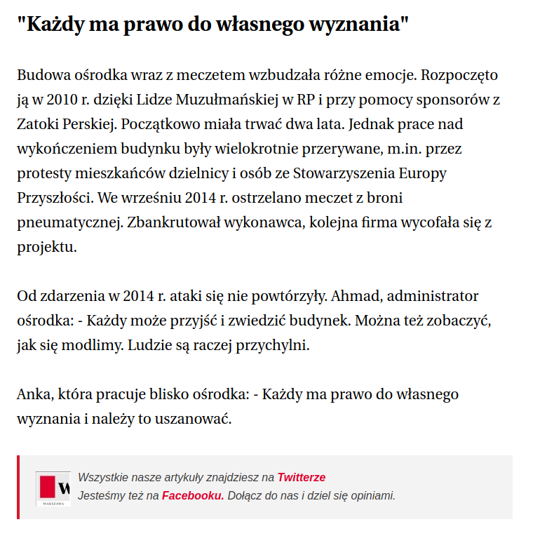

### 2020

Nearly 20,000 protested in Berlin over the weekend against the lockdown and arguing that masks make them slaves. Many have ignored wearing masks and physical distancing as they accused the government of “stealing our freedom“. The press is clearly part of this conspiracy against the people for they are reporting the rise in cases that only reflects herd immunity and not deaths. With the flu, which they totally ignore, for even the CDC states that 44,802,629 Americans had the flu in the 2017-2018 season. Reporting mere thousands with this virus and blowing it up into something that has terrified many and make it seem as if you will face certain death is just outrageous. There should be a class-action lawsuit brought against the media for deliberately not reporting the truth.

  

### 2017

https://pl.wikipedia.org/wiki/Bogus%C5%82aw_Wolniewicz

Bzdura:

  

### 1923

Ówczewny minister spraw wojskowych generał broni Stanisław Szeptycki (zdjęcie) wydał rozkaz o ustanowieniu dnia 15 sierpnia Dniem Żołnierza. W rozkazie tym napisał między innymi:
"W dniu tym wojsko i społeczeństwo czci chwałę oręża polskiego, której uosobieniem i wyrazem jest żołnierz. W rocznicę wiekopomnego rozgromienia nawały bolszewickiej pod Warszawą święci się pamięć poległych w walkach z wiekowym wrogiem o całość i niepodległość Polski”.
Genezą tego święta były wydarzenia z okresu wojny polsko-bolszewickiej, kiedy to właśnie 15 sierpnia 1920 roku Wojsko Polskie rozpoczęło nad Wieprzem w okolicach Kocka wielką kontroofensywę, która rozbiła rosyjski Front Zachodni prowadzony przez generała Michaiła Tuchaczewskiego.

  

---

<a href="https://github.com/TomaszWaszczyk/historia.waszczyk.com/edit/master/src/content/august-4.md" target="_blank">Edytuj tę stronę dzieląc się własnymi notatkami!</a>
