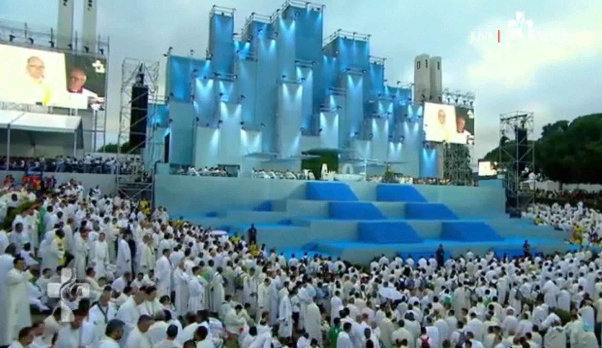

### 2023

<video width="640" height="480" controls>
<source src="./movies/august/przejezyczenie.mp4" type="video/mp4">
Your browser does not support the video tag.
</video>

---

"Ołtarz, który bardziej przypomina scenę koncertową i nie ma nic wspólnego z prawdziwą wiarą. Komunia rozdawana przez świeckie kobiety, gdzie widać, że ilość kapłanów jest wystarczająca aby byli w stawie udzielić każdemu NS. Profanacja na światową skalę. Tak to wygląda kiedy prawdziwa wiara zniknęła" - takie komentarze znajduję pod filmem z Eucharystii na otwarcie ŚDM w Lizbonie.  
Profanacja na światową skalę? Hmmm...  Na zdjęciu widzę, że przed przyjęciem Najświętszego Sakramentu młodzi ludzie wykonują należny gest czci zbliżając się do szafarza. Należny, to nie znaczy, że taki sam jak kiedyś. Życia nie można skopiować. Młodego wina nie można lać do starych bukłaków, bo młode wino jest pełne energii.
Bł. Antonio Rosmini (+1855) w książce „O pięciu ranach Świętego Kościoła” z odwagą i przenikliwością wskazywał na konieczność reform w Kościele. Rosmini uznawany jest za jednego z prekursorów odnowy Kościoła, która znalazła swój konkretny wyraz w przeprowadzonym ponad sto lat po jego śmierci Soborze Watykańskim II. 
Jedną z ran Kościoła według filozofa z Rovereto było oddzielenie ludu od duchowieństwa w kulcie. Ks. Robert Skrzypczak ("Święty "heretyk", który kochał Kościół aż do bólu") pisze o Rosminim: "Lud chrześcijański podczas wspólnych kościelnych celebracji nie pełnić roli widza, lecz aktora. Było dla niego jasne, że liturgia nie jest „widowiskiem wystawianym na oczach ludu”. Chodziło mu o zaangażowanie w działanie Chrystusa całej inteligencji, woli i uczuciowości każdego wiernego. Liturgia miała przenikać w podobnym stopniu tak duchowieństwo, jak i lud."
Tradycja jest ważna. Uczeń Jezusa nie zanurza się jednak w romantycznej przeszłości ani nie wybiega w utopijną przyszłość. Żyje dniem dzisiejszym. "Każdy uczony w Piśmie, który stał się uczniem królestwa niebieskiego, podobny jest do ojca rodziny, który ze swego skarbca wydobywa rzeczy nowe i stare".

  

  

---

### 2021

  

  

### 2008

Lech Kaczyński w Tbilisi

<video width="640" height="480" controls>
<source src="./movies/august/leczkaczynski.mp4" type="video/mp4">
Your browser does not support the video tag.
</video>

### 1944

Oddziały Heinza Reinefartha mordują cywilnych mieszkańców Woli w czasie pacyfikacji Powstania Warszawskiego. Ginie ok. 50 tysięcy ludzi. W jednym z raportów do dowódca donosi, że nie ma już amunicji do dalszych rozstrzeliwań.
RFN, sierpień, lata 50. burmistrz Heinz Reinefarth miasta Westerland na wyspie Sylt z dumą patrzy na tłumy turystów na plaży nadmorskiego kurortu, wkrótce najmodniejszego na wybrzeżu Szlezwika-Holsztynu. W 1958 będzie wybrany do parlamentu landu, a po zakończeniu kadencji w 1967 zacznie pracować jako wzięty prawnik. Reinefarth, który urodził się w Gnieźnie jeszcze przed wstąpieniem do NSDAP, a później SS ukończył aplikację sądową. Mimo licznych wezwań władz polskich do ekstradycji zbrodniarza, niemieckie władze konsekwentnie odmawiały i nawet przyznały Reinefarthowi rentę generalską.
SS- Gruppenführer Heinz Reinefarth “Kat Woli” zmarł jako 76-letni emerytowany generał i zasłużony mieszkaniec gminy w swojej rezydencji na wyspie Sylt. 
Jak to się stało, że człowiek literalnie odpowiedzialny za zamordowanie kilkudziesięciu tysięcy ludności cywilnej uniknął odpowiedzialności karnej? Po pacyfikacji został mianowany dowódcą twierdzy w Kostrzynie nad Odrą, ale odmówił wykonania rozkazu Hitlera aby bronić jej do ostatniego żołnierza. Wydano nawet na niego wyrok, ale nie zdołano go wykonać. To pozwoliło mu twierdzić, że był bojownikiem antyfaszystowskiego ruchu oporu. Wszystkie próby ekstradycji do Polski spotykały się ze sprzeciwem Amerykanów. Mógł zatem swobodnie rozpocząć karierę polityczną w Niemczech Zachodnich.
Zdjęcie po prawej stronie pochodzi z filmu dokumentalnego “Urlaub auf Sylt” nakręconego przez filmowców z NRD w roku 1957. Autorzy Andrew Thorndike, Annelie Thorndike, Karl Raddatz użyli fortelu podając się za dokumentalistów przygotowujących materiał o miejscowości wczasowej, dlatego zdołali nagrać burmistrza w swoim gabinecie (kopię filmu można znaleźć w sieci).
W latach 70. XX wieku Krzysztof Kąkolewski zdołał dotrzeć do zbrodniarza i przeprowadzić z nim rozmowę w ramach cyklu reportaży “Co u pana słychać”. Reinefarth zaprzeczał swojej winie zasłaniając się wyrokiem sądu, który uniewinnił go po wojnie i zdradził, że Himmler wydał decyzję pacyfikacji Powstania nie zdając sobie sprawy z jego skali. “To było nie do rozróżnienia kto jest ludnością cywilną, bo nie wszyscy nosili opaski” - stwierdził w rozmowie z polskim pisarzem. “Żołnierze opowiadali: Dzieci do nas strzelają, więc my strzelamy do dzieci”.
Szacuje się, że podczas tylko trzech dni mogło zginąć od 30 do 60 tysięcy Polaków. Niemcy systematycznie i bezwzględnie mordowali bezbronnych mieszkańców dom po domie. Nie było takiego drugiego wydarzenia w dziejach Polski i Europy, nie tylko podczas II wojny światowej.

  

### 1940

Rządy Polski i Wielkiej Brytanii podpisały status organizacyjny i operacyjny na mocy którego Polskie Siły Zbrojne pod względem operacyjnym podlegać miały dowództwu brytyjskiemu.
Umowa formalizowała pobyt polskich żołnierzy na terenie Wielkiej Brytanii.

### 1884

W Warszawie urodził się Ludwik Hirszfeld - polski profesor doktor habilitowany żydowskiego pochodzenia, wybitny serolog, bakteriolog i immunolog, który odkrył prawa dziedziczenia grup krwi, zaproponował oznaczenie grup krwi A, B, AB i O (którymi obecnie się posługujemy) oraz oznaczył czynnik Rh i odkrył przyczynę konfliktu serologicznego.
Studiował medycynę na Uniwersytetach w Würzburgu i Berlinie.
Był asystentem w Instytucie Badań Raka w Heidelbergu oraz w Zakładzie Higieny Uniwersytetu w Zurychu. W czasie I wojny światowej zwalczał epidemię tyfusu plamistego w Serbii. W czasie okupacji hitlerowskiej został przesiedlony do warszawskiego getta, gdzie nielegalnie zajmował się leczeniem chorych na tyfus. W lipcu 1942 roku uciekł z getta i ukrywał się pod fikcyjnym nazwiskiem. Po wyparciu żołnierzy Wehrmachtu z  Lublina w 1944 rozpoczął wykłady na UMCS. W 1950 został nominowany do nagrody Nobla w dziedzinie medycyny za wyjaśnienie zagadki zjawiska konfliktu serologicznego między matką a płodem. W 1952 utworzył we Wrocławiu Instytut Immunologii i Terapii Doświadczalnej PAN, którego został dyrektorem. Profesor zmarł 7 marca 1954 roku we Wrocławiu. Pozostawił po sobie blisko 400 prac naukowych, które mają olbrzymie znaczenie w dziedzinie biologii, medycyny, a także w  prawie (w kwestii ustalenia ojcostwa).

  

### 1864

Na stokach Cytadeli warszawskiej Rosjanie powiesili generała Romualda Traugutta, dyktatora Powstania styczniowego, i jego bliskich współpracowników. 
Generał Traugutt był ostatnim prezesem Rządu Narodowego, początkowo służył w armii rosyjskiej. Po wybuchu walk przeszedł na stronę powstańców. 
17 października 1863 r. po upadku Rządu Narodowego został wybrany na przywódcę Powstania styczniowego. Realizował program ,,czerwonych''. Był zwolennikiem bezkompromisowej walki z zaborcą. Generał Traugutt odtworzył centralne władze państwowe, zreorganizował siły powstania, próbował powołać pospolite ruszenie chłopów, nawiązał kontakty z europejskimi ruchami rewolucyjnymi i demokratycznymi. Generał Traugutt został pojmany przez rosyjską policję w kwietniu 1864 roku. Osadzono go na Pawiaku, a później w X Pawilonie Cytadeli warszawskiej. Rosjanie próbowali wydobyć od niego informacje dotyczące dowódców powstania, jednak generał nikogo nie wydał. W jednym z listów z carskiego więzienia napisał: „Bóg włada losami ludów, a choćby szubienica, to jednym więcej triumfem i czy odwrót, czy też naprzód, idźcie według potrzeby, jaką sprawa Ojczyzny wskaże”. 
Kardynał Stefan Wyszyński uznał generała Traugutta za męczennika za Wiarę i Ojczyznę powieszonego i starał się o jego beatyfikację.

  

### 1772

W Petersburgu podpisany został traktat rozbiorowy nazywany pózniej pierwszym rozbiorem Polski.
Austria otrzymała całą południową Polskę
po Zbrucz ze Lwowem, ale bez Krakowa (83
tys. km² oraz 2,7 mln mieszkańców). Przy
czym już w 1770 r. Austria samorzutnie
przejęła Spisz i powiaty nowotarski ,
nowosądecki i czorsztyński.
Prusy anektowały Warmię i Prusy
Królewskie ( Pomorze Gdańskie), lecz bez
Gdańska i Torunia (36 tys. km² oraz 600 tys.
mieszkańców). W ten sposób król Prus
Fryderyk II Wielki zrealizował swe wieloletnie
marzenia o państwie na jednolitym obszarze
od Niemna do Łaby .
Rosja zagarnęła Inflanty Polskie oraz
wschodnie, peryferyjne krańce
Rzeczypospolitej za Dnieprem , Drucią i Dźwiną
(województwa: mścisławskie , witebskie i
połockie oraz część mińskiego i inflanckiego
– ogółem 92 tys. km² oraz 1,3 mln
mieszkańców), utrzymując poza tym swój
protektorat nad resztą okrojonego kraju.
Polska straciła 211 tys. km² i 4,5 miliona
ludności.

---

<a href="https://github.com/TomaszWaszczyk/historia.waszczyk.com/edit/master/src/content/august-5.md" target="_blank">Edytuj tę stronę dzieląc się własnymi notatkami!</a>
