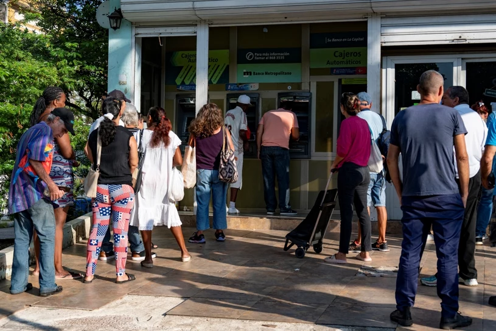
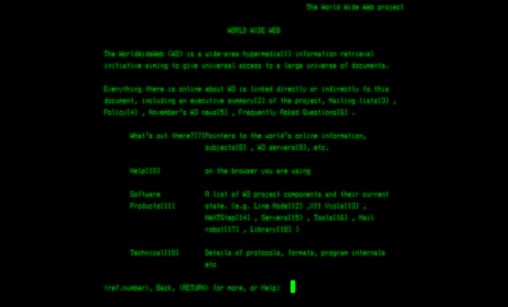
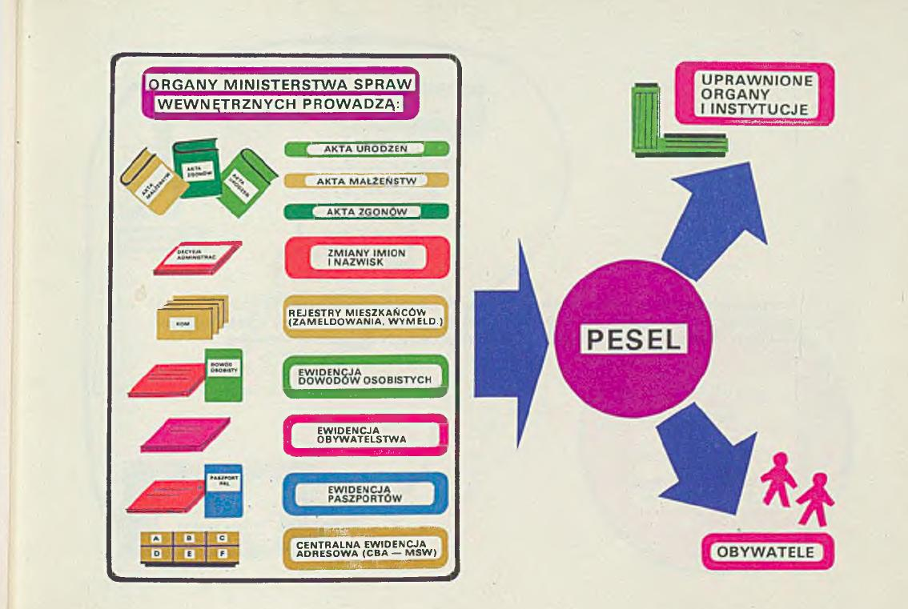
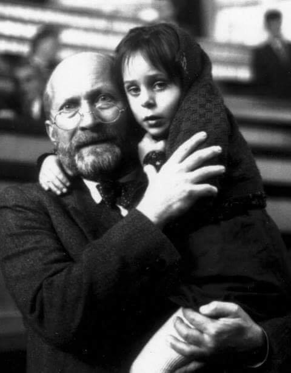

### 2023

> ..nie jestem sam. Słuchaj przekazu uważnie. **Wypierdalaj.**

<video width="640" height="480" controls>
<source src="./movies/august/typiary.mp4" type="video/mp4">
Your browser does not support the video tag.
</video>

---

Bank centralny Kuby zakazał państwowym i prywatnym firmom korzystania z bankomatów oraz ograniczył transakcje gotówkowe pomiędzy nimi - informuje Reuters. W ten sposób władze monetarne chcą walczyć z ciągle rosnącą inflacją oraz słabnącą walutą i jej nielegalną wymianą.

  

### 2021

> Liniowy PIT od działalności gospodarczej jest po prostu skierowany do osób osiągających najwyższe dochody niezależnie od tego, czym oni się zajmują. Ci ludzie często ani nie zatrudniają, ani nie inwestują, nie podejmują jakiegoś wysokiego ryzyka - po prostu dużo zarabiają. - Główny ekonomista Ministerstwa Finansów Łukasz Czernicki

---

  

---

### 1991

The birth of the Web

  

### 1979

PESEL is a national identification system in Poland launched in 1979. It is in fact, the only fully impelmented data system from the grand plans of the cybernetization of the socialist state under Edward Gierek's rule. Early ideas under the name of KSI (National Information System) assumed full datafication and automatization of the state.

And here are some amazing visualizations from the 70s booklet that illustrates how the system works. The 1979 brochure showed what are the goals of the system, and consequences for citizens. PESEL unified the population records and functions to this day as the Polish equivalent of the social security number. Beautiful diagrams also explained relations between specific databases or the territorial location of subsystems. A really amazing example of the marketing of public services. It was colourful and "rainbowish". 🌈 #data #publicpolicy #history #AI

All illustrations are from booklet titled "Informacja o Centralnym Banku Danych" published by the Ministry of Internal Affairs and Information State Agency, 1979

  

### 1964

Loading a new program patch board onto an analog computer at the Institute for Theory of Information and Automation, Czechoslovak Academy of Sciences

  

### 1945

https://pl.wikipedia.org/wiki/Atak_atomowy_na_Hiroszim%C4%99_i_Nagasaki

### 1942

,,Dziś widziałem Janusza Korczaka, 
Jak szedł z dziećmi w ostatnim pochodzie, 
A dzieci były czyściutko ubrane, 
Jak na spacer niedzielny w ogrodzie. (...) 
Janusz Korczak szedł prosto na przodzie
Z gołą głową - z oczami bez lęku, 
Za kieszeń trzymało go dziecko, 
Dwoje małych sam trzymał na ręku. 
Ktoś doleciał - papier miał w dłoni, 
Coś tłumaczył i wrzeszczał nerwowo, 
- Pan może wrócić...jest kartka od Brandta, 
Korczak niemo potrząsnął głową. 
Nawet wiele im nie tłumaczył, 
Tym, co przyszli z łaską niemiecką, 
Jakże włożyć w te głowy bezduszne, 
Co znaczy samo zostawić dziecko...(...)''
---Władysław Szlengel, poeta żydowski.
6 sierpnia 1942 (według innych źródeł 5 sierpnia), do Domu Sierot przy Śliskiej w Warszawie wtargnęli funkcjonariusze niemieckiej żandarmerii, policji żydowskiej oraz Ukraińcy wypędzając doktora Korczaka, jego asystentów oraz żydowskie sieroty na Umschlagplatz. Milczący pochód przeszedł ulicami warszawskiego getta. Dzieci ustawione były czwórkami, na czele pochodu kroczył schorowany doktor Korczak ze wzrokiem wzniesionym ku górze niósł dwójkę dzieci na rękach. Drugi oddział prowadziła Kochana Pani Stefa, trzeci-Broniatowska, czwarty-Szternfeld z internatu na Twardej. To były pierwsze żydowskie szeregi krączące w niemym pochodzie. Za nimi szły tysiące dzieci, setki wychowawców, lekarzy, których tożsamości nie znamy. Był to widok niespotykany. - Kim jest ten człowiek?- pytali zdumieni hitlerowcy zerkając na Korczaka. Hitlerowcy nie mogli dać wiary, że ktoś może z taką godnością iść na śmierć. Świadkiem milczącego pochodu była, m.in. Irena Sendlerowa, kierowniczka referatu dziecięcego w ,,Żegocie'': ,,Byłam wtedy świadkiem wstrząsającego marszu śmierci Janusza Korczaka z dziećmi. Ostatkiem sił dowlokłam się do domu, dostałam szoku nerwowego, moja matka musiała wezwać lekarza (...)''. Tego dnia próbował ocalić życie Januszowi Korczakowi Nachum Remba. Są źródła, które mówią, że tuż przed wywózką do Treblinki niemiecki komendant placu rozpoznał Janusza Korczaka. Komendant był fanem książki Bankructwo małego Dżeka, którą Korczak napisał: ,,(...) to dobra książka, pan może zostać, doktorze. A dzieci? Ach niestety, dzieci muszą jechać...Pan się myli, krzyknął Doktor, dzieci przede wszystkim - i zatrzasnął drzwi za sobą (...)''. Transport ruszył do obozu zagłady Treblinka. Jest wysoce prawdopodobne, że schorowany Janusz Korczak i część dzieci skonali w bydlęcych wagonach w drodze do Treblinki. W środku wagonów wysypanych wapnem, w których śmierdziało chlorem, stłoczeni ludzie po prostu dusili się z braku świeżego powietrza. Co stało się z tymi, którzy przeżyli transport? Zostali zabici strzałem w tył głowy w lazarecie lub zagazowani spalinami w komorach gazowych Treblinki.
Symboliczny kamień ku czci Janusza Korczaka i dzieci znajduje się na terenie byłego niemieckiego obozu zagłady Treblinka.
Pisząc o tak niepojętym okrucieństwie i płacząc niemalże nad losem doktora Korczaka, asystentów i sierot, przytoczę na koniec słowa wymyślonej przeze mnie krótkiej modlitwy: Uczyń Boże, żeby na świecie było tak, jak powinno być, żeby nie było piekła wojen i nadludzkich cierpień niewinnych ludzi.
Ostatnią drogę Janusza Korczaka i dzieci starałam się odtworzyć na podstawie relacji z książki Joanny Iwaszkiewicz ,,Wtedy kwitły forsycje. Pamięci dzieci - ofiar Holocaustu''.
Zdjęcie: kadr z filmu ''Korczak'' w reżyserii Andrzeja Wajdy.

  

### 1898

Skoro świętujemy trzydziestolecie funkcjonowania Warsaw Stock Exchange (GPW), to może cofnijmy się jeszcze dalej, o niemal 100 lat. W załączeniu tekst z Ateneum - pisma naukowego i literackiego (!) z 1898 roku "Akcye przemysłowe i giełda" St. Piotrowskiego.
*
"Im bardziej są zmienne zyski przedsiębiorstwa, im bardziej sama gałąź produkcyi jest w kraju nieznana, im więcej charakteru aleatoryjnego ma przedsiębiorstwo, tern bardziej akcye jego są do gry giełdowej odpowiednim materyałem i tem łatwiej przestają być tem, czem być powinny: dowodem udziału w przedsiębiorstwie i prawa pobierania pewnej części czystego dochodu, a stają się czemś w rodzaju biletu na loteryę, dowodem mającym przynieść właścicielowi nie dochód od kapitału, ale wygraną w grze na giełdzie."

### 1789

https://pl.wikipedia.org/wiki/Friedrich_List

---

<a href="https://github.com/TomaszWaszczyk/historia.waszczyk.com/edit/master/src/content/august-6.md" target="_blank">Edytuj tę stronę dzieląc się własnymi notatkami!</a>
