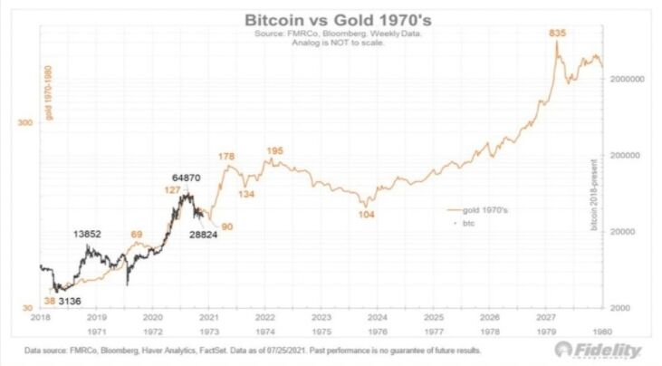
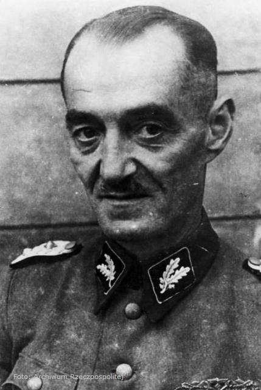
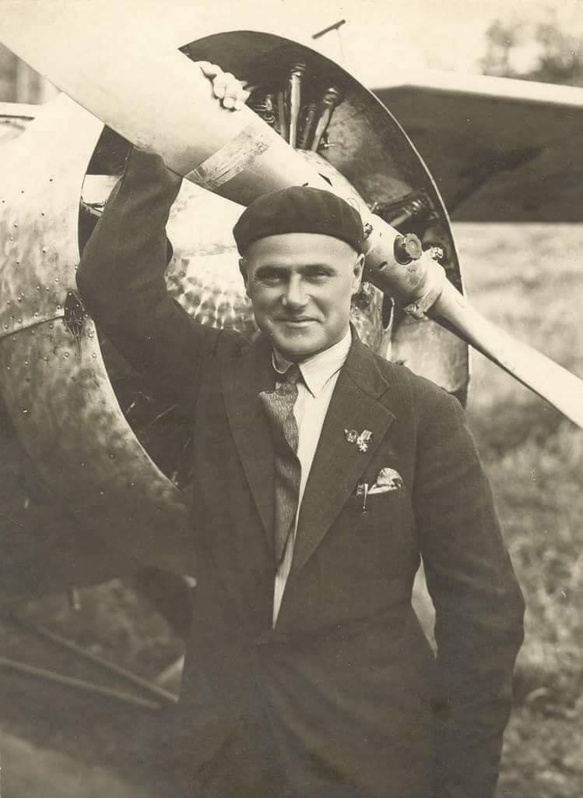
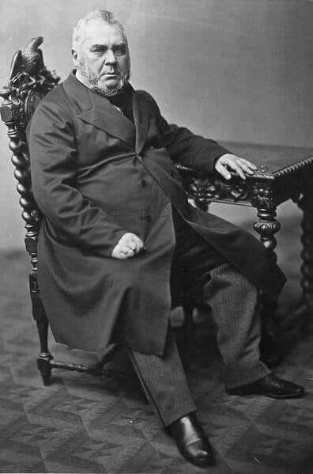

### 2021

  

### 1975

W nocy z 7 na 8 sierpnia 1975 roku w chińskiej prowincji Henan doszło do katastrofy zapory Banqiao. Przerwanie tej ogromnej konstrukcji, spowodowane potężnymi ulewami, wywołało falę powodziową o szerokości 10 kilometrów, która pochłonęła kilkadziesiąt tysięcy ludzkich istnień. Tragedia ta była przez lata ukrywana przez komunistyczne władze w Pekinie.

### 1944

Zakończyła się trwająca rzeź Woli, podczas której Niemcy wymordowali od 40 tys. do 60 tys. mieszkańców warszawskiej dzielnicy. Mordowano kobiety, dzieci, starców i mężczyzn. Egzekucje na Woli trwały jeszcze do 12 sierpnia. Szczególnym okrucieństwem wsławiła się brygada SS Oskara Dirlewangera.

  

---

Wchodząca w skład II Korpusu Kanadyjskiego 1 Polska Dywizja Pancerna pod dowództwem gen. bryg. Stanisława Maczka rozpoczęła natarcie na pozycje niemieckie pomiędzy Caen a Falaise. Po trzech dniach ciężkiej walki aliantom nie udało się okrążyć niemieckich jednostek, które wycofywały się z Normandii.
Walki wznowiono 14 sierpnia, wówczas 1 Polska Dywizja Pancerna gen. bryg. Stanisława Maczka zajęła miejscowości Chambois i wzgórza Mont Ormel. Polacy skutecznie odcięli Niemcom drogę odwrotu. Odcięto Niemców od zaopatrzenia, a także uniemożliwiono dotarcie niemieckiej odsieczy. Niemcy nie mogli wydostać się z ,,kotła''. Walki trwały do 22 sierpnia. Polacy wzięli do niewoli 5113 jeńców, zniszczyli 55 czołgów, 44 działa polowe, 245 samochodów pancernych i pojazdów mechanicznych. Po stronie polskiej straty wyniosły: 325 zabitych, 1002 rannych, 114 zaginionych, stracono ok. 80 czołgów.

### 1931

Porucznik pilot Franciszek Żwirko [na zdjęciu] i inżynier Stanisław Prauss podjęli próbę pobicia rekordu wysokości lotu na samolocie RWD-7. Polska załoga co prawda wzbiła się na rekordową wysokość  5996 m. Niestety, rekord nie został formalnie uznany przez władze Międzynarodowej Federacji Lotniczej, gdyż cytuję: ,,barometr pisał atramentem na papierze, a powinno być wydrapane na zakopconym papierze.'' 🙂
Stanisław Prauss wspominał tamten rekordowy lot: 
"Poleciałem zatem ze Żwirką na ten rekordowy lot, a wybór padł na mnie, ponieważ byłem lżejszy nawet od Antosia Kocjana, który za głodomora uchodził. Przygotowali nas na tę wyprawę starannie, nawet aparaty tlenowe dostaliśmy, tylko ubrania musiały być jak najlżejsze, żeby tę parę metrów wysokości zdobyć. Lot był wspaniały, pogoda słoneczna, trochę zimno, na 4000 metrów zaczęliśmy korzystać z tlenu, ale coś mi nie smakował. Koło 6000 metrów, kiedy Warszawa i Modlin leżały pod naszymi nogami, samolocik zdecydował, że już dość i nawet Ryży (przezwisko Żwirki) nie mógł nic więcej poradzić - po półgodzinie usiedliśmy z powrotem przed hangarem. Czułem się coś nie bardzo, jakbym zjadł coś niedobrego... siedziałem jednak cicho, żeby się nie śmieli, ale Żwirko zaczął pierwszy, że ten tlen był coś nie tego. Więc i ja dodałem, że raczej śmierdział jak zgniła kapusta. No i sprawa się wydała: dostarczone butle gazu okazały się puste, a że przyjaciele nie chcieli odkładać lotu, któryś z nich, myślę, że był to Pysio, zdecydował, żeby butle napełnić gazem przemysłowym, z butli od aparatu do spawania!! Kiedy odczytano barometrowy wykres, okazało się, że byliśmy coś metr poniżej 6000 metrów. Rekord był zatem dobrze pobity, niestety nie został zatwierdzony przez FAI, bo barometr pisał atramentem na papierze, a powinno być wydrapane na zakopconym papierze. I tak ominął mnie zaszczyt figurowania w rejestrach międzynarodowych ..."

  

### 1862

Polski bohater Ludwik Ryll dokonał pierwszego z dwóch nieudanych zamachów na naczelnika Rządu Cywilnego margrabiego Aleksandra Wielopolskiego (zdjęcie). Próbował on strzelić do wychodzącego z budynku Komisji Skarbu Wielopolskiego, ale nie wypalił mu pistolet. 8 dni pózniej inny polski zamachowiec Jan Rzońca dokonał próby zasztyletowania go. To również się nie udało.
Niedługo po tym obaj zamachowcy zostali schwytani wyrokiem Sądu Wojennego skazani na karę śmierci przez powieszenie. 26 sierpnia
1862 roku zostali straceni na stokach Cytadeli.

  

---

<a href="https://github.com/TomaszWaszczyk/historia.waszczyk.com/edit/master/src/content/august-7.md" target="_blank">Edytuj tę stronę dzieląc się własnymi notatkami!</a>
