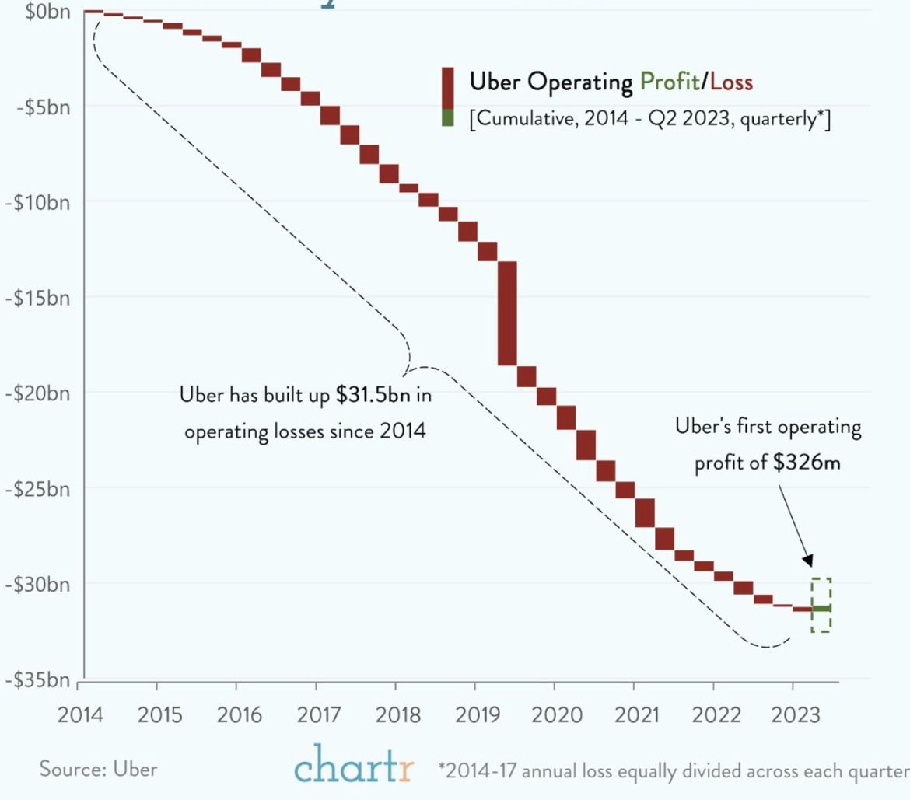
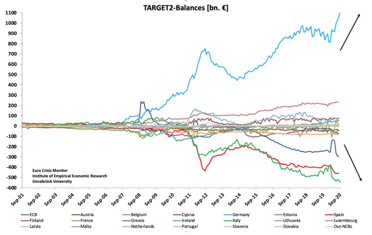
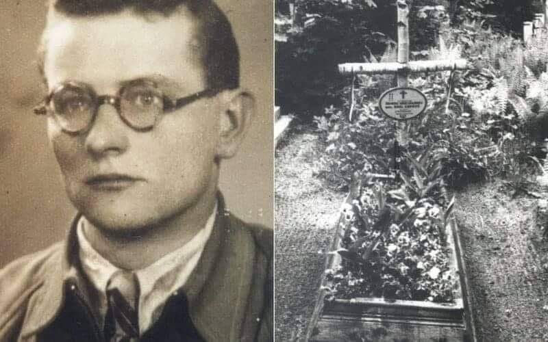
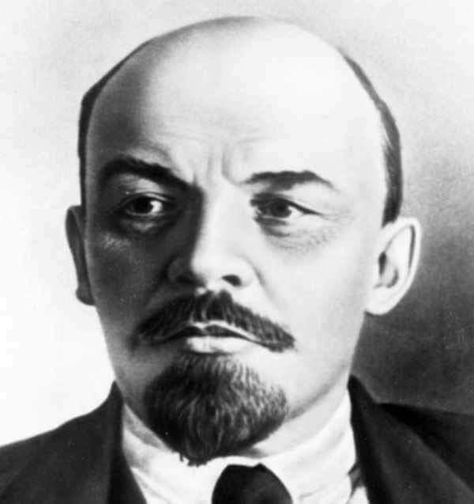

### 2023

Zidiocenie i infantylizacja zachowań międzyludzkich sięga zenitu.

---

Uber has $31.5B in cumulative operating losses since 2014…but still some investors complain that hardware is too capital intensive to invest in. 🤦🏻‍♂️

Many investors, including LPs, simply aren’t intellectually honest about shallowtech versus deeptech investing.

  

### 2021

Today's Thought?

The destruction of the euro

If ever there was a political construct the unstated objective of which is to enslave its population, it is the European Union. The EU represents Ayn Rand’s vision of the socializing state as looter in action.

Brussels does not realise it, but they are partying into the dawn of the next world, and they will have nowhere left to go. Outside of the Brussels hothouse and EU capitals it is hard to discern any support for a failing political system, beyond simply keeping the show on the road.

The EU is a Faustian pact between creditors and debtors to ignore the reality of their respective positions. It is the method of imperialism; but instead of being applied to other nations, Brussels applies imperial suppression to its own member states. And now that they been hollowed out, there is nothing left to sustain Brussels.

The Eurozone’s banking system is a heartbeat from collapse. at the bottom there are the commercial banks with rapidly escalating non-performing loans, a phrase which hides the truth, that they are irretrievable bad debts. At the top is the Eurozone-wide settlement system, TARGET2, which is increasingly used to hide the bad debts accumulating at national levels.

The imbalances are all guaranteed by the ECB. In theory, they shouldn’t exist. They partially reflect accumulating trade imbalances between member states without the balancing payment flows the other way. Additionally, imbalances arise when the ECB instructs a regional central bank to purchase bonds issued by its government and other local corporate entities. As the imbalances between national banks grew, the ECB has stopped paying for some of its bond purchases, leading to a TARGET2 deficit of €297bn at the ECB. The corresponding credits conceal the true scale of the deficits on the books of the PIGS national central banks.

The EU has only one solution a return to sovereign currencies by all EU nations, before the Euro collapses into itself.

  

---

> "Rolnicy są przerażeni". Ardanowski: Muszę to powiedzieć ze smutkiem

Były minister rolnictwa i rozwoju wsi wskazuje, że plany Unii Europejskiej dotyczące redukcji gazów cieplarnianych spowodują gigantyczne straty w polskim rolnictwie. – Społeczeństwa krajów takich jak Polska, krajów, które mają ograniczone możliwości zmiany źródeł energii, w pierwszej kolejności będą pokrzywdzone – stwierdził Jan Krzysztof Ardanowski.
Ma być zredukowanie gazów cieplarnianych. Jednym z oskarżonych jest rolnictwo. Według polityków Unii Europejskiej gazy, które powstają w żołądkach zwierząt, są jednym z najważniejszych elementów emisji gazów i zmian klimatycznych – wskazywał były minister.
Plany eurokratów oznaczają dla społeczeństw państw Wspólnoty bardzo drastyczny wzrost kosztów życia.
Szacuje się, że wprowadzenie zmian w rolnictwie doprowadzi to tego, że niektóre rośliny nie będą po prostu uprawiane, zmieni się ich struktura. W Polsce jako pierwsza upadnie uprawa rzepaku i buraków cukrowych – dodał.

---

### 1946

W okolicach Więcborka w województwie kujawsko-pomorskim funkcjonariusze Urzędu Bezpieczeństwa Publicznego zorganizowali obławę na podporucznika Emila Cuprysia (zdjęcie) byłego żołnierza 24 Dywizji Piechoty Armii Krajowej, uczestnika Akcji "Burza", działacza podziemia antykomunistycznego.  Cupryś był twórcą i dowódcą oddziału pod nazwą Żandarmeria Polowa, którego żołnierze zajmowali się walką z oddziałami sowieckimi dokonującymi gwałtów na Polkach i rabunków polskiego mienia. Najprawdopodniej na skutek donosu jego oddział został zdemaskowany, w on sam w lipcu 1945 roku trafił do więzienia w Bydgoszczy, z którego wkrótce uciekł w okolice Więcborka. Przyjmując pseudonim "Hardy" ponownie podjął działalność dywersyjną i propagandową. Wpadł w ubecką pułapkę podczas spotkania z łącznikiem w Więcborku. Został zastrzelony podczas próby ucieczki. Miał 21 lat.

  

### 1943

W łódzkim getcie zmarł z powodu wycieńczenia, niedożywienia i zapalenia płuc 
19-letni Dawid Sierakowiak - autor słynnego Dziennika będącego świadectwem Holocaustu, męczeństwa i codziennej walki o przetrwanie Żydów uwięzionych w łódzkim getcie. Był niezwykle uzdolnionym człowiekiem władającym pięcioma językami obcymi. Zajmował się tłumaczeniem, pisaniem artykułów do gazet i udzielaniem korepetycji. Odznaczała go wrażliwość na krzywdę ludzką. Szczęśliwe życie i rozwijanie pasji przerywa wybuch wojny. Dawid wraz z rodzicami i siostrą Natalią trafił do łódzkiego getta. Stracił tam rodziców - ojciec Majlech Sierakowiak  vel Sierakowicz zmarł z głodu, a matka Sura Ajdla z Churgelów została zamordowana w niemieckim obozie zagłady w Chełmnie nad Nerem. Natalia najpewniej  została zagazowana rok później w Auschwitz w czasie likwidacji getta . W świadomości wielu Dawid zapisał się jako autor pięciu zeszytów z łódzkiego getta, które rozpoczynają się w czerwcu 1939 roku, a kończą tuż przed jego śmiercią. Dziennik kończy się słowami: „Wieczorem musiałem przygotować i ugotować kolację, co wyczerpało mnie zupełnie. Z polityki kompletnie nic nowego. Czuję, że znów poczynam dostawać melancholii z niecierpliwości. Doprawdy nie ma dla nas wyjścia z…”.

  

### 1914

Na dwanaście dni do więzienia w Nowym Targu trafił Włodzimierz Lenin (zdjęcie). Przyczyną aresztowania był zarzut szpiegostwa na rzecz rządu carskiego.Osadzony razem z chłopami aresztowanymi za nie płacenie podatków w celi numer 5 miał wśród nich zaskakująco dobrą opinię. Uchodził za człowieka spokojnego i opanowanego zawsze służącego radą i pomocą. Zwolniony na skutek starań miejscowych działaczy socjaldemokratycznych wyjechał z Polski do Szwajcarii.

  

---

<a href="https://github.com/TomaszWaszczyk/historia.waszczyk.com/edit/master/src/content/august-8.md" target="_blank">Edytuj tę stronę dzieląc się własnymi notatkami!</a>
