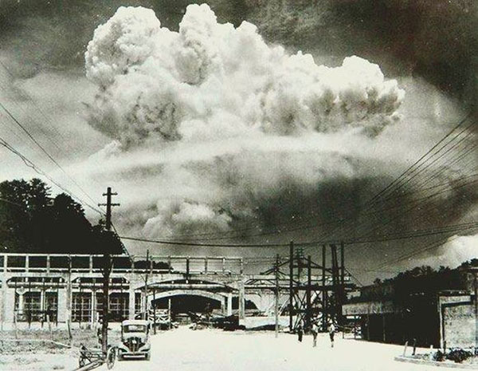
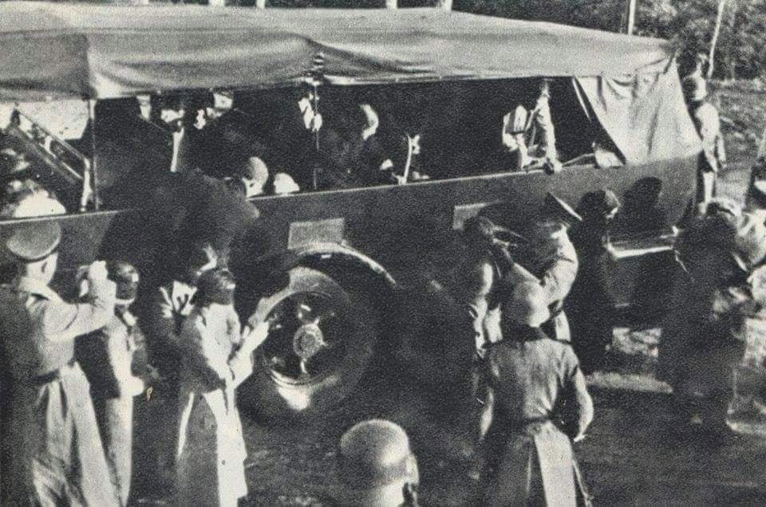
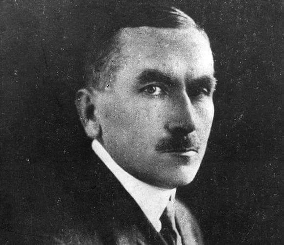

### 1945

Nagasaki, 20 minut po zrzuceniu bomby Fat Man z samolotu B-29 Bockscar 9 sierpnia 1945.

  

### 1941

Na polecenie SS-Hauptsturmführera Hansa Krügera policja ukraińska aresztowała w Stanisławowie 300 przedstawicieli polskiej inteligencji, głównie nauczycieli. Aresztowania dokonano podstępnie, zwołując w jednej ze szkół zebranie, na którym rzekomo miały być omawiane przygotowania do mającego rozpocząć się wkrótce roku szkolnego.
Aresztowanych przetrzymywano w więzieniu Gestapo i wykorzystywano przy pracach budowlanych w okolicach ogrodów Bracha. Początkowo można było z nimi nawiązać kontakt. Po kilku dniach strażnicy ukraińscy zaczęli strzelać do osób próbujących zbliżać się do pracujących więźniów.
W nocy z 14 na 15 sierpnia 1941 roku większość aresztowanych Polaków, około 250 osób, przewieziono ciężarówkami do Czarnego Lasu w okolicy wsi Pawełcze , rozstrzelano, ich zwłoki zakopano na miejscu. Z kaźni ocalał Polak, leśniczy z Sołotwiny, który korzystając z deszczu i nieuwagi konwojentów, zsunął się z ciężarówki i uciekł. Tuż przed egzekucją Niemcy zebrali grupę chłopów z Pawełcza i nakazali jej wykopanie dołów w Czarnym Lesie.

  

### 1864

Urodził się Roman Dmowski: https://pl.wikipedia.org/wiki/Roman_Dmowski

Urodził się Roman Dmowski, architekt niepodległej Polski, ojciec idei narodowej, współzałożyciel i przywódca Narodowej Demokracji, przedstawiciel Polski na konferencji pokojowej w Paryżu w 1919 roku i sygnatariusz traktatu wersalskiego, minister spraw zagranicznych w 1923 roku.

Warto przypomnieć jakie poglądy gospodarcze miał śp. Roman Dmowski:

"Zdaniem Romana Dmowskiego „podatki zaś państwowe i inne doszły do takiej wysokości, że stały się tamą dla rozwoju życia gospodarczego”. Konsekwencją tego jest „konieczność zredukowania machiny państwowej, a przeto zmniejszenia kosztów jej utrzymania, narzuca się, jako rzecz niesłychanie pilna”. Dodatkowo zdaniem Dmowskiego rząd to „najmniej oszczędny i najlekkomyślniejszy konsument” zaopatrujący się u nieuczciwych sprzedawców.

Roman Dmowski pisał, że „Polska niszczeje z trzech głównych przyczyn. Po pierwsze żadne państwo nie ma takiej kosztownej machiny państwowej ze wszystkimi jej przybudówkami, w stosunku do dochodów narodu z jego wytwórczości. Koszty utrzymania państwa tak wielkim ciężarem legły na jego ludności, że ta jedna przyczyna wystarczyłaby do uniemożliwienia normalnego rozwoju życia gospodarczego”.

Ideolog narodowej demokracji przestrzegał, że koszty „administracji państwa i wszelkich jego instytucji pożerają zarobki ludności produkcyjnej i przyczynia się w ogromnej mierze do zabicia wytwórczości. Już dziś żaden kraj w Europie nie wytrzymuje wszelkiego rodzaju podatków, wynikających ze zbyt kosztownej organizacji państwa”.

Roman Dmowski postrzegał rozrośniętą machinę państwa jako przejaw potwornej głupoty, prymitywizmu, pasożytnictwa i niedbałości o państwo. Uważał, że machina państwa musi być na miarę naszych możliwości finansowych, a „system podatkowy przekształcić [należy] tak by nie zabijał wytwórczości”. Roman Dmowski podkreślał też, że „Kapitalizm wreszcie nowoczesny dał światu naszemu dobrobyt i bogactwo przy żadnym innym systemie nie osiągalne”.

  

<!-- w Kamionku w Warszawie urodził się Roman Dmowski, założyciel, przywódca i czołowy ideolog Narodowej Demokracji.
Pochodził z rodziny rzemieślniczej z drobnoszlacheckim rodowodem.
Ukończył III gimnazjum w Warszawie. Studiował na wydziale fizyczno-matematycznym na Uniwersytecie Warszawskim. W 1891 roku uzyskał stopień magistra nauk przyrodniczych. Już w czasie studiów związał się z nielegalną działalnością polityczną, za co został przejściowo uwięziony przez władze carskie - w 1891 r. w setną rocznicę Konstytucji 3 maja zorganizował pochód studentów warszawskich. Od sierpnia 1892 r. do stycznia 1893 r. odsiadywał wyrok w X pawilonie Cytadeli warszawskiej za zorganizowanie manifestacji w dniu 3 maja. Od 1889 roku był członkiem Ligi Polskiej. W latach 1891-92 studiował a Paryżu. W 1893 roku przekształcił Ligę Polską w Ligę Narodową i stanął na jej czele. Jako lider sprecyzował zasady ideologii nacjonalistycznej, zawierającej, m.in. wymóg solidarności narodowej. Redagował ,,Przegląd Wszechpolski'', który był organem prasowym obozu narodowego. W 1903 roku po raz pierwszy opublikował książkę ,,Myśli nowoczesnego Polaka'' - którą nazwał ,,wyznaniem wiary narodowej''. To właśnie na łamach tej publikacji włączył Dmowski do programu partii antysemicko zorientowany nacjonalizm polski. Stosunek Dmowskiego do Żydów wyjaśnia konserwatywny publicysta historyczny Stanisław Cat-Mackiewicz: Dmowski w Myślach nowoczesnego Polaka wypowiedział wielkie zdanie,
o którym zapomnieli jego adepci, widać więcej oddani kultowi Dmowskiego, aniżeli lekturze jego dzieła. Zdanie to brzmi: ,,Nie naród tworzy państwo ale państwo tworzy naród''. Dmowski niewątpliwie nie chciał wyrzekać się ziem polskich z ludnością niepolską lub mieszaną, chciał tylko tę ludność zasymilować, nie chciał jej od narodu odtrącać, jak to czynił Kemal z nie-Turkami, lub Hitler z nie-Niemcami. (...)'' Z tej asymilacji wyłączył jednak Dmowski Żydów. Dmowski chciał asymilować Rusinów czy Litwinów, bronił się przed asymilacją Żydów. (...) Ochrzczony czy nie ochrzczony Żyd pozostawał dla Dmowskiego Żydem, narodowością obcą. Żydzi byli dla Dmowskiego teoretycznie równie godni zwalczania jak zaborcy, praktycznie zwalczał ich jednak więcej. Uważał bowiem, że Żydzi szczelniej okupują nasze życie gospodarcze, niż zaborcy nasze życie polityczne. Obawiał się też nade wszystko przenikania elementu żydowskiego do naszej kultury i literatury. Dążył do emancypacji narodu polskiego spod gospodarczej przewagi Żydów, do stworzenia polskiego mieszczaństwa, do oswobodzenia chłopa od handlu żydowskiego.''
Pod koniec 1906 roku Dmowski pełni obowiązku redaktora Gazety Polskiej. W 1907 został wybrany posłem do sejmu rosyjskiego. Dwa lata później ów mandat poselski złożył. W czasie I wojny światowej był zwolennikiem orientacji na Rosję. W 1916 roku otrzymał tytuł doctora honoris causa Uniwersytetu w Cambridge. W latach 1917-1919 był współtwórcą i prezesem Komitetu Narodowego Polski w Paryżu. W 1918 r. objął zwierzchnictwo nad tworzącą się pod dowództwem Józefa Hallera Armią Polską we Francji. W 1919 roku był delegatem- obok Paderewskiego- na konferencję pokojową w Wersalu, gdzie podpisał w imieniu Polski Traktat Wersalski, który uznawał prawo Polaków do niepodległego państwa. Na marcowym Zjeździe Założycielskim Młodzieży Wszechpolskiej w 1922 roku, Prezesem Honorowym MW wybrano Romana Dmowskiego, który pozostał dla kolejnych pokoleń Wszechpolaków jednym z największych autorytetów moralnych. W 1923 roku objął stanowisko ministra spraw zagranicznych, a także otrzymał tytuł doctora honoris causa Uniwersytetu Poznańskiego. W 1926 roku założył Obóz Wielkiej Polski, organizację narodową, która do momentu rozwiązania przez władze sanacyjne (1933 r.) liczyła ok. ok. 250 tys. członków. W 1928 był inicjatorem powołania Stronnictwa Narodowego. W 1931 r. wydał książkę ,,Świat powojenny i Polska''. W 1933 r. po raz pierwszy opublikował, apelując o samowystarczalność w gospodarce, książkę ,,Przewrót''. 
Roman Dmowski zmarł 2 stycznia 1939 r. w Drozdowie pod Łomżą. Pogrzeb Romana Dmowskiego odbył się w sobotę po święcie Trzech Króli. Pochowany został w grobie rodzinnym na Bródnie. W dniu 8 stycznia 1999 r., w sześćdziesiątą rocznicę śmierci Roman Dmowskiego, Sejm RP docenił Jego zasługi następującą uchwałą: „W związku z 60 rocznicą śmierci Romana Dmowskiego Sejm Rzeczypospolitej Polskiej wyraża uznanie dla walki i pracy wielkiego męża stanu na rzecz odbudowania niepodległości państwa polskiego i stwierdza, że dobrze przysłużył się Ojczyźnie. W swojej działalności Roman Dmowski kładł nacisk na związek pomiędzy rozwojem Narodu i posiadaniem własnego państwa formułując pojęcie narodowego interesu. Oznaczało to zjednoczenie wszystkich ziem dawnej Rzeczypospolitej zamieszkałych przez polską większość, a także podniesienie świadomości narodowej wszystkich warstw i grup społecznych. Stworzył szkołę politycznego realizmu i odpowiedzialności. Jako reprezentant zmartwychwstałej Rzeczypospolitej na Konferencji w Wersalu przyczynił się w stopniu decydującym do ukształtowania naszych granic, a zwłaszcza granicy zachodniej. Szczególna jest rola Romana Dmowskiego w podkreślaniu ścisłego związku katolicyzmu z polskością dla przetrwania Narodu i odbudowania państwa. Sejm Rzeczypospolitej Polskiej wyraża uznanie dla wybitnego Polaka Romana Dmowskiego”. 
Zasługi Romana Dmowskiego docenił również Kościół katolicki. W Watykanie 
oficjalny organ „Osservatore Romano" napisał: „Ś.p. Roman Dmowski, wielki wychowawca młodych pokoleń, wielokrotnie w ostatnich czasach podkreślał, że pojęcie polskości i katolicyzmu są nierozerwalnie ze sobą związane. Dlatego też radosny objaw spontanicznego nawrotu młodzieży polskiej do wiary katolickiej jest w znacznej mierze Jego zasługą".
Odznaczenia nadane Romanowi Dmowskiemu:
Wielka Wstęga Orderu Odrodzenia Polski
Order Narodowy Gwiazdy Rumunii
Order Oranje-Nassau
Wybrane publikacje Romana Dmowskiego:
Nasz patriotyzm (1893)
Myśli nowoczesnego Polaka (1903)
Walka z anarchią i Demokracja Narodowa (1906)
Niemcy, Rosja i kwestia Polska (1908)
Anachronizm (1909)
Separatyzm Żydów i jego źródła (1909)
Upadek myśli konserwatywnej w Polsce (1914)
Nowe czasy i nowe zagadnienia (1924)
Polityka polska i odbudowanie państwa (1925)
O napaści posła Zdziechowskiego (1926)
Zagadnienie rządu (1927)
Kościół, naród i państwo (1927)
Kwestia ukraińska (1930)
Dziedzictwo pod pseudonimem Kazimierz Wybranowski (1931)
W połowie drogi pod pseudonimem Kazimierz Wybranowski (1931)
Świat powojenny i Polska (1931)
Przewrót (1934) -->

---

<a href="https://github.com/TomaszWaszczyk/historia.waszczyk.com/edit/master/src/content/august-9.md" target="_blank">Edytuj tę stronę dzieląc się własnymi notatkami!</a>
