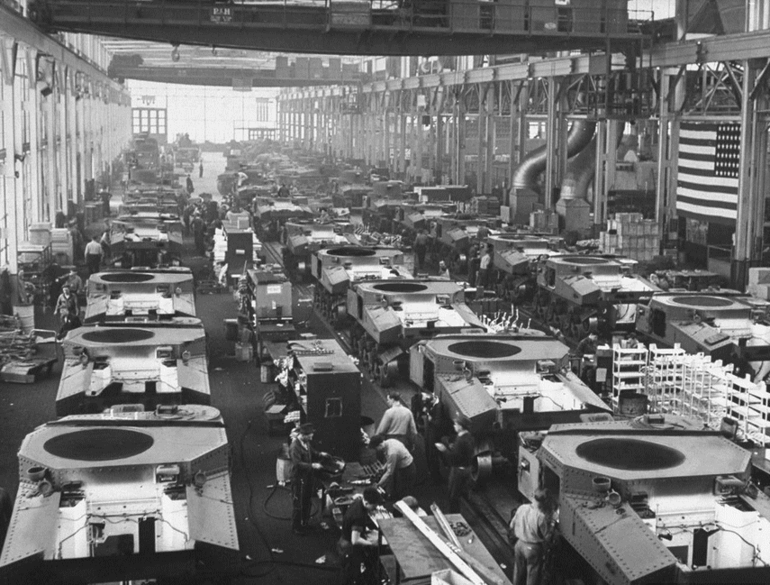

### Dawny Dom Weteranów Powstania Styczniowego

W 1863 roku powstał u zbiegu ulic Floriańskiej i Jagiellońskiej na Pradze Północ w Warszawie.

Został wybudowany w latach 1896-1900 przez nieznanego architekta z inicjatywy rosyjskiego Czerwonego Krzyża i początkowo mieszkały w nim wdowy po poległych rosyjskich żołnierzach.

Weterani powstania zamieszkali w budynku w 1924 r. W latach 20. i 30. a szczególnie po dojściu Józefa Piłsudskiego do władzy największym symbolem patriotyzmu i walki o wolność byli weterani Powstania Styczniowego. Po prawie 70 latach od upadku powstania, żyjący bohaterowie zostali należycie uhonorowani. Władze II Rzeczypospolitej nagrodziły powstańców najwyższymi odznaczeniami wojennymi, nadano im przywilej noszenia munduru powstańca 1863 r. Noszenie granatowego munduru było nie tylko honorem - weteranom salutowali policjanci, żołnierze, a nawet generałowie i Marszałek – pisze w swoich wspomnieniach prażanin, T. Pawłowski.

W Domu Weteranów znajdowało się 20 miejsc dla byłych powstańców. Mieli tutaj zapewniony dach nad głową, wikt i opierunek, dostawali państwową pensję. Nadmiar wolnego czasu spędzali na graniu w karty i szachy. Mieli specjalną kwaterę na cmentarzu Wojskowym na Powązkach. Ostatni weteran, Mamert Wandali, zmarł w 1942 r.

W 1935 roku położony około 200 metrów od Domu Weteranów Plac Aleksandrowski zmienił nazwę na Plac Weteranów 1863 r. Imieniem bohaterów narodowego zrywu nazwano też jedną z lepszych praskich szkół podstawowych przy ul. Kawęczyńskiej 2.

Obecnie w budynku mieści się Kuria Warszawsko-Praska.

https://pl.wikipedia.org/wiki/Historia_ortografii_polskiej

### Wojenna historia gospodarcza doliny krzemowej

Z pośród czterech mocarstw, które walczyły w II wojnie światowej tylko Rosja nie jest dziś mocarstwem ekonomicznym. Niemcy, USA czy Japonia to kraje ludne i bogate. Jak to możliwe, że dwa z nich przegrały wojnę, a dziś przodują w ekonomicznym rozwoju?

Żaden cud ekonomiczny nie był potrzebny. Państwa te miały największy park maszynowy na świecie. W końcu wojna to wyścigi na produkcję. Niemcy czy Japonia tylko odkurzyły z gruzów swoje fabryki i przestawili się z produkcji wojskowej na cywilną. Umiesz robić dobrą ciężarówkę wojskową, zrobisz i cywilną. Umiesz robić dobre czołgi, zrobisz i dobrą koparkę; umiesz robić dobre motocykle, zrobisz i… itd itp.

Stany Zjednoczone wyszły oczywiście na tym najlepiej, gdyż po wojnie zgarnęli niemieckich inżynierów przemysłu lotniczego i rakietowego co umożliwiło im szybsze zdominowanie tych nowych gałęzi gospodarki. Wystarczy tylko wspomnieć ojca rakiety Saturn5 i lotu na Księżyc. To Wernher von Braun, były dyrektor Peenemünde, konstruktor V2 (A4), SS-man i rekruter więźniów do obozu koncentracyjnego Dora.

Pokłosiem wojny jest dominacja gospodarcza głównych potęg w niej uczestniczących (pomijając Rosję rzecz jasna) oraz przewaga technologiczna.  Nawet wydawałoby się tak owiana legendą przedsiębiorczości dolina krzemowa ma swoje korzenie stricte wojskowe. Warto obejrzeć poniższą prezentację żeby wyzbyć się wszelkiej naiwności co do mitu założycielskiego miejsca, skąd de facto pochodzi dzisiejszy rozwój Internetu.

 

Z tej perspektywy „afera” PRISM to konsekwencja działań wywiadu i dla nikogo nie może być zaskoczeniem.

### Małżeństwo

 § 79. Skutki prawne małżeństwa (str. 208-209). Wskutek małżeństwa zachodził stosunek powinowactwa, a także przeszkoda do zawarcia nowego małżeństwa. Dzieci zrodzone w małżeństwie uchodziły za prawe (legitimi). Żona uzyskiwała pozycję społeczną męża, byli oni zobowiązani do wzajemnego szacunku (reverentia). Mąż miał obowiązek utrzymywać żonę, mógł decydować  o miejscu jej zamieszkania i sposobie wychowywania dzieci. Mąż wchodził w stosunki prawno-majątkowe żony  (jeśli uprzednio była sui iuris), stawał się sukcesorem uniwersalnym. Posag (dos) to majątek wnoszony mężowi w związku z zawarciem małżeństwa. Jego zadaniem było pokrywanie części kosztów związanych z utrzymaniem małżeństwa (onera matrimonii). Ustanowienia posagu mógł dokonać ojciec kobiety (dos profecticia) albo inne osoby lub sama żona (dos adventicia). Ustanowienie posagu polegało na przeniesieniu własności na męża (dos datio), przyrzeczeniu stypulacyjnym (dotis promissio) albo przyrzeczeniu ustanawiającym (dotis dictio). Jeśli zastrzeżono zwrot w wypadku rozwiązania małżeństwa, zwano go dos recepticia. Posag formalnie należał do męża, lecz miał on moralny obowiązek zwrócić go przy rozwiązaniu najpierw z dobrej woli, później z mocy umowy i prawa, a środkiem procesowym (nie obejmował pożytków) była actio ex stipulatu (stricti iuris) albo actio rei uxoriae (bonae fidei). Gdy małżeństwo rozpadało się z winy żony albo powstały z niego dzieci, mąż mógł zatrzymać część posagu (retentio - do połowy). Skutkiem małżeństwa był zakaz darowizn. Początkowo darowizny można było czynić przed małżeństwem (donatio ante nuptias). Justynian wprowadził możliwość czynienia darowizny w trakcie małżeństwa (donatio propter nuptias). W wypadku rozwiązania małżeństwa mąż musiał zwrócić darowiznę (nie, jeśli małżeństwo rozpadło się z winy żony).

---

<a href="https://github.com/TomaszWaszczyk/historia.waszczyk.com/edit/master/src/content/ciekawostki.md" target="_blank">Edytuj tę stronę dzieląc się własnymi notatkami!</a>
