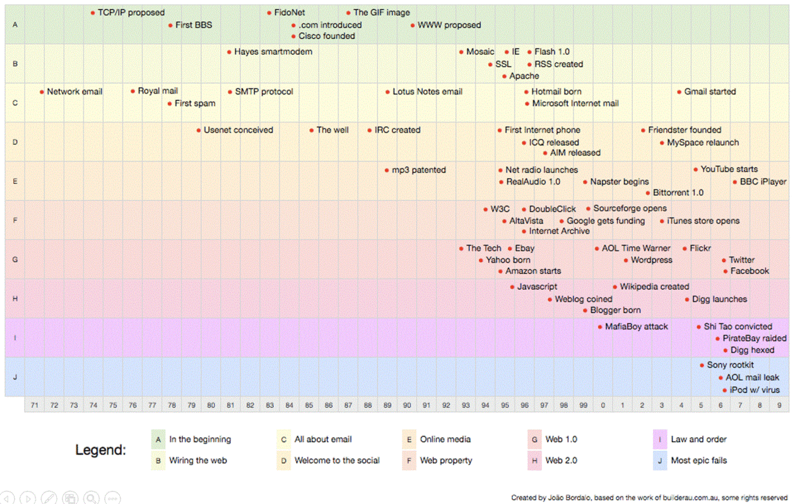

https://en.wikipedia.org/wiki/Operational_transformation - google wykorzystuje

https://en.wikipedia.org/wiki/Brendan_Gregg

https://pl.wikipedia.org/wiki/Hans_Moravec

Context not control.

  

### 2013

During summer of 2013, revelations from ex-
consultant at [the] NSA Edward Snowden gave proof that [the] NSA willingly inserts backdoors
into software, hardware components and published standards. While it is still
believed that the mathematics behind ECC (Elliptic-curve cryptography) are still sound and solid,
some people (including Bruce Schneier [SCHNEIER]), showed their lack of confidence
in NIST-published curves such as nistp256, nistp384, nistp521, for which constant
parameters (including the generator point) are defined without explanation. It
is also believed that [the] NSA had a word to say in their definition. These curves
are not the most secure or fastest possible for their key sizes [DJB], and
researchers think it is possible that NSA have ways of cracking NIST curves.
It is also interesting to note that SSH belongs to the list of protocols the NSA
claims to be able to eavesdrop. Having a secure replacement would make passive
attacks much harder if such a backdoor exists.

However an alternative exists in the form of Curve25519. This algorithm has been
proposed in 2006 by DJB [Curve25519]. Its main strengths are its speed, its
constant-time run time (and resistance against side-channel attacks), and its
lack of nebulous hard-coded constants.

---

Okay. Perhaps there’s some hidden logic there, or perhaps Steve was just trying to motivate Marc. But it was what he said next that made all the difference.

    “And one last thing. You need to go build an application economy.”

Well, what’s an application economy? Marc asked.

I don’t know, Steve replied.

---

### 1989

https://en.wikipedia.org/wiki/Operational_transformation

### 1958

FORTRAN II

- first class functions

- higher order functions

- lexical closure

---

https://en.wikipedia.org/wiki/Cyberpunk

https://liberprimus.org/ 3301 https://en.wikipedia.org/wiki/Cicada_3301

https://en.wikipedia.org/wiki/Wardley_map

https://en.wikipedia.org/wiki/David_Chaum

Taylor Gerring

---

### Cryptography

DO you know SGX is bad?
Yeah, there were some problems and they got patched finally. I'm a fan of cryptographic based technology like ZKP and MPC, but when dealing with a lot of non critical data, TEE can work pretty well. So in short, it's the threat model that matters 
Always, the threat model matters.

---

<a href="https://github.com/TomaszWaszczyk/historia.waszczyk.com/edit/master/src/content/computer-science.md" target="_blank">Edytuj tę stronę dzieląc się własnymi notatkami!</a>
