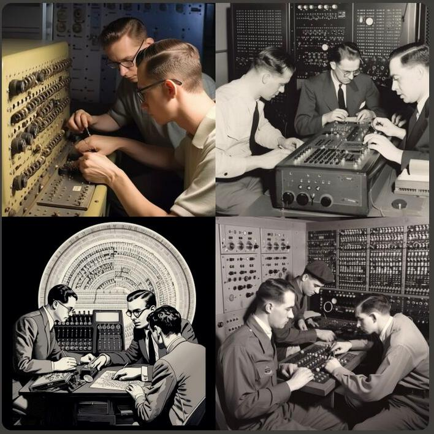

http://homepages.cs.ncl.ac.uk/brian.randell/NATO/index.html (książki NATO o oprogramowaniu)

### A brief history of random numbers

The usefulness of random numbers has been known for a long, long time to people who also knew how to use slide rules. If you wanted to do some math without the bother of coming up with all that pesky input data from the real world, you might as well just use any ol' random numbers, as long as there weren't any patterns in them to heck up the patterns you were trying to look at. So in the first half of the 20th century you had little old ladies named Edith spinning roulette wheels or pulling bingo balls out of baskets and writing the results down, which got assembled into giant tomes and published so that engineering schools could buy them and have giant tomes sitting on their shelves. Anyone who wanted some meaningless numbers could pull the tome down, flip it open to a presumably-random page, and there were all the random numbers anyone could want. The problem was solved, and life was good.

In late 1940's computers were invented, but they were far too big and expensive to be put on the task of intentionally generating nonsense, and things carried on as before. If you needed random numbers in a computer program, you just got a pretty young lady named Mary to transcribe part of the book to punch cards for you.

Around the early 1960's computers got fast enough that Edith and Mary couldn't keep up with them, so they got downsized and replaced with more computers. To do this people came up with Linear Congruential Generators (LCG's), which could generate lots of numbers numbers that weren't really random, but sure looked random. LCG's worked well on computers that even a second-rate university could afford, and so the problem was solved, and life was good.

At some unknown point in here, presumably sometime in the 60's or 70's, someone seems to have invented Linear Feedback Shift Registers (LFSR's) as well. These made random-looking numbers and were really easy to implement in hardware compared to the LCG, which needed to do complicated things like multiply numbers. The random-looking numbers made by LFSR's were good enough for hardware people, so they started using LFSR's whenever they needed to and never looked back.

Anyway, by the late 60's people who knew how to use slide rules had realized that using numbers that only looked random could really heck up their math pretty bad, and one of the more common LCG implmentations, RANDU, was actually about as bad as possible. So, just using any old LCG wasn't good enough, you had to use one made by someone with a PhD in mathematics. Donald Knuth shook his fist at the world and shouted "Hah! I told you so!", published a book on how to do it Right that most people didn't read, and then went back into his Fortress of Solitude to write TeX. Because it was created by IBM, RANDU's awfulness is now enshrined forever in history documents like this one, and because the people writing OS's and programming languages at the time weren't actually doing much slide-rule stuff anymore and didn't actually need very good random-looking numbers, everyone went back to using whatever old crap RNG they were using anyway. The problem was solved, or at least not terribly problematic, and life was good.

Also, sometime in the 70's or 80's the arts of cryptography started leaking from classified government works into the real world. People started thinking about how much money they could make from scrambling satellite TV so that plebs with HAM radio licenses couldn't watch it, and these people started giving more money to people who had PhD's in mathematics to figure out how to make this work. It was quickly determined that neither LCG's nor LFSR's made numbers that were random-looking enough to really get in the way of someone who knew how to use a slide rule, and since Edith had long ago retired to a small beach house in New Jersey, they needed to figure out how to get computers to make better random-looking numbers. But making numbers look random enough that someone couldn't undo the process and get free pay-per-view was slow and involved lots of details that nobody else really cared about, so that topic went off on its own adventures and will not be further mentioned.

Things more or less trundled along this way until the late 90's, when suddenly computers were everywhere and there was a new generation of people who had grown up too late to know how to use slide rules, so they did all their math with computers. They were doing a LOT of math by now, and they looked around and realized that their random-looking numbers really weren't very random-looking at all, and this was actually something of a problem by now. So the Mersenne Twister got invented. It was pretty slow and used a lot of memory and made kinda mediocre random numbers, but it was way better than a bad LCG, and most importantly, it had a cool name. Most people didn't want to read Knuth's book and figure out how to make a non-bad LCG, so everyone started using the Mersenne Twister whenever possible. The problem was solved, and life was good.

This is where things stood until the early 2010's, when I finished my MS and started paying attention again. People suddenly realized it was possible to make random-looking numbers better than the Mersenne Twister using an algorithm called xorshift. Xorshift was fast, it made good pretty random-looking numbers, and it didn't need a whole 3 kilobytes of state just sitting around taking up space and causing comment among the neighbors at church. It did sometimes have problems with some of its numbers not looking random enough in a few select circumstances, but people were gun-shy about their randomness by now so a few people with PhD's in mathematics slowly and patiently spent years figuring out ways to work around these problems, leading to a whole confusing family of related things such as xoshiro, xoroshiro, xoroshiro+, xoroshiro*, and so on. Nobody else could really tell the difference between them, but everyone agreed they were better than Mersenne Twister, easier to implement, and the name was nearly as cool. Many papers were published, the problem was solved, and life was good.

However, at about the same time some bright young spark figured out that it actually wasn't too hard, if you read Knuth's book and thought real hard about what you were doing, to take the old LCG and hop it up on cocaine and moon juice. The result got called the Permuted Congruential Generator, or PCG. This quite miffed the people working on xorshift generators by being almost as small and fast, and producing random-looking numbers that satisfied even the people who had learned to use slide rules for fun in this latter age. It also used xor's and bit shifts, and that's xorshift's turf, dammit, it's right in the name! Since nobody had figured out any downsides to PCG's yet, everyone shrugged and said "might as well just go with that then", and that is where, as of 2019, the art currently stands. The problem is solved, and life is good.

---

https://en.wikipedia.org/wiki/Eventual_consistency

https://pl.wikipedia.org/wiki/Robert_Noyce

https://en.wikipedia.org/wiki/Operational_transformation - google wykorzystuje

https://en.wikipedia.org/wiki/Brendan_Gregg

https://pl.wikipedia.org/wiki/Hans_Moravec

Brave privacy: https://en.wikipedia.org/wiki/Brendan_Eich

Context not control.

  

### 2013

During summer of 2013, revelations from ex-consultant at [the] NSA Edward Snowden gave proof that [the] NSA willingly inserts backdoors
into software, hardware components and published standards. While it is still believed that the mathematics behind ECC (Elliptic-curve cryptography) are still sound and solid, some people (including Bruce Schneier [SCHNEIER]), showed their lack of confidence
in NIST-published curves such as nistp256, nistp384, nistp521, for which constant
parameters (including the generator point) are defined without explanation. It
is also believed that [the] NSA had a word to say in their definition. These curves
are not the most secure or fastest possible for their key sizes [DJB], and
researchers think it is possible that NSA have ways of cracking NIST curves.
It is also interesting to note that SSH belongs to the list of protocols the NSA
claims to be able to eavesdrop. Having a secure replacement would make passive
attacks much harder if such a backdoor exists.

However an alternative exists in the form of Curve25519. This algorithm has been
proposed in 2006 by DJB [Curve25519]. Its main strengths are its speed, its
constant-time run time (and resistance against side-channel attacks), and its
lack of nebulous hard-coded constants.

---

Okay. Perhaps there’s some hidden logic there, or perhaps Steve was just trying to motivate Marc. But it was what he said next that made all the difference.

    “And one last thing. You need to go build an application economy.”

Well, what’s an application economy? Marc asked.

I don’t know, Steve replied.

---

### 1989

https://en.wikipedia.org/wiki/Operational_transformation

### 1958

FORTRAN II

- first class functions

- higher order functions

- lexical closure

---

https://en.wikipedia.org/wiki/Cyberpunk

https://liberprimus.org/ 3301 https://en.wikipedia.org/wiki/Cicada_3301

https://en.wikipedia.org/wiki/Wardley_map

https://en.wikipedia.org/wiki/David_Chaum

Taylor Gerring

---

### Cryptography

  

DO you know SGX is bad?
Yeah, there were some problems and they got patched finally. I'm a fan of cryptographic based technology like ZKP and MPC, but when dealing with a lot of non critical data, TEE can work pretty well. So in short, it's the threat model that matters 
Always, the threat model matters.

---

<a href="https://github.com/TomaszWaszczyk/historia.waszczyk.com/edit/master/src/content/computer-science.md" target="_blank">Edytuj tę stronę dzieląc się własnymi notatkami!</a>
