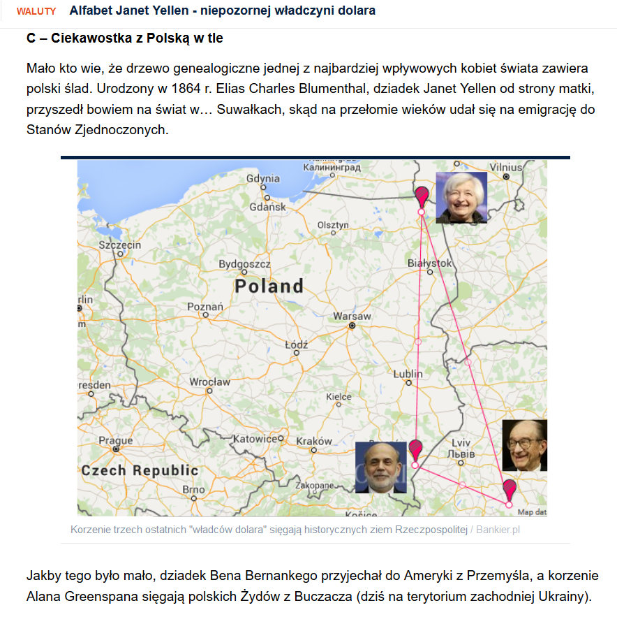
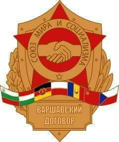
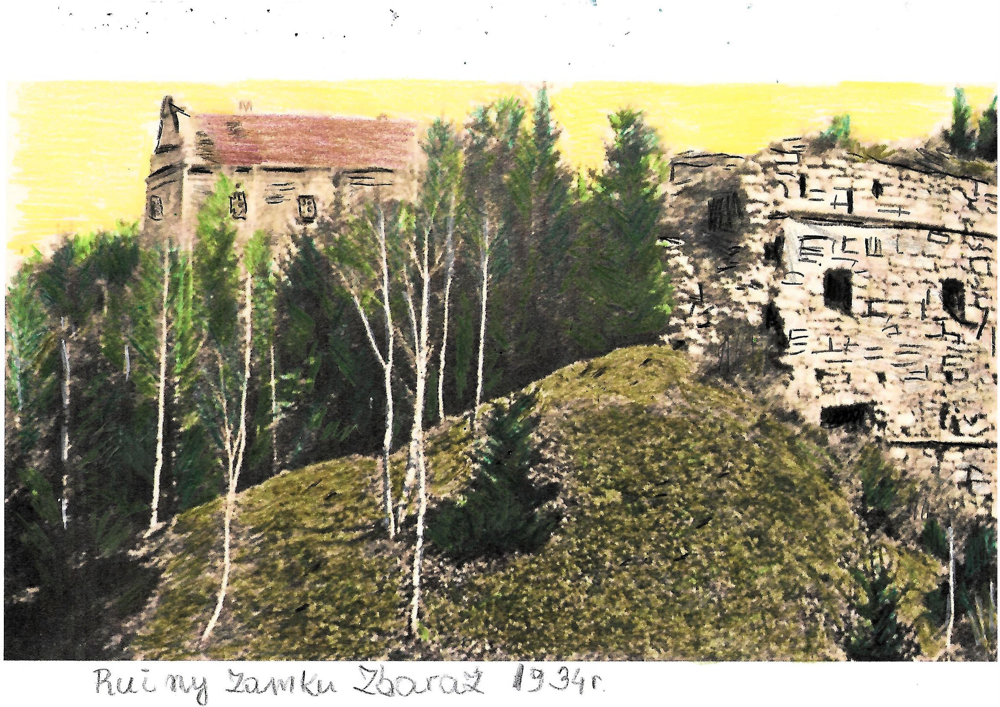

### 2022

  

  

  

### 2021

Morawiecki:

> Ze względu na to, że mamy w Polsce jak i w całej Europie dość silny ruch antyszczepionkowy, to chcemy wspólnie z opozycją wystąpić z pewną ustawą, która pozwoliłaby pracodawcom na sprawdzanie zaszczepienia pracowników, bez wyciągania konsekwencji.

  

---

Komisja Europejska przeciwko Bożemu Narodzeniu. Ujawniono skandaliczny dokument

Nowy wewnętrzny dokument, do którego dotarł włoski portal Il Giornale nosi nazwę "Union Of Equality". Wynika z niego, że eurokraci w ramach "polityki integracyjnej" zamierzają walczyć z obecnością świąt Bożego Narodzenia w przestrzeni publicznej.
Komisja Europejska podkreśla konieczność unikania "uznania kogokolwiek za chrześcijanina”. Autorzy dokumentu tłumaczą to faktem, że nie każdy obchodzi święta Bożego Narodzenia.
W imię polityki równości Komisja Europejska atakuje Boże Narodzenie, zachęcając jednocześnie, aby w trakcie rozmów nie używać zwrotów kojarzących się z chrześcijaństwem.
Komisja posuwa się do tego, że odradza nawet używanie imion chrześcijańskich. "Dlatego zamiast »Maria i Giovanni są parą międzynarodową«, musimy powiedzieć »Malika i Giulio są parą międzynarodową«" – czytamy na portalu Il Giornale.
Aby spełnić równościowe standardy Komisja zaleca wprowadzenie szeregu kuriozalnych zasad uderzających w międzyludzkie stosunki już na poziomie języka. Np. zabronione jest używanie zwrotu „Panna lub Pani”, jak również zabrania się rozpoczynania konferencji od zwrotu w stronę publiczności „Panie i panowie”. Ponadto wykluczone jest organizowanie dyskusji z przedstawicielami tylko jednej płci.
Dodatkowo wybierając „obrazy towarzyszące komunikacji", należy się upewnić, że obecne na nich kobiety i dziewczęta "nie są pokazane w domu lub w pasywnych rolach, podczas gdy mężczyźni są aktywni i żądni przygód”.

---

Szef Fed powiedział, że to jest ten moment, w którym trzeba pożegnać się z określeniem "przejściowa" w odniesieniu do inflacji. Na rynku walutowym trwają uroczystości pożegnalne.

---

### 2020

The launch of the #Eth2 Beacon Chain is characteristic of the emergent, open-source ethos that attracts so many to Ethereum in the first place. More than 27,000 validators from around the globe are now participating in the new #Eth2 consensus model.

  

---

Congratulations to my friend Janet Yellen on her nomination as US Treasury Secretary. Her intelligence, tenacity and calm approach make Janet a trailblazer for women everywhere. I look forward to tackling yet again the global economic challenges we are facing, together.

  

  

Since 2008, USD money supply grew at a rate of 14% per year. Another way to look at it, is that your fiat saving lose half of its value every 5 years and 2 month.

### 2017

Miliarder i człowiek wielkiego serca. Zmarł potomek założyciela Merrill Lynch

Charles Merrill, filantrop i milioner, zmarł w Nowym Sączu. Miał 97 lat. Spadkobierca miliardowej fortuny żył skromnie, w czteropiętrowym bloku na jednym z nowosądeckich osiedli. Znany był jednak nie z sukcesów w biznesie, lecz z dobrego serca.

### 1980

Władze Związku Radzieckiego przekazały generałowi Tadeuszowi Hupałowskiemu i pułkownikowi Franciszkowi Puchale plany operacji "Sojuz 80", w ramach której oddziały Armii Czerwonej miały wkroczyć do Polski. Gotowość operacyjną wyznaczono na 8 grudnia 1980 roku. Do naszego kraju miało wejść 15 dywizji radzieckich, dwie czechosłowackie i jedna enerdowska. Dodatkowo miały je wspomagać cztery dywizje Wojska Polskiego.

  

### 1945

W Budach Petrykowskich w województwie mazowieckim funkcjonariusze Urzędu Bezpieczeństwa w Grójcu zamordowali trzech członków Polskiego Stronnictwa Ludowego- Zbigniewa Tadeusza Hanke, sędziego Sądu Grodzkiego w Grójcu i delegata Rządu na Kraj, który miał być wojewodą warszawskim; Bolesława Łukowskiego, kierownika Spółdzielni Rolniczo-Handlowej „Rolnik” i Tadeusza Liskiewicza, żołnierza AK i nauczyciela grójeckiego. Mord był ubeckim odwetem za próbę ataku grupy Ruchu Oporu Armii Krajowej na siedzibę grójeckiego UB przeprowadzoną 21 listopada 1945 roku.

Niedoszłą czwartą ofiarą ubeckiego odwetu był rolnik Józef Sikorski, który słysząc strzały, upadł, a później wygrzebał się z płytkiego grobu. To dzięki niemu prawda o zbrodni wyszła na jaw – zawiadomił władze PSL i złożył zeznanie przed sądem.

### 1942

Żandarmeria niemiecka dokonała pacyfikacji wsi Przewrotne w województwie podkarpackim. Powodem ukrywanie się w niej rodziny Żydów Celerów; 78 -letniej Marty Celer, jej synów Lejba i Srula oraz dwóch córek Gitli i Gnendli.
Niemcy otoczyli część wsi nazywaną Studzieniec, a także pobliski las, w którym ukrywali się wspomniani ludzie. Początkowo, przez zastraszanie niektórych mieszkańców próbowali zmuszać Polaków do podania miejsca ukrywania się Żydów. Wobec faktu, że próby te spełzly na niczym zdecydowali się na użycie psów tropiących, które szybko doprowadziły ich do poszukiwanych. Cześć z próbujących uciekać Celerów została zastrzelona. Byli to Lejb, Gitla i Srul. Staruszka Marta Celer została pojmana w znajdującym się w lesie schronie i doprowadzona do domu zabitego wcześniej gospodarza Adama Kaczora, z którego po przesłuchaniu ponownie została wywleczona do lasu, w miejsce z którego została zabrana, a w które w międzyczasie przeniesiono zwłoki jej zabitych dzieci, w tym ostatniej córki Gnendli. Oprawcy nie oszczędzili starszej kobiety. Polakowi Wojciechowi Organiściakowi nakazali wykopać dół, do którego najpierw wyrzucili ciała pierwszych ofiar, a na koniec ciało ich matki.
Nie poprzestano jednak na tym. W akcie zemsty patrol żandarmerii doprowadził pod wspomnianą już posesję Adama Kaczora grupę Polaków podejrzanych o pomaganie Żydom w ukrywaniu się i budowaniu leśnego schronu. Podejrzanym oznajmiono po polsku, że zostaną rozstrzelani za pomoc Żydom. Egzekucji dokonano pod pobliskim lasem.

### 1920

Ruiny zamku w Zbarażu.

Zbaraż to miasto w położone w dolinie rzeki Gniezny (dopływ Seretu). Prywatne miasto szlacheckie położone było w XVI wieku w województwie wołyńskim. Do 1945 roku należał do Polski. Od grudnia 1920 w II Rzeczpospolitej, województwie tarnopolskim, było siedzibą powiatu zbaraskiego. .Oblężenie zamku opisał Henryk Sienkiewicz w Ogniem i Mieczem. Obecnie w granicach Ukrainy.

Fotografia: Obraz m.Kowalsky, Ruiny Zamku Zbaraż 1934. Obraz wykonany w jednym egzemplarzu, tuszem, kredkami i ołówkiem

  

### 1918

Biało-czerwona "szachownica" stała się oficjalnie symbolem polskiego lotnictwa. Pierwszy raz symbol ten znalazł się na samolocie pilota myśliwskiego inżyniera Stefana Steca, który 15 listopada 1918 roku przyleciał z meldunkiem z oblężonego Lwowa do Warszawy. Wtedy to podpułkownik Hipolit Łossowski uznał, że "szachownica" spełnia wszelkie wymogi symbolu, którym mogłoby posługiwać się polskie lotnictwo.
W rozporządzeniu nr 38 wydanym 1 grudnia 1918 roku przez Szefa Sztabu Generalnego Wojska Polskiego czytamy:
" Samoloty Wojsk Polskich będą w przyszłości zaopatrzone w miejscach dotychczas obowiązujących znakiem kwadratowym szerokości 60 cm, dzielącym się na cztery równe pola. Lewe górne i prawe dolne pole będzie barwy karmazynowej, lewe dolne i prawe górne pole barwy białej".
W pózniejszych latach do "szachownicy " dodano biało-czerwoną obwódkę.

---

<a href="https://github.com/TomaszWaszczyk/historia.waszczyk.com/edit/master/src/content/december-1.md" target="_blank">Edytuj tę stronę dzieląc się własnymi notatkami!</a>
