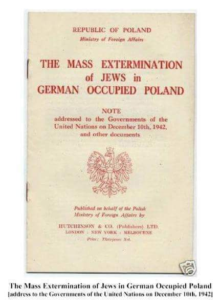

### 1942

Ppełniący obowiązki ministra spraw zagranicznych RP Edward Raczyński przedstawił aliantom szczególowy raport o Holokauście stworzony na podstawie dokumentów, które do Londynu przywiózł Jan Karski. Rząd Polski na Uchodźctwie liczył w ten sposób na to, że alianci, a zwłaszcza Stany Zjednoczone zareagują na to, co zostało im przekazane. Niestety skończyło się na niedowierzaniu w to, co opisał Karski i braku jakiejkolwiek reakcji. Raport Karskiego był pierwszym tego typu opisującym tragiczną sytuację nie tylko Żydów w Polsce, ale i w całej Europie. Trzeci punkt noty Raczyńskiego brzmiał:
" Ostatnie raporty przynoszą przerażający obraz sytuacji, w jakiej znaleźli się Żydzi polscy. Stosowane w ciągu ostatnich kilku miesięcy nowe metody masowych rzezi potwierdzają fakt, że władze niemieckie systematycznie dążą do całkowitej zagłady żydowskiej ludności Polski z Europy zachodniej i środkowej, a także z samej Rzeszy Niemieckiej. Rząd polski uważa za swój obowiązek zaznajomić rządy wszystkich cywilizowanych krajów z następującymi (…) informacjami, które ukazują aż nadzbyt wyraźnie nowe metody eksterminacji zastosowane przez władze niemieckie”

 

### 1956

Rada Państwa wydała dekret, na mocy którego w miejsce nazwy Stalinogród przywrócona została historyczna nazwa miasta Katowice.
Przypomnijmy, że Katowice nazwano Stalinogrodem 7 marca 1953 roku czyli zaledwie 2 dni po śmierci Józefa Stalina.
Warto też dodać, że chociaż oficjalnie autorem nazwy Stalinogród był Gustaw Morcinek, to prawda jest taka, że była ona wytworem wyobraźni samego Bolesława Bieruta, a Morcinek został zmuszony do podpisania się pod tym pomysłem. Inną ciekawostką jest fakt, że wszystkim chłopcom urodzonym w Katowicach w nocy z 7 na 8 marca 1953 roku nadano z urzędu trzecię imię Józef.

### 1905

W Stockholmie Henryk Sienkiewicz jako pierwszy polski pisarz odebrał z rąk króla Szwecji Literacką Nagrodę Nobla.
W potocznej świadomości Sienkiewicz otrzymał Nobla za powieść Quo vadis, tymczasem jury Akademii Szwedzkiej w Sztokholmie podało w werdykcie, że nagroda ta przypadła polskiemu pisarzowi: „za wybitne osiągnięcia w dziedzinie epiki i rzadko spotykany geniusz, który wcielił w siebie ducha narodu”

---

<a href="https://github.com/TomaszWaszczyk/historia.waszczyk.com/edit/master/src/content/december-10.md" target="_blank">Edytuj tę stronę dzieląc się własnymi notatkami!</a>
