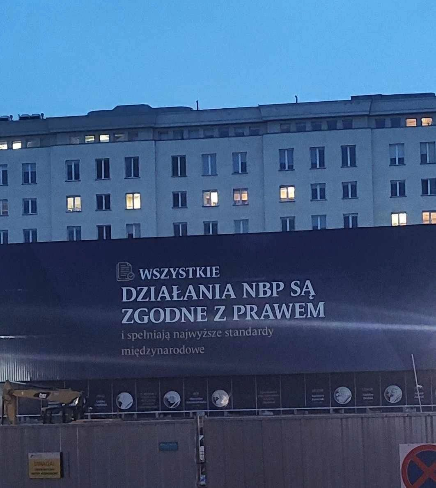
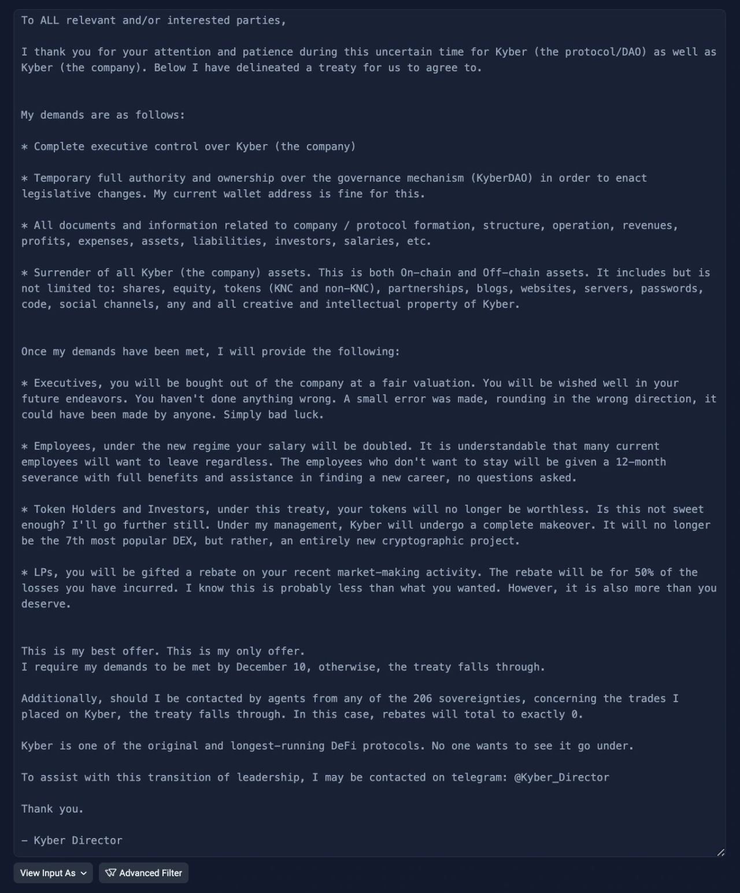
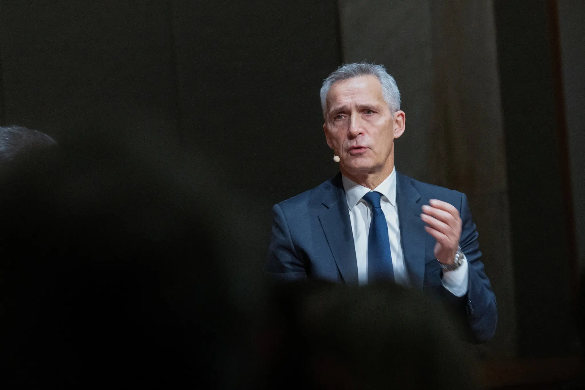
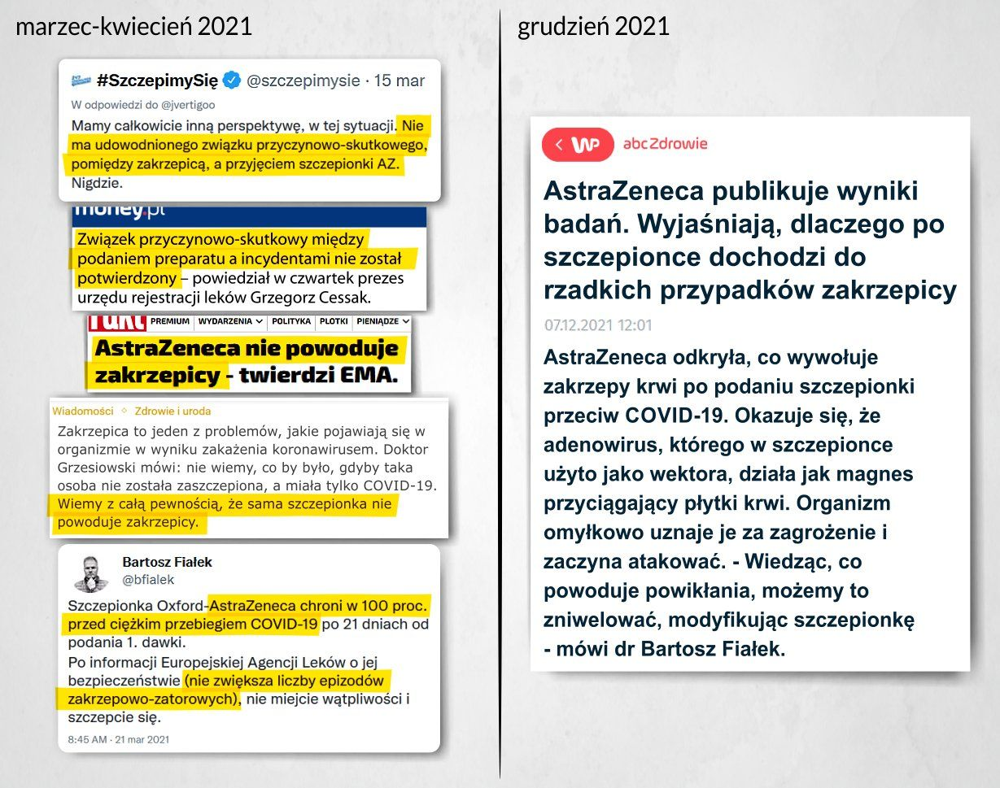
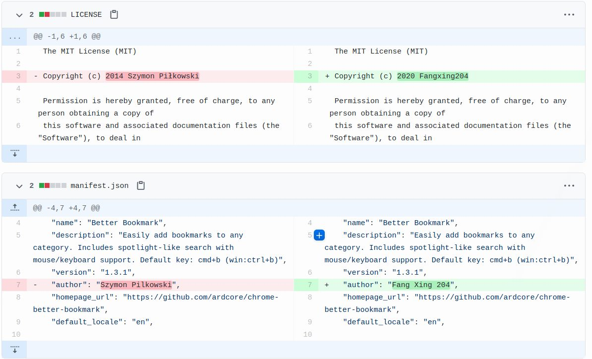
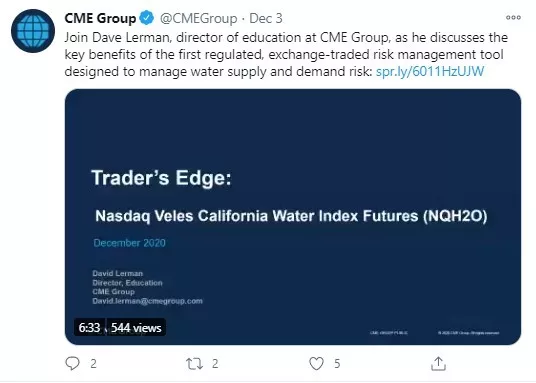
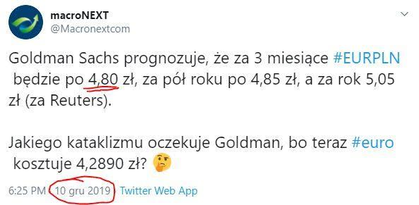

### 2023

  

<a href="https://aztec.network/blog/the-hunting-of-the-snark-1-3/" target="_blank">SNARK</a>

---

  

---

  

---

### 2022

NATO’s secretary general warns that a ‘full blown war’ with Russia is ‘a real possibility.’

“If things go wrong, they can go horribly wrong,” Jens Stoltenberg said in an interview published on Friday.

  

NATO’s secretary general warned on Friday that Russia’s war in Ukraine could expand into a wider war with the Atlantic alliance.

The official, Jens Stoltenberg, repeatedly cautioned in news media interviews this week against underestimating the situation in Ukraine and emphasized the wider threat President Vladimir V. Putin of Russia could pose to Europe.

“If things go wrong, they can go horribly wrong,” Mr. Stoltenberg said in an interview released on Friday with the Norwegian journalist Anne Lindmo, in which he added that there was “no doubt” a full-blown war against NATO was a “real possibility.”

“I understand everyone who is tired of supporting Ukraine. I understand everyone who thinks that food prices and the electricity bills are far too high,” he said. “But we have to pay a much higher price if our freedom and peace are threatened through Putin winning in Ukraine.”

Mr. Stoltenberg’s comments came two days after he said that Russia was intentionally stalling the war in order to prepare a renewed onslaught against Ukrainian forces next year.

“What we see now is that Russia is actually attempting to have some kind of ‘freeze’ of this war, at least for a short period of time, so they can regroup, repair, recover, and then try to launch a bigger offensive next spring,” he told The Financial Times on Wednesday.

### 2021

  

  

### 2020

  

---

Bloomberg has reported that CME Group—the platform that was the first to launch Bitcoin futures—is to start trading futures contracts on water this week.

These futures are expected to help major users of water—such as farmers and firefighters—manage risk and manage the water supply and demand better.

  

---

### 2019

 

### 1942

Ppełniący obowiązki ministra spraw zagranicznych RP Edward Raczyński przedstawił aliantom szczególowy raport o Holokauście stworzony na podstawie dokumentów, które do Londynu przywiózł Jan Karski. Rząd Polski na Uchodźctwie liczył w ten sposób na to, że alianci, a zwłaszcza Stany Zjednoczone zareagują na to, co zostało im przekazane. Niestety skończyło się na niedowierzaniu w to, co opisał Karski i braku jakiejkolwiek reakcji. Raport Karskiego był pierwszym tego typu opisującym tragiczną sytuację nie tylko Żydów w Polsce, ale i w całej Europie. Trzeci punkt noty Raczyńskiego brzmiał:
> Ostatnie raporty przynoszą przerażający obraz sytuacji, w jakiej znaleźli się Żydzi polscy. Stosowane w ciągu ostatnich kilku miesięcy nowe metody masowych rzezi potwierdzają fakt, że władze niemieckie systematycznie dążą do całkowitej zagłady żydowskiej ludności Polski z Europy zachodniej i środkowej, a także z samej Rzeszy Niemieckiej. Rząd polski uważa za swój obowiązek zaznajomić rządy wszystkich cywilizowanych krajów z następującymi (…) informacjami, które ukazują aż nadzbyt wyraźnie nowe metody eksterminacji zastosowane przez władze niemieckie.

After the fall of France in 1940, the Polish Government-in-exile relocated from Paris to London. There, they continued to communicate with the Warsaw based resistance (known as the Home Army or Armia Krajowa) through a system of clandestine couriers.

The most notable of these couriers was a 26-year-old former Polish Cavalry Officer named Jan Karski.

Karski is most remembered for the eyewitness testimony he delivered to President Roosevelt in July 1943 on conditions facing the Jews of Poland. After 35 years of silence, Karski agreed to the following interview.

 

### 1956

Rada Państwa wydała dekret, na mocy którego w miejsce nazwy Stalinogród przywrócona została historyczna nazwa miasta Katowice.
Przypomnijmy, że Katowice nazwano Stalinogrodem 7 marca 1953 roku czyli zaledwie 2 dni po śmierci Józefa Stalina.
Warto też dodać, że chociaż oficjalnie autorem nazwy Stalinogród był Gustaw Morcinek, to prawda jest taka, że była ona wytworem wyobraźni samego Bolesława Bieruta, a Morcinek został zmuszony do podpisania się pod tym pomysłem. Inną ciekawostką jest fakt, że wszystkim chłopcom urodzonym w Katowicach w nocy z 7 na 8 marca 1953 roku nadano z urzędu trzecię imię Józef.

### 1905

W Stockholmie Henryk Sienkiewicz jako pierwszy polski pisarz odebrał z rąk króla Szwecji Literacką Nagrodę Nobla.
W potocznej świadomości Sienkiewicz otrzymał Nobla za powieść Quo vadis, tymczasem jury Akademii Szwedzkiej w Sztokholmie podało w werdykcie, że nagroda ta przypadła polskiemu pisarzowi: „za wybitne osiągnięcia w dziedzinie epiki i rzadko spotykany geniusz, który wcielił w siebie ducha narodu”

---

<a href="https://github.com/TomaszWaszczyk/historia.waszczyk.com/edit/master/src/content/december-10.md" target="_blank">Edytuj tę stronę dzieląc się własnymi notatkami!</a>
