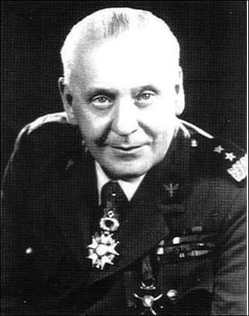
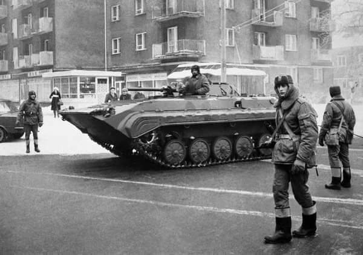
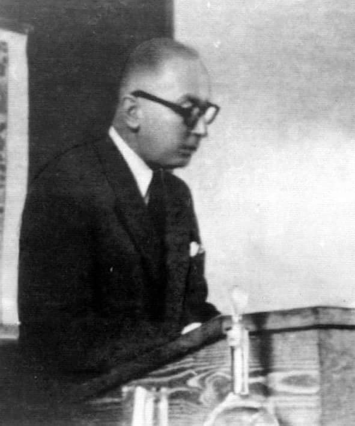
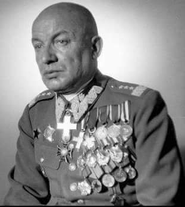
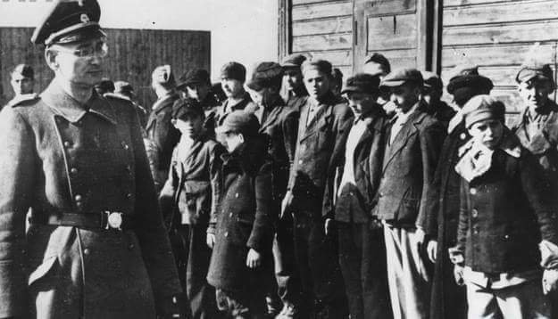
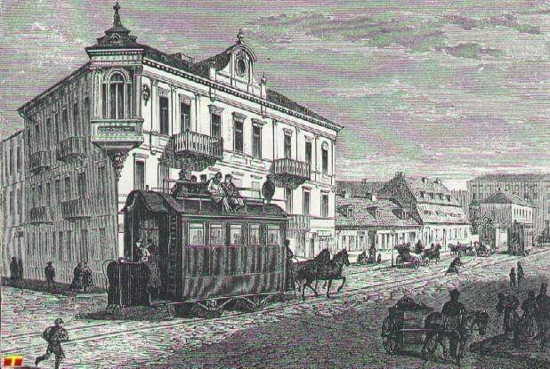
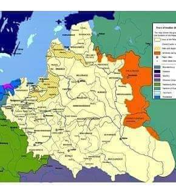

### 2019

<video width="640" height="480" controls>
  <source src="./img/december/rosna-ceny.mp4" type="video/mp4">
Your browser does not support the video tag.
</video>

### 2001

Chiny przystępują do WTO

### 1994

> Żołnierz polski walczy o wolność wszystkich narodów, ale umiera tylko dla Polski

generał broni Stanisław Maczek

1994 roku w Edynburgu zmarł Stanisław Maczek - generał broni Wojska Polskiego, honorowy obywatel Holandii, Kawaler Orderu Orła Białego; w latach 1938-39 dowódca 10 Brygady Kawalerii Zmotoryzowanej; organizator i dowódca: 10 Brygady Kawalerii Pancernej (1940), 1 Dywizji Pancernej (1942-45); dowódca 1 Korpusu Polskiego w Szkocji; autor książki ,,Od podwody do czołga''.

 

### 1981

Władze PRL podjęły decyzję o wyznaczeniu tak zwanej godziny "G". Tym samym rozpoczęło się przemieszczanie oddziałów wojska.
Poniżej fragment artykułu Krzysztofa Czabańskiego pt Czy będzie wojna domowa", który ukazał się w Tygodniku Solidarność 11 grudnia 1981 roku.
"Władza może pokazać swoje zdecydowanie. Na skrzyżowaniach staną czołgi, patrole policyjne i wojskowe wyroją się na ulicach. Ale karabin nie zastąpi reformy gospodarczej ani nie zapełni pustych półek w sklepach. Karabin w ogóle niczego sensownego nie załatwi. A żadne rozmowy władza - społeczeństwo nie będą już możliwe. Strajk generalny jaki wówczas wybuchnie, uwidoczni próżnię społeczną wokół sił przemocy. Wtedy okaże się, czy są dwie strony (i wojna domowa), czy strona - jak twierdzę - jest tylko jedna, a ci, którzy postawią na przemoc sami w ten sposób usuną się z życia kraju"

 

---

Komendanci wojewódzcy Milicji Obywatelskiej otrzymali specjalny szyfrogram, w którym kierownictwo Ministerstwa Spraw Wewnętrznych nakazywało podjęcie "aktywnej kontroli najważniejszych figurantów akcji "Jodła". Tego samego dnia Naczelnik Wydziału Śledczego Komendy Głównej Milicji Obywatelskiej w Warszawie podpułkownik Adam Adamski wystosował pismo do Wydziału III Komendy Stołecznej Milicji Obywatelskiej, w którym czytamy:
"Uprzejmie informuję, że niżej wymienieni pracownicy Waszego Wydziału realizować będą jako kierownicy grup następujących figurantów (...) Proszę o natychmiastowe sprawdzenie dojścia do w/wym. adresów zamieszkiwania figurantów po dokonaniu ich lustracji w godzinach nocnych". W normalnej polszczyźnie znaczy to tyle, że każdemu przeznaczonemu do internowania przydzielono funkcjonariusza milicji, który ma kierować grupą dokonującą aresztowania.
Swój aktywny udział w przygotowaniach do wprowadzenia stanu wojennego miał również minister obrony narodowej generał Florian Siwicki, który w tym samy czasie, na polecenie generała Wojciecha Jaruzelskiego zwrócił się z prośbą do naczelnego dowódcy Wojsk Układu Warszawskiego marszałka Wiktora Kulikowa o udzielenie odpowiedzi na pytania zadane przez generała Mirosława Milewskiego, które brzmiały:

1. Prosimy, aby przyjechał do nas ktoś z przywództwa partii. Kto i kiedy?

2. Wydać oświadczenie popierające nas (...)

3. Czy możemy liczyć na pomoc ZSRR po linii wojskowej (uzupełniające wprowadzenie wojsk)?
Generał Siwicki niemal sam poddał w wątpliwość chęć rozwiązania sprawy przez Sowietów, stwierdzając "Pozostała jedna doba do wielkich spraw, a nikt z radzieckiego kierownictwa nie wnosi jasności. Nie możemy iść na awanturę, jeśli towarzysze radzieccy nas nie wspomogą". Na co Kulikow odpowiedział "Macie siły i wiecie o tym. Stan wojenny jest dobrze przygotowany i nie trzeba mówić o żadnej awanturze".

### 1970

Na posiedzeniu Biura Politycznego Komitetu Centralnego Polskiej Zjednoczonej Partii Robotniczej zatwierdzono uchwałę Rady Ministrów o zmianie cen detalicznych. Dzień pózniej na popołudniowych zebraniach Podstawowych Organizacji Partyjnych odczytano protokół następującej treści: " "Podwyżki cen na szereg artykułów powszechnego użytku nie mogą być, z natury rzeczy, przyjmowane z zadowoleniem przez masy pracujące. Chodzi o to, aby zostały przyjęte ze zrozumieniem. To właśnie ma na celu niniejszy list. Najważniejszym
więc zadaniem stojącym przed wszystkimi
czlonkami partii i przed organizacjami partyjnymi w obecnej chwili, jest właściwe wyjaśnienie wszystkim ludziom pracy przyczyn i słusznych celów, jakimi powodowała się partia i rząd podejmując te doniosłe decyzje".
Prawdopodobnie władza spodziewała się gwałtownej reakcji społeczeństwa,ponieważ w stan gotowości bojowej postawiono wszystkie służby podległe Ministerstwu Spraw Wewnętrznych.

### 1949

Podczas przesłuchania w areszcie Ministerstwa Bezpieczeństwa Publicznego na ulicy Koszykowej w Warszawie zamordowany został profesor Marian Piotr Grzybowski (zdjęcie) światowej sławy lekarz medycyny, dermatolog, wenerolog. Był autorem badań nad patogenezą bielactwa i mięsaków, prezesem Polskiego Związku Przeciwwenerycznego, kapitanem rezerwy Korpusu Sanitarnego CWSan. W czasie wojny na Tajnym Studium Lekarskim prowadził wykłady ze studentami medycyny. Przed wybuchem Powstania Warszawskiego jako członek Armii Krajowej na polecenie odpowiedniej jednostki AK zorganizował w prowadzonej przez siebie klinice dermatologicznej magazyn leków, materiałów opatrunkowych oraz broni. W czasie Powstania Warszawskiego przeżył ewakuację tej kliniki wraz z chorymi, rannymi i personelem do obozu w Pruszkowie.

 

### 1946

Zakończył się trwający od 23 listopada 1946 roku proces członków Komendy Głównej Narodowych Sił Zbrojnych i Organizacji Polskiej. Aresztowanych oskarżono o współpracę z Niemcami, działalność nielegalną, pracę wywiadowczą na rzecz ,,obcego mocarstwa", zorganizowanie ,,trójek antykomunistycznych" oraz ,,zbrodniczą działalność skierowaną przeciwko Polsce Ludowej". Kilku działaczy NSZ zostało skazanych na śmierć. Wyroki wykonano.
Tego samego dnia " Głos Ludu " pisał:
„Szkodniki i szkodnicy niszczą nam kraj, a Pan Mikołajczyk uprawia opozycję (...).
Dla Pana Mikołajczyka główna rzecz to nie myszy i pomór, główna rzecz to wybory, które usuną wszystkie trudności, w tej liczbie myszy i zarazę stadniczą. Pan Mikołajczyk nie mobilizuje podległego mu aparatu do walki ze szkodnikami i chorobami, pan Mikołajczyk mobilizuje siły do walki z podstawami ustroju społeczno-gospodarczego, który chłopu dał ziemię i pomoże mu w stworzeniu dobrobytu”.

### 1944

Generał Karol Świerczewski (zdjęcie) zatwierdził wyrok śmierci wydany 5 grudnia 1944 roku przez Sąd Wojskowy Garnizonu Lubelskiego na Jana Piwko, żołnierza Armii Krajowej. Oskarżono go o przynależność do Armii Krajowej -organizacji mającej na celu obalenie demokratycznego ustroju Państwa Polskiego" oraz o udzielanie schronienia w swoim mieszkaniu innemu "terroryście z AK".
Wyrok wykonano 14 grudnia 1944 roku.

 

### 1942

Do utworzonego 10 dni wcześniej Polen Jugendverwahrlager (obozu dla polskich dzieci) przybył pierwszy transport małych więzniów. Obóz nazywany "Małym Oświęcimiem" stał się miejscem cierpień kazni dzieci w wieku od 8 do 16 lat ,ale wiadomo dziś,że trafiały tam nawet dwulatki.
Według założeń Polen Jugendverwahrlager miał funkcjonować jako placówka "resocjalizacyjna" dla polskiej młodzieży dopuszczającej się napadów i kradzieży. W rzeczywistości zaś można tam było trafić nawet za brak ważnego biletu tramwajowego lub gdy rodzice nie zgodzili się na podpisanie volkslisty.
Obóz istniał do 18 stycznia 1945 roku,kiedy to Niemcy uciekli, pozostawiając otwartą bramę. Niektóre dzieci opuściły wtedy obóz w poszukiwaniu jedzenia i pomocy. Jednak większość została w barakch.
Wystraszone, chore i głodne maluchy odnaleźli
Sowieci, którzy wkroczyli 19 stycznia. Naprędce zorganizowano pogotowie opiekuńcze, gdzie trafiło 233 dzieci. Z 12 tysięcy więzionych tu dzieci końca wojny doczekało 900.

 

### 1941

Polska jedyny raz w historii XX wieku wypowiedziała wojnę obcemu państwu. Krajem tym było geograficznie dla nas odległe Cesarstwo Japonii. Jedną z pryczyn tego kroku był japoński atak na bazę Marynarki Amerykańskiej w Pearl Harbour, co sprawiło,że tocząca się do tej pory jedynie w Europie wojna stała się konfliktem na skalę globalną. Władze Japonii, które uznały, że wypowiedzenie to zostało dokonane pod presją władz brytyjskich , nie przyjęły go. Oficjalnie koniec wojny polsko-japońskiej nastąpił 8 lutego 1957 roku, kiedy to polski wiceminister spraw zagranicznych Józef Winiewicz i ambasador Japonii Kase Toshikazu podpisali porozumienie o normalizacji stosunków polsko-japońskich.

### 1866

W Warszawie pod nazwą "Żelazna droga" uruchomiono pierwsze połączenie tramwajowe obsługiwane przez tramwaj konny. Połączyła ona Dworce Kolei Wiedeńskiej i Kolei Petersburskiej.
Koncesję na budowę linii tramwajowej
wydał rząd carski Towarzystwu Kolei Żelaznych Rosyjskich. Dzięki temu podległe jemu Towarzystwo Drogi Żelaznej Warszawsko- Petersburskiej na własny koszt wybudowało linię jednotorową, z mijankami i odgałęzieniami, o łącznej długości 7600 metrów.
Czasopismo "Kłosy "tak opisywało funkcjonowanie tej linii: "Ozdobne wagony z głównej stacji na Krakowskim Przedmieściu sprzed gmachu Resursy Obywatelskiej odchodzą co pół godziny na Pragę
i do Dworca Drogi Żelaznej Warszawsko-
Wiedeńskiej".

 

### 1772

W Larbert w Szkocji urodził się John Baildon (grafika) hutnik, przemysłowiec, inżynier.
Chociaż był Szkotem to jego życiorys mocno splata się z historią naszego kraju. Jako 21-letni chłopak przybył do Tarnowskich Gór na zaproszenie dyrektora Wyższego Urzędu Górniczego we Wrocławiu Friedricha Wilhelma von Redena, który powierzył mu stanowisko doradcy technicznego przy budowie Królewskiej Odlewni Żelaza w Gliwicach. Brał również udział przy konstrukcji i odlewie najstarszego na kontynencie europejskim mostu żelaznego nad Strzegomką w Łażanach na Dolnym Śląsku. Łuki nośne mostu zostały odlane w zakładach hutniczych Mała Panew i ustawione wiosną 1796 roku. Pod koniec lat 90-tych XVIII wieku opracował projekt Królewskiej Huty w Chorzowie, która uruchomiona została w 1802 roku i była najnowocześniejszą hutą w ówczesnej Europie. Baildon był również projektantem Kanału Kłodnickiego oraz Głównej Sztolni Dziedzicznej, inwestycji, które miały służyć do transportu drogą wodną węgla z kopalń Królowa Luiza w Zabrzu i Król w Królewskiej Hucie. Zmarł 7 sierpnia 1846 roku w Gliwicach.

### 1618

W Dywilinie w powiecie dmitrowskim w gubernii moskiewskiej Polska i Rosja zawarły rozejm kończący trwającą dziewieć lat wojnę. W jej trakcie Polacy zdobyli Moskwę i zmusili cara Wasyla Szujskiego do oddania hołdu królowi Zygmuntowi III Wazie. Rosja została też zmuszona do oddania Polsce Ziemi Czernichowskiej, a Wielkiemu Księstwu Litewskiemu-Smoleńszczyzny.
W wyniku tego ówczesne terytorium Polski stało się największym w całej jej historii.

 

---

<a href="https://github.com/TomaszWaszczyk/historia.waszczyk.com/edit/master/src/content/december-11.md" target="_blank">Edytuj tę stronę dzieląc się własnymi notatkami!</a>
