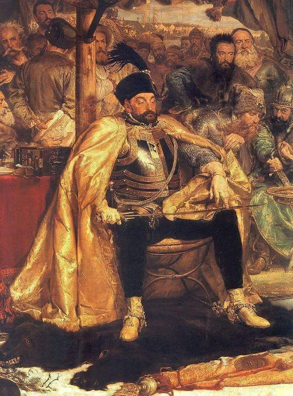

### 2019

"Mijający rok jest trudnym okresem dla polskiej giełdy, a najpoważniejszym ciężarem dla indeksów GPW są spółki kontrolowane przez Skarb Państwa. Jak wynika z wyliczeń Bankier.pl, wartość tych największych spadła w ostatnim roku aż o 49 mld zł".

"Wszystkie powyższe argumenty składają się na jeden wniosek - WIG20 prezentuje się w tym roku fatalnie, a wyznaczone we wtorek minima są tego najlepszym dowodem. Tyle, że sam indeks, to aż 20 spółek, a każda z nich to w pewnym sensie inna historia. Niektóre radzą sobie lepiej, niektóre gorzej, niektóre stanowią zaś ogromny ciężar dla indeksu. Różnicę widać m.in. przy podziale spółek według ich głównych akcjonariuszy. Obecnie w składzie WIG20 jest jedenaście spółek kontrolowanych przez polski Skarb Państwa, dziewięć zaś znajduje się poza jego kontrolą (są to w zasadzie spółki prywatne, choć wyjątkiem jest Orange kontrolowana de facto przez francuski rząd). Kryterium podległości polskiemu Skarbowi Państwa dzieli więc indeks w zasadzie na pół (11:9)".

"Takie porównanie wypada druzgocąco dla firm kontrolowanych przez polski rząd. Przez ostatnie dwanaście miesięcy stopa zwrotu z notowanych w WIG20 spółek Skarbu Państwa wyniosła -18,2 proc., tymczasem pozostałe 9 spółek wchodzących w skład indeksu urosło zaś o 12,7 proc. To zatem Skarb Państwa w 2019 roku zatapia WIG20 i to "zasługą" kontrolowanych przez rząd spółek są ostatnie minima".

### 1586

W Grodnie zmarł zasiadający przez 10 lat na polskim tronie król Stefan Batory (grafika).
Był drugim po Henryku Walezym królem elekcyjnym. Dał się poznać jako dobry organizator, który zreformował armię, pokonał Rosję w wojnie o Inflanty,a także zreformował husarię.
Batory został pochowany na Wawelu.

 

---

<a href="https://github.com/TomaszWaszczyk/historia.waszczyk.com/edit/master/src/content/december-12.md" target="_blank">Edytuj tę stronę dzieląc się własnymi notatkami!</a>
