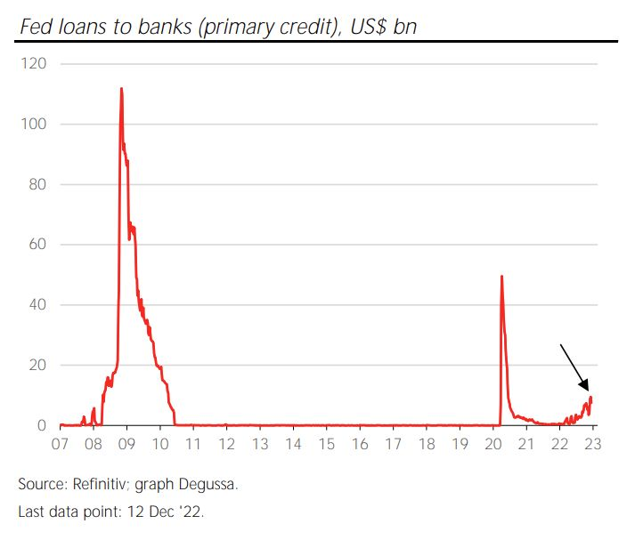
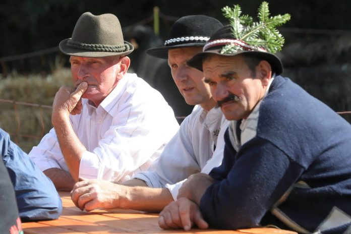
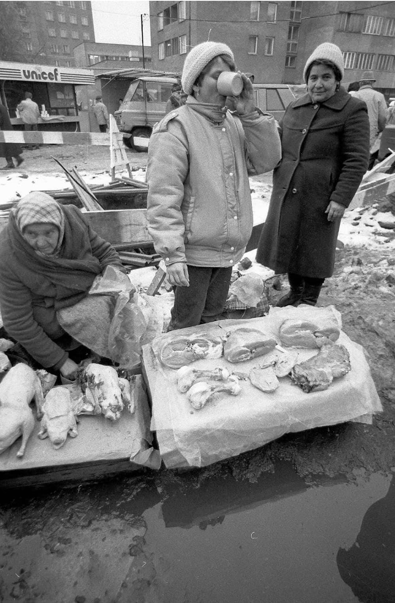
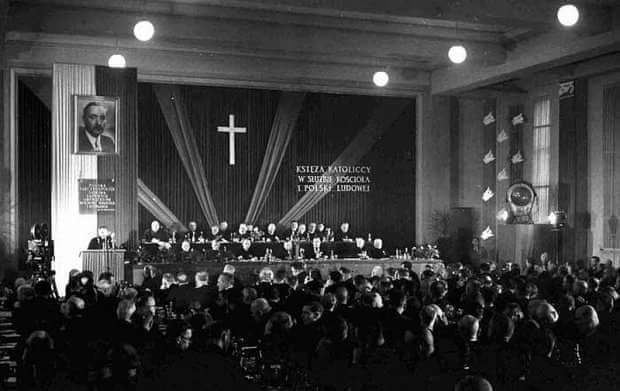

### 2022

  

---

Mohammed bin Salman saying goodbye to President Xi after 3 days of meetings.

Time will tell, but judging from the cold and humiliating reception of Biden, and the extremely warm reception of China, the US is no longer a close Saudi ally…

---

Dr Zbigniew Martyka o szczepieniach malutkich dzieci preparatem na COVID-19. 

"Twarde dane naukowe mówią, że możliwość ciężkiego przebiegu u dzieci jest praktycznie znikoma. To jest 0,27% na 100 tys. dzieci"

---

"Zależy nam również na tym, by jak najwięcej Polaków było przeszkolonych, sprawa ćwiczeń rezerwistów to ułamek całości" - przekonywał szef MON Mariusz Błaszczak.

W poniedziałek w wykazie prac legislacyjnych Rady Ministrów został opublikowany projekt rozporządzenia MON, w którym przewidziano powołanie maksymalnie 200 tys. osób na ćwiczenia. Z tej liczby limit 38 tys. dotyczy żołnierzy rezerwy oraz osób, które mają uregulowany stosunek do służby wojskowej (tj. odbyli służbę lub szkolenie wojskowe), a limit 28 580 osób w ramach dobrowolnej zasadniczej służby wojskowej, w tym w trakcie kształcenia.

Błaszczak był pytany w Programie Pierwszym Polskiego Radia w jakim celu mają odbywać się ćwiczenia w takiej skali i czy jest to "wprowadzanie zasadniczej służby wojskowej tylnymi drzwiami".

- "Nie, nie jest. My jesteśmy w takim położeniu, że przy naszej wschodniej granicy toczy się wojna, która ma charakter bezwzględny (...) Rząd PiS wzmacnia wojsko, a żeby wzmocnić wojsko, należy rozwinąć je liczebnie i wyposażyć w nowoczesną broń, i to konsekwentnie robimy - odpowiedział. - Zależy nam na tym również, by jak najwięcej osób było przeszkolonych. W mediach rzeczywiście uwypuklona była sprawa ćwiczeń rezerwistów, ale to jest naprawdę ułamek" - dodał.

Błaszczak podkreślał, że rząd mówi otwarcie o zagrożeniach dla kraju, związanych z rosyjską agresją. Mówił, że jeżeli Władimir Putin wygrałby wojnę w Ukrainie, to nie będzie się wówczas wahać, by zaatakować państwa NATO, chyba, że - jak podkreślił - "wykorzystamy ten czas, który mamy do tego, by zbudować silne wojsko polskie, przeszkolić jak najwięcej ludzi z umiejętności posługiwania się bronią, umiejętności niesienia pierwszej pomocy medycznej".

---

### 2020

Oracle Moves Headquarters to Texas, Joining Valley Exodus

Oracle Corp. said it has moved its headquarters to Texas, from its home state of California to give employees more flexibility on where they do their jobs.

The move to Austin from Redwood City “means that many of our employees can choose their office location as well as continue to work from home part time or all of the time,” Oracle said Friday in a regulatory filing. The company will continue “to support” its other U.S. office locations in Santa Monica, California, Seattle, Denver, Orlando and Burlington, Massachusetts, according to the filing.

  

---

Gminy górskie: dajcie nam pracować, nasze firmy i miejscowości umierają bez turystów

Zrobimy wszystko, jeszcze sami zaostrzymy reżim sanitarny, żeby tylko rząd pozwolił nam pracować.
Samorządowcy wnosili, by chociaż ozdrowieńcy, których jest w Polsce ogromna liczba, mogli do nich przyjechać. Na konferencji przekonywali, że lockdown zabije ich miejscowości. Wskazali, jako przykład, Bukowinę Tatrzańską, gdzie 73 procent przychodów branży turystycznej pochodzi z sezonu zimowego, a prognozowany spadek na sezon 2020/2021 wynosi już 79 procent.
Mamy monokulturę, nie możemy zdywersyfikować przychodów. W takich miejscowościach jak Świeradów Zdrój czy Szczyrk 80-90 procent mieszkańców teraz nie pracuje. A przecież w normalnych warunkach płacą oni potężne podatki. Stąd nasza prośba, a raczej krzyk, o pomoc. Prosimy o solidarność, o wsparcie państwa.
Ani tarcza PFR, ani tarcza 6.0, którą zresztą nie objęto hoteli i obiektów noclegowych, nie wyrówna przedsiębiorcom strat. Rząd powinien je zrekompensować. A najlepiej pozwolić im pracować.
Zamykanie ludzi w domach i pozbawianie ich pracy budzi frustrację oraz napięcia w rodzinach, co może prowadzić do tragedii.

  

---

### CME Launches Water Futures as Water Could Become as Scarce as Bitcoin

---

### 2019 - czas na.. wzrosty?

"Mijający rok jest trudnym okresem dla polskiej giełdy, a najpoważniejszym ciężarem dla indeksów GPW są spółki kontrolowane przez Skarb Państwa. Jak wynika z wyliczeń Bankier.pl, wartość tych największych spadła w ostatnim roku aż o 49 mld zł".

"Wszystkie powyższe argumenty składają się na jeden wniosek - WIG20 prezentuje się w tym roku fatalnie, a wyznaczone we wtorek minima są tego najlepszym dowodem. Tyle, że sam indeks, to aż 20 spółek, a każda z nich to w pewnym sensie inna historia. Niektóre radzą sobie lepiej, niektóre gorzej, niektóre stanowią zaś ogromny ciężar dla indeksu. Różnicę widać m.in. przy podziale spółek według ich głównych akcjonariuszy. Obecnie w składzie WIG20 jest jedenaście spółek kontrolowanych przez polski Skarb Państwa, dziewięć zaś znajduje się poza jego kontrolą (są to w zasadzie spółki prywatne, choć wyjątkiem jest Orange kontrolowana de facto przez francuski rząd). Kryterium podległości polskiemu Skarbowi Państwa dzieli więc indeks w zasadzie na pół (11:9)".

"Takie porównanie wypada druzgocąco dla firm kontrolowanych przez polski rząd. Przez ostatnie dwanaście miesięcy stopa zwrotu z notowanych w WIG20 spółek Skarbu Państwa wyniosła -18,2 proc., tymczasem pozostałe 9 spółek wchodzących w skład indeksu urosło zaś o 12,7 proc. To zatem Skarb Państwa w 2019 roku zatapia WIG20 i to "zasługą" kontrolowanych przez rząd spółek są ostatnie minima".

---

Francuska firma Veolia, która kontroluje sieć ciepłowniczą w Gdańsku i Warszawie, zanotowała w 2018 roku wzrost zysku netto o 11%. Jej prezes zarobił ''tylko''... ponad 2 mln Euro. W Polsce Veolia była wcześniej znana z wożenia Adamowicza i kolegów z Urzędu Miasta Gdańska na wycieczki do Madrytu.

### 2015

https://en.wikipedia.org/wiki/Paris_Agreement

### 1989

Tak wyglądał wówczas handel mięsem przed halą. I ludzie żyli bez unijnych zakazów. Nikt się nie przejmował.

  

### 1952

W Warszawie odbył się zorganizowany przez Ministerstwo Bezpieczeństwa Publicznego zjazd księży patriotów- części duchowieństwa popierającej działania władz komunistycznych.
1500 obradujących księży potępiło Episkopat Polski oraz kardynała Stefana Wyszyńskiego, który w odpowiedzi zagroził atakującym go księżom ekskomuniką.

 

### 1942

Do niemieckiego obozu koncentracyjnego KL Auschwitz trafiła 14-letnia Czesia Kwoka. Zamordowana przez Niemców 3 miesiące później fenolem za to, że była polskim dzieckiem!

### 1671

> Polska z Turcją walczyła a finalnie korzystali Habsburgowie i Rosjanie.

Sułtan Imperium Osmańskiego Mehmed IV wypowiedział wojnę Polsce.
Główną przyczyną wybuchu tego konfliktu było oddanie się Kozaków, pod wodzą hetmana Piotra Doroszenki w 1666 r. pod zwierzchnictwo Porty. Wojna wybuchła dopiero 6 lat od tego wydarzenia, bowiem Turcja była zamieszana w konflikt z Wenecją i Austrią. Pierwszym starciem wojsk polsko-tureckich była Bitwa pod Ładyżynem. Do najważniejszych wydarzeń tej kampanii należy m.in. zdobycie Kamieńca Podolskiego przez Turków. Porażka ta zmusiła Polskę do zawarcia traktatu w Buczaczu. Na jego mocy Rzeczypospolita musiała płacić haracz Turcji oraz wyrzec się części Ukrainy oraz Podola. Sejm polski nie ratyfikował tego traktatu i zorganizował armię, na czele której stanął hetman Jan Sobieski. Wojska pod jego dowództwem pokonały w 1673 roku siły tureckie pod Chocimiem. Wojnę zakończył dopiero traktat w Żurawnie w 1676 roku. Na jego mocy Rzeczypospolita uzyskała zwolnienie od haraczu oraz odzyskała część ziem utraconych 4 lata wcześniej w Buczaczu.

### 1586

W Grodnie zmarł zasiadający przez 10 lat na polskim tronie król Stefan Batory (grafika).
Był drugim po Henryku Walezym królem elekcyjnym. Dał się poznać jako dobry organizator, który zreformował armię, pokonał Rosję w wojnie o Inflanty,a także zreformował husarię.
Batory został pochowany na Wawelu.

 

---

<a href="https://github.com/TomaszWaszczyk/historia.waszczyk.com/edit/master/src/content/december-12.md" target="_blank">Edytuj tę stronę dzieląc się własnymi notatkami!</a>
