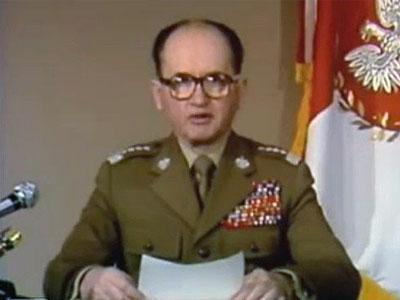
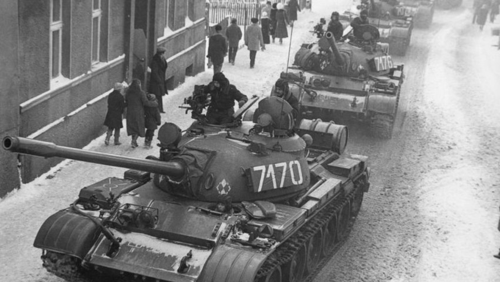
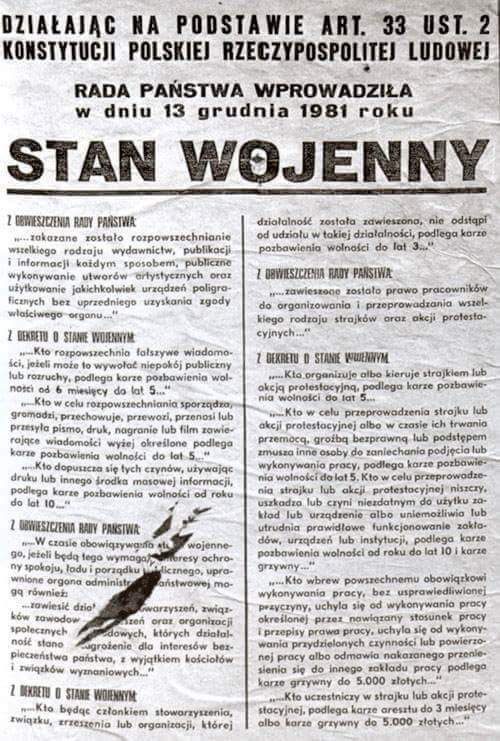
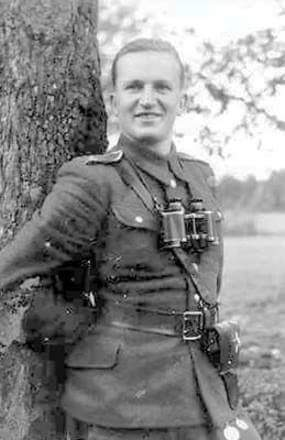
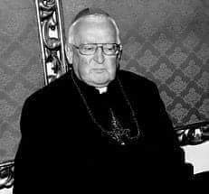
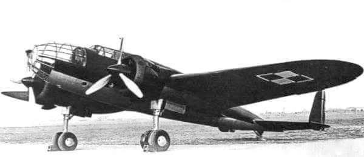
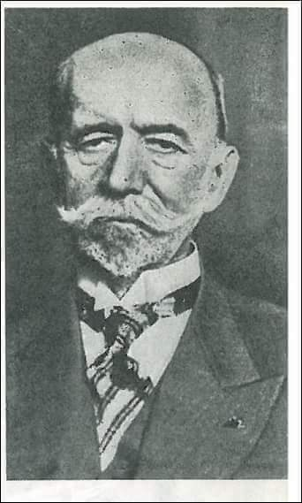

### 2019

#### Outcome WRC 2019 for 5G Spectrum

  

In total, 17.25 GHz of new spectrum has been identified for IMT, in addition to the 1.9 GHz IMT spectrum already available before WRC-19.

Out of this number, 14.75 GHz (i.e., 85% of total IMT spectrum) result harmonized worldwide Quite impressive numbers.

Let's see how successful FR2 with mmwave frequencies will be in practice with all its challenges. 

---

Szwedzka prokuratura zwróciła się do Sądu Rejonowego w Goeteborgu z wnioskiem o wydanie polskim władzom byłego stalinowskiego sędziego Stefana Michnika. Sąd ma wkrótce podjąć decyzję w tej sprawie - potwierdziła w piątek PAP w szwedzkiej Prokuraturze Krajowej.

Jak przekazała Ann-Sofie Adolfsson, wiceszefowa administracji wydziału ds. zwalczania przestępczości międzynarodowej Prokuratury Krajowej, wniosek został w czwartek wysłany do sądu w Goeteborgu. Nie ustalono jeszcze daty posiedzenia.

Prowadząca sprawę prokurator Ulrikę Bentelius Egelrud w dokumencie złożonym w sądzie pisze, że osoba, której dotyczy Europejski Nakaz Aresztowania (ENA) nie została przesłuchana ani nie doręczono jej tego wniosku.

Prokurator - co także jest zawarte we wniosku prokuratury - uważa jednocześnie, powołując się na przepisy prawne, że nie ma możliwości wydania Polsce Stefana Michnika. Zwraca ona uwagę na jego szwedzkie obywatelstwo oraz wystąpienie przedawnienia zarzucanych mu czynów, jakie mają być podstawą zastosowania ENA.

We wniosku Bentelius Egelrud dodaje, że już 4 lutego br. sąd rejonowy w Goeteborgu orzekł, że Stefana Michnika nie należy przekazywać Polsce. Prokurator podkreśla, że niektóre przestępstwa, o które oskarżony jest Michnik, wymienione były także we wcześniejszym ENA, w którym określono 30 czynów. Zwraca uwagę, że w aktualnym ENA polskie władze wymieniają 93 przestępstwa, jakich miał się dopuścić Michnik w latach 1952-1953.

### 1981

Wojskowa Rada Ocalenia Narodowego, na czele z gen. Wojciechem Jaruzelskim, wprowadziła w Polsce stan wojenny. Mając świadomość ogromnego poparcia społecznego dla „Solidarności” i związanego z tym zagrożenia dla swojej pozycji, komuniści postanowili użyć siły i rozprawić się z opozycją. Tego dnia złamano nadzieje milionów Polaków i na wiele lat odsunięto szansę na demokratyczne przemiany. Władza nie miała skrupułów, by strzelać do stawiających opór. Stan wojenny przyniósł tysiącom osób i ich rodzinom wielkie cierpienie – bestialskie pobicia i porwania, izolację w obozach internowania, uwięzienie, pozbawienie pracy, zaś dziesiątki niewinnych straciły życie. Symbolem zbrodni stanu wojennego stała się masakra w Kopalni „Wujek”.
Dziś #Lewica (postkomuniści i neokomuniśći) próbuje relatywizować tą zbrodnię. Jedno z ich głównych haseł brzmi "przywrócimy emerytury" funkcjonariuszom aparatu represji z PRLu.
Liczba ofiar reżimu Jaruzelskiego pozostaje nieznana. W latach 1981–1982 władze komunistyczne przetrzymywały w specjalnie utworzonych obozach dla internowanych 9736 osób. Niejednokrotnie dochodziło w nich do wypadków znęcania się psychicznego i fizycznego nad internowanymi. Komitet Helsiński odnotował 93 przypadki zgonów w latach 1981 - 1989. Komisja Rokity ustaliła 122 przypadki śmiertelne, z czego blisko 90 z udowodnionym poszlakowo udziałem funkcjonariuszy aparatu represji. IPN mówi o blisko 100 osobach zamordowanych w czasie trwania reżimu Jaruzelskiego.

https://13grudnia81.pl/

---

Rada Państwa na polecenie w Rady Ocalenia Narodowego podjęła uchwałę o wprowadzeniu stanu wojennego na całym terytorium Polskiej Rzeczpospolitej Ludowej. To posunięcie władz komunistycznych spowodowane było rosnącym niezadowoleniem społecznym,a także przybieraniem na sile opozycji, której głównym ośrodkiem był stworzony w 1980 roku Niezależny Samorządny Związek Zawodowy "Solidarnośc".
Komunistyczny rząd nie wywiązywał się z podpisanych w sierpniu 1980 roku w Gdańsku porozumień, co wywołało falę niepokojów społecznych, które właśnie za pomocą ingerencji wojskowej próbowano stłumić.
5 grudnia 1980 roku w Moskwie generał Wojciech Jaruzelski przedstawił Leonidowi Breżniewowi plany zorganizowania przez Wojsko Polskie wewnętrznej interwencji zbrojnej.
W lutym 1981 przeprowadzono „grę sztabową”
MON i MSW, której celem było przećwiczenie
różnych wariantów rozwoju sytuacji. Ustalono
wówczas, iż stan wojenny powinien być
poprzedzony odpowiednim przygotowaniem
propagandowym, a sama decyzja powinna być
powzięta na podstawie pretekstu, który
uzasadniłby opinii publicznej i międzynarodowej celowość jego wprowadzenia. Stwierdzono również konieczność ogłoszenia stanu wojennego
przed oczekiwaną mobilizacją NSZZ
„Solidarność” (przed rozpoczęciem strajku
powszechnego), oraz wprowadzenie go od
razu na terytorium całego kraju (z soboty na
niedzielę, aby utrudnić reakcję opozycji
związkowej).
13 grudnia 1981 roku oddziały ZOMO ,milicji i Służby Bezpieczeństwa przystąpiły do serii aresztowań czołowych działaczy Solidarności. Już pierwszego dnia stanu wojennego na ulice wyprowadzono 70 tysięcy żołnierzy, 30 tysięcy milicjantów, 1750 czołgów, 1400 pojazdów opancerzonych,9000 samochodów, 500 wozów bojowych oraz helikoptery. Półtorej godziny przed północą wyłączone zostały telefony, a o godzinie 9 rano telewizja nadała w miejsce Teleranka wystąpienie generała Wojciecha Jaruzelskiego. Wprowadzona została również obowiązująca od 22-do 6 rano godzina milicyjna.
Oficjalnym powodem stanu wojennego była
pogarszająca się sytuacja gospodarcza kraju,
której przejawami były m.in. brak zaopatrzenia
w sklepach (także żywności), reglamentacja
(od kwietnia do października 1981 roku ponownie objęto systemem tzw. kartek żywnościowych wiele istotnych towarów np. mięso, masło, tłuszcze, mąka, ryż, mleko dla niemowląt itd.) oraz zagrożenie bezpieczeństwa energetycznego w kraju wobec zbliżającej się zimy. Rzeczywistymi powodami były obawy reżimu komunistycznego przed utratą władzy, związane z utratą kontroli nad niezależnym ruchem związkowym, w szczególności Niezależnym Samorządnym Związkiem Zawodowym „Solidarność” , oraz walki różnych stronnictw w PZPR nie mogących dojść do porozumienia w kwestii formy i zakresu reform ustroju polityczno --gospodarczego PRL .
Istotny był gwałtowny spadek poparcia
społecznego dla polityki komunistów, według
badań OBOP już w czerwcu 1981 zaufanie do
rządu deklarowało 24% respondentów,
działania KC PZPR aprobowało jedynie 6%
respondentów, a działania NSZZ „Solidarność”
pozytywnie oceniało aż 62% Polaków
Stan wojenny zakończył się 22 lipca 1983 roku.

 

 

 

### 1946

We wsi Niemyje-Skłody w województwie podlaskim, przybyły z Bielska Podlaskiego oddział Korpusu Bezpieczeństwa Wewnętrznego i funkcjonariusze Urzędu Bezpieczeństwa urządzili obławę na żołnierzy 4. Szwadronu 5. Brygady Wileńskiej pod dowództwem podporucznika Henryka Wieliczko (zdjęcie). Do niewoli trafiło dwóch partyzantów, a sam Wieliczko wycofał się po tej akcji z działalności antykomunistycznej. W swoich notatkach tak opisywał obławę:
„W międzyczasie dnia 13 XII 1946 roku– z postoju szwadronu [na] kolonii Niemyje-Skłody wyszedł kpr. »Żmija« w cywilu do szewca po obstalowane dla niego buty. Na patrolu tym »Żmija« dostał się w ręce UB i zdradził miejsce postoju szwadronu. Późnym wieczorem kolonia Niemyje-Skłody została obstawiona przez wojsko i UB. Otwarto ogień i zarzucono kolonię granatami. Szwadron wybiegł na alarm i odstrzelał się. Na rozkaz wycofano się. W czasie wycofania, szwadron rozbił się na grupy. Do miejsca koncentracji dnia 16 XII dotarli nie wszyscy, w parę dni później zebrała się reszta szwadronu. Ustalono wtedy, że plut. »Sykstus« i strz. »Pijawka« zostali złapani przez UB w drodze na punkt zborny szwadronu, natomiast strz. »Jastrząb« dostał się w czasie akcji w ręce UB”.
Podporucznik Wieliczko, w skutek zdrady został aresztowany 23 czerwca 1948 roku, a następnie zastrzelony na Zamku Lubelskim 14 marca 1949 roku.

 

### 1940

Z obozu Sachcenhaussen do obozu w Dachau przetransportowano 527 uwięzionych tam polskich księży. Tak o swoim pobycie w tym miejscu mówił biskup Ignacy Jeż (zdjęcie,numer obozowy 37196):
" Życie w obozie nasuwało wprost
porównanie do Drogi Krzyżowej, która zakończyła się wprawdzie śmiercią, ale za którą przyszło Zmartwychwstanie. To są myśli, które chrześcijaninowi, a tym bardziej księdzu,
pozwalają nadać głęboki sens cierpieniu i
utrapieniom życia, szczególnie w takiej sytuacji w jakiej znalazł się człowiek w obozie
koncentracyjnym. Z tej perspektywy to, co potem nadeszło, było już tylko zrealizowaniem się następstwa tajemnic bolesnych i chwalebnych.
Ludzie pytają mnie, skąd tyle optymizmu i
radości po obozowych przejściach? No właśnie dlatego! Jak nie cieszyć się darowanym życiem?
Tylu wspaniałych ludzi tam zginęło. Tylu wprost świętych zakończyło tam swoje ziemskie pielgrzymowanie. A mnie danym było wyjść, pracować, a nawet zostałem biskupem?! Z tamtej perspektywy zmiana nieprawdopodobna."

 

### 1936

1936 roku pilot doświadczalny Jerzy Widawski odbył pierwszy lot na polskim bombowcu PZL. 37 Łoś. Maszyna konstrukcji inżynierów Jerzego Dąbrowskiego, Piotra Kubickiego i Franciszka Misztala była dolnopłatowcem w całości zbudowanym z metalu i wyposażonym w chowane podwozie. Mimo pewnych zastrzeżeń samolot wszedł do produkcji. Do 1 września 1939 roku wytwórnie w Mielcu i Warszawie wyprodukowały 120 sztuk Łosia, z których 70 znalazło się na wyposażeniu lotnictwa wojskowego. Warto w tym miejscu dodać, że część samolotów, które udało się ocalić po niemieckim bombardowaniu Okęcia została przeznaczona do służby w X Dywizjonie, który 10 września 1939 roku w okolicach Radymna skutecznie zbombardował kolumnę niemieckich wozów pancernych XXII Korpusu Armijnego.

 

### 1923

Polska uznała istniejący od 30 grudnia 1922 roku Związek Socjalistycznych Republik Radzieckich. Jedną z przyczyn tego faktu była chęć ocieplenia stosunków polsko-radzieckich przez rząd Władysława Grabskiego, co z kolei wynikało z pogarszającej się sytuacji gospodarczo-ekonomicznej Polski. Uznając ZSRR Polacy liczyli na otwarcie rynku wschodniego na polskie produkty i towary.
Uznanie ZSRR nie było jednak aktem podjętym bezwarunkowo. Polacy tym samym domagali się realizacji przez Rosjan postanowień Trakttu Ryskiego, a uściślając, zwrotu majątku zabranego przez bolszewików.
Rosjanie nigdy się z tego nie wywiązali.

### 1959

1859 roku w Lisowcach urodził się Aleksander Wasiutyński - profesor Politechniki Warszawskiej i Lwowskiej, współzałożyciel Akademii Nauk Technicznych, autor licznych prac z dziedziny budowy nawierzchni kolejowych, przepustowości i kosztów budowy linii kolejowych. Pionier w zakresie badań nad odkształceniami toru kolejowego. Był pierwszym, któremu udało się dokonać dokładnych pomiarów odkształceń toru kolejowego. Opracował metodę optyczną dzięki której otrzymał fotograficzny zapis odkształceń. Wyniki swoich badań przedstawił w dziele zatytułowanym "Obserwacje nad odkształceniami sprężystymi toru kolejowego" w 1899 roku. Za badania nad odkształceniami sprężystymi toru kolejowego przyznano mu w Instytucie Inżynierów Komunikacji tytuł adiunkta, równocześnie został nagrodzony nagrodą Petersburskiego Towarzystwa Technicznego, odznaką zaszczytną Stowarzyszenia Inżynierów Komunikacji oraz Złotym Medalem na Powszechnej Wystawie Światowej w Paryżu. W 1930 roku zaprojektował kolejową linię średnicową w Warszawie, a także otrzymał Złoty Krzyż Zasługi za zasługi na polu naukowo-pedagogicznem w zakresie kolejnictwa.
Zmarł 17 października 1944 roku w Wodzisławiu.

 

---

<a href="https://github.com/TomaszWaszczyk/historia.waszczyk.com/edit/master/src/content/december-13.md" target="_blank">Edytuj tę stronę dzieląc się własnymi notatkami!</a>
