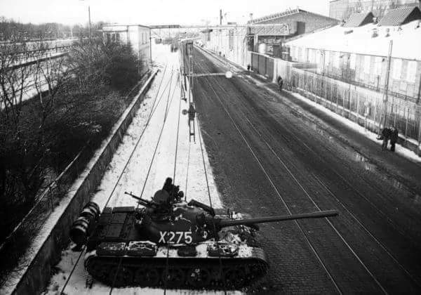
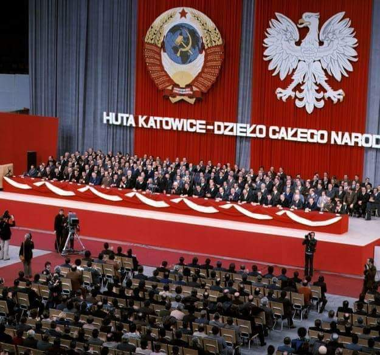
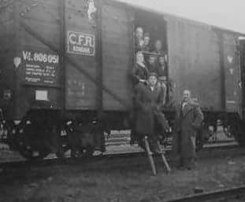
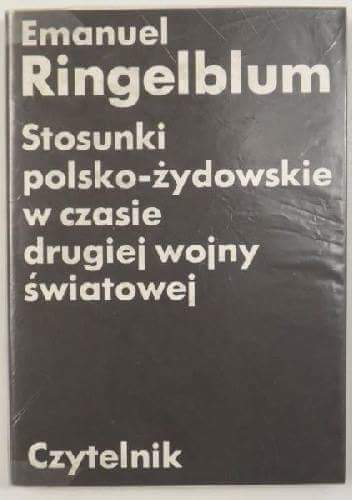
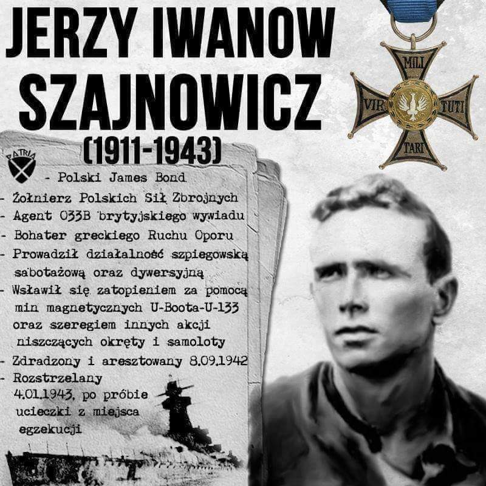

### 1981

W Stoczni Gdańskiej rozpoczął się strajk okupacyjny. Jednak już w nocy do zakładu wkroczyły uzbrojone oddziały ZOMO, które wyprowadziły strajkujących. Pozostała część załogi zdecydowała się na kontynuowanie protestu następnego dnia. Do akcji ściągnięto 814 milicjantów, wśród których byli również uczniowie szkoły milicyjnej w Szczytnie, a także jeden pułk czołgów. Tego samego dnia gdańska bezpieka wezwała do swojej siedziby przedstawicieli tamtejszego duchowieństwa, księży Stanisława Bogdanowicza, Zbigniewa Bryka i Stanisława Dułaka celem podpisania "lojalek" zapewniających, iż nie podejmą żadnych działań sprzecznych z dekretem o stanie wojennym.

 

### 1976

1976 roku oddana została do użytku Huta Katowice. Budowa tego metalurgicznego molocha trwała ponad cztery lata. Zakład , o budowie którego decyzję podjęto na VI Zjeździe Polskiej Zjednoczonej Partii Robotniczej usytowany został na powierzchni ponad 1000 hektarów w Zagłębiu Dąbrowskim, pomiędzy Gołonogiem, Ząbkowicami Będzińskimi, Łośniem i Strzemieszycami. Na terenie budowy, półtora razu większym od powierzchni huty pracowało ponad 50 tysięcy robotników.
Propaganda PRL, która w owym czasie lansowała hasła głoszące błyskawiczny rozwój gospodarczy Polski dołożyła również wszelkich starań, by uroczystość otwarcia kombinatu odbiła się jak największym echem, a także, by zyskała rozgłos w świecie. Zasadniczą rolę w uwiarygodnieniu głoszonego wówczas hasła o braterstwie między Polską, a ZSRR odegrać miało zaproszenie na uroczystość otwarcia kombinatu samego premiera Związku Radzieckiego Aleksieja Kosygina oraz nadanie już na początku budowy tytułu Pierwszego Pracownika I sekretarzowi KC KPZR Leonidowi Breżniewowi, który z wykształcenia był właśnie metalurgiem.
Rozpalenie wielkiego pieca nr 1 nastąpiło 2 grudnia 1976 roku, a dzień później Edward Gierek odbierał meldunek o dokonaniu pierwszego spustu surówki.
Huta Katowice jest obecnie częścią koncernu ArcelorMittal Poland.

 

### 1970

Robotnicy gdańskiej Stoczni imienia Lenina rozpoczęli strajk, który miał być protestem przeciwko ogłoszonym przez rząd podwyżkom cen żywności i podniesieniu norm wydajności pracy.
Robotnicy skandowali "Chodźcie z nami",
śpiewali hymn narodowy i różne pieśni, między
innymi: "Rotę", "Boże coś Polskę" ,
"Międzynarodówkę" i "Marsz Gwardii Ludowej".
Pod siedzibą KW robotnicy domagali się rozmowy z I sekretarzem KW PZPR Alojzym Karkoszką, który w tym czasie uczestniczył w VI plenum KC PZPR w Warszawie.
Wkrótce też do stoczniowców dołączyli studenci Politechniki Gdańskiej. Zaczęto skandować hasła: "Chodzcie z nami","Prasa kłamie","Oszukują was","Dosyć tych kłamstw". Około godziny 15 członek KC PZPR Zenon Kliszko po telefonicznej konultacji z Ministerstwem Spraw Wewnętrzych wydaje rozkaz wysłania przeciw protestującym trzech kompanii ZOMO i dwóch plutonów kompanii szkolnej. Doszło do walk w wyniku których milicja aresztowała 329 osób. Trzy dni pózniej ta sama milicja strzelała do bezbronnych ludzi.

### 1945

Strony polska i ukraińska podpisały protokół uzupełniający do porozumienia z 9 września 1944 roku. Według ustaleń zawartych w tym dokumencie strona polska zobowiązała się do zakończenia w terminie do 15 czerwca 1946 roku rejestracji ludności ukraińskiej zamieszkałej na terenie Polski przeznaczonej do przesiedlenia za wschodnią granicę.

 

### 1942

KSIĘŻA CHCĄ RATOWAĆ DZIECI ŻYDOWSKIE. W pewnych kołach stanęła ostatnio na porządku dziennym sprawa ocalenia pewnej liczny (kilkaset) dzieci żydowskich przez umieszczenie ich w klasztorach we wszystkich zakątkach kraju. Co skłoniło do tego duchowieństwo? Złożyły się na to trzy powody. Po pierwsze: polowanie na duszyczki. Kler katolicki zawsze wykorzystywał ciężkie chwile w życiu Żydów (pogromy, wygnania itd.), żeby pozyskać dorosłych i dzieci. Ten moment odgrywa zapewne najważniejszą rolę, mimo że kler zapewnia, że nie ma zamiaru ochrzcić dzieci żydowskich, które przyjmie do zakładów. Po drugie: czynnik natury materialnej. Za każde dziecko żydowskie trzeba będzie zapłacić za rok z góry po 600 zł miesięcznie. Jest to dość dobra transakcja dla zakonów. Wyżywienie kosztuje je bardzo tanio, posiadają bowiem własne pola i folwarki. Za biedne dzieci, których rodzice nie będą w stanie pokryć tej opłaty, zapłacą rodzice zamożnych dzieci, wnosząc podwójną opłatę. Po trzecie: czynnik prestiżowy. Duchowieństwo polskie bardzo mało do tej pory zdziałało dla ratowania Żydów przed rzezią, wysiedleniem. W związku z protestami, rozglegającymi się na całym świecie przeciwko masowemu wymordowaniu Żydów polskich, uratowanie kilkuset dzieci będzie mogło posłużyć za świadectwo, że w tych ciężkich czasach kler polski nie siedział bezczynnie, że uczynił wszystko, aby ratować Żydów, szczególnie zaś dzieci żydowskie. Brałem udział w dyskusji kilku intelektualistów na ten temat. Jeden kategorycznie oświadczył, że jest temu przeciwny. Mimo ustalenia, iż do klasztorów będą przyjmowane dzieci w wieku od 10 do 14 lat (zgodnie z życzeniem Żydów), ulegną one przecież wpływowi księży i wcześniej czy później przyjmą chrzest. Na nic się tu zda obietnica księży, że nie ochrzczą dzieci. Czas i wychowanie dokonają swego. Uważał on, że winniśmy pójść w ślady naszych przodków i umrzeć w imię wiary. Nie wolno nam wyrażać zgody na chrzest naszych dzieci. Społeczności, jako takiej, nie wolno się tym parać. Niech każdy indywidualnie rozwiąże tę kwestię. Jakie znaczenie ma uratowanie kilkuset dzieci wobec wymordowania ponad trzystu tysięcy Żydów Warszawy? Niech zginą bądź też pozostaną przy życiu, ale razem z ogółem. Inni utrzymywali: musimy pamiętać o przyszłości. Po wymordowaniu ludności żydowskiej w Europie każdy Żyd jest wielkim skarbem i należy dbać o to, żeby się uchował. Po wojnie kler nie będzie miał wpływu, być może, że go w ogóle nie będzie. A jeśli tak, nie należy się obawiać, że dzieci ulegną wpływowi duchowieństwa. Gruntowna znajomość kart naszych dziejów poucza, że w naszej historii nie śmierć w imię wiary była prawidłowością, lecz przeciwnie marranizm - pozorny christianizm. Żydzi zawsze przystosowywali się do najtrudniejszych warunków, zawsze potrafili przetrwać najcięższe czasy. Przeprowadzenie małej garstki dzieci żydowskich na tamtą stronę ocali twórców nowej generacji Żydów. Nie wolno nam odbierać prawa do życia temu nowemu pokoleniu. Należy mocno podkreślić różnicę między przyjęciem chrztu a pozornym chrystianizmem. Księża sami przecież oświadczają, że nie ochrzczą dzieci, jedynie z uwagi na otoczenie będą one musiały zachowywać się jak dzieci chrześcijańskie. Co prawda zachodzi obawa, że jeśli to potrwa jeszcze długo, część dzieci ulegnie wpływowi kleru. Jeżeli jednak zrezygnujemy z pomocy kleru, aby uratować dzieci, po pewnym czasie nie pozostanie nikt, zginą także i ci nieliczni, których moglibyśmy ocalić. Niektórzy z uczestników dyskusji twierdzili, że uratowanie jak największej liczny Żydów jest w obecnej chwili jednym z najważniejszych zadać. Musimy za wszelką cenę ocalić najwięcej Żydów i dlatego trzeba przyjąć propozycję umieszczenia dzieci w klasztorach. Inni zaś utrzymywali, że trzeba wprawdzie tak postąpić, choć bez aprobaty przedstawicieli społeczeństwa żydowskiego. Ludzie ratują się w różny sposób, niechaj akcja klasztorów nosi indywidualny charakter". (źródło. Ringelblum Emanuel, Stosunki polsko-żydowskie w czasie drugiej wojny światowej, Warszawa 1988.)

 

### 1911

1911 roku w Warszawie urodził się Jerzy Iwanow Szajnowicz (zdjęcie)-polski harcmistrz, pływak, wielokrotny reprezentant Polski w piłce wodnej, agent polskich i brytyjskich służb specjalnych,bohater greckiego ruchu oporu,słynny Agent nr 1.
Od roku 1940 prowadził w Grecji działalność szpiegowską i sabotażową polegającą na przekazywaniu Brytyjczykom ważnych danych na temat niemieckich instalacji militarnych w Grecji,a także na temat ruchów sprzymierzonych z Niemcami wojsk włoskich. Grupa dywersyjna prowadzona przez Szajnowicza dokonała 400 zniszczeń samolotów należących do Włochów i Niemców polegających głównie na uszkadzaniu silników. Zaś on sam, wykorzystując swoje umiejętności pływackie instalował miny i inne ładunki wybuchowe pod wrogimi okrętami podwodnymi i transportowcami.
Był trzykrotnie aresztowany przez Gestapo. Ostatni raz 8 września 1942 roku w Atenach. Otrzymał wyrok śmierci. Zginął 4 stycznia 1943 roku w ateńskiej dzielnicy Kesariani po próbie ucieczki z więzienia. Przed rozstrzelaniem przez SS krzyknął "Niech żyje Grecja,niech żyje Polska!"
Iwanow-Szajnowicz został odznaczony
pośmiertnie Orderem Virtuti Militari. W lipcu
1945 marszałek Harold Alexander ogłosił
podziękowanie dla Iwanowa w imieniu
Narodów Sprzymierzonych, a królowa Elżbieta
II w kilka lat po śmierci agenta przekazała
rodzinie zmarłego 1000 funtów w uznaniu jego
zasług.
O jego losach opowiada nakręcony w 1971 roku film Zbigniewa Kuzmińskiego pt "Agent nr 1"w którym w rolę Jerzego Iwanowa Szajonowicza wcielił się Karol Strasburger.

 

---

<a href="https://github.com/TomaszWaszczyk/historia.waszczyk.com/edit/master/src/content/december-14.md" target="_blank">Edytuj tę stronę dzieląc się własnymi notatkami!</a>
