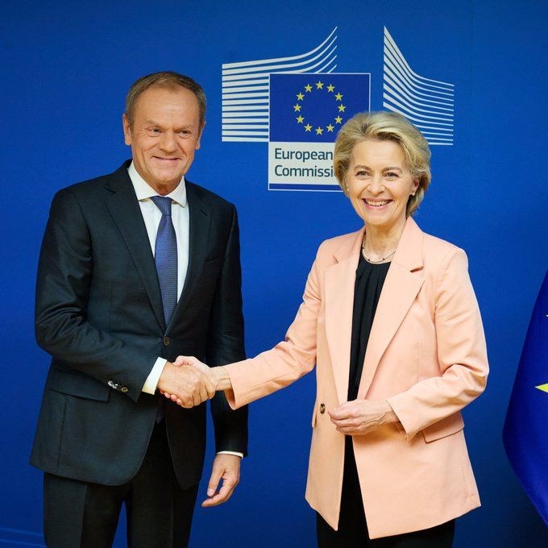
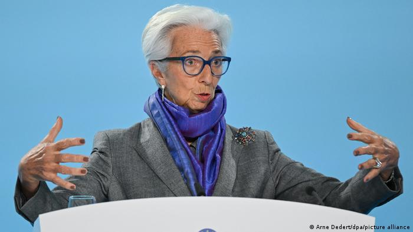
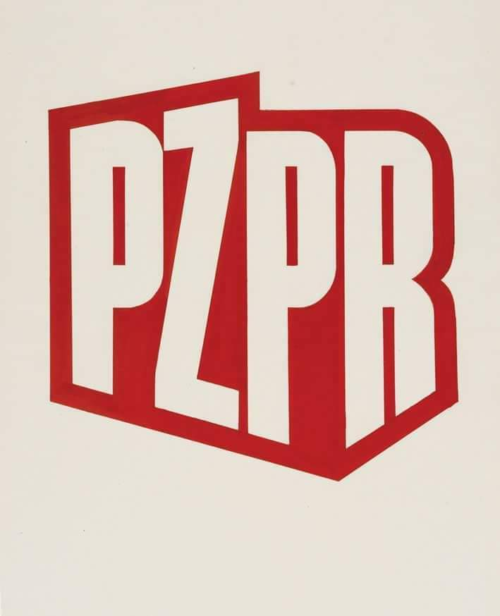
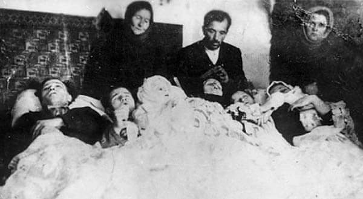
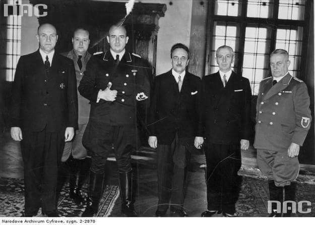

### 2023

  

### 2022

Niemiecka prasa o podwyżce stóp procentowych: „Euro jak lira, nie marka”

Lokalna prasa komentuje decyzję ECB o podwyżce stóp procentowych. Dla jednych za wysoka, dla innych za niska, ale z inflacji i stanu gospodarki zadowolony nie jest nikt. Komentatorzy boją się „utraty dobrobytu”.

  

### 2021

Polacy (oraz znaczna część Europy) zasługują na socjalizm* co już otwarcie pokazuje poniższa akcja.

  

> Morawiecki: Jeżeli inflacja nie będzie spadać, będziemy rozwijać tarczę antyinflacyjną

Jeśli rozdawanie pieniędzy będzie napędzało inflację, to w celu jej zwalczenia będziemy rozdawać jeszcze więcej pieniędzy! To wszystko idzie w publiczne media a ludzie w to wierzą i nie widzą problemu.

*słabą walutę, wysokie stopy procentowe czyli wywłaszczenie zakredytowany salariat z nieruchomości oraz przymieranie głodem ~10-15lat z absurdalnie drogą energią elektryczną.

  

---

> Rządowa Agencja Rezerw Strategicznych: Dziś do Polski dotarła dostawa 1,1 mln dawek dziecięcych szczepionek przeciw #COVID19 od Pfizer-BioNTech, które zostaną rozdysponowane po punktach szczepień. Kolejna dostawa planowana jest w styczniu.

<video width="640" height="480" controls>
<source src="./movies/december/premierpolski.mp4" type="video/mp4">
Your browser does not support the video tag.
</video>

@PremierRP @MZ_GOV_PL

---

### 2020

  

### 2017

  

### 1965

„Ogromnie mnie osobiście krępuje cała ta ‘otoczka’, która nieustannie robi z nas ‘bohaterów’. Te wielkie manifestacje, które towarzyszą przy sadzeniu drzewka w Jerozolimie, ta wielka uroczystość, jaka odbywa się w Izraelu, to bardzo jest krępujące dla osób mego pokroju, które nie uważają się za wielkich ludzi, ani za bohaterów. Robiliśmy to jako rzecz zupełnie normalną, w myśl zasady, że jak człowiek tonie, to ten drugi musi mu podać rękę, lub choć mały palec. To podkreślanie nadzwyczajności naszych prac jest żenujące. Żyd, Francuz, Niemiec to przecież tacy sami ludzie,jak my. Tylko taka idea przyświecała nam. To, co robiliśmy wypływało z potrzeby serc”. Irena Sendlerowa
15 grudnia 1965 roku Instytut Pamięci Męczenników i Bohaterów Holocaustu Yad Vashem w Jerozolimie przyznał działaczce socjalistycznej i społecznej Irenie Sendlerowej medal ,,Sprawiedliwy wśród Narodów Świata'' jako dowód uznania, że w czasie II wojny światowej z narażeniem własnego życia ratowała Żydów przed Zagładą. Sprawiedliwej przysługiwało prawo zasadzenia swojego drzewka pamięci w Alei Sprawiedliwych w Jerozolimie. Do tego wydarzenia doszło dopiero w 1983 roku, ponieważ wcześniej władze PRL odmawiały Irenie Sendlerowej wydania paszportu.
W czasie II wojny światowej Irena Sendlerowa związana była z Wydziałem Opieki Społecznej m. Warszawy i w porozumieniu z Radą Główną Opiekuńczą od początku wojny niosła ratunek prześladowanym Żydom, a w szczególności dzieciom żydowskim. Gdy pod koniec 1942 roku powstała Rada Pomocy Żydom ,,Żegota'' stanęła na czele referatu dziecięcego. Dzieci z getta warszawskiego szmuglowała, z pomocą zaufanych osób na aryjską stroną, a następnie umieszczała je najczęściej przy polskich zaufanych rodzinach, a także w zakonnych zakładach sióstr Rodziny Maryi i służebniczek starowiejskich, sierocińcach oraz w innych placówkach.
Irena Sendlerowa niejednokrotnie ocierała się o śmierć.
20 października 1943 roku, funkcjonariusze gestapo aresztowali ją i uwięzili na Pawiaku. Aresztowanie było wynikiem zdekonspirowania jednej ze ,,skrzynek'' kontaktowych RPŻ. Zdekonspirowana ,,skrzynka'' kontaktowa, czyli lokal należący do bardzo zaufanych osób, gdzie spotykali się członkowie ,,Żegoty'' i otrzymywali zadania znajdował się w pralni przy ulicy Brackiej. Właścicielka lokalu nie wytrzymała tortur i wydała gestapowcom nazwisko Ireny Sendlerowej. Oprócz tego gestapowcy dysponowali materiałem w postaci całej teczki donosów, które konfidenci składali na Irenę Sendlerową do siedziby gestapo. Moment aresztowania opisała Sendlerowa w swojej autobiografii: ,,Kiedy gestapowcy kazali mi się ubierać, to choć zabrzmi to może niewiarygodnie, ale poczułam się szczęśliwa, bo wiedziałam, że spis dzieci nie wpadł w ich ręce. Tak bardzo się śpieszyłam, że wyszłam z domu w rannych pantoflach, aby tylko ci zbrodniarze opuścili mój dom. Janka wybiegła z butami dla mnie. Niemcy pozwolili mi je założyć. Szłam długim podwórzem i myślałam tylko o tym, że muszę się opanować, że oni nie mogą dostrzec na mojej twarzy lęku. A przecież strach, przed tym co mnie czeka, ściskał mi gardło. Wtedy zdarzyły się trzy cudy. Pierwszy, że nie znaleziono kartoteki - dzieci więc były bezpieczne! I drugi... Tego dnia miałam w domu dużą sumę pieniędzy na zapomogi dla naszych podopiecznych. I ich adresy. Były też kenkarty, metryki. Prawdziwe i fałszywe. To wszystko znajdowało się pod moim posłaniem, które zawaliło się podczas rewizji. Niemcy zajęci rozpruwaniem poduszek i wyrzucaniem rzeczy z szafy, na szczęście nie interesowali się złamanym łóżkiem. Mogłam więc zachować, tak trudny w tej sytuacji wewnętrzny spokój. To była przecież pierwsza noc... Cudem trzecim było udane zniszczenie w czasie drogi na Szucha ważnego spisu nazwisk dzieci, którym następnego dnia miałam zanieść pieniądze. Był w kieszeni marynarki, w której byłam. Wiedziałam, że na pewno zrewidują mnie i rozbiorą do naga. Bezcenną kartkę cichutko drobniutko podarłam i niezauważenie wyrzuciłam przez uchylone okno jadącego samochodu. Była szósta nad ranem, było ciemno, a Niemcy bardzo zmęczeni prawie drzemali. Nikt niczego podejrzanego nie zauważył. Byłam spokojna o los dzieci. Swojego przeznaczenia nie znałam. (...) W czasie przesłuchań pytano mnie o nazwę organizacji i nazwisko jej przewodniczącego. Niemcy wiedzieli, że istnieje jakaś tajna organizacja, która ratuje Żydów. Ale nie znano szczegółów - nazwy, siedziby, ludzi w niej działających. Obiecywano mi, że jak wszystko powiem, to natychmiast zostanę zwolniona(...) Milczałam. Wolałam umrzeć niż zdemaskować naszą działalność. Cóż znaczyło moje życie w porównaniu z życiem tylu innych osób, które mogłam narazić na śmierć?(...)'' Irena Sendlerowa spędziła sto dni na Pawiaku, gdzie była wielokrotnie torturowana. Po trzech miesiącach skazano ją na karę śmierci. Wykonanie egzekucji wstrzymali działacze ,,Żegoty'': Julian Grobelny i Maria Szulisławska- Palester. Udało się im przekupić jednego z gestapowców . Irena Sendlerowa została ,,rozstrzelana'' w dokumentach i potajemnie wypuszczona na wolność 20 stycznia 1944. W sumie Irena Sendlerowa wraz ze swoimi ofiarnymi współpracownikami ocaliła od Zagłady około 2500 żydowskich dzieci i niemałą liczbę osób dorosłych, między innymi Irenę Majewską, która spłaciła wobec Sendlerowej dług wdzięczności, wyciągając ją w 1949 roku z ubeckiej katowni. Każde uratowane przez siebie dziecko Sendlerowa uważała jako usprawiedliwienie swojego istnienia na tym świecie. Michał Głowiński - jeden z ocalonych przez Irenę Sendlerową wyjaśnił jak to było możliwe, że Irena Sendlerowa mogła dokonać ratowania istnień w skali tak ogromnej, że wręcz nieprawdopodobnej: ,,To wielkie dzieło ratowania wymagało geniuszu organizacyjnego. Irena Sendlerowa go posiadała, umiała zaplanować działania w strasznej rzeczywistości okupacyjnej, a także przewidzieć ich skutki, umiała stworzyć zespół współpracowników i nimi kierować, a także współdziałać z ludźmi z wielu kręgów społecznych i politycznych, religijnych i towarzyskich. To dzięki tym niezwykłym talentom mogła dokonać tego, czego dokonała. I dzięki odwadze wprost niebywałej. Była człowiekiem czynu, którego celem nieustannym stało się niesienie dobra. Człowiekiem czynu, który nie bał się narażenia własnego życia dla ratowania życia innych.'' W późniejszym czasie Irena Sendlerowa została również uhonorowana odznaczeniami państwowymi Orderem Orła Białego i Krzyżem Komandorskim z Gwiazdą Orderu Odrodzenia Polski. Nie była jednak zadowolona z tych odznaczeń, mówiąc, że ,,Po Jedwabnem potrzebny jest bohater''. Szczególnie bliska była jej natomiast Nagroda im. Jana Karskiego ,,Za Odwagę i Serce'', przyznany na wniosek dzieci Order Uśmiechu oraz list z gratulacjami i apostolskim błogosławieństwem nadesłany z Watykanu przez papieża Jana Pawła II. Pozwolę sobie przytoczyć treść tej niezwykłej papieskiej korespondencji: ,,Czcigodna i Droga Pani, dowiedziałem się o przyznanej Pani nagrodzie im. Jana Karskiego ,,Za Odwagę i Serce''. Proszę przyjąć moje serdeczne gratulacje i wyrazy uznania za niezwykle odważną działalność w czasie okupacji, kiedy nie bacząc na własne bezpieczeństwo, ratowała Pani wiele dzieci od zagłady i śpieszyła z pomocą humanitarną bliźnim potrzebującym wsparcia duchowego i materialnego. Sama doświadczona torturami fizycznymi i cierpieniami duchowymi, nie załamała się, lecz nadal służyła ofiarnie bliźnim, współtworząc domu dla dzieci i starców. Niech Pan Bóg w swej dobroci wynagrodzi Pani te czyny dobroci dla innych szczególnymi łaskami o błogosławieństwem. Pozostając z wyrazami szacunku i wdzięczności udzielam Pani Apostolskiego Błogosławieństwa. Jan Paweł II Watykan, 22 października 2003 r.'' Była dwukrotną kandydatką do otrzymania pokojowej Nagrody Nobla. Komisja noblowska nigdy nie zdecydowała się na przyznała jej tejże nagrody. Ale dla Ireny Sendlerowej to nie było ważne, dla niej nagrodą Nobla było to, że szkoły są nazywane jej imieniem. Zmarła 12 maja 2008 roku.

### 1948

Podczas zjazdu odbywającego się w Gmachu Głównym Politechniki Warszawskiej powołana do życia została Polska Zjednoczona Partia Robotnicza.
Ten sprawujący w Polsce przez ponad 40 lat władzę, organ powstał z połączenia Polskiej Partii Socjalistycznej i Polskiej Partii Robotniczej.
Połączenie obu partii poprzedziło przeprowadzenie czystek w szeregach PPS polegających na usunięciu działaczy wykazujących poglądy dalekie od założeń idei komunizmu, a nawet, w ocenie twórców PZPR ocierające się o prawicowo- nacjonalistyczne.
PZPR była największą partią polityczną w Polsce. Już chwili założenia jej liczebność wynosiła ponad półtora miliona członków, a w kolejnych latach utrzymywała się na zbliżonym poziomie, by w roku 1980 osiągnąć apogeum w postaci 3 milionów. Warto również dodać, że po zarejestrowaniu NSZZ Solidarność szeregi PZPR opuściło 850 tysięcy ludzi.
Władza PZPR była systemem rządów autorytarnych, chociaż poprzez zawarcie sojuszu ze Stronnictwem Demokratycznym i Zjednoczonym Stronnictwem Ludowym stwarzała pozory demokracji.
Pierwszym I sekretarzem KC PZPR był Bolesław Bierut, ostatnim Mieczysław Rakowski. Partia została rozwiązana w styczniu 1990 roku. Spadkobiercami PZPR są, nie istniejąca już Socjademokracja Rzeczpospolitej Polskiej oraz Sojusz Lewicy Demokratycznej.

 

### 1943

Zdjęcie to fotografia wykonana przez niemiecką policję 15 grudnia 1943 roku po zamordowaniu dzień wcześniej przez UPA zamieszkującej wieś Latacz w obwodzie tarnopolskim rodziny Karpiaków.
Na zdjęciu Maria Karpiak z mężem Stanisławem i 6 zabitych dzieci w wieku od 8 do 23 lat.

 

### 1939

Niemieckie władze okupacyjne powołały Bank Emisyjny w Polsce. Dyrektorem Banku Emisyjnego w Polsce
(Emissionbank in Polen) został mianowany prof. dr Feliks Młynarski, wicedyrektorem Rudolf Jędrzejewski. Powołano także Urząd Nadzoru Bankowego (UNB) kierowany przez Fritza Paerscha, który nadzorował także Bank
Emisyjny w Polsce.
Na zdjęciu członkowie zarządu Polskiego Banku Emisyjnego u gubernatora Hansa Franka.

 

### 1862

Po 11 latach budowy otwarto Kolej Warszawsko-Petersburską.
Trasa kolei to: Petersburg – Gatczyna – Ługa –
Psków – Dźwińsk – Wilno – Białystok – Łapy –
Warszawa.
Pierwszym inwestorem tego przedsięwzięcia był rząd rosyjski, a zastępcą kierownika budowy był polski inżynier Stanisław Kierbedź
Budowę przerwano na czas wojny krymskiej. Po jej zakończeniu finansowanie budowy przejęło Główne Towarzystwo Rosyjskich Dróg Żelaznych. Jako, że kolej tę budowlali Rosjanie, to też i szerokość toru była dostosowana do standardów obowiązujących w Rosji.
Pierwszy skład osobowy przejechał na trasie Warszawa -Peterburg 18 maja 1863 roku.
W 1895 Kolej Warszawsko-Petersburska
została wykupiona i upaństwowiona przez
rząd carski, a w 1906 została połączona z
Bałtyjsko-Pskowsko-Ryską żelazną drogą,
tworząc Północno-Zachodnie Drogi Żelazne
( Северо-Западные железные дороги, Siewiero- Zapadnyje żeleznyje dorogi).
Grafika przedstawia most kolejowy przez Niemen w okolicach Kowna.

---

<a href="https://github.com/TomaszWaszczyk/historia.waszczyk.com/edit/master/src/content/december-15.md" target="_blank">Edytuj tę stronę dzieląc się własnymi notatkami!</a>
