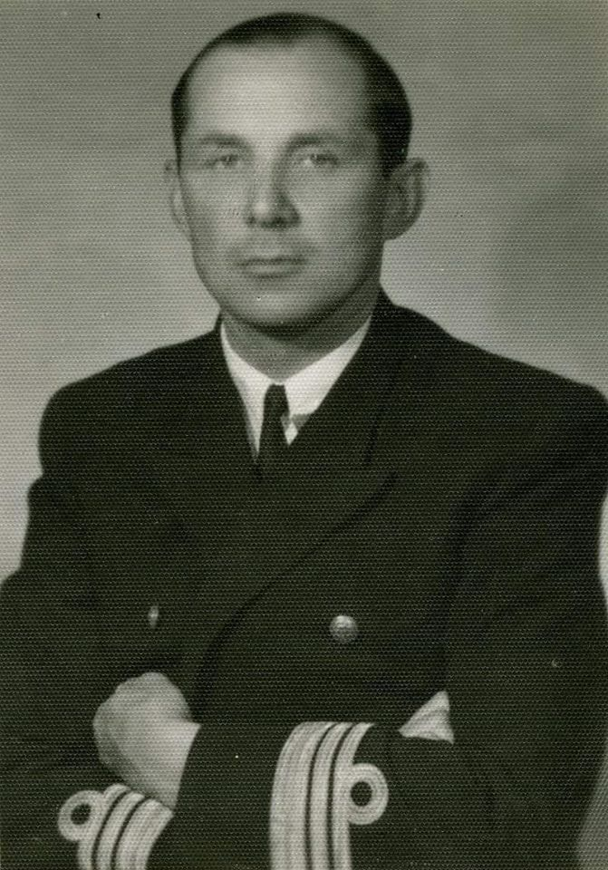
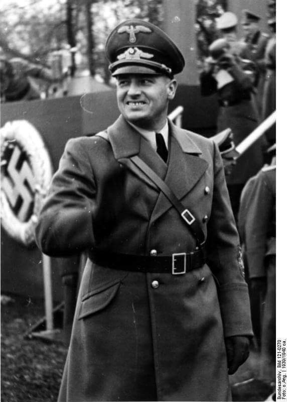

### 2020

CME Group will list an Ethereum (ETH) futures product next year, the firm said Wednesday.

CME Group, which gate-crashed the crypto derivatives world with a bitcoin futures contract at the height of the 2017 cycle, said on Wednesday — as bitcoin topped $20,000 that it would launch futures tied to Ethereum.

The product is coming to market February 8, subject to regulatory approval. It will be cash-settled and based on the firm's CME CF Ether-Dollar Reference Rate. According to CME's website, one contract will be equal to 50 ETH.

"Building on the success of Bitcoin futures and options, CME Group will add Ether futures to the cryptocurrency risk-management solutions available to trade in February," the firm said.

### 2004

O hołdzie pruskim każdy coś wie, bo o tę datę pytają w szkole, na lekcji historii. Poza tym namalował go Jan Matejko. O hołdzie ruskim mało kto z Polaków słyszał, choć Matejko też go namalował. Wiedzą za to dobrze Rosjanie.

16 grudnia 2004 r. Duma Państwowa Federacji Rosyjskiej przyjęła ustawę o dniach wojennej sławy, zwycięskich dla Rosjii. W uzasadnieniu do tej ustawy napisano, że dzień 4 listopada staje się w Rosji świętem państwowym, zamiast rocznicy rewolucji bolszewickiej 7 listopada 1917 r., na pamiątkęoswobodzenia Moskwy od polskich i litewskich interwentów oraz heroizmu całego narodu.

Rosja wróciła w ten sposób do starego ukazu carskiego, jeszcze z roku 1649, który uczynił dzień kapitulacji załogi polskiej na Kremlu 4 listopada 1612 r. świętem narodowym, zniesionym dopiero przez bolszewików.

My, Polacy, też mamy co wspominać z tego czasu, a najbardziej dzień 29 października 1611 r., kiedy car rosyjski Dymitr Szujski, razem z braćmi, składali hołd królowi polskiemu i przyrzekali mu posłuszeństwo. Lokajski stosunek do Rosji, kształtowany pracowicie przez prawie pół wieku Polski sowieckiej, sprawił, że zapomina się o tym dniu, by nie „obrazić” Rosji. Owszem, trzeba pamiętać jako o dniach polskiej chwały.

Lata 1598-1613 nazywane są w historii Rosji okresemWielkiej Smuty (SmutnojeWremja). Nastąpił kryzys carstwa i udana interwencja wojsk Rzeczypospolitej, która doprowadziła do tego, że Polka Maryna Mniszchówna została uznana za carową i panowała w Moskwie. Po antypolskim powstaniu carem został bojar Wasyl IV Szujski. W obawie przed Polską zawarł układ ze Szwecją, oddając jej Inflanty. To się nie spodobało królowi polskiemu. Wojsko polskie znów wyprawiło się do Moskwy. 4 lipca 1610 r. pod Kłuszynem (między Smoleńskiem a Moskwą) jazda polska, licząca niespełna 7 tysięcy ludzi, dowodzona przez hetmanaStanisława Żółkiewskiego, rozbiła w pył armię rosyjską kniazia Szujskiego i posiłki szwedzkie – razem 35 tysięcy ludzi! Było to największe militarne zwycięstwo Polaków od czasu bitwy pod Grunwaldem, do czasu Cudu nad Wisłą. W tym roku było 400-lecie.

Wojska polskie zajęły ponownie Moskwę, a car został uwięziony i przewieziony do Polski! Wasyl Szujski uznał prawa królewicza Władysława Wazy do tronu rosyjskiego. 29 października 1611 r. na Krakowskim Przedmieściu w Warszawie odbył się triumfalny wjazd Stanisława Żółkiewskiego. Car i jego rodzina zostali zaprowadzeni na zamek królewski i złożyli hołdZygmuntowi III Wazie. Jako więzień króla polskiego, car został umieszczony na Mokotowie (oczywiście, w pałacu…). Potem wywieziono go do Gostynina, gdzie zmarł w roku 1612. W roku 1635 poselstwo rosyjskie przybyło do Warszawy z prośbą o wydanie trumien Wasyla, Dymitra i Jekatieriny Szujskich do Moskwy. Car został pochowany w Soborze Archangielskim w Moskwie.

Polacy zostali wyparci z Kremla w roku 1612, a Sobór Ziemski, zwołany przez mieszczan i szlachtę rosyjską, obrał na cara księcia Michała Romanowa. Dał on początek nowej dynastii, panującej w Rosji do roku 1762, a z liniami bocznymi aż do rewolucji bolszewickiej.

Dziś Federacja Rosyjska świętuje wyparcie załogi polskiej z Kremla jako Dzień Jedności Narodowej. Rosjanie mają do tego prawo. My powinniśmy natomiast pamiętać o dniach naszej chwały. Nie tylko o hołdzie pruskim, ale i ruskim.

### 1981

Oddziały ZOMO dopuściły się mordu na bezbronnych górnikach Kopalni Węgla Kamiennego "Wujek " w Katowicach.
Wszystko zaczęło się od aresztowania przez milicję 13 grudnia 1981 roku wiceprzewodniczącego zakładowej Solidarności Jana Ludwiczaka. Wydarzenie to wywołało napięcie wśród górników pracujących wtedy na nocną zmianę. 14 grudnia górnicy podjęli decyzję o rozpoczęciu strajku ,który miał trwać aż do zwolnienia przez władze Ludwiczaka. Rozmowy prowadzone z dyrekcją kopalni nie przyniosły żadnego skutku, a tylko dały czas władzom na przygotowanie się do pacyfikacji kopalni. 15. grudnia górnicy dowiedzieli się o brutalnym pacyfikowaniu przez ZOMO strajkujących w regionie zakładów pracy, m.in. kopalń Staszic i Manifest Lipcowy . Od tej chwili niemal powszechne było przekonanie, że na Wujka ZOMO też przyjdzie. W nocy z wtorku na środę grupa około stu osób przygotowywała różnego rodzaju uzbrojenie. Decyzja o wprowadzeniu ZOMO zapadła w Urzędzie Wojewódzkim w Katowicach. Przewodniczącym odbywającego się tam posiedzenia sztabu Wojewódzkiego Komitetu Obrony był pułkownik milicji Jerzy Gruba.
16 grudnia na teren kopalni przybyli przedstawiciele WKO, którzy poprosili o opuszczenie jej terenu wszystkie przebywające tam kobiety. O godzinie 11.00 ZOMO i ORMO otoczyły zakład, izolując go od miasta i rozpędzając zgromadzony dookoła tłum.
Przystąpiono do głównego uderzenia, w którym udział wzięło pięć kompanii ZOMO, dwie kompanie ORMO i jedna kompania NOMO. Przeciwko górnikom skierowano 7 armatek wodnych,10 bojowych wozów piechoty oraz kompanię czołgów.
W pacyfikacji zginęło 9 górników: Jan Stawisiński, Joachim Gnida, Józef Czekalski, Krzysztof Giza, Ryszard Gzik, Bogusław Kopczak, Andrzej Pełka, Zbigniew Wilk, Zenon Zając, a 21 zostało rannych.
Rany odniosło też 41 milicjantów i żołnierzy.
WSZYSCY WINNI TEJ ZBRODNI SĄ DZIŚ NA WOLNOŚCI.

 

### 1952

W więzieniu UB na warszawskim Mokotowie zamordowany został komandor porucznik Zbigniew Przybyszewski (zdjęcie) żeglarz, uczestnik wojny obronnej, dowódca 31 Dywizjonu Artylerii Nadbrzeżnej, szef służby artylerii Marynarki Wojennej.
Aresztowany w roku 1950 w sprawie tak zwanego "spisku komandorów" czyli postępowania karnego wobec siedmiu oficerów Marynarki Wojennej, którym postawiono fałszywe zarzuty "próby obalenia władzy ludowej".
Odznaczony Krzyżem Srebrnym Orderu Virtuti Militari, Orderem Krzyża Grunwaldu III klasy, Medalem za Udział w Wojnie Obronnej 1939, a w pośmiertnie, w roku 2011 Krzyżem Oficerskim Orderu Odrodzenia Polski. Miał 45 lat.

 

### 1941

Fragment przemówienia Hansa Franka (zdjęcie), wygłoszonego 16 grudnia 1941 w Krakowie na posiedzeniu rządu Generalnego Gubernatorstwa, o planie masowej zagłady ludności żydowskiej:
„[...] Powiem Panom otwarcie, że z Żydami trzeba skończyć tak czy owak. Führer powiedział kiedyś: jeśli zjednoczonemu żydostwu znowu uda się rozpętać wojnę światową, wówczas nie tylko podburzone do wojny narody złożą swą krew w ofierze, lecz przyjdzie również kres na Żyda w Europie. Wiem, że krytykuje się wiele posunięć, dokonywanych teraz w Rzeszy w stosunku do Żydów. Świadomie i wciąż usiłuje się - jak o tym świadczą sprawozdania o nastrojach - mówić o okrucieństwie, surowości itd. Zanim będę mówił dalej, proszę, by zechcieli Panowie najpierw zgodzić się ze mną co do następującego sformułowania: litujmy się z zasady tylko nad narodem niemieckim, poza tym nad nikim na świecie. Tamci też nie mieli nad nami litości. Jako stary narodowy socjalista muszę też powiedzieć, że gdyby ród żydowski w Europie przeżył wojnę, my zaś poświęcilibyśmy najlepszą naszą krew dla zachowania Europy - wówczas wojna ta byłaby tylko częściowym sukcesem. Dlatego mój zasadniczy stosunek do Żydów opiera się na nadziei, że Żydzi znikną. Trzeba ich usunąć. Rozpocząłem pertraktacje w celu deportowania ich na Wschód. W styczniu odbędzie się w Berlinie wielka konferencja w tej sprawie, na którą wydeleguję p. sekretarza stanu dr Bühlera. Konferencja ta ma odbyć się w Głównym Urzędzie Bezpieczeństwa Rzeszy u obergruppenführera SS Heydricha. W każdym razie rozpocznie się wielka żydowska migracja. [...]

 

### 1834

https://en.wikipedia.org/wiki/L%C3%A9on_Walras

General equilibrium

---

<a href="https://github.com/TomaszWaszczyk/historia.waszczyk.com/edit/master/src/content/december-16.md" target="_blank">Edytuj tę stronę dzieląc się własnymi notatkami!</a>
