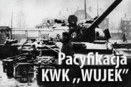

### 1981

Oddziały ZOMO dopuściły się mordu na bezbronnych górnikach Kopalni Węgla Kamiennego "Wujek " w Katowicach.
Wszystko zaczęło się od aresztowania przez milicję 13 grudnia 1981 roku wiceprzewodniczącego zakładowej Solidarności Jana Ludwiczaka. Wydarzenie to wywołało napięcie wśród górników pracujących wtedy na nocną zmianę. 14 grudnia górnicy podjęli decyzję o rozpoczęciu strajku ,który miał trwać aż do zwolnienia przez władze Ludwiczaka. Rozmowy prowadzone z dyrekcją kopalni nie przyniosły żadnego skutku, a tylko dały czas władzom na przygotowanie się do pacyfikacji kopalni. 15. grudnia górnicy dowiedzieli się o brutalnym pacyfikowaniu przez ZOMO strajkujących w regionie zakładów pracy, m.in. kopalń Staszic i Manifest Lipcowy . Od tej chwili niemal powszechne było przekonanie, że na Wujka ZOMO też przyjdzie. W nocy z wtorku na środę grupa około stu osób przygotowywała różnego rodzaju uzbrojenie. Decyzja o wprowadzeniu ZOMO zapadła w Urzędzie Wojewódzkim w Katowicach. Przewodniczącym odbywającego się tam posiedzenia sztabu Wojewódzkiego Komitetu Obrony był pułkownik milicji Jerzy Gruba.
16 grudnia na teren kopalni przybyli przedstawiciele WKO, którzy poprosili o opuszczenie jej terenu wszystkie przebywające tam kobiety. O godzinie 11.00 ZOMO i ORMO otoczyły zakład, izolując go od miasta i rozpędzając zgromadzony dookoła tłum.
Przystąpiono do głównego uderzenia, w którym udział wzięło pięć kompanii ZOMO, dwie kompanie ORMO i jedna kompania NOMO. Przeciwko górnikom skierowano 7 armatek wodnych,10 bojowych wozów piechoty oraz kompanię czołgów.
W pacyfikacji zginęło 9 górników: Jan Stawisiński, Joachim Gnida, Józef Czekalski, Krzysztof Giza, Ryszard Gzik, Bogusław Kopczak, Andrzej Pełka, Zbigniew Wilk, Zenon Zając, a 21 zostało rannych.
Rany odniosło też 41 milicjantów i żołnierzy.
WSZYSCY WINNI TEJ ZBRODNI SĄ DZIŚ NA WOLNOŚCI.

 

### 1941

Fragment przemówienia Hansa Franka (zdjęcie), wygłoszonego 16 grudnia 1941 w Krakowie na posiedzeniu rządu Generalnego Gubernatorstwa, o planie masowej zagłady ludności żydowskiej:
„[...] Powiem Panom otwarcie, że z Żydami trzeba skończyć tak czy owak. Führer powiedział kiedyś: jeśli zjednoczonemu żydostwu znowu uda się rozpętać wojnę światową, wówczas nie tylko podburzone do wojny narody złożą swą krew w ofierze, lecz przyjdzie również kres na Żyda w Europie. Wiem, że krytykuje się wiele posunięć, dokonywanych teraz w Rzeszy w stosunku do Żydów. Świadomie i wciąż usiłuje się - jak o tym świadczą sprawozdania o nastrojach - mówić o okrucieństwie, surowości itd. Zanim będę mówił dalej, proszę, by zechcieli Panowie najpierw zgodzić się ze mną co do następującego sformułowania: litujmy się z zasady tylko nad narodem niemieckim, poza tym nad nikim na świecie. Tamci też nie mieli nad nami litości. Jako stary narodowy socjalista muszę też powiedzieć, że gdyby ród żydowski w Europie przeżył wojnę, my zaś poświęcilibyśmy najlepszą naszą krew dla zachowania Europy - wówczas wojna ta byłaby tylko częściowym sukcesem. Dlatego mój zasadniczy stosunek do Żydów opiera się na nadziei, że Żydzi znikną. Trzeba ich usunąć. Rozpocząłem pertraktacje w celu deportowania ich na Wschód. W styczniu odbędzie się w Berlinie wielka konferencja w tej sprawie, na którą wydeleguję p. sekretarza stanu dr Bühlera. Konferencja ta ma odbyć się w Głównym Urzędzie Bezpieczeństwa Rzeszy u obergruppenführera SS Heydricha. W każdym razie rozpocznie się wielka żydowska migracja. [...]

 

---

<a href="https://github.com/TomaszWaszczyk/historia.waszczyk.com/edit/master/src/content/december-16.md" target="_blank">Edytuj tę stronę dzieląc się własnymi notatkami!</a>
