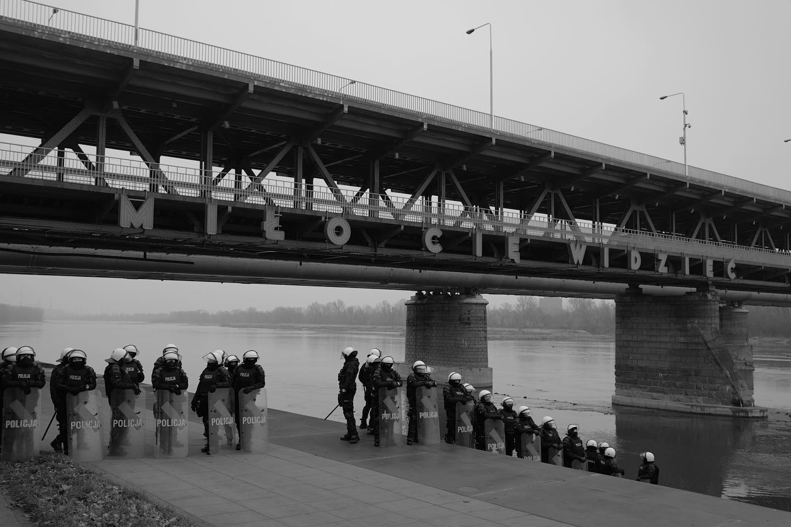

### 2022

  

  

  

### 2021

> Lagarde: Very unlikely ECB will raise rates in 2022

  

ECB mocno podnosi prognozy inflacji:

2021: 2,2% -> 2,6%
2022: 1,7% -> 3,2%  
2023: 1,5% -> 1,8%
2024: 1,8%

---

  

---

> Grzechy cielesne nie są najcięższe – powiedział papież podczas konferencji prasowej w samolocie, broniąc arcybiskupa Paryża Michela Aupetita, oskarżanego o romans sprzed lat. „Zresztą chodziło o drobne pieszczoty i masaże sekretarki” – dodał Franciszek.

---

Czeczko już jest gwiazdą TV na wschodzie.

  

---

### 2020

  

Ciekawe czy BTC stanie się aktywem rezerowym nowych banków centralnych?

---

  

---

  

---

Chanuka - źródłosłów

Słowo Chanuka ma ten sam źródłosłów co Chinuch (edukacja). W czasie Chanuki skupiamy się na żydowskiej edukacji dzieci. Nie jest jasne dlaczego dajemy dzieciom Chanuka gelt, ale wykorzystujemy tę okazję, aby nauczyć je jak ważne jest by wzrastać w ofiarności i dobrych uczynkach.
Kolejna sprawa: Grekom chodziło o to, aby z naszej służby B-gu usunąć wszystko to, co duchowe. Nie próbowali nas zabić, ale chcieli abyśmy zaczęli żyć tak jak oni. Nie zburzyli Świątyni i nie wylali oliwy, lecz „jedynie” zbezcześcili je i sprawili, że stały się nieczyste.
Chanuka gelt to wyraz wolności i przeciwstawienia się zabiegom Greków. Dawać datki z Chanuka gelt to sposób uczenia naszych dzieci, że to co materialne może (i powinno) być używane w służbie B-gu.
Rodzice i znajomi dają Chanuka gelt. Najodpowiedniejszą nocą na podarowanie Chanuka gelt jest piąta noc – pierwsza, w czasie której jest więcej płomieni niż ciemności. Lubawicz Rebe zachęca abyśmy dawali gelt w każdą z ośmiu nocy (oprócz Szabatu).
Co roku od 1958 Bank Izraela emituje specjalne monety chanukowe, przedstawiające społeczności żydowskie z różnych zakątków świata. Pierwsza moneta chanukowa przedstawiała menorę z epoki Machabeuszy. W 1976, aby uczcić 200 lecie Stanów Zjednoczonych wyemitowano monetę z amerykańską chanukiją z czasów kolonialnych. Zaś w 1981 wybito na srebrnym szeklu chanukiję z Polski. Inne monety na przestrzeni lat ukazywały chanukije z wielu krajów, w których mieszkają Żydzi.

  

---

### 2019

Tak wysokiej podwyżki ZUS nie było w całej historii. Już za dwa tygodnie, nawet 80% samozatrudnionych w Polsce, odczuje największą podwyżkę ZUS w historii Polski.

Skala jest ogromna, dlatego, że składkę trzeba płacić, czy się stoi, czy się leży.

Nie ma znaczenia, czy w danym miesiącu lub przez trzy kolejne miesiące Twój biznes przynosi dochody. Nawet jeżeli Twój dochód przez 4 miesiące wyniesie zero złotych, to Ty musisz zapłacić 6 000 zł na sam ZUS mimo to, że nic nie zarobiłeś/aś.

Sprawa jest poważna, dlatego, że w żadnym państwie Unii Europejskiej ryczałtowa składka ZUS nie wynosi 77,2% minimalnej płacy netto w danym kraju.

W 2020 r. minimalna płaca netto wyniesie 1 877 zł. 1 450 zł, to 77,2% minimalnej płacy netto w Polsce.

Gdyby przełożyć sytuacje Polaków do Brytyjczyków lub Niemców, to samozatrudnieni w Wielkiej Brytanii i Niemczech musieliby płacić 1 000 funtów w Wielkiej Brytanii i 900 euro w Niemczech, oczywiste jest, że to nie byłoby możliwe - ani, brytyjska, ani niemiecka gospodarka nie wytrzymałaby takiego obciążenia - ludzie, zaczęliby uciekać z tych krajów, ponieważ, nie dałoby się tam żyć.

Rząd Polski przygotował pewne ulgi dla części samozatrudnionych, jednak te ulgi są mało znaczące, ponieważ tylko około 15% działalności gospodarczych może z nich skorzystać, cała reszta będzie musiała płacić aż 1 450 zł miesięcznie.

### 1989

Do Sejmu skierowany został pakiet 10 ustaw wprowadzających nowe zasady funkcjonowania polskiej gospodarki znanych pod określeniem "Plan Balcerowicza".
Nowemu polskiemu parlamentowi zajęło zaledwie dwa tygodnie wprowadzenie tych regulacji w życie.
1 stycznia 1990 roku razem ze zmianą nazwy Polska Rzeczpospolita Ludowa na Rzeczpospolita Polska oraz ukoronowaniem orła wszedł w życie ten różnie dziś oceniany plan.

  

### 1953

W Belwederze biskupi Episkopatu Polski Michał Klepacz ( zdjęcie) i Zygmunt Choromański złożyli uroczyste ślubowanie na wierność Polskiej Rzeczpospolitej Ludowej. Przysięga została złożona w imieniu całego Episkopatu, który upokarzając się w ten sposób przed władzami komunistycznymi został zmuszony, w związku z aresztowaniem prymasa Stefana Wyszyńskiego do przeciwdziałania, jak to oficjalnie określono, „wszelkim próbom siania niepokoju, godzącym we wspólne dobro
Kościoła i państwa”

### 1942

Państwa sprzymierzone ogłosiły równocześnie Londynie, Waszyngtonie i Moskwie wspólną deklarację opracowaną na podstawie tzw "Noty Raczyńskiego"
Autorem tego dokumentu dotyczącego prześladowań oraz zbrodni na ludności żydowskiej był polski minister spraw zagranicznych Edmund Raczyński.
Była to pierwsza tego typu publikacja informująca opinię publiczną na zachodzie o holokauście.
We wspólnej deklaracji państw sprzymierzonych czytamy:
„Uwagę rządów Belgii , Czechosłowacji , Grecji ,
Luksemburga , Holandii, Norwegii , Polski, Stanów Zjednoczonych Ameryki Północnej , Zjednoczonego Królestwa Wielkiej Brytanii i
Północnej Irlandii , Związku Socjalistycznych Republik Radzieckich, Jugosławii i francuskiego Komitetu Narodowego zwróciły liczne doniesienia z Europy, że władze niemieckie, nie zadowoliwszy się odmówieniem osobom pochodzenia żydowskiego na wszystkich terenach, które zostało rozciągnięte ich barbarzyńskie prawo, najbardziej podstawowych praw ludzkich, przystąpiły one obecnie do realizacji wielokrotnie zapowiadanej przez Hitlera zagłady narodu żydowskiego w Europie.”

### 1897

https://pl.wikipedia.org/wiki/W%C5%82adys%C5%82aw_Broniewski

---

<a href="https://github.com/TomaszWaszczyk/historia.waszczyk.com/edit/master/src/content/december-17.md" target="_blank">Edytuj tę stronę dzieląc się własnymi notatkami!</a>
