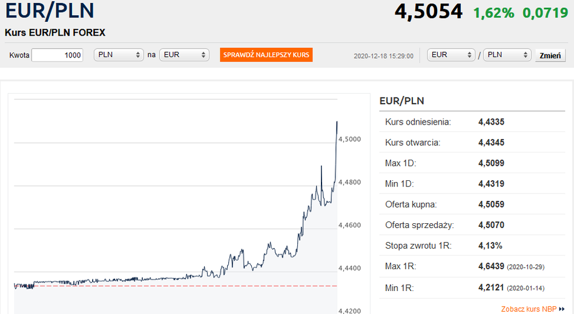
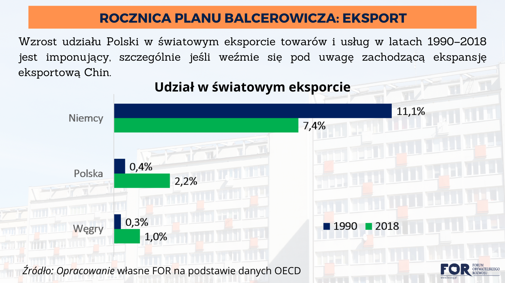
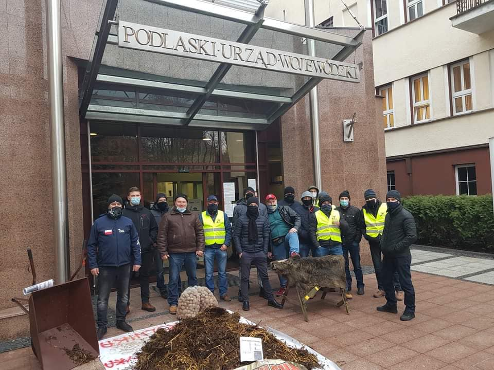
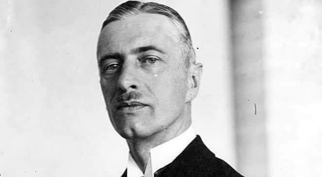
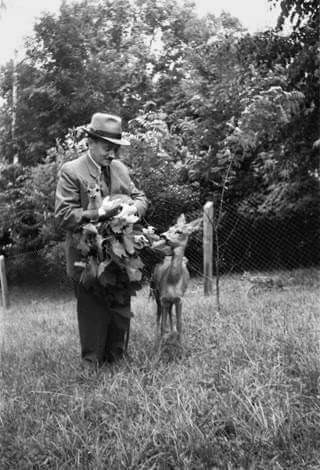
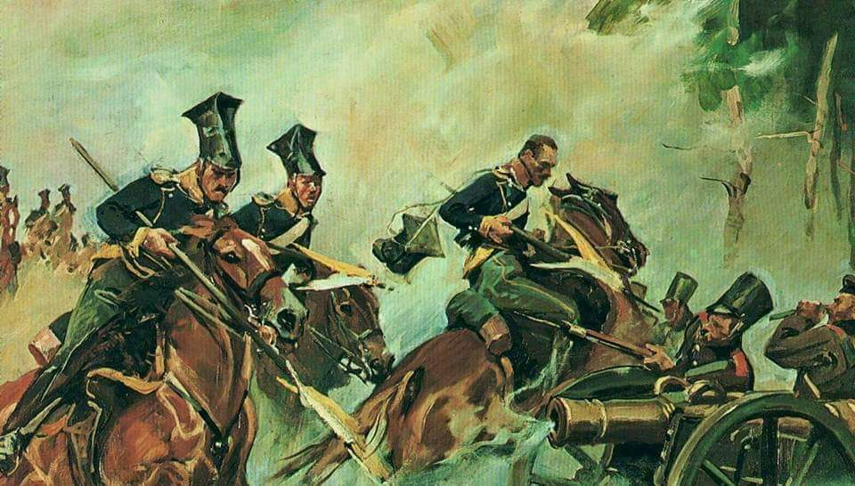

### 2020

WAŻNE: Polski bank centralny celowo osłabia złotego po raz pierwszy od 10 lat

  

Jak dowiedział się Bankier.pl, za piątkowymi zmianami na parze euro-złoty stał Narodowy Bank Polski, który przeprowadził interwencję na rynku walutowym, sprzedając złotego na rynku. Fakt ten potwierdziła też redakcja PAP Biznes, powołująca się na swoje źródła w banku centralnym.

Tymczasem nastroje na światowych rynkach były umiarkowanie optymistyczne. Niemiecki DAX rósł o 0,3%, kontrakty na S&P500 pozostawały bez większych zmian, a kurs EUR/USD utrzymywał się w pobliżu wyznaczonego wczoraj przeszło 2,5-letniego szczytu. Powodem osłabienia złotego nie były też dane z polskiej gospodarki. Raport GUS pokazał, że listopadowa produkcja przemysłowa ukształtowała się na poziomie wyższym niż przed rokiem i wyraźnie wyższym od oczekiwań analityków.

- Dlaczego NBP akurat dziś zdecydował się na takie działanie - ciężko powiedzieć. Jest to dość dziwne ze względu na to, że eurozłoty nie jest ostatnio aż tak ściśle skorelowany z eurodolarem, który zwyżkuje i to powinno spowodować spadki kursu eurozłotego - tak się nie dzieje, więc NBP powinien czuć się z tym raczej OK. Taka sytuacja powinna być dla nich komfortowa, ale widocznie nie jest - skomentował analityk rynków finansowych w Bank Millennium Mateusz Sutowicz cytowany przez PAP Biznes.

- Poziom 4,44/EUR - jaki był w ostatnich dniach - nie jest jakimś dramatycznie mocnym złotym, żeby już teraz zaczynać taką walkę z rynkiem, która pewnie w średnim terminie nie będzie skuteczna - dodał Sutowicz.

---

''Wojsko jest jednym z zasadniczych elementów Narodowego Programu Szczepień - będzie przewozić szczepionki, a żołnierze medycy będą gotowi, by szczepić w szpitalach wojskowych i w punktach mobilnych'' - podkreślił w środę szef MON Mariusz Błaszczak. Zaapelował do wszystkich, "by się zaszczepić".

Pytany wieczorem w TVP3 Warszawa, jak wojsko przygotowało się do udziału w Narodowym Programie Szczepień i jak będzie pomagać, szef MON odparł, że żołnierze będą przewozić szczepionki, a medycy wojskowi będą gotowi, żeby szczepić.

"Chodzi o szpitale wojskowe, chodzi także o przeszkolonych ratowników medycznych - żołnierzy Wojska Polskiego, a więc będą to również grupy mobilne, które dojadą ze szczepieniami tam gdzie będzie to potrzebne" - powiedział Błaszczak.

Zaapelował przy tym "do wszystkich, żeby się zaszczepić".

"To jest niezwykle ważne, to jest podstawa do tego, żeby zwalczyć epidemię, żeby zahamować jej rozwój, a de facto, żeby wrócić do normalności" - przekonywał.

---

"Zamknięcie hoteli od Nowego Roku albo centralny rejestr pobytów służbowych w ośrodkach wypoczynkowych, to – jak informuje w czwartek "Gazeta Wyborcza", pomysły rządu na ukrócenie hotelarskiego podziemia.

"GW" ocenia, że "rząd boi się, że w sylwestra i w czasie ferii zimowych nie uda się powstrzymać od wyjazdów ludzi zmęczonych już akcją #zostańwdomu".

Dziennie bezpośrednio na skutek pandemii Covid-19 umiera w Polsce średnio 400 osób, a pośrednio - blisko 1000. Liczba nowych wykrywanych zakażeń również przestała w ostatnich dniach spadać. Dane o liczbie zgonów sugerują, że zachorowalność nie zmniejszała się w ostatnim miesiącu tak szybko, jak wskazywałyby oficjalne dane o nowych zakażeniach.

Zdaniem wielu lekarzy styczeń i luty pod względem zdolności rozprzestrzeniania się wirusa są groźniejsze niż październik czy listopad – podaje "GW", powołując się na Centrum Informacyjne Rządu.

Gazeta informuje, że na szczeblu rządowym od ok. dwóch tygodni trwają narady, jak ukrócić hotelarskie podziemie."

---

Zweryfikować:

  

---

  

---

### 1981

Papież Jan Paweł II wystosował do generała Wojciecha Jaruzelskiego list, w którym apelował o przerwanie stanu wojennego.
Oto jego treść:
"Wydarzenia ostatnich dni, wiadomości o zabitych i rannych Rodakach w związku ze stanem wojennym wprowadzonym od 13 grudnia, nakazują mi zwrócić się do Pana Generała z usilną prośbą i zarazem gorącym wezwaniem o zaprzestanie działań, które przynoszą ze sobą rozlew polskiej krwi.
W ciągu ostatnich zwłaszcza dwu stuleci Naród Polski doznał wiele krzywd, rozlano też wiele polskiej krwi, dążąc do rozciągnięcia władzy nad naszą Ojczyzną. Ostatnia wojna i okupacja przyniosła stratę około sześciu milionów Polaków, walczących o własną i niepodległą Ojczyznę. W tej perspektywie dziejowej nie można dalej rozlewać krwi polskiej: nie może ta krew obciążać sumień i plamić rąk Rodaków.
Zwracam się więc do Pana, Generale, z usilną prośbą i zarazem gorącym wezwaniem, ażeby sprawy związane z odnową społeczeństwa, które od sierpnia 1980 r. były załatwiane na drodze pokojowego dialogu, wróciły na tę samą drogę. Nawet jeżeli jest ona trudna, nie jest niemożliwa.
Domaga się tego dobro całego Narodu. Domaga się tego również opinia całego świata, wszystkich społeczeństw, które słusznie wiążą sprawę pokoju z poszanowaniem praw człowieka i praw narodu. Ogólnoludzkie pragnienie pokoju przemawia za tym, ażeby nie był kontynuowany stan wojenny w Polsce. Kościół jest rzecznikiem tego pragnienia.
Zbliżają się Święta Bożego Narodzenia, które od tylu pokoleń łączyły wszystkich synów i córki naszego Narodu przy opłatku wigilijnym. Trzeba uczynić wszystko, ażeby tegorocznych Świąt Rodacy nie musieli spędzać pod groźbą śmierci i represji. Zwracam się do Pańskiego sumienia, Generale, i do sumień wszystkich tych ludzi, od których zależy w tej chwili decyzja."
Watykan, dnia 18 grudnia 1981 r. Jan Paweł II

### 1942

1942 roku prezydent Rzeczypospolitej Polskiej Władysław Raczkiewicz (zdjęcie) wystosował notę do papieża Piusa XII, w której nawoływał do do przerwania milczenia i wzięcia w obronę mordowanych Żydów i Polaków. W Polsce jak i na Ukrainie za pomoc Żydom groziła kara śmierci. Zabijano nie tylko „winowajców”, ale także ich rodziny. Mimo to od samego początku władze Polski Podziemnej zaangażowały się w pomoc.

 

### 1937

https://pl.wikipedia.org/wiki/Janusz_Onyszkiewicz

### 1933

Aresztowany tydzień wcześniej działacz Komunistycznej Partii Polski Bolesław Bierut (zdjęcie) został skazany za współpracę z radzieckim wywiadem na 7 lat więzienia. Karę odbywał w aresztach w Mysłowicach i Rawiczu. Na wolność wyszedł przedterminowo, bo po 5 latach pozbawienia wolności.

 

### 1896

https://pl.wikipedia.org/wiki/Stanis%C5%82aw_Mackiewicz

### 1830

Sejm podjął uchwałę o uznaniu powstania listopadowego za narodowe.
W podjętej wówczas uchwale czytamy:
> Zaręczona wolność osobista zgwałcona, zapełniono więzienia, wojenne sądy postanowione na osoby cywilne, rozciągnięto sromotne kary na obywateli, których całą winą było, że ducha i charakter narodowy ratować od zepsucia i zguby zamierzali. O ile Rosja zaatakuje Królestwo wróg nasz nad jedną tylko pustynią więcej panowanie swoje roztoczy!
Miesiąc pózniej car Mikołaj pierwszy został zdetronizowany.

 

---

<a href="https://github.com/TomaszWaszczyk/historia.waszczyk.com/edit/master/src/content/december-18.md" target="_blank">Edytuj tę stronę dzieląc się własnymi notatkami!</a>
