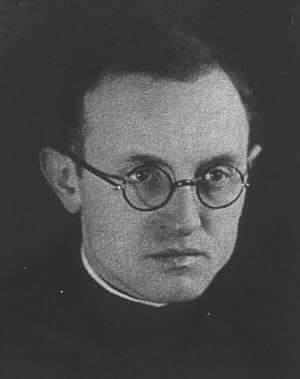
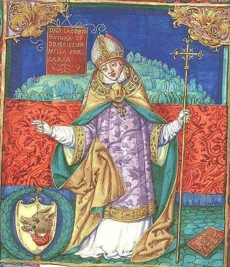

### 2020

S&P6

  

---

Czarny czwartek dla górali. Przedsiębiorcy z Podhala mówią wprost: „To gwóźdź do trumny”

  

---

"Orwellowski sposób resortu finansów na walkę z przestępczością finansową"

System Informacji Finansowej (w skrócie SInF) będzie ogólnopolskim rejestrem:
– kont bankowych w tym w SKOK
– rachunków maklerskich,
– rachunków płatniczych,
– skrzynek depozytowych
Utworzenie takiego systemu według Ministerstwa Finansów wymusza na nas prawo unijne - realizacja Dyrektywy 2018/843 z 30 maja 2018 oraz Dyrektywy 2019/1153 z 20 czerwca 2019. Przekazywanie danych o rachunkach będzie bowiem dla wszystkich banków i innych podmiotów finansowych obowiązkiem – w przypadku niedopełnienia tego obowiązku grozić będą kary finansowe liczone w milionach złotych.
Ale trzeba powiedzieć, że intencja projektu ustawy jest słuszna, ale wskazane narzędzia – tak jak np. dynamit – w pewnych rękach mogą być pożyteczne, w innych – szkodliwe i niebezpieczne. Wszystko zależy od intencji tego, kto po narzędzie sięga.

---

### 1981

Ambasador Polski w USA Romuald Spasowski (zdjęcie ) poprosił władze amerykańskie o udzielenie mu azylu politycznego. 4 października 1982 roku władze komunistycznej Polski skazały go na karę śmierci,pozbawienie praw publicznych na zawsze i przepadek mienia, a 30 października 1985 roku Rada Państwa pozbawiła go polskiego obywatelstwa.
Spasowski mimo, iż od lat był zajadłym komunistą był obok ambasadora w Tokio Zdzisława Rurarza jedynym polskim dyplomatą, który otwarcie skrytykował wprowadzenie przez polskie władze stanu wojennego. Przekazał on stronie amerykańskiej ważne informacje dotyczące zabezpieczeń i szyfrowania w polskiej ambasadzie.
Uniewinniony został 25 listopada 1990 roku, a
w 1993 roku przywrócono mu polskie
obywatelstwo. Nigdy jednak nie powrócił do
kraju. W 1985 roku przyjął chrzest katolicki.
Zmarł 9 sierpnia 1995 roku w Oakton w stanie Wirginia w USA.

 

### 1970

Na cmentarzu Witomińskim w Gdyni milicja urządziła potajemne pogrzeby osób zabitych podczas mających tam miejsce demonstracji robotniczych. Nie wpuszczono tam księży ani rodzin ofiar.
Tego samego dnia Biuro Polityczne Komitetu Centralnego Polskiej Zjednoczonej Partii Robotniczej podjęło decyzję o zwołaniu na dzień następny VII plenum na którym miała zapaść decyzja o powołaniu nowego I Sekretarza.

 

### 1962

W pobliżu warszawskiego lotniska Okęcie miała miejsce katastrofa samolotu rejsowego Polskich Linii Lotniczych LOT Vickers Viscount 804, który odbywał lot powrotny z Brukseli do Warszawy. Maszyna, za sterami której siedział kapitan Mieczysław Rzepecki rozbiła się podczas podejścia do lądowania na pas nr 33. Zginęło 28 pasażerów i 5 członków załogi.
Przyczyną katastrofy była prawdopodobnie utrata prędkości samolotu przed lądowaniem, co skutkowało jego przeciągnięciem spowodowana wyposażeniem samolotu w silniki turbośmigłowe, które nabierając prędkości na kilka sekund zmieniały kąt łopat śmigieł. Z tego względu niezalecane było gwałtowne zwiększanie mocy takich silników. Taki właśnie manewr prawdopodobnie wykonał kapitan Rzepecki, przyzwyczajony do latania na samolotach wyposażonych w silniki tłokowe, gdzie manewr taki jest dopuszczalny.

 

### 1951

W podziemiach Zamku Lubelskiego wykonano wyrok śmierci na Józefie Bieleckim (zdjęcie) kapralu Armii Krajowej placówki Piszczac Obwodu AK Biała Podlaska, żołnierzu organizacji Wolność i Niezawisłość. Aresztowany został przez UB 4 lipca 1950 roku w okolicach wsi Dobryń w województwie lubelskim. W czasie próby ucieczki zranił jednego z ubeków, a drugiego zabił. W czasie rozprawy, która odbywała się w dniach od 24 do 26 września 1951 roku przed Wojewódzkim Sądem Rejonowym w Lublinie postawiono mu 39 zarzutów. Prezydent Bolesław Bierut nie skorzystał z prawa łaski wobec Bieleckiego.
W styczniu 1952 roku funkcjonariusze Urzędu Bezpieczeństwa aresztowali jego syna Władysława, którego 14 czerwca 1952 Wojewódzki Sąd Rejonowy w Bydgoszczy skazał na karę śmierci wykonaną 24 października 1952 roku.

 

### 1942

Oficjalna nota niemiecka o problemie żydowskim.

Pisownia i interpunkcja zgodne z oryginałem

Berlin 19 grudnia 1942

Oficjalna nota niemiecka o problemie żydowskim, zajmując się ogólną deklaracją sformułowaną w ostatnich dniach, o problemie żydowskim, wydaną przez rządy angielski, amerykański i sowiecki, jak też przez rozmaite trządy emigracyjne, uważa między innymi, że w zasadzie problem żydowski jest dla Niemiec zlikwidowany już od 30 stycznia 1933 r.

Wydalenie Żydów z ziem Niemieckich jest podstawą fundamentalną programu nacjonal-socjalistycznego jeszcze na dziesięć lat przed dojściem do władzy. Od owego czasu ten punkt został niewzruszony. Jeżeli Żydzi uważali, że narodowy socjalizm zmieni swój program lub go nie zastosuje właściwie w kwestii żydowskiej, tem gorzej dla nich.

W każdym razie należy podkreślić, iż Żydzi niemieccymieli dziesięć lat do wyciągnięcia odpowiednich wniosków z programu narodowo -socjalistycznego i opuszczenia kraju.

Żydzi innych państw europejskich mieli do swojej dyspozycji jeszcze więcej czasu, a dla wielu z nich możliwości emigracyjne istniały jeszcze do roku lub dwóch wstecz. Dla Żydów w niektórych państwach europejskich takie możliwości istnieją jeszcze do teraz.

W końcu dobrze jest prtypomnieć kategoryczny monit wypowiedziany przez Führera na krótko przed wybuchem konfliktu:

"Jeżeli Żydzi doprowadzą do wybuchu nowej wojny światowej, będą pierwszymi, którzy odczują konsekwencje tej zbrodni".

 

Zdjęcie; getto warszawskie, ulica Karmelicka.

---

Górze Pietralewickiej koło Słonimia gestapo rozstrzelało jezuitę Adama Sztarka (na zdjęciu) oraz dwie siostry zakonne ze Zgromadzenia Sióstr Niepokalanego Poczęcia Najświętszej Marii Panny - siostrę Marię Martę Kazimierę Wołowską i siostrę Bogumiłę Noiszewską
(obie Kościół uznał za błogosławione).
Była to kara za ukrywanie dzieci żydowskich w klasztorze.
Według zeznań świadków ojciec Sztark nawoływał z ambony do pomocy Żydom, zbierał na ich rzecz wśród parafian pieniądze i kosztowności, organizował dla nich aryjskie papiery. Odnalezione na ulicy osierocone żydowskie dzieci przechowywał na plebanii. Przekazywał je potem siostrom niepokalankom.
Według świadków w czasie egzekucji ojciec Sztark przebaczył swoim oprawcom wznosząc okrzyk:
„Niech żyje Chrystus Król, niech żyje Polska.
Ojcze, przebacz im, bo nie wiedzą, co czynią!
(Łk 23,34)”.
Pośmiertnie ojciec Adam Sztark został uhonorowany , jako pierwszy polski jezuita medalem Sprawiedliwy wśród Narodów Świata.

 

### 1922

W Warszawie odbył się pogrzeb zamordowanego 16 grudnia 1922 roku prezydenta Polski Gabriela Narutowicza. W uroczystościach tych udział wzięło około pół miliona warszawiaków,a poeta Julian Tuwim napisał z tej okazji następujący wiersz:

"Krzyż mieliście na piersi, a brauning w kieszeni.
Z Bogiem byli w sojuszu, a z mordercą w pakcie, Wy, w chichocie zastygli, bladzi, przestraszeni,
Chodźcie, głupcy, do okien - i patrzcie! i patrzcie!
Z Belwederu na Zamek, tętnicą Warszawy,
Alejami, Nowym Światem, Krakowskiem
Przedmieściem,
Idzie kondukt żałobny, krepowy i krwawy:
Drugi raz Pan Prezydent jest dzisiaj na mieście.
Zimny, sztywny, zakryty chorągwią i kirem,
Jedzie Prezydent Martwy a wielki stokrotnie.
Nie odwracając oczu! Stać i patrzeć, zbiry!
Tak! Za karki was trzeba trzymać przy tym oknie!
Przez serce swe na wylot pogrzebem przeszyta,
Jak Jego pierś kulami, niech widzi stolica
Twarze wasze, zbrodniarze - i niech was przywita
Strasznym krzykiem milczenia żałobna ulica."

W kondukcie pogrzebowym nie wziął udziału Józef Piłsudski. Oficjalnym powodem braku jego udziału było przeziębienie.

### 1283

1283 roku w kościele franciszkańskim w Kaliszu odbyła się konsekracja Jakuba Świnki (grafika) na arcybiskupa gnieźnieńskiego.
Świnka był jednym z bliskich współpracowników księcia wielkopolskiego Przemysła II i późniejszego króla Władysława Łokietka.
Arcybiskupstwo objął po zmarłym w 1271 roku arcybiskupie Januszu. 12 letni okres przerwy w sprawowaniu władzy arcybiskupiej w ówczesnej Polsce wynikał z wewnętrznych sporów, jakie toczyły się pośród polskiego duchowieństwa. Dopiero osobista interwencja księcia wielkopolskiego sprawiła, że Świnka został kandydatem na tron arcybiskupi.
Okres jego panowania to czas bardzo dobrych stosunków państwa z kościołem, o czym świadczyć może chociażby wielki przywilej z 1 sierpnia 1284, w którym Przemysł II potwierdzał wszystkie dotychczasowe przywileje arcybiskupstwa i zezwalał dodatkowo na posiadanie i bicie własnej monety w dobrach kościelnych.
Świnka panował przez 31 lat, do śmierci 4 marca 1314 roku.

 

### 1914

Józef Piłsudski stanął na czele powołanej przez władze austriackie I Brygady Legionów.
Została ona sformowana z oddziałów podległych Piłsudskiemu, które w dniach 17-18 listopada 1914 roku wzięły udział w bitwie pod Krzywopłotami.
Na zdjęciu oficerowie I Brygady Legionów (rok 1915). W środku brygadier Józef Piłsudski oraz m.in. Tadeusz Piskor, Bolesław Długoszowski-Wieniawa, Ignacy Boerner, Zygmunt Sulistrowski, Emil Bobrowski, Konstatnty Dzieduszycki.

 

---

<a href="https://github.com/TomaszWaszczyk/historia.waszczyk.com/edit/master/src/content/december-19.md" target="_blank">Edytuj tę stronę dzieląc się własnymi notatkami!</a>
