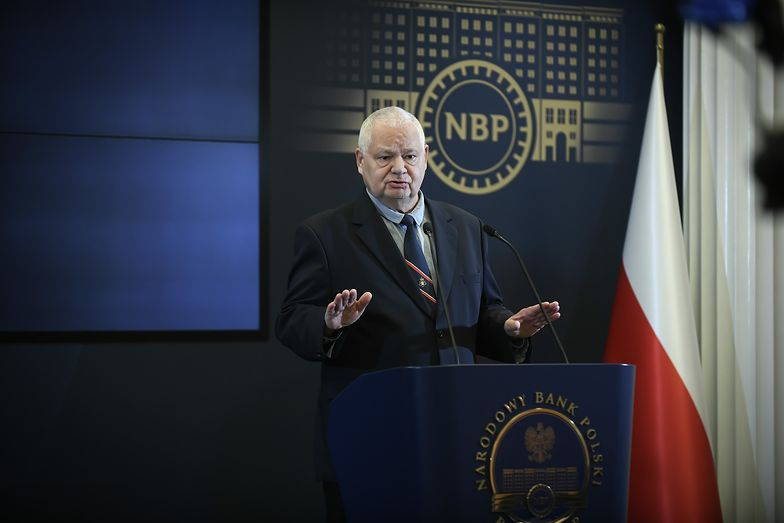
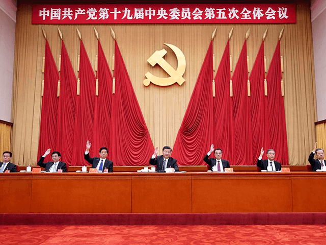
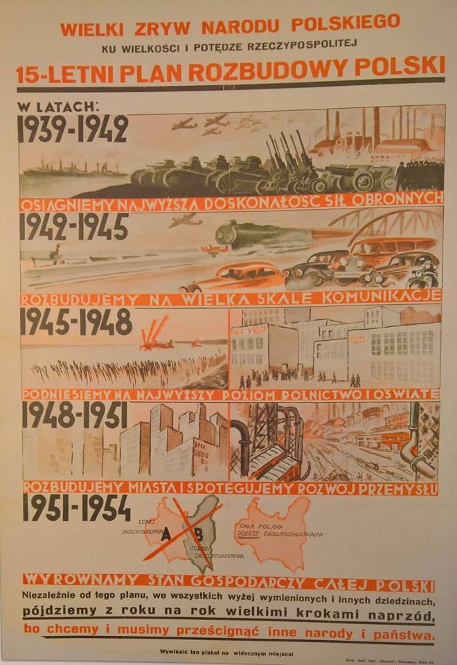

### 2021

Glapiński:

> Inflacja to szok zewnętrzny, a w Polsce mamy cud gospodarczy.

  

### 2020

“The prelude of an Asian Era has begun,” China’s state-run Global Times declared on Monday, citing data indicating that Asia will “contribute roughly 60 percent of global growth” by 2030.

The article also cited East Asian societies’ emphasis on “order” over personal freedom as a strong indicator that the region will recover more efficiently from the ongoing coronavirus pandemic than Western nations.

“By 2025, China’s GDP is expected to catch up with or even surpass that of the US. India may surpass Germany to become the world’s fourth-largest economy.  … The US’ status as the world’s largest economy will be nearing its end. For the first time, three Asian countries will be among the four major economies in the world,” the newspaper noted.

The Global Times cited the recent “signing of the Regional Comprehensive Economic Partnership (RCEP) on November 15” as a further indication of Asia’s growing economic dominance.

The trade pact’s inking “brought together ASEAN [the Association of Southeast Asian Nations] nations, Japan, South Korea, China, Australia and New Zealand into one of the most diverse and populated trade blocks on Earth,” according to the newspaper. “It marks a new age for Asian regional cooperation that features multilateralism and trade liberalism. In terms of the global recovery process during the post-pandemic era, this new configuration can accomplish many things.”

India, which the Global Times cited as a future top four global economy by 2025, notably opted out of signing the RCEP on November 15, in line with its stated goal of becoming less dependent on foreign supply chains, which in turn helps to contain Chinese dominance over Asian manufacturing and trade.

Written by Wang Wen, a “professor and executive dean of Chongyang Institute for Financial Studies at Renmin University of China,” the Global Times article further argued that East Asian societal norms, in particular their focus on “self-discipline” and a “code of conduct,” suggest that the region will combat the negative side effects of the coronavirus pandemic more successfully than western countries.

“From the perspective of national governance, East Asian countries, which put emphasis on order in their culture, show more efficiency in fighting against the pandemic, compared with European countries and the US, which purportedly value freedom more,” Wang stated. “Therefore, Asian countries are also revitalizing their economies faster than other parts of the world.”

A report by the Jakarta Post in January seems to support the Global Times‘ prediction of the incremental growth in Asian economies.

“In 2020 Asia’s gross domestic product will overtake gross domestic product (GDP) of the rest of the world combined. By 2030, the region is expected to contribute roughly 60 percent of global growth,” the article, co-authored by a member of the World Economic Forum’s executive committee, revealed.

“Asia-Pacific will also be responsible for the overwhelming majority (90 percent) of the 2.4 billion new members of the middle class entering the global economy. The bulk of that growth will come from the developing markets of China, India and throughout South-East Asia,” the Indonesian newspaper added.

  

---

USD/PLN zbliża się do arcy-ważnego poziomu 3,65. Brakuje zaledwie 3 groszy. Ewentualne przełamanie tego wsparcia otwiera drzwi (a nawet wrota) do dalszego zjazdu w kierunku 3,30. Coraz bardziej widzę podobieństwo bieżącej sytuacji do tej z 2005-2006. Takie same struktury fal. Podobieństwo takie jest tez widoczne na wykresie EUR/USD.

Szkoda polskich eksporterów. Przy silnym złotym, trudniej im będzie odrobić straty Covidowe.

---

### 2009

https://pl.wikipedia.org/wiki/Traktat_lizbo%C5%84ski

### 1991

Polska jako pierwsze państwo na świecie uznała niepodległość Ukrainy. Krok ten podjęto bardzo szybko, ponieważ zaledwie dzień wcześnie odbyło się tam referendum na temat ogłoszenia niepodległości. Wzięło w nim udział 84 procent Ukraińców,z których 90 procent opowiedziało się za ogłoszeniem niepodległości. Prezydentem Ukrainy został Leonid Krawczuk, do którego prezydent Polski Lech Wałęsa wysłał pismo gratulacyjne.

### 1989

1989 roku prezydent Wojciech Jaruzelski złożył wieniec w miejscu upamiętniającym 9 górników Kopalni Węgla Kamiennego " Wujek", którzy zginęli 16 grudnia 1981 roku od kul wystrzelonych przez kompanię ZOMO.

### 1984

https://pl.wikipedia.org/wiki/Lista_Kisiela

### 1980

Z Komitetu Centralnego Polskiej Zjednoczonej Partii Robotniczej został usunięty Edward Gierek. Preludium do tej decyzji było odbranie mu na obradującym w dniu 6 września 1980 roku VI Plenum Komitetu Centralnego Polskiej Zjednoczonej Partii Robotniczej stanowiska I Sekretarza. Jego miejsce zajął Stanisław Kania.

Oficjalną przyczyną odsunięcia Gierka od władzy był kryzys ekonomiczny i społeczny, do którego miały doprowadzić jego działania. 18 maja 1981 roku stanął przed tak zwaną komisją Grabskiego, której zadaniem było badanie nadużyć wysokich funkcjonariuszy partyjnych PZPR, związanych z nieprawidłowym wykorzystaniem pożyczek zagranicznych z lat 70.). W stanie wojennym od stycznia do grudnia 1982 roku był internowany w Głębokiem koło Koszalina. Po wyjściu na wolność był pod stałą obserwacją służb.

### 1963

W ogrodzie zoologicznym w Edynburgu zmarł 22-letni niedźwiedź Wojtek, kapral 22 Kompanii Zaopatrywania Artylerii w 2 Korpusie Polskim; uczestnik bitwy o Monte Cassino. Z postacią Wojtka wiąże się szereg zabawnych anegdot np. "Jego ulubioną sztuczką było podpływanie po kryjomu pod wodą do grup kąpiących się kobiet i niespodziewane wynurzanie się pośród nich. Fortel ten zawsze powodował wybuch ogromnej paniki. Piski kobiet przerażonych pojawieniem się w niewielkiej odległości ogromnego niedźwiedzia były dla uszu Wojtka najpiękniejszą muzyką. W jego oczach sztuczka była świetnym dowcipem, który nigdy m się nie znudził. W swoim czasie Wojtek był w pewnym sensie futrzastym odpowiednikiem rekina, który straszył plażowiczów w filmie „Szczęki”. (źródło cytatu: Niedźwiedź Wojtek. Niezwykły żołnierz Armii Andersa. Autor: Allen Orr)

### 1944

W Lublinie zakończył się trwający od 27 listopada 1944 roku proces niemieckich zbrodniarzy wojennych z obozu koncentracyjnego w Majdanku.
Specjalny Sąd Karny skazał na karę śmierci 6 zbrodniarzy. Byli to czterej członkowie załogi esesmani: Hermann Vogel, Wilhelm Gerstenmeier, Anton Thernes i Theodor Schoellen oraz dwaj niemieccy kryminaliści, którzy pełnili w obozie funkcję kapo: Heinz Stalp i Edmund Pohlmann. Żaden z nich nie przyznał się do winy, ale co istotne, żaden też nie twierdził, że zbrodnie w obozie nie miały miejsca.
Wyrok na zbrodniarzach wykonano już następnego dnia. Jeden z nich, Pohlmann popełnił wcześniej samobójstwo.
Ciekawostką jest fakt, że na dzień przed rozpoczęciem procesu czyli 26 listopada 1944 roku wyświetlono w kinach film Aleksandra Forda "Cmentarzysko Europy", w którym ukazany został ogrom niemieckich zbrodni dokonanych w Majdanku.

### 1943

W Warszawie, w okolicach ulic Puławskiej i Rakowieckiej oddział żołnierzy Armii Krajowej pod dowództwem kapitana Tadeusza Jaegermanna przeprowadził zamach na niemiecki transport. Dwie niemieckie ciężarówki wyjeżdżające Willowej zostały obrzucone granatami i ostrzelane z karabinów maszynowych. Zabito pięciu funkcjonariuszy Schutzpolizei, jednego esesmana, a kilku żołnierzy zostało rannych.

### 1941

> Sowiety wkroczyły. Nakazuję
> ogólne wycofanie na Rumunię i
> Węgry najkrótszymi drogami.
> Z bolszewikami nie walczyć,
> chyba w razie natarcia z ich
> strony albo próby rozbrojenia
> oddziałów. Zadania Warszawy
> i miast które miały się bronić
> przed Niemcami – bez zmian.
> Miasta do których podejdą
> bolszewicy powinny z nimi
> pertraktować w sprawie
> wyjścia garnizonów do Węgier
> lub Rumunii

Słowa te dnia 17 września 1939
roku wypowiedział zmarły 2 grudnia 1941 roku na atak serca marszałek Edward Rydz Śmigły (zdjęcie) -dowódca wojskowy,Naczelny Wódz,pierwszy komendant Oddziału Związku
Strzeleckiego w Brzeżanach, potem okręgu lwowskiego. W czasie wojny polsko – bolszewickiej dowódca Frontu Południowo – Wschodniego.

### 1938

"Już kilkakrotnie w historii odrodzonej
Polski udowodnione zostało w sposób
niewątpliwy, że przy koncentracji woli
kierowniczej, przy koncentracji pieniędzy
i programu, powstają dzieła wielkie i montujące
siłę moralną, polityczną i materialną Polski. (...)
Okres I więc obejmuje lata 1939-1942, przy
czym zadaniem naczelnym będzie dalsza
rozbudowa potencjału obronnego. Produkcja ta
ma osiągnąć w tym okresie najwyższą
doskonałość techniczną i eksportową.
(...) W okresie II, obejmującym lata 1942-45,
dominować winno zagadnienie komunikacyjne.
Koleje, mosty, drogi bite, drogi wodne
śródlądowa i kanały, dalszy skok w rozbudowie
Gdyni, motoryzacja i lotnictwo cywilne,
produkcja samochodów - oto podstawowe cele
drugiego okresu.
W okresie III - w latach 1945-48 - sama logika
celów narzuci nam nowe potrzeby, które
zamykają się w dwóch słowach: oświata ludowa i rolnictwo... w tym właśnie 3-leciu należałoby skoncentrować największe środki materialne na rozbudowę szkolnictwa wiejskiego -powszechnego i zawodowego, na meliorację, na usprawnienie obrotu produktami rolnymi, na spotęgowanie i zróżnicowanie produkcji rolnej.
Cegła, cement i żelazo w budownictwie
wiejskim, maszyna w uprawie i produkcji - oto
naczelne hasło tego okresu wsi polskiej,
pozbawionej młodych analfabetów.
(...) Okres IV miałby wysunąć hasło: urbanizacja
i uprzemysłowienie Polski. W tym okresie
skoncentrowałyby się wielkie inwestycje
miejskie, zagadnienia kultury i oświaty
najwyższego rzędu, zagadnienia zdrowotne
w miastach, a przede wszystkim ostateczna
polonizacja struktury miast polskich...
(...)Wreszcie, w okresie V, sięgającym roku
1954, dominowałaby akcja o ujednolicenie
struktury i dynamiki gospodarczej w Polsce.
Byłby to okres walki o zatarcie granic pomiędzy
Polską A i Polską B".
Tymi słowami 2 grudnia 1938 roku wicepremier Eugeniusz Kwiatkowski uzasadniał wprowadzenie opracowanego przez siebie nowego 15-letniego planu gospodarczego dla Polski.
Niestety ,jak wszyscy wiemy 1 września 1939 roku zniweczył te zamiary.

---

Wicepremier i minister skarbu Eugeniusz Kwiatkowski ogłosił 15-letni plan gospodarczy.
Plan, rozłożony na etapy, sięgał do 1954 roku: okres I (1939-1942) - rozbudowa sektora zbrojeniowego; okres II (1942-1945) - rozwój transportu: sieci drogowej i kolejowej, sieci mostów, przemysłu samochodowego, kolejowego i lotniczego; okres III (1945-1948) - rozwój rolnictwa: melioracja, rozwój edukacji w rejonach wiejskich; okres IV i V (1948-1954) - wyrównywanie różnic w poziomie życia w różnych regionach kraju.
Perspektywę rozwoju gospodarczego Kwiatkowski przedstawił podczas posiedzenia sejmu: "Już kilkakrotnie w historii odrodzonej Polski udowodnione zostało w sposób niewątpliwy, że przy koncentracji woli kierowniczej, przy koncentracji pieniędzy i programu, powstają dzieła wielkie i montujące siłę moralną, polityczną i materialną Polski. (...) Okres I więc obejmuje lata 1939-1942, przy czym zadaniem naczelnym będzie dalsza rozbudowa potencjału obronnego. Produkcja ta ma osiągnąć w tym okresie najwyższą doskonałość techniczną i eksportową.
(...) W okresie II, obejmującym lata 1942-45, dominować winno zagadnienie komunikacyjne. Koleje, mosty, drogi bite, drogi wodne śródlądowa i kanały, dalszy skok w rozbudowie Gdyni, motoryzacja i lotnictwo cywilne, produkcja samochodów - oto podstawowe cele drugiego okresu.
W okresie III - w latach 1945-48 - sama logika celów narzuci nam nowe potrzeby, które zamykają się w dwóch słowach: oświata ludowa i rolnictwo... w tym właśnie 3-leciu należałoby skoncentrować największe środki materialne na rozbudowę szkolnictwa wiejskiego - powszechnego i zawodowego, na meliorację, na usprawnienie obrotu produktami rolnymi, na spotęgowanie i zróżnicowanie produkcji rolnej. Cegła, cement i żelazo w budownictwie wiejskim, maszyna w uprawie i produkcji - oto naczelne hasło tego okresu wsi polskiej, pozbawionej młodych analfabetów.
(...) Okres IV miałby wysunąć hasło: urbanizacja i uprzemysłowienie Polski. W tym okresie skoncentrowałyby się wielkie inwestycje miejskie, zagadnienia kultury i oświaty najwyższego rzędu, zagadnienia zdrowotne w miastach, a przede wszystkim ostateczna polonizacja struktury miast polskich...
(...)Wreszcie, w okresie V, sięgającym roku 1954, dominowałaby akcja o ujednolicenie struktury i dynamiki gospodarczej w Polsce. Byłby to okres walki o zatarcie granic pomiędzy Polską A i Polską B".
Kwiatkowski zdawał sobie sprawę, że realizacja długofalowych planów, zwłaszcza w niestabilnej sytuacji politycznej w Europie, może natrafić na poważne trudności: "Oczywiście, że przedstawiony schemat działań ma sens ekonomiczny tylko jako linia kierunkowa i programowa. Życie jest bardziej skomplikowane od wszelkich, jaśniejszych nawet wypracowań na dalszą metę".
Miał rację, 1 września 1939 roku rozpoczęła się wojna z Niemcami.

  

<!-- Jak możesz używaj natywnych swgwit adresów (bc1) - są najtańsze później. Jednak nie wszystkie serwisy pozwalają, więc warto mieć drugi z adresami kompatybilnymi (3 z przodu), które działają wszędzie, są tańsze niż standardowe (1 z przodu) ale trochę droższe niż bc1
Adresy z 1 z przodu są najdroższe, i nie ma ekonomicznego sensu ich używać.
Wydania z bc1 w stosunku do wydania z 1 mogą być nawet kilkukrotnie tańsze.
Pomiędzy 3 a bc1 jest kilka % różnicy.
I tak dużo zależy od transakcji. -->

---

### 1914

W czasie pierwszej wojny światowej rozpoczęła się bitwa pod Limanową między wojskami Austro-Węgier,Cesarstwa Niemieckiego, a Imperium Rosyjskim.Po stronie wojsk austriacko-węgiersko -niemieckich dowodzonych przez generała Franza Conrada von Hötzendorfa i Josefa von Rotha stanęło 90 tysięcy żołnierzy, natomiast wojska rosyjskie dowodzone przez generała porucznika Radko Dimitriewa liczyły około 120 tysięcy żołnierzy. Rosjanom niestety nie pomogła przewaga liczebna. Po trwających 10 dni walkach ponieśli klęskę, która kosztowała ich życie 30 tysięcy ludzi przy stracie przeciwnika wynoszącej 12 tysięcy ofiar.

### 1853

Polski przemysłowiec i pionier polskiego przemysłu naftowego Jan Zeh jako pierwszy otrzymał patent na destylację ropy naftowej. Pozwoliło mu to na uruchomienie we Lwowie własnej rafinerii naftowej w której produkował różnego rodzaju smary, naftę i świece parafinowe.

### 1794

Poniższy tekst to list carycy Katarzyny II do króla Stanisława Augusta Poniatowskiego napisany 2 grudnia 1794 roku:

"Panie bracie,
Los Polski, jaki Wasza Królewska Mość mi
maluje w liście z 21 listopada jest skutkiem
zniszczeń wszelkiego porządku i pochodzi z
instytucji społecznych, które Polacy
zaczerpnęli od narodu oddającego się swoim
błędom. Nie było mi dane powstrzymać ich
okropnych skutków i zamknąć przepaść
otwartą pod stopami narodu polskiego przez
jego uwodzicieli, dokąd udało się im go
zwieść. Wszystkie moje troski, wszystkie trudy
były odpłacane niewdzięcznością, nienawiścią
i zdradą.
Ze wszystkich nieszczęść jakie spadły na ten
nieszczęśliwy naród najstraszniejsza jest
groźba głodu. Wydam rozkazy, by na tyle na
ile będę mogła zabezpieczyć przed tą
straszną klęską.
To nieszczęście w połączeniu ze
świadomością niebezpieczeństw, na jakie
Wasza Królewska Mość była wystawiona w
sercu szalonego ludu, pozwala życzyć sobie,
by opuściła bez zwłoki to karygodne miasto i
udała się do Grodna. Feldmarszałek hrabia
Suworow Rymnicki ma rozkaz zaproponowania
panu tego i wydania stosownych poleceń by
pana tam sprowadzić w sposób tyle
bezpieczny co stosowny. Wasza królewska
Mość zna mój charakter. Sprawia, że jestem
niezdolna do nadużywania korzyści jakie dobro
Opatrzności i sprawiedliwość moich
przedsięwzięć mi przyniosły.
Wasza Królewska Mość może więc oczekiwać
w spokoju tego, co o losie Polski zadecydują
racja stanu i bezpieczeństwo publiczne.
Pozostaję z tym przeświadczeniem, panie
bracie, dobra siostra Waszej Królewskiej
Mości."
Katarzyna

### 1789

Miała miejsce w Warszawie tak zwanana "czarna procesja"- protest delegatów Sejmu Czteroletniego, reprezentujących 141 miast królewskich. Ubrani w całości na czarno protestanci pod przewodnictwem prezydenta Warszawy Jana Dekerta przeszli ulicami miasta pod Zamek Królewski, gdzie na ręce króla Stanisława Augusta Poniatowskiego złożyli petycję domagającą się rozszerzenia praw publicznych dla mieszczan. Niespełna dwa lata później powołana przez Sejm komisja do spraw reformy ustroju uchwaliła tak zwane "prawa o miastach" , które zostały zapisane w Konstytucji 3 maja.

### 1655

W czasie potopu szwedzkiego wojska króla Karola Gustawa X zdobyły Toruń. Miasto oblegane było do 26 listopada 1655 roku. Za namową polskiego zdrajcy szlachcica Hieronima Radziejowskiego, który towarzyszył Szedom akt kapitulacji podpisał burmistrz Torunia Henryk Stroband. Podpisanie tego dokumentu oznaczało również wypowiedzenie posłuszeństwa królowi polskiemu Janowi Kazimierzowi i uznanie króla szwedzkiego.

---

<a href="https://github.com/TomaszWaszczyk/historia.waszczyk.com/edit/master/src/content/december-2.md" target="_blank">Edytuj tę stronę dzieląc się własnymi notatkami!</a>
