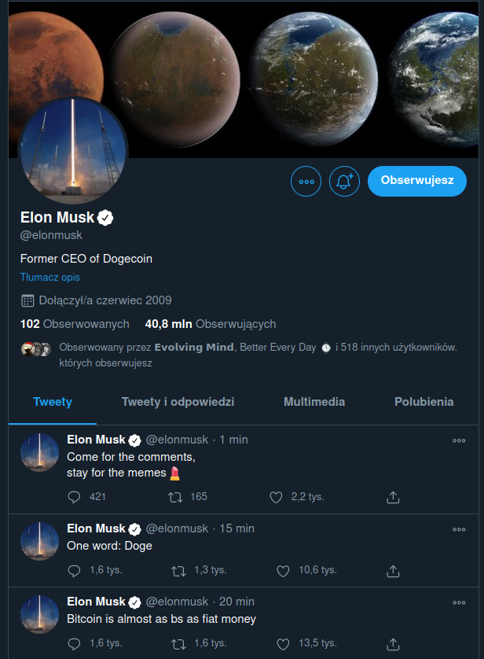
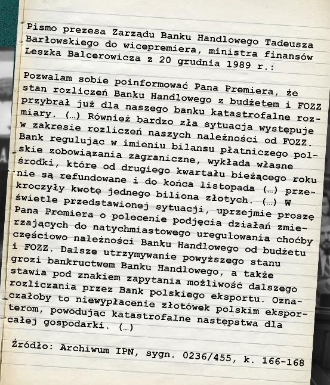
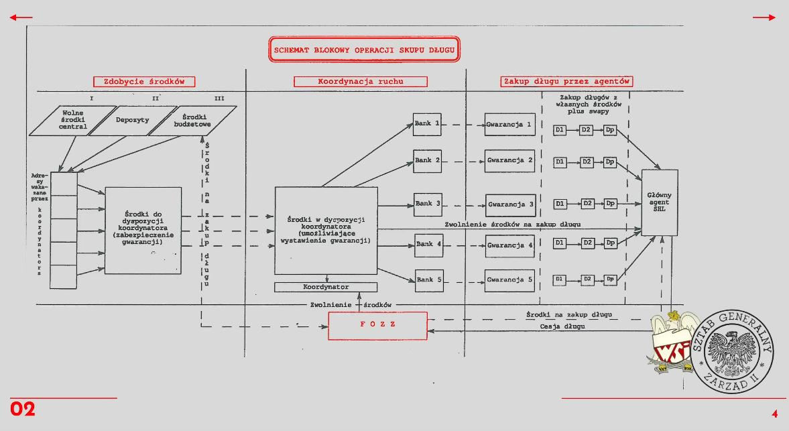
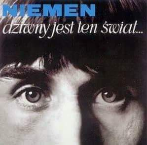
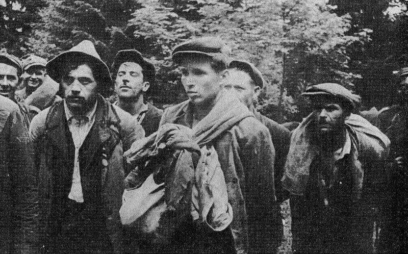
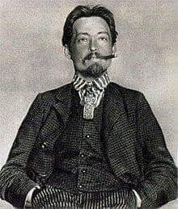
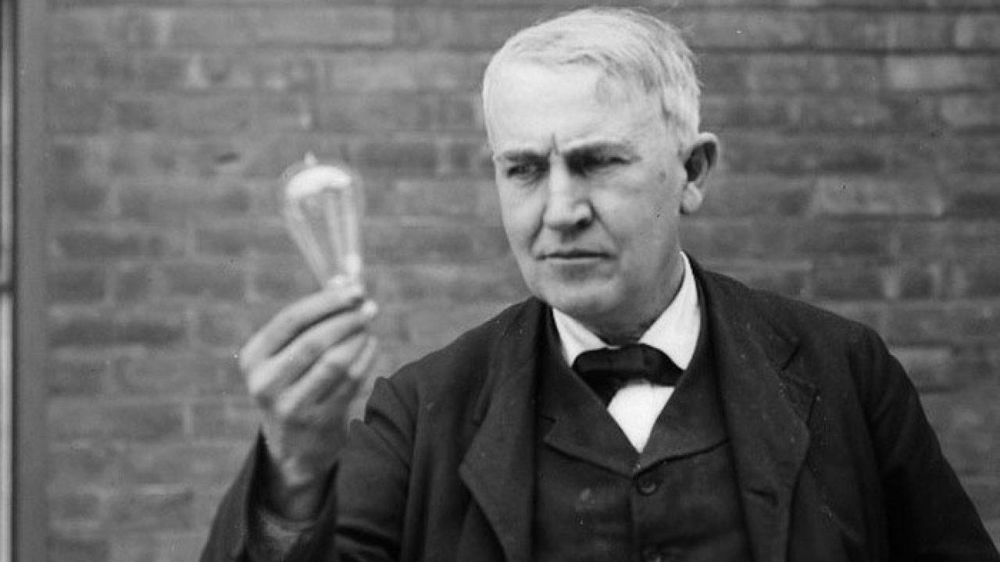

### 2023

Why all central banksters MUST CONTINIOUSLY LIE...

  

The philosophical lie: To sustain a massive falsehood over time, facts must be constantly denied. Otherwise, people will hold the scam up to reality and check it against evidence. The falsehood needs to blur the truth, or destroy it, so that facts become discredited. If the lie is successful over time, people come to believe that the way things are right now—what they are told is “true”—is the way things have always been and must always be. Nothing but the lie is practical or possible.

Central Bank, Paper currency as debt was “the ghost of money”; coins were the reality. They were opposites of each other, like lies and truth, with one being a phantom and the other being the substance of life. Paper money is not merely an expression of and a pathway to corruption, it is also an existential parallel to free-market money. (“Existential” here means that fiat affirms the existence of money by being a “ghost” of it, even while contradicting money’s substance.)

The challenge for central banks is to make the phantom seem real and the reality seem fraudulent. One way to do so is to question the validity of objective reality itself. After all, if there is no objective reality—if reality is dictated by authorities, the narrative, the majority, or other subjective forces—then there is nothing factual against which to assess anything. When nothing is objectively false or true, a lie is as valid as the truth.

Thus central banks in 2023, had created debt as the 'phantom' of irredeemable fiat-money, via perpetuating the lie of monetary value existence within a continuously debased national currency.

Central banking is immoral. Fiat money and its inevitable inflation are theft; the banking monopoly robs people of opportunity and prosperity; the punishment of financial dissenters, negates freedom by denying individuals the use of their own property. This is a problem for central banking because it is an oppressive double standard which enslave all nations peoples via central bank issued 'debt' as circulating fiat-money.

Central banking is a metaphysical lie that requires the discrediting of fact. Lies are used to establish the superiority of state-controlled finances over a privately-controlled system and so gin up people’s compliance to remain enslaved by the central banksters debt. The worlds central banks know truth from lies; they know what they are doing when the peddle the lies of fiat-monetary value.

---

Tang Xiao'ou, miliarder założyciel chińskiego giganta AI SenseTime, zmarł w piątek z powodu tajemniczych "kwestii zdrowotnych". Takie oświadczenie zostało wydane przez częściowo państwową firmę.

  

---

### 2021

  

### 2020

Lata 2022 - ~2030 to czas kiedy zarządy spółek będą tłumaczyć się przed inwestorami, dlaczego nie posiadają w księgach aktywa rezerwowego - BTC.

---

  

---

### 1991

Polska została przyłączona do międzynarodowej sieci komputerowej znanej obecnie pod nazwą Internet. Pierwszymi włączonymi do sieci polskimi instytucjami były placówki naukowe Uniwersytetu Warszawskiego czyli Instytut Fizyki Jądrowej i Obserwatorium Astronomiczne oraz pojedyńcze komputery znajdujące się w Krakowie,Toruniu i Katowicach.
Pierwszą polskim prywatnym odbiorcą internetu została w czerwcu 1992 roku firma ATM S.A.
W sierpniu 1993 roku powstał pierwszy
polski serwer www, pod nazwą "Polska
Strona Domowa". Natomiast internet znany nam w obecnej formie uruchomiono w kwietniu 1996 roku.
Obecnie internet w Polsce dostępny jest dla ponad 80 % procent gospodarstw domowych.

### 1989

  

  

### 1982

W Genewie zmarł Artur Rubinstein - wybitny polski pianista pochodzenia żydowskiego. Urna z prochami wirtuoza została pochowana niedaleko Jerozolimy na zboczu góry Orah.
Rubinstein kształcił się w Berlinie u Heinricha Bartscha i Rudolfa Breithaupta (fortepian); kształcił się także pod kierunkiem Ludomira Różyckiego i Ignacego Paderewskiego oraz Maxa Brucha (kompozycja).
Do historii przeszedł jako najwybitniejszy wirtuoz XX wieku oraz genialny odtwórca muzyki Chopina. Był propagatorem muzyki Schuberta, Szymanowskiego, a także muzyki hiszpańskiej. Wystąpił na scenie ponad sześć tysięcy razy.
Podczas jednego ze swoich występów, a było to w trakcie uroczystości podpisania Karty Narodów Zjednoczonych w 1945 roku, Rubinstein zamanifestował swój patriotyzm na koncercie dla delegatów w sali opery w San Francisco: “W tej Sali, w której zebrały się wielkie narody, aby uczynić ten świat lepszym, nie widzę flagi Polski, za którą toczono tę okrutną wojnę” i dodał: “A więc teraz zagram polski hymn narodowy”.

### 1968

Album Czesława Niemena zatytułowany "Dziwny jest ten świat" otrzymał status. Złotej Płyty. Był to pierwszy autorski projekt tego artysty i równocześnie pierwsze polskie wydawnictwo muzyczne uhonorowane tym wyróżnieniem.
Album ten wyprodukowany w wytwórni muzycznej Muza ukazał się w 1967 roku, a oprócz tytułowego utworu znalazły się na nim takie kompozycje jak: "Domek bez adresu", "Pamiętam ten dzień" czy "Wspomnienie".

 

### 1943

1943 roku na Wołyniu, dowodzący zahonem UPA imienia Bohuna, Porfirij Antoniuk ps "Sosenko" podpisał porozumienie z Niemcami.
W pakcie tym "wyjaśniono" Niemcom zasadnicze cele działalności ukraińskiej partyzantki narodowej.
Antoniuk wymienił trzy główne cele UPA tj. walka przeciwko bolszewizmowi, walka ze wszystkim co polskie, walka o utworzenie niepodległej Ukrainy. Na koniec dodał, że UPA chce aby Niemcy nie atakowali ich oddziałów. Dowódca niemiecki przedstawił swój punkt widzenia sprawy, który przedstawiał się następująco: UPA może zwalczać bolszewizm bez ograniczeń, w stosunku do Polaków ma podejmować walkę wyłącznie z uzbrojonymi oddziałami, które przeprowadzały antyniemieckie akcje, UPA nie może likwidować polskich placówek samoobrony, ponieważ jest to zadanie policji bezpieczeństwa. Ponadto UPA nie może atakować polskich osiedli, ponieważ jest to działanie na szkodę Niemców, którzy mają problemy ze ściąganiem żywności na tych terenach. Niemiecki kapitan, przedstawił sprawę jasno i zaznaczył, że w przypadku niedotrzymania warunków UPA będzie postrzegana jako ,,nielegalna banda, którą będziemy zwalczać i niszczyć’’. Przedstawiciel niemiecki zaznaczył w sprawozdaniu, że rozmowy nad kwestią polską zajęły kilka godzin i spotkały się z ,,silnym oporem przedstawicieli UPA’’.
Na zdjęciu członkowie sotni Bira, odpowiedzialnej za mordy w Sakowczyku, Tworylnem, Hulskiem, Zatwarnicy i Krywem, schwytani przez żołnierzy Ludowego Wojska Polskiego w 1946 roku.

 

### 1917

Rada Komisarzy Ludowych powołała do życia Wszechrosyjską Nadzwyczajną Komisję do Spraw Walki z Kontrrewolucją i Sabotażem (Czeka). Na jej czele stanął polski i rosyjski działacz komunistyczny Feliks Dzierżyński (zdjęcie).
Akronim Czeka wywodzi się od drugiej nazwy nadanej tej instytucji w 1918 roku,która brzmiała "Czeriezwyczajka".
Dzierżyński kierował tą instytucją aż do
śmierci w 1926 roku. Oprócz centralnego
organu WCzK, istniały terenowe komisje
nadzwyczajne CzK.

 

### 1879

Thomas A. Edison zademonstrował w Menlo Park w stanie New Jersey swoją żarówkę.
Wynalazł ją 21 października 1879 roku, po 13 miesiącach eksperymentów, aby znaleźć odpowiedni materiał na żarnik. Odkrył, że zwęglone włókna bawełniane mogą działać przez 40 godzin w próżni wewnątrz szklanej bańki. Kiedy pierwsza publiczna demonstracja odbyła się w Menlo Park 31 grudnia 1879 r., Pennsylvania Railroad Company uruchomiła tam specjalne pociągi, aby umożliwić publiczności obejrzenie pokazu.

  

---

<a href="https://github.com/TomaszWaszczyk/historia.waszczyk.com/edit/master/src/content/december-20.md" target="_blank">Edytuj tę stronę dzieląc się własnymi notatkami!</a>
