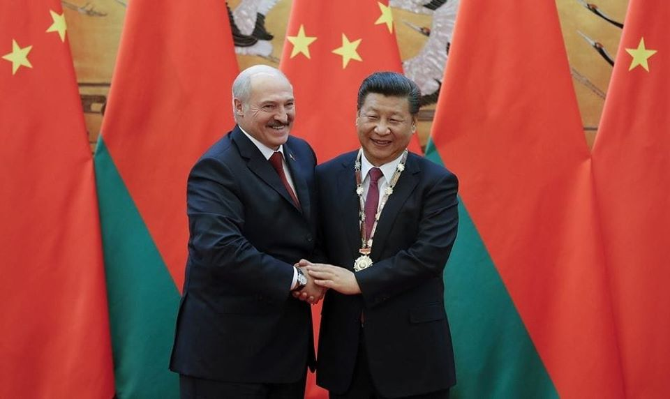
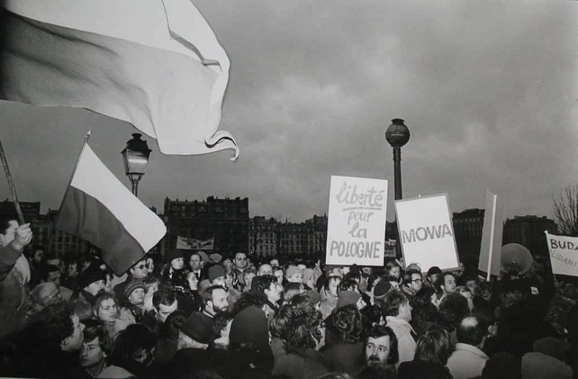
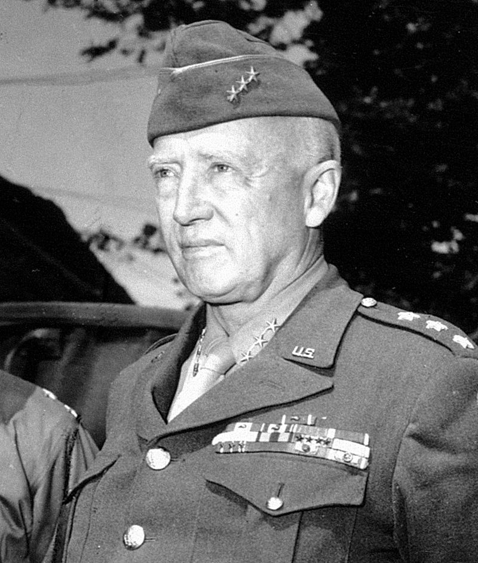
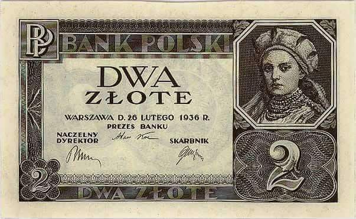
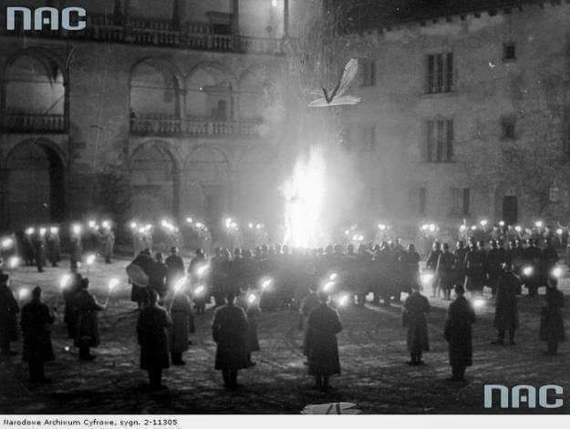
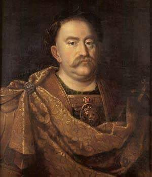
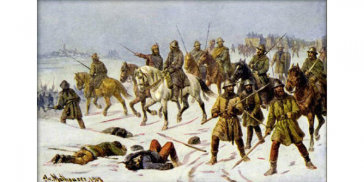

### 2019

Ciekawa sytuacja w dawnym Wielkim Księstwie Litewskim, czyli na Białorusi.

Ciekawa, i chyba jednak trochę zaskakująca, bo Chiny wbrew Rosji, postanowiły wesprzeć niezależność/niepodległość Białorusi.

Z jednej strony nie ma co udawać, że taki wariant był niemożliwy ( przynajmniej ja nie zamierzam udawać, że nie brałem go pod uwagę), bo Wielki Kamień ( z 5-procentowym udziałem Duisburga), wszechobecne chińskie napisy w Mińsku, 10 lat ( a nawet więcej) uśmiechów i tak zwanego „dobrego klimatu” w relacjach Białoruś-Chiny.

Z drugiej strony, to było tylko 10 lat ( lub więcej) poklepywania się po plecach. Tylko tyle, i aż tyle.

Ale teraz, gdy Białorusi przystawiono nóż do gardła ( lub pistolet do głowy, jeśli ktoś bardziej od Iwana Groźnego, woli jego XX-wieczną wersję), to okazuję się, że w Państwie Środka znalazły się pieniądze na 500 mln USD kredytu z dowolnym przeznaczeniem.

I co ciekawe nastąpiło to, jak piszą Bartłomiej Radziejewski z Nowej Konfederacji i Rusłan Szoszyn, autor artykułu w Rzeczpospolitej, „w najbardziej odpowiednim momencie dla Białorusi, a w najmniej odpowiednim dla Rosji”.

Rodzi to kilka bardzo istotnych pytań, których listę przedstawiam poniżej.

Jedno natomiast nie ulega wątpliwości. Ten drobny przelew, akurat w tym szczególnym momencie, zmienia sytuację w bezpośrednim otoczeniu Polski, a faktem staję się to, co można było uznawać tylko za jeden z wariantów i to niekoniecznie najbardziej prawdopodobny.

Teraz jest już jasne, iż Chinom podoba się sytuacja, w której istnieje Białoruś ( niezależna, lub nie do końca zależna od Rosji, ale jednak istnieje).

I kiedy ta krucha ( i powiedzmy sobie szczerze, w takiej formie, nieakceptowalna dla III RP, bo niedemokratyczna) państwowość zaczyna być zagrożona, to są w stanie wykonać w tej sprawie jakieś realne posunięcia i wychodzą poza formułę symbolicznych gestów, czy kurtuazyjnych uśmiechów, wysyłając drobny (z perspektywy Chin) przelew.

I tu pojawia się cała lista pytań, na które trzeba odpowiedzieć, poza lub na marginesie oficjalnego dyskursu w Polsce, który rządzi się swoimi prawami (co trzeba uszanować i zaakceptować, ale chyba jednak nie za cenę unikania poniższych pytań, które zaczynają się już odnosić do bezpośredniego otoczenia Polski):

Po pierwsze, co zrobi ( lub co będzie w stanie zrobić) Rosja?

Wejście na teren dawnej Rusi, ostentacyjne mieszanie się w sprawy (domniemanego) rosyjskiego dominium, to policzek.

Białoruś dla Rosji, jest jak Hongkong ( i Tajwan) dla (Wielkich) Chin. Pekin swoim działaniem otwarcie i brutalnie to zakwestionował. A nie ma Wielkiej Rosji, bez Białorusi (i Ukrainy). I co teraz?

Po drugie, jaki koszt są w stanie ponieść Chiny, aby utrzymać kruchą ( w nieakceptowalnej dla III RP formie) państwowość białoruską?

Białoruś to istotny element transportowego Nowego Jedwabnego Szlaku (ale i tak właściwie nie istnieje, bez przejazdu przez Federację Rosyjską). Czy warto zatem inwestować w 10 milionowy kraj, wyłącznie z tego powodu, w dodatku narażając się Rosji?

Chiny starają się unikać sponsoringu i zaangażowania, bowiem to oznacza koszty i zamiast tego preferują konkretne deale oparte na konkretnych korzyściach (nie zawsze symetrycznie rozłożonymi pomiędzy państwami, często nie zawsze równomiernie rozłożonymi w konkretnych państwach).

Na ile cenna jest zatem dla Chin Białoruś? Czy był to jednorazowy przelew na pół miliarda dolarów, czy to początek całej serii? Każdy wie, że Chiny posiadają zasoby, które pozwalają jej bez trudu przelicytować Federację Rosyjską. Czy będą chciały to zrobić? I co będą chciały w zamian?

Po trzecie, jaki koszt poniesie Białoruś?

Czy pomysłem Aleksandra Łukaszenki, na białoruską państwowość, jest „oddanie się pod opiekę” jeszcze silniejszego imperatora, który wyrósł na Wschód od Moskwy? Czy będzie on oczekiwał tylko symbolicznego trybutu, czy konkretnych wymiernych korzyści?

I czy poczynione koncesje nie okażą się jeszcze bardziej dolegliwe dla niezbyt zasobnego, młodego państwa, a Białoruś popadnie w jeszcze większą ( i jeszcze bardziej dla nas nieakceptowalną) zależność, ale tym razem od dalekiego Imperatora rezydującego nie w Moskiwe, ale za Wielkim Murem w Północnej Stolicy?

Po czwarte, jeśli Pekin zdecyduje się „ustanowić stały przelew” dla słabiutkiej i zagrożonej Białorusi Aleksandra Łukaszenki, to na ile będzie ona w tej koncepcji niezależna od Rosji i przede wszystkim na ile będzie niezależna ( lub uzależniona) od samych Chin?

Czy będzie zależna (uzależniona) tylko od Chin, czy również w jakiejś mierze od Rosji?

Czy w tej sytuacji Białoruś pozostanie stabilną, nieakceptowalną dla nas dyktaturą, czy stanie się obszarem rywalizacji mocarstw, co zawsze powoduję chaos (vide Ukraina)?

Po piąte, co po (nieakceptowalnym dla III RP) Łukaszence?

Czy rządy przejmie Kolia, który od 2017 roku regularnie razem z Ojcem uczestniczy w szczytach Pasa i Szlaku ( miałem okazję ich tam zobaczyć osobiście dwa lata temu)? Jak odnajdzie się on ( albo inny następca Łukaszenki) w tej niezwykle skomplikowanej rozgrywce i to nie z byle kim, bo z Rosją i Chinami? (a przecież w tle jest jeszcze UE i Stany).

Czy można sobie wyobrazić trudniejsze warunki do skutecznej sukcesji? Czy ceną będzie zredukowanie państwowości Białorusi do wymiaru symbolicznego ( czy obecna jest symboliczna, czy jednak nie?), czy po kilku dekadach, jej całkowita likwidacja?

Po szóste, i dla nas najważniejsze, co zrobią Stany Zjednoczone i Unia Europejska?

Po siódme, znów Rosja.

Bo przecież nie można wykluczyć wariantu, w którym Chiny tylko podbijają bębenek by uznać iż Białoruś jednak nie posiada, ani istotnych walorów (ani tym bardziej zasobów) dla Chin i w ostateczności ułożyć się z Rosją, uzyskując od niej dodatkowe koncesje (a Białoruś potraktować, jako element przetargowy)...

Wówczas to Białoruś pozostanie sam na sam z Rosją, a Chiny zdyskontowałyby sobie to w inny sposób (pytanie co takiego mogłaby zaproponować Rosja, za chińskie niezaangażowanie na Białorusi, które jak widzimy, jest możliwe).

Po ósme, co to oznacza dla Polski?

Wygląda na to, że z demokratyzacji Białorusi w co tak dużo zainwestowaliśmy i nad czym tak wytrwale pracowaliśmy na razie nic nie wyszło.

Walczy ona o przetrwanie i nie waha się użyć chińskiego lewaru. Trochę szkoda, iż to nie ambitna polityka jagiellońska Lecha Kaczyńskiego, przyczynia się do zachowania państwowości białoruskiej, ale dalekie i nowo wyrosłe mocarstwo na Wschód od Rosji ( reprezentujące nieakceptowalne dla III RP wartości).

Mam nadzieję, że można spojrzeć prawdzie w oczy i zadać politycznie niepoprawne pytanie:

Co w sytuacji gdy dawne Wielkie Księstwo Litewskie wejdzie w orbitę wpływów Pekinu?

Last but not least, Chiny potrafią czekać i to już wiemy.

Niczym giełdowy gracz, pojawiają się wówczas, gdy nadchodzi dobry moment na zakup, a cena aktywów spada. Wtedy można kupić całkiem tanio i jak pokazują przykłady wielu krajów, być może nawet przejąć pakiet kontrolny.

Wygląda na to, że tym razem Chiny wybrały moment na wysłanie przelewu w najlepszym dla siebie momencie.

Chyba był to również najlepszy moment dla Białorusi, albo można napisać najlepszy moment, bo jeszcze chwila, i innego wyboru, oraz innego „momentu” mogło w ogóle nie być.

Alternatywą był kolejny krok, w Zjednoczeniu Wielkiej Rusi, a tego jak się okazuję nie chce ani Aleksander Łukaszenka ani Białorusini, także Ci, oglądający Bielsat, którym jednak spodobało się posiadanie, słabego i uzależnionego, ale jednak własnego państwa.

Ale czy ta strategiczna zbieżność utrzyma się długo? I czy w ogóle zaistnieje? A jeśli tak, do czego doprowadzi? Jakie tutaj pojawiają się warianty?

Czy powinniśmy się w Polsce nad tym zastanawiać, czy może jednak nie powinniśmy sobie zadawać w ogóle takich pytań?

W nowym 2020 roku, zapraszam Państwa, na kolejne edycje studiów, które poprowadzę na uczelniach wyższych, gdzie wspólnie staramy się przewidywać różne warianty i poruszać wyżej wymienione kwestie ( a uważam, iż mają one dla nas w PL, bardzo duże znaczenie...).

 

### 2011

Doszło do najtragiczniejszego wydarzenia w historii misji polskich żołnierzy w Afganistanie. Tego dnia talibowie przeprowadzili atak na konwój w pobliżu miejscowości Razaak, w wyniku którego zginęła cała załoga poruszająca się opancerzonym samochodem typu Oshkosh M-ATV, w którym jechało pięciu polskich żołnierzy z 20. Brygady Zmechanizowanej w Bartoszycach. Zdalnie odpalona mina-pułapka, o prawdopodobnej masie 100 lub 150 kg rozerwała pojazd na dwie części i zabiła dowódcę drużyny starszego kaprala Piotra Ciesielskiego (33 lat), starszego szeregowego Łukasza Krawca (24 lat), starszego szeregowego operatora załogi wozu dowodzenia Marcina Szczurowskiego (30 lat), starszego szeregowego Marka Tomalę (25 lat) i szeregowego Krystiana Banacha (22 lat). Polegli żołnierze zajmowali się ochroną specjalistów z Zespołu Odbudowy Prowincji (PRT), którzy pomagali lokalnej ludności: budowali szkoły, drogi czy szpitale. Prezydent RP Bronisław Komorowski uhonorował poległych Orderami Krzyża Wojskowego oraz Gwiazdą Afganistanu. Pogrzeb żołnierzy odbył się w Wigilię.

### 1981

1981 roku francuscy związkowcy z prawie wszystkich central związkowych (oprócz CGT, związku powiązanego z Francuską Partią Komunistyczną) przystąpili do godzinnego strajku, na znak solidarności z polskimi robotnikami.
Warto też dodać, że nie była to jedyna reakcja Francuzów na to, co działo się w Polsce. Już 13 grudnia 1981 roku w całym kraju odbyły się 153 manifestacje, w których udział wzięło 116 tysięcy osób.
Przerwa w pracy, za którą zapłacono strajkującym była też doskonałą okazją do zebrania środków finansowych dla polskich związkowców.
W nadesłanym z Nantes liście pracowników Dyrekcji Regionalnej Telekomunikacji i Agencji Handlowej do centrali Solidarności w Paryżu czytamy:
" Drodzy Przyjaciele z Komitetu Koordynacyjnego „Solidarności” we Francji,
Pracownicy Dyrekcji Regionalnej Telekomunikacji i Agencji Handlowej w Nantes, przerwali pracę między godziną 11 a 12, w poniedziałek 21 grudnia 1981 aby zaprotestować przeciwko zamachowi stanu generała Jaruzelskiego i przekazać swoje wsparcie dla oporu społeczeństwa polskiego wobec stanu wojennego.
Decydując się nieść pomoc wystarczającą i wyraźną, zgromadzenie ogólne zdecydowało przekazać Komitetowi Koordynacyjnemu „Solidarności” pomoc finansową, której udzieliło 160 osób, a która wynosi 7 980 Franków.
Bądźcie w stanie, z pomocą sił, które zawsze wierzą w polską odnowę, walczyć przeciwko kłamstwu, dezinformacji i brutalnej represji, które zawsze są twarzą każdej normalizacji"

 

### 1945

1945 roku zginął w niejasnych okolicznościach amerykański generał George Smith Patton Junior

> "Niestety, niektórzy z naszych przywódców są po prostu cholernymi durniami i nie mają pojęcia o historii Rosji. Cholera, mam wątpliwości, czy wiedzieli chociaż tyle, że Rosja jeszcze niecałe sto lat temu zajmowała Finlandię, wyssała krew z Polski i zrobiła z Syberii więzienie dla własnego narodu. Wyobrażam sobie, jak szydził Stalin, kiedy uzyskał od nich wszystko podczas tych niby konferencji”

W Heidelbergu w Niemczech, w tajemniczych okolicznościach zginął amerykański generał George Smith Patton Junior.
Był antykomunistą i nie bał się mówić o prawdy o komunistycznym tyranie Józefie Stalinie. Istnieją publikacje dowodzące, że został on zabity przez agentów NKWD na rozkaz Stalina we współpracy z OSS . Powodem dokonania zamachu na Pattona miała być jego odmowa wydania w ręce sowieckie żołnierzy Brygady Świętokrzyskiej oraz wcielenie jej w całości w szeregi armii amerykańskiej jako kompanii wartowniczej. Patton również dość głośno wyrażał swoje antykomunistyczne poglądy. Sowiecka propaganda usiłowała nawet rozpuszczając plotki przekonać opinię publiczną iż jakoby Patton chciał doprowadzić do konfliktu z Armią Czerwoną, aby w ten sposób wywołać z ZSRR wojnę. Zbierał ponoć też informacje na temat różnych grzeszków zachodnich dowódców, które mógłby zaszkodzić im w karierach. Na potwierdzenie swoich teorii o zamachu na życie generała, są wskazania na szereg faktów, m.in. zaginięcie dokumentów ze śledztwa, brak jakichkolwiek ran czy nawet zadrapań u kierowcy i drugiego pasażera, zeznania Douglasa Bazata – agenta OSS, brak sekcji zwłok. Wreszcie podmieniony samochód Pattona w muzeum mu poświęconym. Po co ktoś miałby zadawać sobie tyle trudu, skoro rzekomo był to tylko zwykły wypadek?

 

### 1939

Na terenach zajętych przez ZSRR został uniewaważniony polski złoty. Oznaczało to wycofanie tej waluty z obiegu bez możliwości wymiany na wprowadzonego na jego miejsce rubla. Tym samym miliony Polaków straciły wszystkie oszczędności.

 

---

W nocy z 21 na 22 grudnia 1939 roku w Krakowie Niemcy obchodzili uroczyście tzw święto przesilenia nocy.
Ogniska i pochodnie zapalono na Kopcu Kościuszki, na Wawelu i w wielu innych punktach Krakowa. Uroczystości te były nawiązaniem do starogrmańskiej tradycji święta Jul, kiedy to plemiona germańskie składały hołd słońcu i wierzyły w jego odradzanie się. Pogańskie uroczystości w 1939 roku były jedynymi, które okupacyjne władze urządziły w Krakowie z takim rozmachem.

 

### 1874

https://pl.wikipedia.org/wiki/Tadeusz_Boy-%C5%BBele%C5%84ski

### 1807

Wszedł w życie Dekret Grudniowy-dokument będący rozwinięciem czwartego artykułu Konstytucji Księstwa Warszawskiego nadawał wolność osobistą jego mieszkańcom. Na mocy tego dekretu wprowadzone zostały zasady kapitalistycznej własności ziemi, które zastąpiły feudalizm. Tym samym chłopstwo zostało pozbawione praw do ziemi, a dziedzic, który stał się jej właścicielem zyskał prawo do usunięcia z niej chłopa wedle własnego uznania, jednak z zachowaniem sześciomiesięcznego okresu wypowiedzenia.
Drugi aspekt Dekretu Grudniowego był taki, że chłop mógł dowolnie przemieszczać się po terenie państwa, jednak był zobowiązany do pozostawienia swemu panu tzw. załogi, czyli inwentarza żywego, budynków i narzędzi, a także zasiewów.
Grafika; Żniwa, obraz pędzla Adama Ciemniewskiego.

 

### 1686

Podczas posiedzenia Senatu we Lwowie król Polski Jan III Sobieski (grafika) zaprzysiągł tzw "Traktat Grzymułtowskiego". Był to dokument zawierający treść traktatu pokojowego kończącego wojnę polsko-rosyjską w latach 1654-1667.
Na mocy tego porozumienia Polska zrzekła się Ukrainy Lewobrzeżnej z Kijowem, Smoleńszczyzny, Ziemi Czernichowskiej, Drohobuża i Starobuda.
Rzeczpospolita gwarantowała prawosławnym wolność wyznania i do tego samego było zobowiązana Rosja ws. katolików.
Rosja zaoferowała przymierze przeciwko Turcji i Chanatowi Krymskiemu, przyznając Rzeczypospolitej subsydium wwysokości 146 000 rubli.

 

### 1421

1421 roku Jan Žižka pokonał armię katolików po Kutną Horą. Bitwa miała miejsce w czasie wojen husyckich, w trakcie II krucjaty antyhusyckiej. Panowanie nad tym miastem dawało strategiczną przewagę we wschodnich Czechach. Žižka koncentrował do obrony ok. 12 tys. żołnierzy. Siły katolików, głównie Niemców i Węgrów, wynosiły 50 tys. i były dowodzone przez Zygmunta Luksemburskiego. Wojska cesarza zajęły pozycję naprzeciw wozów taborowych husytów. Na froncie stanęli Madziarzy, dowodzeni przez Pippo Spano. Walki trwały do zmierzchu. O zmierzchu większa część wojsk zaatakowała husytów na zachodnim wzgórzu. W tym samym czasie Węgrzy wtargnęli przez bramę do miasta i rozpoczęli rzeź zwolenników heretyków w mieście. Sytuacja Czecha była zła, otoczony przez wojska nie mógł pomóc mieszkańcom. Następnego dnia jego wojska przebiły się przez siły cesarza i podążyły na północ. Zygmunt Luksemburski nie gonił ich, lecz zdobył miasto.

 

---

<a href="https://github.com/TomaszWaszczyk/historia.waszczyk.com/edit/master/src/content/december-21.md" target="_blank">Edytuj tę stronę dzieląc się własnymi notatkami!</a>
