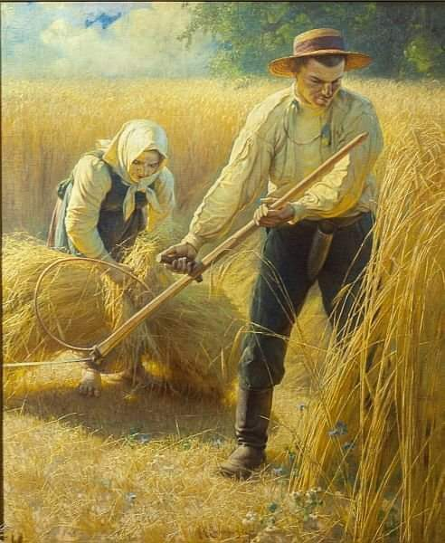

### 2011

Doszło do najtragiczniejszego wydarzenia w historii misji polskich żołnierzy w Afganistanie. Tego dnia talibowie przeprowadzili atak na konwój w pobliżu miejscowości Razaak, w wyniku którego zginęła cała załoga poruszająca się opancerzonym samochodem typu Oshkosh M-ATV, w którym jechało pięciu polskich żołnierzy z 20. Brygady Zmechanizowanej w Bartoszycach. Zdalnie odpalona mina-pułapka, o prawdopodobnej masie 100 lub 150 kg rozerwała pojazd na dwie części i zabiła dowódcę drużyny starszego kaprala Piotra Ciesielskiego (33 lat), starszego szeregowego Łukasza Krawca (24 lat), starszego szeregowego operatora załogi wozu dowodzenia Marcina Szczurowskiego (30 lat), starszego szeregowego Marka Tomalę (25 lat) i szeregowego Krystiana Banacha (22 lat). Polegli żołnierze zajmowali się ochroną specjalistów z Zespołu Odbudowy Prowincji (PRT), którzy pomagali lokalnej ludności: budowali szkoły, drogi czy szpitale. Prezydent RP Bronisław Komorowski uhonorował poległych Orderami Krzyża Wojskowego oraz Gwiazdą Afganistanu. Pogrzeb żołnierzy odbył się w Wigilię.

### 1981

1981 roku francuscy związkowcy z prawie wszystkich central związkowych (oprócz CGT, związku powiązanego z Francuską Partią Komunistyczną) przystąpili do godzinnego strajku, na znak solidarności z polskimi robotnikami.
Warto też dodać, że nie była to jedyna reakcja Francuzów na to, co działo się w Polsce. Już 13 grudnia 1981 roku w całym kraju odbyły się 153 manifestacje, w których udział wzięło 116 tysięcy osób.
Przerwa w pracy, za którą zapłacono strajkującym była też doskonałą okazją do zebrania środków finansowych dla polskich związkowców.
W nadesłanym z Nantes liście pracowników Dyrekcji Regionalnej Telekomunikacji i Agencji Handlowej do centrali Solidarności w Paryżu czytamy:
" Drodzy Przyjaciele z Komitetu Koordynacyjnego „Solidarności” we Francji,
Pracownicy Dyrekcji Regionalnej Telekomunikacji i Agencji Handlowej w Nantes, przerwali pracę między godziną 11 a 12, w poniedziałek 21 grudnia 1981 aby zaprotestować przeciwko zamachowi stanu generała Jaruzelskiego i przekazać swoje wsparcie dla oporu społeczeństwa polskiego wobec stanu wojennego.
Decydując się nieść pomoc wystarczającą i wyraźną, zgromadzenie ogólne zdecydowało przekazać Komitetowi Koordynacyjnemu „Solidarności” pomoc finansową, której udzieliło 160 osób, a która wynosi 7 980 Franków.
Bądźcie w stanie, z pomocą sił, które zawsze wierzą w polską odnowę, walczyć przeciwko kłamstwu, dezinformacji i brutalnej represji, które zawsze są twarzą każdej normalizacji"

 

### 1939

Na terenach zajętych przez ZSRR został uniewaważniony polski złoty. Oznaczało to wycofanie tej waluty z obiegu bez możliwości wymiany na wprowadzonego na jego miejsce rubla. Tym samym miliony Polaków straciły wszystkie oszczędności.

 

---

W nocy z 21 na 22 grudnia 1939 roku w Krakowie Niemcy obchodzili uroczyście tzw święto przesilenia nocy.
Ogniska i pochodnie zapalono na Kopcu Kościuszki, na Wawelu i w wielu innych punktach Krakowa. Uroczystości te były nawiązaniem do starogrmańskiej tradycji święta Jul, kiedy to plemiona germańskie składały hołd słońcu i wierzyły w jego odradzanie się. Pogańskie uroczystości w 1939 roku były jedynymi, które okupacyjne władze urządziły w Krakowie z takim rozmachem.

 

### 1807

Wszedł w życie Dekret Grudniowy-dokument będący rozwinięciem czwartego artykułu Konstytucji Księstwa Warszawskiego nadawał wolność osobistą jego mieszkańcom. Na mocy tego dekretu wprowadzone zostały zasady kapitalistycznej własności ziemi, które zastąpiły feudalizm. Tym samym chłopstwo zostało pozbawione praw do ziemi, a dziedzic, który stał się jej właścicielem zyskał prawo do usunięcia z niej chłopa wedle własnego uznania, jednak z zachowaniem sześciomiesięcznego okresu wypowiedzenia.
Drugi aspekt Dekretu Grudniowego był taki, że chłop mógł dowolnie przemieszczać się po terenie państwa, jednak był zobowiązany do pozostawienia swemu panu tzw. załogi, czyli inwentarza żywego, budynków i narzędzi, a także zasiewów.
Grafika; Żniwa, obraz pędzla Adama Ciemniewskiego.

 

### 1686

Podczas posiedzenia Senatu we Lwowie król Polski Jan III Sobieski (grafika) zaprzysiągł tzw "Traktat Grzymułtowskiego". Był to dokument zawierający treść traktatu pokojowego kończącego wojnę polsko-rosyjską w latach 1654-1667.
Na mocy tego porozumienia Polska zrzekła się Ukrainy Lewobrzeżnej z Kijowem, Smoleńszczyzny, Ziemi Czernichowskiej, Drohobuża i Starobuda.
Rzeczpospolita gwarantowała prawosławnym wolność wyznania i do tego samego było zobowiązana Rosja ws. katolików.
Rosja zaoferowała przymierze przeciwko Turcji i Chanatowi Krymskiemu, przyznając Rzeczypospolitej subsydium wwysokości 146 000 rubli.

 

---

<a href="https://github.com/TomaszWaszczyk/historia.waszczyk.com/edit/master/src/content/december-21.md" target="_blank">Edytuj tę stronę dzieląc się własnymi notatkami!</a>
