### 2022

Grafika przedstawiająca miejsca relokacji największych ukraińskich firm sektora IT. Stan na 22 grudnia. Źródło: Forbes

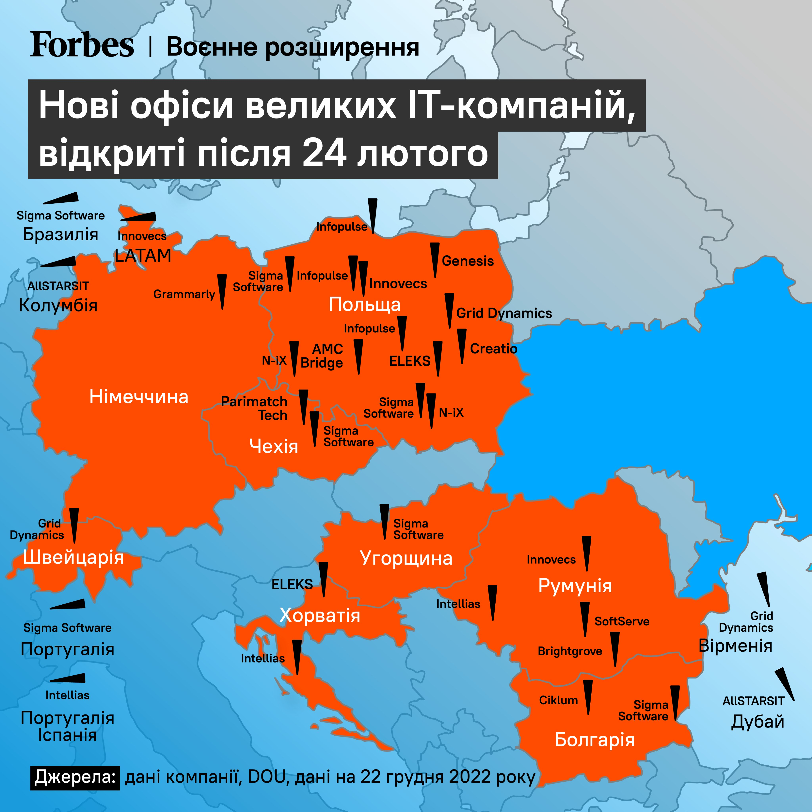  

### 2021

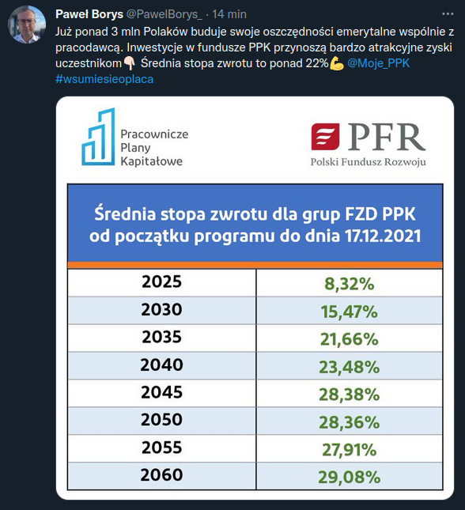  

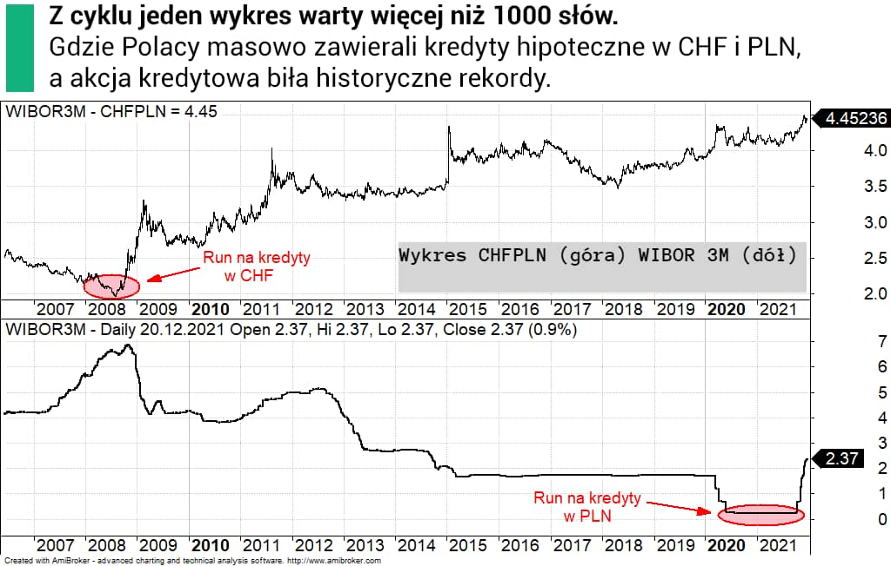  

### 2020

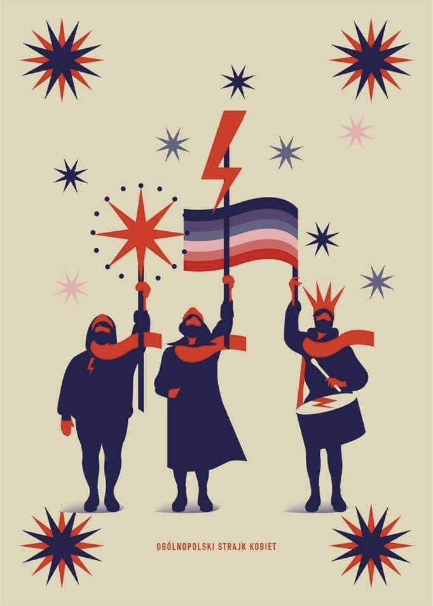  

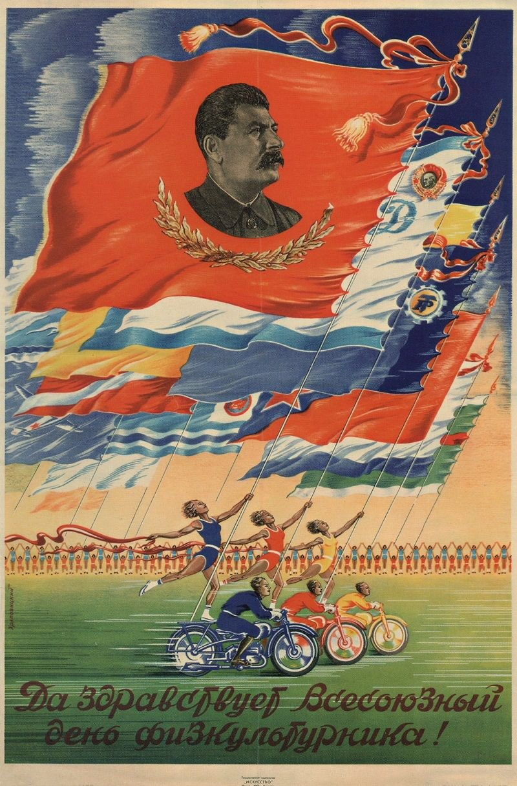  

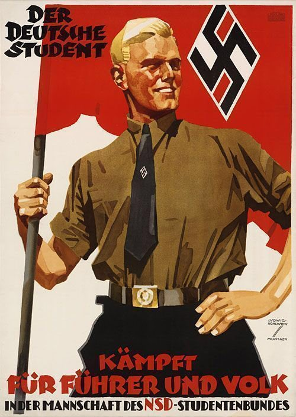  

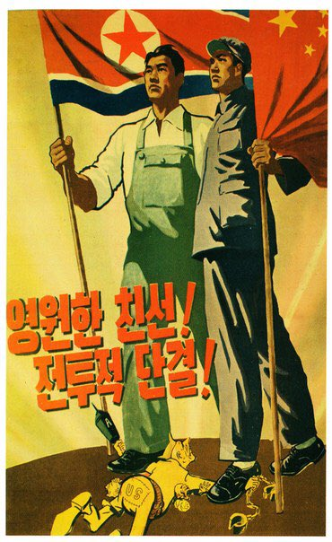  

---

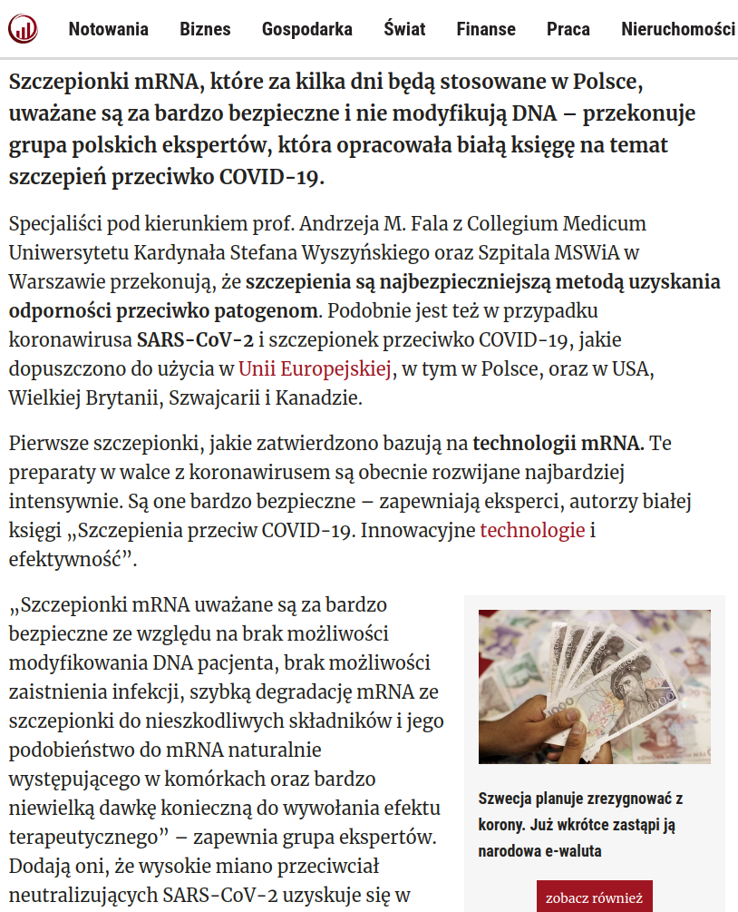  

Źródło: forsal.pl

---

### 1947

Przed Najwyższym Trybunałem Narodowym w Krakowie zakończył się trwający prawie miesiąc proces niemieckich zbrodniarzy KL Auschwitz.
Akt oskarżenia obejmował przede wszystkim zarzuty dotyczące udziału oskarżonych w gazowaniu Żydów przywożonych z całej Europy na terenie obozu w Brzezince, dokonywania rozlicznych egzekucji i maltretowania więźniów oraz popełnienia innych okrucieństw na terenie obozu.
Na ławie oskarżonych znałazło się 40 członków załogi tego obozu zagłady, z których 23 skazano na śmierć, 16 otrzymało wyroki więzienia od 3 lat do dożywocia, a 1 został uniewinniony.
W uzasadnieniu wyroku czytamy:
" Znęcanie się nad i tak nadmiernie udręczonymi więźniami dowodzi wielkiego zezwierzęcenia tych oskarżonych, którzy w wyniku przewodu sądowego zostali skazani na karę śmierci. To znęcanie się ze strony tych oskarżonych, którzy wszyscy brali mniejszy lub większy udział w zabijaniu więźniów, wskazuje też na to, że ci oskarżeni brali udział w tych zabójstwach z potrzeby wewnętrznej zabijania, a nie w wykonaniu rozkazu przełożonych. Gdyby bowiem nie odczuwali potrzeby zabijania, to albo okazywaliby więźniom współczucie, albo też byliby dla nich obojętni, lecz nie znęcaliby się nad nimi."

### 1988

W Warszawie zmarła Aniela Zofia Steinsbergowa, z domu Berlinerblau – polska prawnik, społecznik i tłumaczka żydowskiego pochodzenia, adwokat w wielu procesach politycznych i – po 1956 – rehabilitacyjnych (w 1968 pozbawiona prawa wykonywania zawodu), działaczka Polskiej Partii Socjalistycznej WRN, współzałożycielka Komitetu Obrony Robotników i Komitetu Samoobrony Społecznej KOR.

Urodziła się w Wiedniu w zamożnej rodzinie zasymilowanych polskich Żydów, jako córka Józefa (zm. 1935), który ukończył Konserwatorium Muzyczne w Warszawie, a później uzyskał habilitację z chemii na uniwersytecie w Bernie i był właścicielem (a także dyrektorem) fabryki przerobu juty Stradom w Częstochowie, oraz Heleny z domu Oppenhem (Oppenheim; 1870–1939), absolwentki warszawskiej Szkoły Rysunku. Miała troje rodzeństwa: siostra Dorota (1898–1943) była malarką, brat Adolf (1900–1977) inżynierem chemikiem i dyrektorem technicznym fabryki Stradom (w czasie II wojnie światowej osiadł w Stanach Zjednoczonych), drugi brat Tadeusz (1907–1941 lub 1942) ukończył Akademię Sztuk Pięknych w Krakowie i pracował jako architekt w pracowni Szymona Syrkusa w Warszawie (zginął we Lwowie z rąk Ukraińców).

Dzieciństwo i młodość spędziła w Warszawie. W 1905 roku rozpoczęła naukę szkolną, a jej nauczycielką była m.in. Stefania Sempołowska, aktywna działaczka doby Rewolucji 1905 roku. Aniela po ślubie w 1921 zamieszkała w Krakowie, gdzie własną, uznaną kancelarię adwokacką prowadził jej mąż Emil Steinsberg (1879–1943). Była jedną z pierwszych w Polsce kobiet – adwokatów. W okresie międzywojennym słynęła z obrony komunistów i robotników – była jednym z adwokatów, którzy bronili w 1936 robotników krakowskiej fabryki Semperit, oskarżonych o udział w krwawych zamieszkach, które wybuchły po stłumieniu z użyciem broni przez policję robotniczej demonstracji. Podczas II wojny światowej ukrywała się w Warszawie i pracowała w Radzie Pomocy Żydom Żegota (referacie żydowskim Delegatury Rządu na Kraj), wyszukując kryjówki dla uciekających na aryjską stronę Żydów. Należy wówczas do Polskiej Partii Socjalistycznej – Wolność, Równość, Niepodległość. Wtedy też opiekowała się ciężko chorą Stefanią Sempołowską, do czasu jej śmierci w 1944 roku.

Bezpośrednio po wojnie broniła żołnierzy Armii Krajowej. W latach 1948–1955 należała do PZPR (po połączeniu PPS z PPR). W 1955 razem z mecenasem Władysławem Winawerem reprezentowała Kazimierza Moczarskiego, późniejszego autora Rozmów z katem. Wrażenia z tamtych procesów spisała w swojej kronice Widziane z ławy obrończej wydanej przez Instytut Literacki w Paryżu. Była członkiem Klubu Krzywego Koła oraz sygnatariuszką wielu listów protestacyjnych. Później broniła studentów aresztowanych podczas wydarzeń marcowych w 1968. Podobnie jak przedwojennych komunistów broniła ich za darmo – tym razem swój polityczny wybór przypłaciła utratą prawa wykonywania zawodu. Nie można jednak było jej zabronić udzielania opozycjonistom porad prawnych.

W 1975 podpisała List 59, petycję przeciwko projektowi zmian w Konstytucji PRL (pomysł kampanii konstytucyjnej powstał w jej mieszkaniu). W czerwcu 1976 sygnowała list solidaryzujący się z robotnikami represjonowanymi w Radomiu i Ursusie. Była członkiem–założycielem Komitetu Obrony Robotników. Na krótko przed śmiercią zaangażowała się w próbę reaktywacji Polskiej Partii Socjalistycznej.

W latach 50. była redaktorką pism zebranych Stefanii Sempołowskiej; przetłumaczyła m.in. Smutek tropików i Totemizm Claude’a Lévi-Straussa. Zmarła w Warszawie. Jest pochowana na cmentarzu ewangelicko-reformowanym przy ulicy Żytniej.

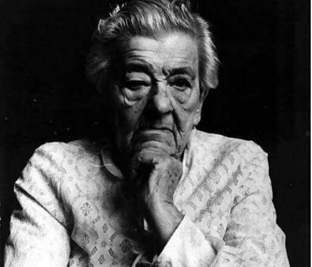 

### 1942

W Krakowie żołnierze Żydowskiej Organizacji Bojowej grupy "Iskra" pod dowództwem Idka Libera dokonali zamachu na niemiecką kawiarnię "Cyganeria" przy ulicy Szpitalnej. Do lokalu wrzucono granaty. Śmierć poniosło 11 Niemców,a 13 zostało rannych.

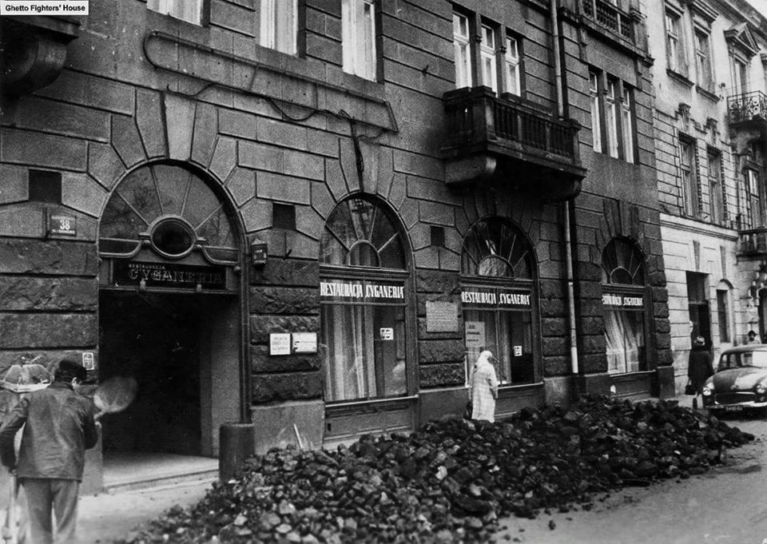 

### 1940

Wyposażeni w nowe samoloty Wellington polscy piloci 301 Dywizjonu Bombowego Ziemi Pomorskiej Obrońców Warszawy wzięli udział w brytyjskim nalocie na rafinerię ropy naftowej w Antwerpii produkującą paliwo dla Niemców Akcja ta zakończyła się pełnym sukcesem.

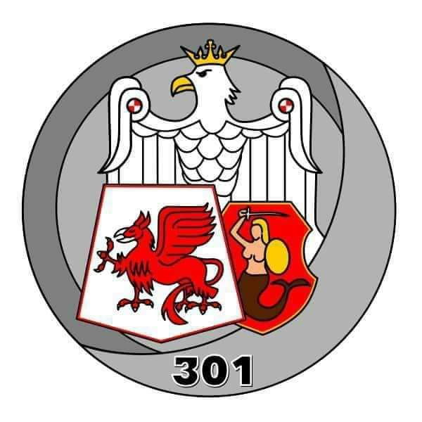 

### 1922

W Warszawie nowy polski prezydent Stanisław Wojciechowski (zdjęcie) złożył przysięgę prezydencką.
Wojciechowski był aktywnym prezydentem, który angażował się w prace rządu,ale nieporozumienia w Sejmie, co do reform gospodarczych i wojskowych przerosły jego możliwości. Kolejne dymisje rządów i ogólny brak jednolitej polityki sprawiły, że w maju 1926 roku doszło do przewrotu na skutek którego Wojciechowski złożył swój urząd.

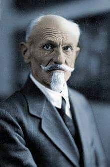 

### 1913

A Polish woman Jadwiga Apostoł was born in Nowy Targ. At the beginning of 1942 arrested for her resistance activity. Imprisoned in #Auschwitz on 1 December 1942. Evacuated to KL Ravensbrück. She survived.

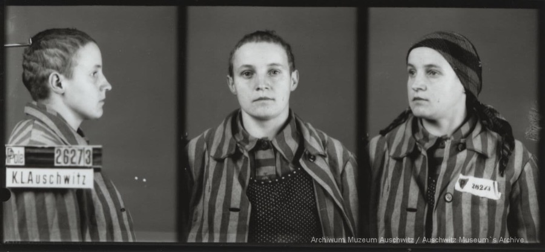 

https://en.wikipedia.org/wiki/Jadwiga_Aposto%C5%82

### 1904

W Berdyczowie urodził się Władysław Bukowiński (zdjęcie), duchowny katolicki, więzień gułagów i obozów koncentracyjnych, duszpasterz i misjonarz w Kazachstanie i Azji Środkowej.
Był absolwentem wydziału prawa, a następnie teologii na Uniwersytecie Jagiellońskim. W roku 1931 przyjął święcenia kapłańskie, a w sierpniu 1936 roku wyjechał do Łucka na Wołyniu, gdzie pracował do roku 1945. Aresztowany 22 sierpnia 1940 roku przez NKWD, został skazany na 8 lat łagrów. 23 czerwca 1941 roku, czyli na drugi dzień po wkroczeniu Niemców do ZSRR został postawiony również przez NKWD pod ścianą śmierci razem z innymi więźniami aresztu w Łucku. Cudem, nie dopadła go żadna z kul, a on sam leżąc na więziennym dziedzińcu udzielał rozgrzeszenia umierającym braciom w niedoli.
Wielokrotnie w czasie swojej posługi ryzykował życiem ukrywając żydowskie dzieci, a także opiekując się ofiarami czystek na Ukrainie.
Drugi raz został aresztowany w nocy z 3 na 4 stycznia 1945 roku razem z biskupem łuckim Adolfem Piotrem Szelążkiem i innymi kapłanami pracującymi w Łucku. W roku 1946 został skazany na 10 lat łagrów, którą to karę odbywał początkowo w obozie Bakał w obwodzie czelabińskim, a następnie, w kopalni miedzi w Dżezgestanie. W roku 1955 został wypuszczony na wolność i wysłany do Karagandy.
Nigdy, mimo takiej możliwości nie powrócił do Polski. Uznał, że jego miejsce jest wśród wiernych w Kazachstanie. Przyjął obywatelstwo sowieckie. Dwa lata później znowu go uwięziono, tym razem na trzy lata. Przebywał w obozie pracy w Czumie w obwodzie irkuckim i
obozie dla „religiozników” w Sosnówce. Po odbyciu kary, w grudniu
1961 roku wrócił do Karagandy. Kontynuował wyprawy misyjne oraz nielegalną pracę duszpasterską, oficjalnie pracując jako nocny stróż. Łącznie przez dwadzieścia lat pracował w Kazachstanie, sprawując jednocześnie opiekę duszpasterską nad wiernymi różnych narodowości, wyjeżdżając do odległych miast, wsi i posiółków całej sowieckiej Azji Środkowej z posługą kapłańską.
Mimo to trzy razy odwiedził swoją ojczyznę, spotykając się przy każdej okazji z metropolitą krakowskim Karolem Wojtyłą, co wzbudzało zainteresowanie SB.
Zmarł 3 grudnia 1974 roku w Karagandzie.
Podczas pielgrzymki do Kazachstanu w 2001 roku tak o nim mówił papież Jan Paweł II:
" „Zawsze żywo interesowałem się waszym losem. Wiele mówił mi o was niezapomniany ks. Władysław Bukowiński, którego wielokrotnie spotykałem i zawsze podziwiałem za kapłańską wierność i apostolski zapał. Był szczególnie związany z Karagandą, ale opowiadał mi o życiu was wszystkich”.
W roku 2011 został pośmiertnie odznaczony Krzyżem Komandorskim z Gwiazdą Orderu Odrodzenia Polski.

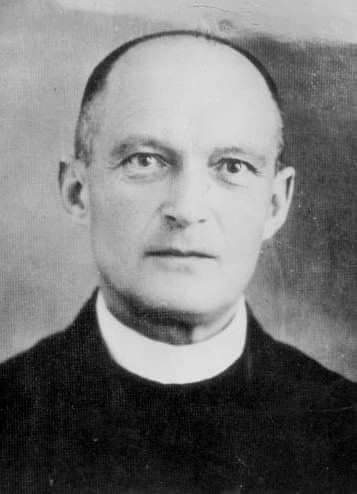 

### 1872

We Lwowie urodził się Zdzisław Krygowski (zdjęcie)-polski matematyk, rektor Politechniki Lwowskiej, pionier badań kryptologicznych nad niemiecką maszyną szyfrującą Enigma. To właśnie jego najzdolniejszym uczniom udało się w 1932 roku złamać niemieckie kody szyfrujące dzięki czemu wywiad brytyjski miał dostęp do wielu cennych informacji.
Zdzisław Krygowski zmarł w 1955 roku.

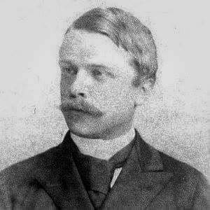 

### 1655

W czasie w potopu szwedzkiego wojska króla Karola Gustawa zajęły Elbląg. Tego samego dnia miasto podpisało akt kapitulacji.
Decyzję o oddaniu Szwedom tego miasta podjęła rada miejska, która nie widziała pomocy z zewnątrz.
Zniszczenia i zarazy spowodowane trwającą pięć lat okupacją zahamowały rozwój miasta na wiele kolejnych lat.
Grafika przedstawia miedzioryt Elbląga z 1655 roku.

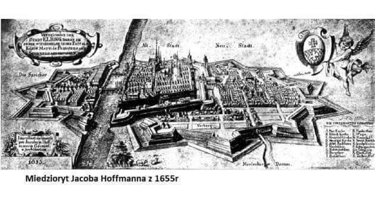 

---

<a href="https://github.com/TomaszWaszczyk/historia.waszczyk.com/edit/master/src/content/december-22.md" target="_blank">Edytuj tę stronę dzieląc się własnymi notatkami!</a>
