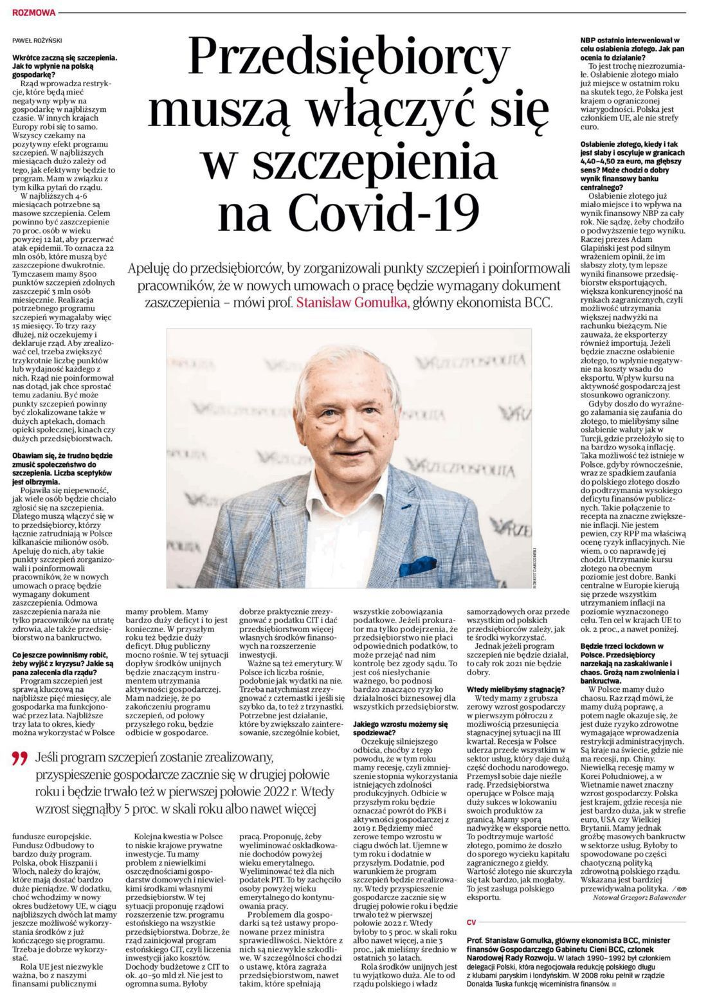

### 2021

Styczniowe posiedzenie RPP (04.01) będzie mieć miejsce jeszcze przed publikacją danych o inflacji CPI za miesiąc grudzień (08.01).

To pierwszy taki przypadek od momentu, gdy GUS publikuje flashowe dane o inflacja w Polsce. 

### 2020

> Bank Pekao wprowadził ujemne oprocentowanie sald na rachunkach klientów korporacyjnych, które w niektórych przypadkach sięga nawet minus 0,8 proc. Po podobne rozwiązania mogą sięgać kolejne banki, jednak klienci detaliczni najprawdopodobniej na tym nie stracą, oceniają specjaliści.

---

  

---

  

---

  

---

https://pl.wikipedia.org/wiki/Talidomid

---

### 1982

Władze komunistyczne Polski podjęły decyzję o zwolnieniu z więzień i ośrodków internowania części działaczy solidarnościowych aresztowanych w ramach akcji "Jodła" w nocy z 12 na 13 grudnia 1981 roku. Na wolność wypuszczono wielu działaczy Solidarności, ale nie dotyczyło to członków Komisji Krajowej NSZZ - Andrzeja Gwiazdy (zdjęcie), Karola Modzelewskiego i Jana Rulewskiego.
Swojego rodzaju ciekawostką jest fakt, że wśród internowanych wówczas osób znalezli się też ludzie z otoczenia Edwarda Gierka z nim samym na czele.

 

### 1981

Władze USA w odpowiedzi na wprowadzenie w Polsce stanu wprowadziły sankcje gospodarcze.
Restrykcje te objęły ograniczenia w handlu ze Stanami Zjednoczonymi, ograniczenia w dostępie Polski do amerykańskich funduszy i kredytów, a także w dostępie do nowoczesnych technologii.
Równocześnie Stany Zjednoczone prowadziły akcję propagandową, której celem było odkreślenie, iż sankcje są skierowane tylko
przeciwko reżimowi komunistycznemu, a nie
polskiemu społeczeństwu, wobec którego
Amerykanie deklarowali sympatię i solidarność.
Organizowano liczne akcje pomocowe dla
Polaków w kraju, wspierano także polskich
emigrantów i Polonię.
Sankcje zostały złagodzono w 1983 roku, kiedy to władze komunistyczne zdecydowały o zwolnieniu z więzień części działaczy solidarnościowych.
Ostatecznie sankcje zostały zniesione w 1987 roku.

 

Na zdjęciu redaktor Witold Stefanowicz prowadzący Dziennik Telewizyjny. W tle zdjęcie ówczesnego amerykańskiego prezydenta Ronalda Reagana.

### 1970

In the 1970s Polish communist state had an idea to create a complex data system that would process information about different state and economy areas, connected by a tool called INFOSTRADA. Among those systems was WEKTOR, created to process information and assist in managing construction investments. At that time, Poland was still recovering from the war damages and looked like a huge construction site.

The system collected data about the investment course and provide precise information that enables control of the construction, in terms of the progress of work, material consumption, use of manpower or the correct implementation of the initial plan. WEKTOR started as a pilot in seven different locations e.g. port in Świnoujście or pipeline Płock-Blachowina. Ultimately, WEKTOR ensured the flow of information between all organisational units of investment processes in the country - from contractors, design offices and equipment suppliers, through, ministries, and Planning Commission local administration offices. For few years, WEKTOR was a success story. But in 1974 due to political and economic reasons, the system was abandoned.

  

  

  

  

  

  

### 1944

We wsi Ochotnica Dolna k. Nowego Targu Niemcy zamordowali 56 osób, w tym kobiety i dzieci.

Masakra przeszła do historii jako „krwawa Wigilia".

D-ca pacyfikacji ani żaden żołnierz z jego jednostki nie został osądzony za tę zbrodnię.

  

### 1939

Stefan Starzyński został zamordowany przez Niemców najprawdopodobniej między 21 a 23 grudnia 1939 r.

Stefan Starzyński – charyzmatyczny prezydent Warszawy, został zamordowany przez Niemców między 21 a 23 grudnia 1939 r. Drugiego sierpnia 1934 roku zastąpił Mariana Feldmarszałkowskiego na stanowisku komisarycznego prezydenta m.st. Warszawy. Bilans 5-letnich rządów Starzyńskiego w Warszawie to budowa ponad 100 tys. mieszkań z infrastrukturą, budowa 30 gmachów szkolnych i modernizacja kilkudziesięciu starych, wykończenie i oddanie do użytku – Muzeum Narodowego, Domu Turysty, hali targowej na Żoliborzu, szpitala Przemienienia Pańskiego, renowacja pałacu Blanka, Arsenału, pałacu Brühla. To też przygotowanie wstępnego projektu budowy mostu Piłsudskiego i sieci metra, modernizacja arterii wylotowych Warszawy, modernizacja siedmiu szpitali, budowa wiaduktu żoliborskiego nad Dworcem Gdańskim i przedłużenia ulicy Bonifraterskiej.
Podczas kampanii wrześniowej po odmowie wykonania rozkazu ewakuacji ze stolicy, sprawował funkcję komisarza cywilnego przy Dowództwie Obrony Warszawy. Na propozycję odlotu z Warszawy samolotem przysłanym przez E. Rydza-Śmigłego, odpowiedział gen. Juliuszowi Rómmlowi jako dowódcy obrony stolicy: „Tak jak pan dzieli los swoich żołnierzy – tak i ja pozostanę wśród swoich”.
Znakomity organizator, podtrzymywał ducha oporu ludności żarliwymi przemówieniami radiowymi. Wypowiedział pamiętne słowa: „Chciałem, by Warszawa była wielka (…) I dziś widzę ją wielką…”. Po kapitulacji Warszawy był współtwórcą struktury administracji podziemnej. Współpracował z pierwszym komendantem głównym Służby Zwycięstwa Polski gen. Michałem Karaszewiczem-Tokarzewskim. Został aresztowany przez Niemców 27 października 1939 w ratuszu[. Był przesłuchiwany w siedzibie Gestapo w alei Szucha i osadzony w Areszcie Centralnym. Stamtąd został przewieziony do więzienia przy ul. Rakowieckiej, skąd trafił na Pawiak, gdzie był więziony w izolacji na jego oddziale kobiecym, tzw. Serbii. Wcześniejsze hipotezy mówiły, że Starzyński został zamordowany 19 marca 1944 r. w kopalni soli potasu, gdzie był więźniem filii obozu i pracował w Lipskim Ogólnym Przedsiębiorstwie Transportu, w którym produkowano części do samolotów. Według świadków, na kozłach ustawiono deskę, na której postawiono S. Starzyńskiego z dwoma pełnymi wiadrami wody. Stał na niej tak długo, aż zemdlał i zmarł. Data i miejsce śmierci zostały ujawnione przez władze niemieckie dopiero w styczniu 1994. Dokumenty były w posiadaniu Stasi i mimo próśb z polskiej strony nie były ujawnione. Śmierć prezydenta historycy przypisują Einsatzgruppe IV pod dowództwem SS-Brigadeführera Lothara Beutela. Prowadzący śledztwo w sprawie okoliczności śmierci, pion śledczy Instytutu Pamięci Narodowej zakończył dochodzenie w dniu 8 września 2014 roku. Prokurator Oddziałowej Komisji Ścigania oświadczyła, że śmierć Stefana Starzyńskiego nastąpiła w wyniku rozstrzelania przez Gestapo, pomiędzy 21 a 23 grudnia 1939 roku w Warszawie lub jej okolicach. Sprawcami zabójstwa mieli być: SS-Oberscharführer Hermann Schimmann, SS-Hauptscharführer Weber i SS-Unterscharführer Perlbach. Z kolei historyk Tomasz Szarota lansował tezę, że prezydenta Warszawy Niemcy zamordowali dopiero w 1943 roku. Jednak historyk nie był w stanie przedstawić wiarygodnych dowodów potwierdzających jego spekulacje.

 

---

W Warszawie powstał Strażacki Ruch Oporu "Skała"-organizacja konspiracyjna skupiająca strażaków ,a swoją działalnością obejmująca terytorium całego kraju. Pierwszym komendantem tej organizacji został podpułkownik pożarnictwa Jerzy Legocki "Jastrząb".
"Skała" współpracowała ze Związkiem Walki Zbrojnej, a następnie z Armią Krajową. Do jej zadań należało prowadzenie działalności wywiadowczej, zdobywanie broni, ostrzeganie i udzielanie pomocy osobom poszkodowanym, organizowanie szkoleń wojskowych, prowadzenie kolportażu konspiracyjnych ulotek. Jednak jednym z dosyć przewrotnych w pracy strażaków działań było...podpalanie ważnych dla wroga obiektów o znaczeniu strategicznym, takich jak chociażby składy wojskowe na Okęciu lub pociągi z benzyną.
Podczas powstania warszawskiego strażacy wywodzący się ze Strażackiego Ruchu Oporu "Skała" walczyli w oddziałach liniowych, zwłaszcza w szeregach Batalionu "Nałęcz" por. Stefana Kaniewskiego ps. "Nałęcz".
"Skała" istniała do końca 1943 roku. Obecnie do jej tradycji nawiązuje 55 Olsztyńska
Grunwaldzka Harcerska Drużyna Pożarnicza "Dżed".

 

### 1913

https://pl.wikipedia.org/wiki/Mieczys%C5%82aw_Moczar

### 1901

https://pl.wikipedia.org/wiki/Jakub_Berman

### 1783

https://en.wikipedia.org/wiki/George_Washington%27s_resignation_as_commander-in-chief

---

<a href="https://github.com/TomaszWaszczyk/historia.waszczyk.com/edit/master/src/content/december-23.md" target="_blank">Edytuj tę stronę dzieląc się własnymi notatkami!</a>
