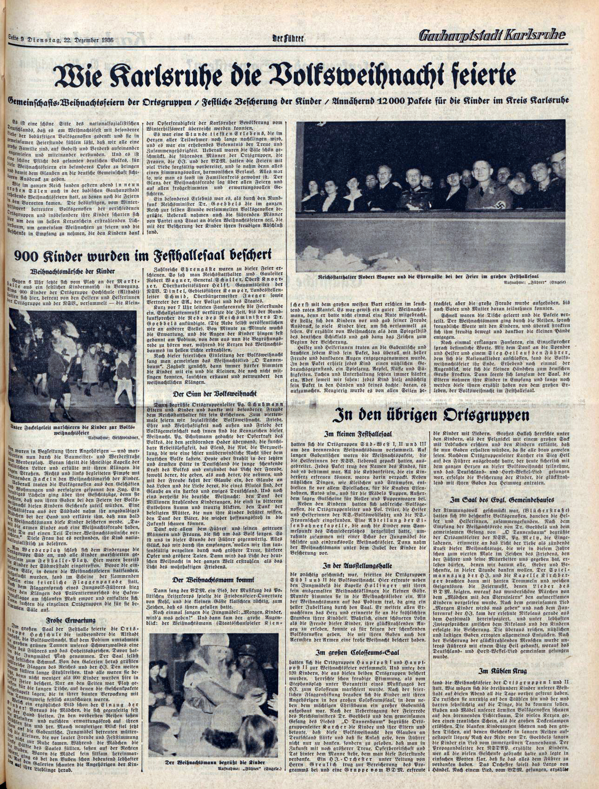

### 2020

Christmas Time Is Here

During 2021+ towards 0x..

  

---

Likwidacja małych przedsiebiorców, światowy PGR

> "Wchodzimy w czas przebudowy świata. Przebudowy najgłębszej od 30, a może nawet od 80 lat. Widzimy, że sytuacja jest dynamiczna – ekonomiści, którzy jeszcze w kwietniu–maju zastanawiali się, czy będziemy mieli do czynienia z V-kształtnym, U-kształtnym, W-kształtnym czy L-kształtnym odbiciem, gremialnie się mylili. Odbicie po koronawirusie przyjmie kształt litery K. To dlatego, że niektóre branże znakomicie rosną nawet mimo epidemii, a może nawet na skutek epidemii, a inne są bardzo mocno poturbowane.
> **Przemysł w Polsce rozwija się nadal w dobrym tempie. Apple, Amazon czy Microsoft notują gigantyczne dochody i wyceny.** Architektura społeczna i gospodarcza będzie ulegała głębokiej zmianie. Teraz trzeba pomyśleć o tym, jak świat może wyglądać za dwa, pięć, dziesięć lat, i przystosować procesy legislacyjne i inwestycyjne do tego świata. Cel to sprawić, by Polska odnalazła się w tym świecie jak najlepiej" - poinformował szef rządu.

---

Zaczyna się drukować rachunek za socjalizm i wygodę, atomizacja w praktyce:

  

### 1946

W więzieniu na Łubiance w Moskwie zmarł w wieku 48 lat ostatni dowódca Armii Krajowej generał brygady Leopold Okulicki.
W sowieckim areszczie NKWD znalzł się w wyniku podstępnego aresztowania 9 marca 1945 roku, kiedy to sowiecki pułkownik Pimienow -naczelnik radomskiej grupy operacyjnej NKWD wysłał do niego list z zaproszeniem do rozmów. Razem z Okulickim aresztowano wtedy 15 innych działaczy polskiego podziemia.

 

### 1942

https://de.wikipedia.org/wiki/Nationalsozialistischer_Weihnachtskult

  

### 1940

W KL Auschwitz miała miejsce pierwsza obozowa wigilia. Nie było to jednak miłe przeżycie dla więzniów obozu, ponieważ Niemcy ustawili na placu apelowym
choinkę oświetloną elektrycznymi lampkami. Pod nią złożyli ciała więźniów zmarłych w czasie pracy oraz tych, którzy zamarzli podczas
apelu. Lagerfuehrer Karl Fritzsch określił leżące pod choinką zwłoki mianem "prezentu" dla żyjących i zabronił śpiewania polskich kolęd.

---

<a href="https://github.com/TomaszWaszczyk/historia.waszczyk.com/edit/master/src/content/december-24.md" target="_blank">Edytuj tę stronę dzieląc się własnymi notatkami!</a>
