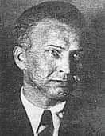

### 1946

W więzieniu na Łubiance w Moskwie zmarł w wieku 48 lat ostatni dowódca Armii Krajowej generał brygady Leopold Okulicki.
W sowieckim areszczie NKWD znalzł się w wyniku podstępnego aresztowania 9 marca 1945 roku, kiedy to sowiecki pułkownik Pimienow -naczelnik radomskiej grupy operacyjnej NKWD wysłał do niego list z zaproszeniem do rozmów. Razem z Okulickim aresztowano wtedy 15 innych działaczy polskiego podziemia.

 

### 1942

https://de.wikipedia.org/wiki/Nationalsozialistischer_Weihnachtskult

### 1940

W KL Auschwitz miała miejsce pierwsza obozowa wigilia. Nie było to jednak miłe przeżycie dla więzniów obozu, ponieważ Niemcy ustawili na placu apelowym
choinkę oświetloną elektrycznymi lampkami. Pod nią złożyli ciała więźniów zmarłych w czasie pracy oraz tych, którzy zamarzli podczas
apelu. Lagerfuehrer Karl Fritzsch określił leżące pod choinką zwłoki mianem "prezentu" dla żyjących i zabronił śpiewania polskich kolęd.

---

<a href="https://github.com/TomaszWaszczyk/historia.waszczyk.com/edit/master/src/content/december-24.md" target="_blank">Edytuj tę stronę dzieląc się własnymi notatkami!</a>
