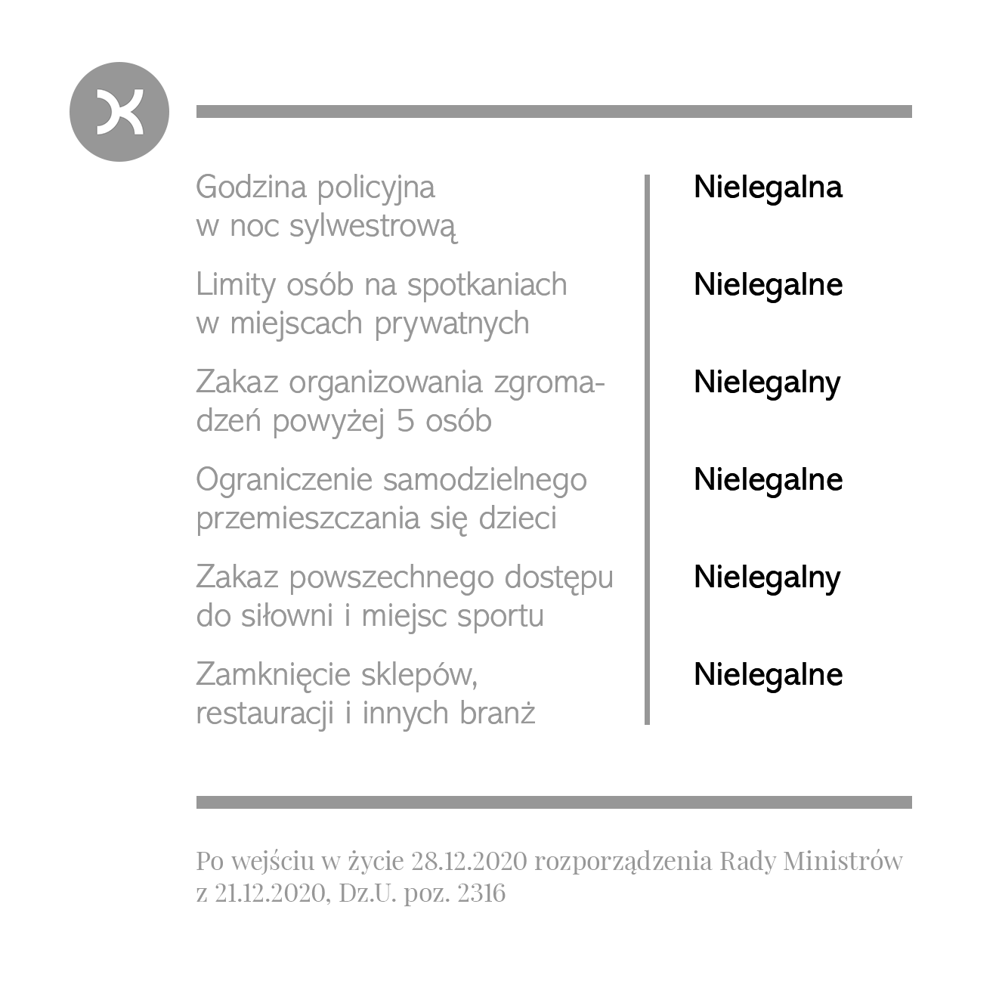
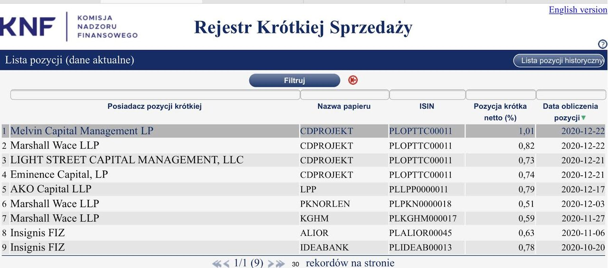
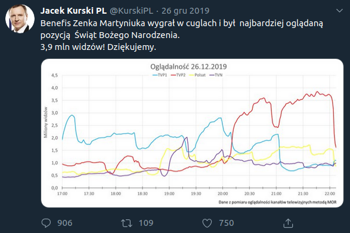
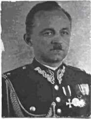
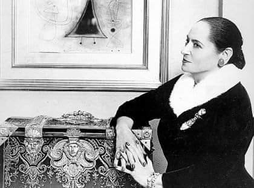

### 2020

  

---

Już prawie 4% całej kapitalizacji Spółki jest w krótkiej sprzedaży.

  

---

### 2019

Panem et circenses w wykonaniu Polski i społeczeństwa.

 

Sowieci i hitlerowcy wymordowali lwią cześć polskiej inteligencji. Ciąg dalszy nastąpił za komuny. Dzieło domyka towarzysz Kurski. Bez jednego wystrzału.

### 1989

https://en.wikipedia.org/wiki/Nicolae_Ceau%C8%99escu

### 1945

w Aninie zmarł Marceli Godlewski - ksiądz katolicki, prałat, działacz społeczny, polityk związany z endecją, w 2009 roku pośmiertnie uhonorowany tytułem Sprawiedliwy wśród Narodów Świata. W latach 1915-45 był proboszczem kościoła Wszystkich Świętych w Warszawie. W okresie II wojny światowej prałat Godlewski wraz ze współpracownikami ocalił od Zagłady od tysiąca do trzech tysięcy Żydów. Wśród ocalonych przez prałata Godlewskiego byli m.in. profesor Ludwik Hirszfeld oraz państwo Wanda i Krzysztof Zamenhofowie. ,,Gdy wspominam jego nazwisko, ogarnia mnie wzruszenie. Namiętność i miłość w jednej duszy. Ongiś bojowy antysemita, kapłan wojujący w piśmie i słowie. Ale gdy los go zetknął z dnem nędzy, odrzucił precz swoje nastawienie i cały żar swojego kapłańskiego serca poświęcił Żydom'' - wspominał profesor Ludwik Hirszfeld.

### 1940

W więzieniu NKWD w Moskwie rozstrzelany został podpułkownik dyplomowany Wojska Polskiego Kazimierz Stanisław Szpądrowski (zdjęcie).
Poniżej przedstawiam fragment stenogramu z jego ostatniego przesłuchania:
Śledczy
-Jesteście oskarżeni o to, że będąc pracownikiem lI Oddziału, a później Kierownikiem Ekspozytury w Katowicach - na przestrzeni 7 lat prowadziliście działalność szpiegowską przeciw ZSRR. Czy przyznajecie się do winy?
Szpądrowski
-Nie czuję się winnym, bo działałem dla dobra swego Państwa. Do pracy w wywiadzie trafiłem z rozkazu swego kierownictwa. Działalnością na szkodę Związku Radzieckiego nie zajmowałem się. Służba w polskim wywiadzie wykonywana przeze mnie nie przyczyniła szkód Związkowi Radzieckiemu.

 

### 1923

https://en.wikipedia.org/wiki/Ren%C3%A9_Girard

### 1872

W Krakowie urodziła się Helena Rubinstein (zdjęcie) "Cesarzowa kosmetyków) jedna z najbogatszych kobiet w historii. Z Polski, do Wiednia wyjechała w roku 1900. Dwa lata później osiedliła się w Australii.
W swoich wspomnieniach pisała:
> "Urodziłam się w Dzień Bożego Narodzenia 1872 roku w Krakowie, w dużym domu przy placu rynkowym, nieopodal Uniwersytetu Jagiellońskiego (...) Dzieciństwo i młodość spędziłam w szczęśliwej atmosferze w wielkim, starym domostwie. Pokoje były zapełnione zbiorami ojca, który kolekcjonował bibeloty, antyki i książki (...) Nienawidziłam Australii. Słońce jest samobójstwem dla urody! (...) Opuściłam mojego wujka, udając się do Melbourne, do pani, którą poznałam na statku, w drodze do Australii. Miałam uczyć jej dzieci niemieckiego. Ale stało się inaczej. To od niej pożyczyłam 250 funtów i kilka krzeseł. Otworzyłam salon piękności "Valaze". Z Polski nadeszła receptura na produkcję kremu i tak rozpoczęła się moja kariera. Gdy odwiedziła mnie reporterka z Sydney i napisała o mnie, posypały się zamówienia, otrzymałam ich 15 tysięcy (...) Wszystkie kobiety miały twarze w okropnym białym pudrze i dziwnie szary kolor ust - wspomina. - Pomyślałam: to potężny rynek dla moich produktów!."

Była właścicielką 154 fabryk kosmetyków i 32 instytutów na całym świecie. Jej majątek oceniany był na ponad 100 milionów dolarów.
Zmarła 1 kwietnia 1965 roku w Nowym Jorku.

 

---

<a href="https://github.com/TomaszWaszczyk/historia.waszczyk.com/edit/master/src/content/december-8.md" target="_blank">Edytuj tę stronę dzieląc się własnymi notatkami!</a>
