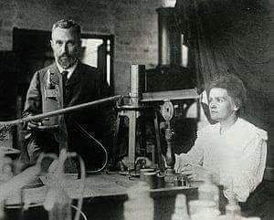
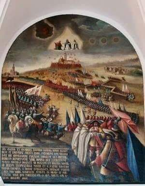

### 1898

Maria i Piotr Curie oznajmili światu odkrycie radu. 🎉

Mimo że naukowcy przypłacili zdrowiem swoje eksperymenty, ich praca nie pozostaje bez wpływu na współczesne oblicze medycyny. Dziś rad nie jest stosowany w radioterapii, ale działania badaczy umożliwiły rozwój tej specjalizacji, a przez to poprawę rokowania u pacjentów chorujących na promieniowrażliwe nowotwory.

💁‍♂️ Nie wszyscy wiedzą, że po otrzymaniu drugiej nagrody Nobla (właśnie za odkrycie nowych pierwiastków) Maria Skłodowska-Curie zainicjowała powstanie kolebki Noblistów - Instytut Radowy. W placówce działało czterech noblistów, w tym... córka i zięć Polki.

<!--   -->

### 1655

W czasie drugiej wojny północnej zakończyło się trwające od 18 listopada 1655 roku szwedzkie oblężenie klasztoru na Jasnej Górze.
Wydrzenie to było przełomem w wojnie obronnej Rzeczpospolitej przeciwko Szwecji.
Dowodzący obroną klasztoru ojciec Augustyn Kordecki pod pozorem obiecywania rozmów zwodził Szwedów, a w tym czasie reszta zakonników ściągała do obrony profesjonalnych żołnierzy i wzmacniała wały.
Wielkie znaczenie moralne dla obrońców miały brawurowe "wycieczki” z twierdzy, czyli nocne wypady, podczas których zagważdżano szwedzkie działa i wycinano ich załogi.
Sienkiewicz przypisał te "wycieczki” panu Andrzejowi Kmicicowi, postaci literackiej. W rzeczywistości najsłynniejszą „wycieczką” dowodził dzielny oficer Piotr Czarniecki.
Zasadniczym zwrotem podczas obrony klasztoru było wydarzenie z 20 grudnia, kiedy to obrońcy pod dowództwem Stefana Zamoyskiego zabili górników kopiących tunel, którym Szwedzi chcieli dostać się do twierdzy. 24 grudnia Szwedzi, których żądanie poddania się odrzucił ojciec Kordecki przypuścili atak artyleryjski, który jednak został skutecznie został odparty.
W nocy z 26 na 27 grudnia wojska szwedzkie wycofały się w stronę Prus.

 

---

<a href="https://github.com/TomaszWaszczyk/historia.waszczyk.com/edit/master/src/content/december-26.md" target="_blank">Edytuj tę stronę dzieląc się własnymi notatkami!</a>
