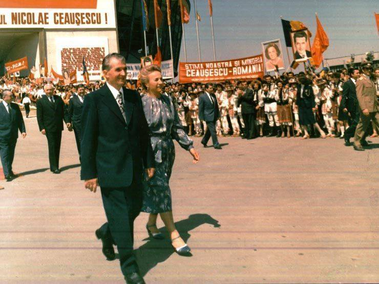

### 2020

Chiny przodują na świecie w pracach nad walutą cyfrową. Jeśli próby się powiodą w Chiny, mogą doprowadzić do szerszego zastosowania cyfrowej waluty w tym państwie w 2021r.

Jak zauważa HSBC, „Bank Rozrachunków Międzynarodowych wskazuje, że 10% banków centralnych prawdopodobnie wyemituje CBDC w ciągu trzech lat, a 20% w ciągu sześciu".

Te programy pilotażowe pomogą ukształtować międzynarodowy standard i pomogą innym globalnym bankom w opracowaniu ich własnych walut cyfrowych. Banki centralne USA, Wielkiej Brytanii, Eurostrefy i Japonii są na różnych etapach rozwoju, chociaż żaden z nich nie ma konkretnych planów wdrożenia CBDC (cyfrowej waluty banku centralnego). Wśród dużych gospodarek przodują w tej dziedzinie Szwecja i Chiny. Oczekuje się, że mogą przyjąć CBDC już w przyszłym roku, co może otworzyć wrota do dalszego rozwoju.

Jak podkreśla Rabobank, „po pierwsze, powinno to zapewnić chińskiej gospodarce znaczny impuls; po drugie, jednocześnie jeszcze bardziej zwiększy kontrolę chińskiego rządu nad chińskim społeczeństwem; wreszcie nowa waluta jest częścią ambitnego planu wzmocnienia międzynarodowej chińskiej waluty, i potencjalnie, w szczególności kosztem euro”.

---

### 1989

Rewolucja w Rumunii: w Târgoviște rozstrzelano obalonego dyktatora Nicolae Ceaușescu i jego żonę Elenę.
W Târgoviste, ok. 80 km od Bukaresztu, rozstrzelani zostali Elena i Nicolae Ceausescu, komunistyczny dyktator, od 1965 r. niepodzielnie rządzący Rumunią. Trzy dni wcześniej starał się zjednać sobie wrogi tłum przemową w centrum stolicy. Gdy mu się to nie udało, uciekł z żoną helikopterem do rezydencji w Snagov, a potem do Târgoviste. Tam zostali pojmani i po pospiesznym procesie, który był farsą, straceni. Upadek Ceausescu zaczął się w połowie grudnia od protestów w Timisoarze w obronie węgierskiego pastora oskarżanego o szerzenie nienawiści do Rumunów. Pacyfikacja Timisoary wywołała rebelię w kolejnych miastach, a po przejściu wojska na stronę demonstrantów dyktator został sam.

  

### 1898

Maria i Piotr Curie oznajmili światu odkrycie radu. 🎉

Mimo że naukowcy przypłacili zdrowiem swoje eksperymenty, ich praca nie pozostaje bez wpływu na współczesne oblicze medycyny. Dziś rad nie jest stosowany w radioterapii, ale działania badaczy umożliwiły rozwój tej specjalizacji, a przez to poprawę rokowania u pacjentów chorujących na promieniowrażliwe nowotwory.

💁‍♂️ Nie wszyscy wiedzą, że po otrzymaniu drugiej nagrody Nobla (właśnie za odkrycie nowych pierwiastków) Maria Skłodowska-Curie zainicjowała powstanie kolebki Noblistów - Instytut Radowy. W placówce działało czterech noblistów, w tym... córka i zięć Polki.

 

### 1655

W czasie drugiej wojny północnej zakończyło się trwające od 18 listopada 1655 roku szwedzkie oblężenie klasztoru na Jasnej Górze.
Wydrzenie to było przełomem w wojnie obronnej Rzeczpospolitej przeciwko Szwecji.
Dowodzący obroną klasztoru ojciec Augustyn Kordecki pod pozorem obiecywania rozmów zwodził Szwedów, a w tym czasie reszta zakonników ściągała do obrony profesjonalnych żołnierzy i wzmacniała wały.
Wielkie znaczenie moralne dla obrońców miały brawurowe "wycieczki” z twierdzy, czyli nocne wypady, podczas których zagważdżano szwedzkie działa i wycinano ich załogi.
Sienkiewicz przypisał te "wycieczki” panu Andrzejowi Kmicicowi, postaci literackiej. W rzeczywistości najsłynniejszą „wycieczką” dowodził dzielny oficer Piotr Czarniecki.
Zasadniczym zwrotem podczas obrony klasztoru było wydarzenie z 20 grudnia, kiedy to obrońcy pod dowództwem Stefana Zamoyskiego zabili górników kopiących tunel, którym Szwedzi chcieli dostać się do twierdzy. 24 grudnia Szwedzi, których żądanie poddania się odrzucił ojciec Kordecki przypuścili atak artyleryjski, który jednak został skutecznie został odparty.
W nocy z 26 na 27 grudnia wojska szwedzkie wycofały się w stronę Prus.

 

---

<a href="https://github.com/TomaszWaszczyk/historia.waszczyk.com/edit/master/src/content/december-26.md" target="_blank">Edytuj tę stronę dzieląc się własnymi notatkami!</a>
